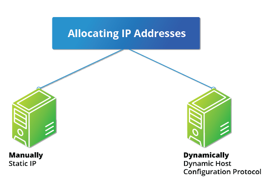
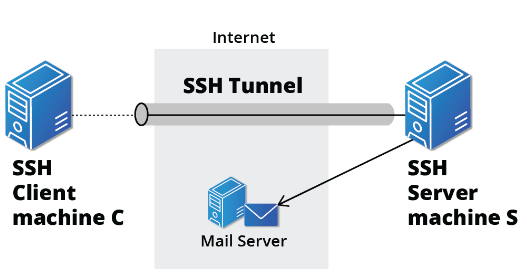
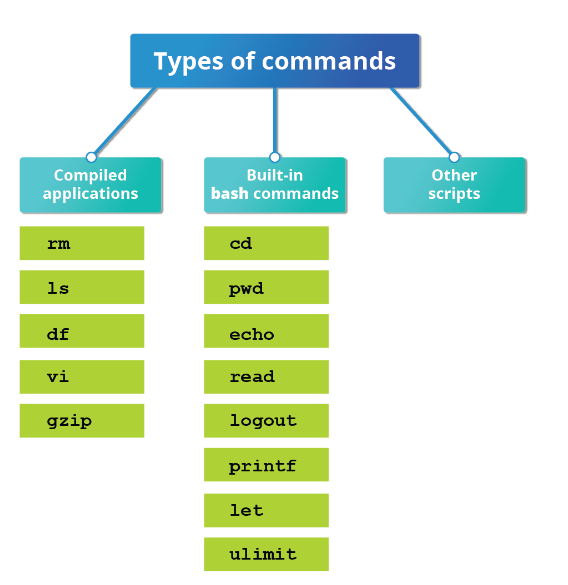
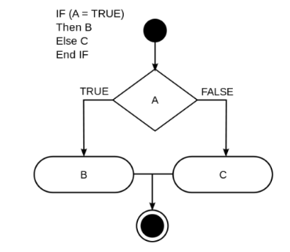
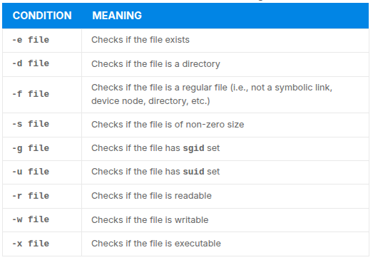
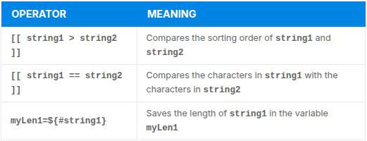
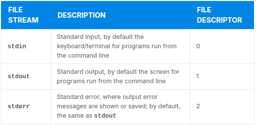
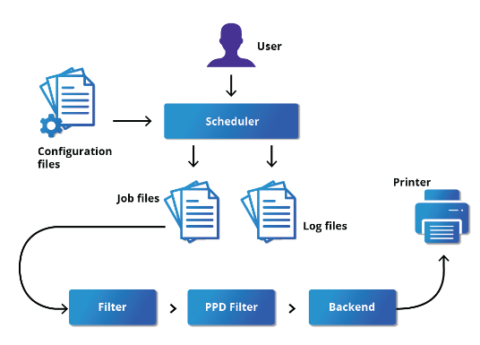
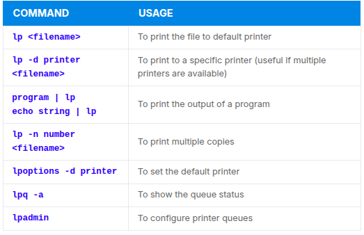

# Heading 1

## Heading 2

### Heading 3

#### Heading 4

##### Heading 5

###### Heading 6

It copies the html rules for headings. Two spaces is like <_br_> from html

# Test Heading 1

Some text

## Subheading 1

More text

---

How to bold text add \*\* or double underscore:

**bold**- prefferd method

**bold2**

How to make text italic use 1 asterics:

_Italic example_

It can be also used with 1 underscore on both sides.

If you want the text to be both bold AND Italic- 3 \*

**_Example of both_**

~~crossed off~~

==highlight== / extended feature of makrdown and its not supported by github. So we can use the mark html element
<mark>highlight</mark>.

Also superscript and subscript will ot work so we need to used the html tags:

This is a <sup>superscript</sup>

X<sup>2</sup>

This is a <sub>subsctipt</sub>

H<sub>2</sub>O

Emojis- it will not work

:smile:

How to show code

`code` - shows code on 1 line

```
let x = 1;
let y = 5;
```

By surrounding them with 3 (```) It preservves the indentation. you can even label it with the language that you use so it will be rendered in the syntax according.

how do you create a link? [this is a link ] + ()
in the parenthesis you put the link that you want to lead to.

[example link](https://google.com)

you can also use <https://google.com>

Images have the same syntax but we need to place ! before the parenthesis+ bracket structure.

Example: ! + [ ] + () = 
in the square brackets you can use the alt text
in the parethesis you can place the png/webp/jpeg format. OR uRL that points to an image.

Block quote >

> This is a start of a block quote
>
> > nested quote

Horizontal rule:

---

---

---

space + dash/underscore/star - surrounded by empty space in order to divide it.

Lists is marked with
Ordered list :

1. Item 1
2. Item 2
3. Item 3

Unordered list \* /+ / -

- item 1
- item 2

* item 3

- item 4

* item 5

To nest them you need to use TAB

- item 1
  - item 1.1

You can also make ordered list inside unordered .

Table from github:

| Col 1 | Col 2   |
| ----- | ------- |
| This  | is      |
| an    | example |
| table | with    |
| two   | columns |

Checkboxes:

- [ ] unchecked box

- [x] checked

# LFS 101 Linux Foundation

## Week 3

### Chapters 15-19

---

#### Chapter 15: Network Operations

##### Introduction to networking

- The computers connected over a network may be located in the same geographical area or spread across the world. Connected devices are often termed nodes.

- Network is used to: Allow the connectected devices to communicate with each other. Enable multiple users to share devices over the network such as video servers, printers and scanners. Share and manage information such as databases andfile systems across computers easily.

---

**IP Addresses**

- Devices attached to a network must have at least one unique network address indentifier know as the **IP** (internet protocol) address. This address is essential for routing packets of information through the network.

- Exchanching information across the ntwrok requires using streams of small packets ech of which contains a piece of information going from one machine to another. They contain- data buffers, header(containing the adress they come from and where they are going to, where it fits in the sequence of packets that constitute the stream).


---

**IPv4 and IPv6**

- There are two different types of IP addresses available- IPv4 and IPv6. IPv4 is older and by far the more widely used, while IPv^ is newer and is designed toget past limitations inherent in the older standard.

- IPv4- uses 32-bits for addresses, there are only 4.3 bilion unique addresses availabe. There are also allotted and reserved adresses which are not in use, hence the number diminishes.

- IPv6 uses 128-bits for addresses, this allows 3.4 x 10<sup>38</sup> unique addresses. Migration between v4 and v6 is quire complex and the protocols do not inter-operate well.


- IPv4 has not disappeared is due to thewidely-used ways to effectively make more addresses available by methods such as **NAT** (Network Address Translation). NAT enables sharing one IP address among many locally connected computers, each of which has a unique address only see on the local network. While this is used in organizational settings, it is also used in simple home networks.

- Example: If you have a router hooked up to your ISP(internet service provider) it gives you one extrernally visible address, but issues each device in your home an individual local address, which is invisible to the outside world.


---

**Decoding IPv4 Addresses**

- A 32- bit IPv4 address is divided into four 8-bit sections called octets.

- The octet is a unit of digital information in computing and telecommunications that consists of eight bits. The term is often used when the term byte might be ambiguous, as the byte has historically been used for storage units of a variety of sizes.


- Network addresses are divided into 5 classes: A, B, C, D and E. Classes A, B and C are classified into two parts(NET ID) and Host address (Host ID). The Net ID- is used to identify the network, while the Host ID is used to identifya host in the network. Class D is used for special multicast applications(information is broadcast to multiple computers simultaneously). Class E is reserved for future use.


---

**Class A**

- **Class A** network uses the first octet of an IP address and their Net ID and use the other three octets as the Host ID. First octet always starts with 0. Hence you can use only 7-bits for unique network numbers. As a result the are maximum of 126 class A networks available(address- 0000000 1111111 are reserved).

- Ech Class A network can have up to 16.7 milion unique hosts on its network. The range of host addresses is from
  **1.0.0.0 to 127.255.255.255**

- The value of an octet, or 8-bits, can range from 0 to 255.


---

**Class B**

- Class B addresses use the first 2 octets of the IP address as their NET ID and the last 2 octets as the Host ID. The first two bits of the first octet are always set to binary 10, so the maximum of 16,384(14-bits) class B networks.

- The fist octet of a class B address has values from 128 to 191. Each class B network can support maximum of 65,536 unique hosts on its network. The range of host addresses is from **128.0.0.0 to 191.255.255.255.**


---

**Class C**

- Class C addresses use the first three octets of the IP address as their Net ID and the last octet as their Host ID. The first 3 bits of the first octet are set to binary 110. so almost 2.1 milion(21-bits) Class C networks are available.

- The first octet of a Class C address has values from 192 to 223. These are most common for smaller networks which dont have many hosts. Each class C network can support up to 256 (8-bits) unique hosts. The range of host addresses is from **192.0.0.0 to 233.255.255.255**.


---

**IP Address Allocation**

- Range of IP addresses are requested from your ISP, by certain organization's network administrator. Ofter the choice of which class of IP adresses youare given depends on the size of your network and expected growth needs. If NAT is in operation, such as in a home network, you only get one externally visible address!

- It is possible to assign IP addresses to computers over a network either manually or dynamically. Manual assignments adds static(never changing) addresses to the network. Dynamically assigned addresses can change every time you reboot or even more often the DHCP(Dynamic Host Configuration Protocol) is used to assign IP addresses.



---

**Name Resolution**

- Name Resolution is used to convert numerical IP address values into a human-readable format known as the hostname. Hostnames are much easier to remember.

- Given an IP address, you can obain its corresponding hostname. Accessing the machine over the network become easier when you can type the hostname instead of the IP address.

- To view your own system's hostname you can type **hostname** with no argument in the terminal.

- If you give an argument, the system will try to change its hostname to match, however only root users can do that.

- The special hostname localhost is associated with the IP address **127.0.0.1** and describes the machine you are currently on.

---

**Network Configuration Files**

- Network Configuration files are essential to ensure that interfaces function correctly. They are located in the **/etc** directory tree. However, the exact files used have historically been dependent on the particular Linux distro.

- For Debian Family configurations, basic network config files could be found udner **/etc/network/** while the Red Hat and SUSE family systems at **/etc/sysconfig/network**.

- Modern systems emphasize the use ot Network Manager, the **nmtui** utility remain same across all distros. Recent ubuntu distributions include **netplan** which is turned on by default and supplants Network Manager.

---

**Network Interfaces**

- Network interfaces are a connection channel between a device and a network. Network interfaces can proceed through a network interface card (NIC) or can be more abstractly implemented as software. It is possible to have multiple network interfaces operating at once.

- Using the utilities **ip** and **ifconfig** you can get infromating about the network interface. ip is newer than ifconfig and has far more capabilities, but its difficult to understand.

---

**ip utility**

- It can be used like:

```
$ /sbin/ip addr show - to view the IP address
$ /sbin/ip/route show - to view the routing information
```

**ping utility**

- is used to check whether or not a machine attached to the network can receive and send data -> confirms that the remote host is online and is responding.

- to check the status of a remote host, type **ping <hostname**>

- ping is frequently used for network testing and management, howeever its usage can increase network load unacceptably -> to stop execution is best to type ping -c which limits the number of packets that ping will send before int quits. After it stops summary is presented.

Exaple:

```
$ ping -c 10 training.linuxfoundation.org
```

**route utility**

- Network connection require many nodes, data moves from source to destination by passing through a series ofrouters and potentially across multiple networks. Servers maintain routing tables containing the addresses of each node in the network. The IP routing protocols enable routers to build up a forwarding table that correlates final destinations with the next hop address.

- ip route /route is used to view or change th eIP routing table to add, delete or modify(static) routes to specific hosts ornetworks.

```
route -n
ip route
```


**traceroute utility**

- Is used to inspec the route which the data packet takes to reach the destination host, which makes it quite useful for troubleshooting network delays and errors. Its possible to isolate connectivity issues between hops with traceroute.

```
$ traceroute <address>
```

---

**Additional Networking Tools**


---

**Graphical and Non-Graphical Browsers**

- Browsers are used to retrieve, transmit and explore informational resources over the internet. There are two types: graphical and non-graphical

- Types for graphical- Firefox, chrome, chromium, konqueror, opera.

- Types for non-graphical browsers- lynx, elixns, w3m.

---

**wget**

- used when you need to download multiple files/or directories. **wget** is a utility that can capably handle diferent downloads: large files, recursive downloads(where a webpage refers to other web pages and all are downloaded at once), password-required downloads, multiple file downloads.

- to download a web page, you can simple used the command below, and then you can read the downloaded page as a logical file using a graphical or non-graphical browser.

```
wget <url>
```

---

**curl**

- is a utility used to obrain infromation regarding the source code of a URL. it allows you to save the contents of a page to a file, just as wget, however DOESNOT support recursive download.

| Feature                    | `wget`                             | `curl`                                  |
| -------------------------- | ---------------------------------- | --------------------------------------- |
| **Primary Purpose**        | File downloads (recursive, robust) | Data transfer (flexible, scripting)     |
| **Protocol Support**       | HTTP, HTTPS, FTP                   | Many: HTTP, HTTPS, FTP, SCP, SFTP, etc. |
| **Recursive Download**     | ✅ Yes                             | ❌ No                                   |
| **Resume Download**        | ✅ Yes (`-c`)                      | ✅ Yes (`-C -`)                         |
| **Upload Support**         | ❌ No                              | ✅ Yes (`-T` or `-d`)                   |
| **Scripting & APIs**       | ❌ Limited                         | ✅ Powerful (form data, headers, JSON)  |
| **Output**                 | Saves to file by default           | Prints to stdout by default             |
| **Dependencies**           | Standalone                         | Can be a dependency in scripts/tools    |
| **Built-in Progress Bar**  | ✅ Yes                             | ✅ Yes (`--progress-bar`)               |
| **Cookie/Session Support** | ✅ Yes                             | ✅ Yes (more advanced control)          |

```
curl <URL>
```

---

##### Transfering Files

---

**FTP**

- Protocol used to transfer files between machines connected via a network. Build on client-server model. FTP can be used within a browser or stand-alone client programs. Downsides: insecure.


---

**FTP Clients**

- They enable transfer files with remote computers using the FTP protocol. Can be GUI or CLI based. All web browsers support ftp.

- Some of the CLI FTP clients are: ftp, sftp, ncftp, yafc(yet another ftp client). FTP is insecure and the transmissions are without encryption. sftp is the secure mode of connection between users, that uses Secure Shell(ssh), however it does not work with anonymous ftp.


---

**SSH- Secure Shell**

- is a cryptographic network protocol used for secure data communication. its used for remote services and other secure services between devices on a network, very useful for administering systems, which you do not have in-person access but you can access remotely.



- To login, type sh some_system, after that you will be prompted for remote password.

- if you need to run as another user, you can do either:

```
ssh -l someone some_system
```

OR

```
ssh someone@some_system
```

- to run a command via SSH is like:

```
ssh some_system my_command
```

---

**scp-secure copy**

- secure copy is used to move files securely between two networked hosts. scp uses ssh protocol for ransfering data.

- to copy a file to a remote system is like:

```
scp <localfile> <user@remotesystem>:/home/user
```

- after that a prompt for the password is opened. There is option to configue scp so it does not prompt password.


---

#### Chapter 16: Bash Shell and Shell Scripting

---

##### Shell features and capabilities

- Shell scripting allows to automate sets of commands, most commonly in Linux the scripts are developed to be run under the **bash** command shell interpreter. Below is explanation of the benefits of deploying shell scripts.


- Command shell choices: Commonly used interpreters include: /usr/bin/perl, /bin/bash, /bin/csh, /usr/bin/python and /bin/sh.

- Linux provides a wide choice of shells; exactly what is available on the system is listed in /etc/shells. Typical choices are:

```
/bin/sh
/bin/bash
/bin/tcsh
/bin/csh
/bin/ksh
/bin/zsh
```


---

###### Shell Scripts

- A shell is simply a command line interpreter which provides the user interface for terminal windows. A command shell can also be used to run scripts, even in non-interactive sessions without a terminal window, as if the commands were being directly typed in.

- The first line of the script, which starts with #!, contains the full path of the command interpreter (in this case /bin/bash) that is to be used on the file.

- The special two-character sequence, #!, is often called a shebang, and avoids the usual rule that the pound sign, #, delineates the following text as a comment.

- Simple bash script can be like that

```
#!/bin/bash
echo "Hello Linux Foundation"
```

- After that the file needs to be saved, made available for execution with "chmod +x" for all users and then it can be executed.

---

**Interactivity**

- The user need to be prompted to enter a value, which is displayed on the screen. The value is stored in a temorary variable "name". In order to reference he value of the shell variable we can use $ in front of the variable name, such as **$name**.

**Return Values**

- All shell scripts generate a return value upon finishing execution, which can be explicitly set with the **exit** statement.

- Return values permit a process to monitor the exit state of another process, often in a parent-child relationship.


- How to view return values: As script executes, one can check for a specific value or condition and return success or failure as the result. Success is returned as **0** zero, and failure is returned as any non-zero value.

- Easy way to check is the execute **ls**on a file that exists as well as one does not. The return value is stored in the environment variable presented by **$?**.

```
$ ls /etc/logrotate.conf
/etc/logrotate.conf

$ echo $?
0
```

- In this example, the system is able to locate the file /etc/logrotate.conf and ls returns a value of 0 to indicate success. When run on a non-existing file, it returns 2.

---

**Basic Syntax and Special Characters**


- There are other special characters and character combinations and constructs that scripts understand, such as (..), {..}, [..], &&, ||, ', ", $((...))

---

**Scripting Long Commands over multiple lines**

- The concatenation operator **( \ )**, the backslash character, is used to continue long commands over several lines.

Here is an example of a command installing a long list of packages on a system using Debian package management:

```
$~/> cd $HOME
$~/> sudo apt install autoconf automake bison build-essential \
    chrpath curl diffstat emacs flex gcc-multilib g++-multilib \
    libsdl1.2-dev libtool lzop make mc patch \
    screen socat sudo tar texinfo tofrodos u-boot-tools unzip \
    vim wget xterm zip
```

---

**Putting multiple commands on a single line**

- Users sometimes need to combine several commands and statements and even conditionally execute them based on the behavior of operators used in between them. This method is called chaining of commands.

- There are several different ways to do this, depending on what you want to do. The ; (semicolon) character is used to separate these commands and execute them sequentially, as if they had been typed on separate lines. Each ensuing command is executed whether or not the preceding one succeeded.

- Thus, the three commands in the following example will all execute, even if the ones preceding them fail:

```
$ make ; make install ; make clean
```

- However, you may want to abort subsequent commands when an earlier one fails. You can do this using the && (and) operator as in:

```
$ make && make install && make clean
```

- If the first command fails, the second one will never be executed. A final refinement is to use the || (or) operator, as in:

```
$ cat file1 || cat file2 || cat file3
```

- In this case, you proceed until something succeeds and then you stop executing any further steps.

- Chaining commands is not the same as piping them; in the later case succeeding commands begin operating on data streams produced by earlier ones before they complete, while in chaining each step exits before the next one starts.

---

**Output Redirection**

- In most OS input is accepted from the keyboard and displayed as output on the terminal. Shell commands and scripts can send the output to a file. The process is called output redirection.

- **>** character is used to write output to a file. Ex: command below sends the output of \*\*free to /tmp/free.out

```
$ free > /tmp/free.out
```

- to check the output you can used the **cat** command.
- Two >(>>) will append output to a file if exists and act just like > if file does not already exist.

---

**Input Redirection**

- The process of reading input from a a file is called input redirection and uses **<** character.

- the following commands(use wc to count the number of lines, words and characterist in a file) are equivalent.

```
$ wc < /etc/passwd
49  105 2678 /etc/passwd

$ wc /etc/passwd
49  105 2678 /etcpasswd

$ cat /etc/passwd | wc
49  105 2678
```

---

**Built-In Shell Commands**

- Shell scripts execute sequences of commands and other types of statements. They are complied applications, built-in commands. Shell scripts from other interpreted lanagues like perl and python.

- Compiled application are binary executable files residing on the filesystem such as **/usr/bin**. Shell scripts always have access to application in the defuault path- **rm,ls, df,vi,gzip**- which are compiled from **C**.

- many built-in comands can only be used to display output within terminal shell or a shell script. They are **cd,pwd, echo,read,logout,printf,let,time and ulimit**- sometimes those names are the same as the executable programs on the system, which need to be threaded carefully. Ex: command **echo** can have slightly different command than **/bin/echo**.

- Use the man bash **man page** for more info.

```
$ help
```



---

**Script parameters**

- Often when writing script we need to pass parameter values- filename,date, etc. Scripts will take different path or arrive at different results according to the parameters that are passed to them. The values can be text or numbers.

```
$ ./script.sh/tmp
$ ./script.sh 100 200
```

- The parameter or an argument is represented with a **$** and a number or special character.


```
$0 prints the script name: param.sh

$1 prints the first parameter: one

$2 prints the second parameter: two

$3 prints the third parameter: three

$* prints all parameters: one two three four five

The final statement becomes: All done with param.sh
```

---

**Command Subtitution**

- Substitution can be done in two ways:

```
enclosing the inner command in $( )

```

- the specified command will be executed in a newly lanched shell environment, standard output of the shell will be inserted where the command substitution is done.

- $( ) method allows command nesting

---

**Environment Variables**

- variables can be used anywhere in the script, they can be user or system-defined.

- standard enviroment variables are **HOME, PATH, HOST**. When referenced, environment variables must be prefixed with the **$** as in **$HOME**. You can view and set the value of environment variables.

- display of the value stored in the **PATH** variable:

```
$ echo $PATH
```

- to modify the variable value, you do not need to put a prefix:

```
$ MYCOLOR=blue
```

- you can list of enviroment variables with **env,set or printenv**.

---

**Exporting Variables**

- by default variables created within a script are available only to the subsequent steps of that script. Any child processes(sub-shells) do not have automatic access to the values of these variables.

- to make them available to child processes, they must be promoted to environment variables using the export statement. Examples:

```
export VAR=value
or
VAR=value ; export VAR
```

- child processes are allowed to modify the value of exported variable, the parent will not see any changes, exported variables are not shared, they are only copied and inherited. Typing export with no arguments will give a list of all currently exported environment variables.

---

**Functions**

- function is a code of block that implements a set of operations.Functions are useful for executing procedures multiple times, perhaps with varying input variables. They are also called subroutines.

- using functions in scripts requires two steps: 1- declaring a function and 2- calling a function.

- the function declaration requires a name which is used to invoke it.

```
function_name (){
  command...
}
```

- for exampe function named display will be like:

```
display(){
  echo "This is a sample functions that displays a string"
}

```

- function can be as log as desired or have many statements. Once defined, can be called later as many times as necessary.

---

**Constructs**

---

**if statement**

- used for conditional decision maiking. when **if** statement is used, the ensuingactions depend on the evaluation of specified conditions, such as:
  - numerical or string comparisons
  - return value of a command (0 for success)
  - file existence or permissions

```
if TEST-COMMANDS; then CONSEQUENT-COMMANDS; fi
```

- example:

```
if condition
then
  statements
else
  statements
fi
```



- example of statement

```
if [-f "$1"]
then
  echo file "$1" exists
else
  echo file "$1" does not exist
fi
```

- it check firs that there is an argument passed to the script $1 and abort if not.

- [] square brackets are used to deliniate the test condition. In most scripts they are doubled: **[[-f /etc/passwd]]**

---

**elif statement**

- elif statement to perform more complicatedtests.

```
if [sometest]; then
  echo Passed test1
elif [somethertest] ; then
  echo Passed test2
fi
```

- if statement can be used with file conditionals:
  - file or directory existence
  - read or write permission
  - executable permission

```
if [ -x /etc/passwd]; then
  ACTION
fi
```

- if statement checks if the file /etc/passwd is executable, which is not.
- common practice is putting ; then on the same line as the iff statement.



---

**Boolean Expressions**

- they evaluate with **TRUE** or **FALSE**.


- if you have multiple conditions strung together with the && operator, processing stops as soon as a condition evaluates to false.

- use of && operator

```
if you have A && B && C
A is true
B is false
C will never be executed
```

- use of || operator, processing stops as soon as anything is true.

```
A || B || C
A is false
B is true
C will never execute
```

- Boolean expressions are used when working with multiple data types, strings numbers as well as file.

- if we need to check for a file we can use the following condtional statement:

```
[-e <filename>]
```

-to check if the value of number1 is creater than the value of number2:

```
[ $number1 -gt $number2]
-gt returns TRUE if number1> number2
```

---

**Testing Strings**

- if statement to compare strings usin the operator ==

```
if [string1 == string2] ; then
  ACTION
fi
```

- NB we can use = but its deprecated.
- if statement is used to compare the input provided by the user and accordingly display the result.

---

**Numberical Tests**

- we can use defined operators with the if statement to compare numbers.


```
AGE=$1
if [[$AGE -ge 20]] && [[$AGE -lt 30]] ; then
  echo "You are in your 20s"
elif [[$AGE -ge 30]] && [[$AGE -lt 40]] ; then
  echo "You are in your 30s"
elif [[$age -ge 40]] && [[$AGE -lt 50]] ;then
  echo "You are in your 40s"
else
  echo at AGE = $AGE, you are not in the proper range of 21-50
fi
```

---

**Arithmetic Expressions**

- spaces are important when using arithmetic expressions

- using **expr** utility.**expr** is a standard but somewheat deprecated program, syntax is as follows:

```
expr 8+8
echo $(expr 8+8)
```

- using **$(())** syntax, built-in shell format.

```
echo $((x+1))
```

- using shell command let

```
let x=( 1 + 2 ); echo $x
```

-**expr** is replaced with **var=$(())**

---

#### Chapter 17 More Shell Scripting

---

##### Shell Scripting features

**String Manipulation**

- string manipulation include comparison, sorting, andfind length.



- String parts: sometimes we need parts of a string instead of full string. To extract **n** characters of a string we can specify as following:

```
${string:0:n}
```

- 0 is the offset in the string (which character to begin from) where the extraction needs to start, and n is the number of characters to be extracted.

```
${string#*.}
```

- is used to extract all characters in a string after a dot(.).

---

**case statement**

- used where the actual value of a variable can lead to different execution paths. case statements are often used to handle command-line options.

- advantages of using a case statement:
  - easier to read and write, good alternative to nested multi-level if-then-else-fi code blocks.
  - enables user to compare a variable agains several values at once.
  - reduces complexity of a program.


**structure of case statement**

```
case expression in
   pattern1) execute commands;;
   pattern2) execute commands;;
   pattern3) execute commands;;
   pattern4) execute commands;;
   * )       execute some default commands or nothing ;;
esac
```

- as soon as the expression matches a pattern successfully the execution path exist, meaning the further tests are neither executed nor evaluated. if none of the tests return success, the final choice will execute which can be made to do nothing.


- you can write the case statement in such a way that multiple possibilities for each value take the same action.

---

**Looping Constructs**

- by using loops you can execute one or more lines of code repetitively, usually on a selection of valuables of data such as individual files.

- frequenly used types of loops: for, while until.

---

**for loop**

- operates on each element of a list of items.

```
for a variable-name in list
do
execute one iteration for each item in the list until the list is finished
done
```

- the loop should be enclosed by do and done.

```
sum=0

for j in 1 2 3 4 5 6 7 8 9 19
do
  sum=$(($sum +$j))
done
echo The sum is $sum
echo The sum of numbers from 1 to n is :'n*(n+1)/2'
exit 0
```

---

**while loop**

- while loop repeats a set of statements as log as control command returns true.

```
while condition is true
do
  commands for execution
  ---
done
```

- set of commands that need to eb repeated should be enclosed between do and done. any command or operator can be used as the condition(often enclosed with []).

---

**until loop**

- until loop repeats a set of statements as long as the control command is false.

```
until condition is false
do
Commands for execution
---
done
```

- similar to the while llop the, the set of commands that need to be repeated should be enclosed between do and done.

---

##### Debugging bash scripts

---

**Script Debug Mode**

- before fixing an error its vital to locate the source.

- we can run a bash script in debug mode by either doing **bash -x./script_file** or bracketing parts of the script with set -x and set +x.

- debugging helps identifies errors as it traces and prefixes each command in the + character. displays each command before executing, it can debug only selected parts of a script with:

```
set -x # turns on debugging

set +x # turns off debugging

```

---

**redirecting errors to file and screen**

- in linux we have three open file streams:



- by using redirection, we can save the standard output and error streams to one file or two separate files for later analysis after a program or command is executed.

---

**creating temporary files and directories**

- when in need to retrieve certain data from a bigger collection of data we need to have a place to store the extracted information, best approach will be with a temporary file(temp file)/directory.

- used mainly to store data for a short amount of time. they dissapear when the program using them terminates.

- we can use touch to create a temporary file. best practice to have a data protection on your machine is to create them in temporary storage with random an dunpredictable filenames.

- good way to do that is to use **mktemp** utility.


---

**creating temp files and directories**

- sloppines in creation of temporary files can lead to real damage, either by accident or if there is a malicious actor.

- example: if some were to create a symbolic link from a known temporary file used by roo to the /ect/passwd like:

```
$ ln -s /etc/passwrd /tmp/tempfile
```

- it can lead to a problem if a script run by root has a line like

```
echo $VAR > /tmp/tempfile
```

- the passwword will be overwritten by the temporary file contents. to prevent tis we need to randomize our temp file names by replacing like:

```
TEMP=$(mktemp /tmp/temfile.XXXXXX
)
echo $VAR > $TEMP
```

---

**discarding output with /dev/null**

- commands like **find** are capable of getting big amounts of output. to avoid this, we can redirect the large output to a special file (device node) **/dev/null**

- all data written to /dev/null is discarded. write operations never return failure conditions. if we are using redirection operators, it can make the uninteresting output disappear from commands that would normally generate output to **stdout** or **stderr**.

```
$ ls -lR /tmp > /dev/null
```

- in this command, the entire standard output stream is ignored, but any errors will appear on the console.

```
$ ls -lR /tmp >& /dev/null
```

- both **stdout** and **strderr** will be dumped into **/dev/null**.

---

**random numbers and data**

- often used to generate random numbers and other random data performing tasks.

- used for performing security-related tasks, reinitializing storage devices, erasing and/or obscuring existing data, generating meaningless data to be used for tests.

- random numbers can be generated by using **$RANDOM** environment variable, which is derived from the linux kernel's built-in random number generator, or by the OpenSSL library functions, which uses FIPS140 algorithm to generate random numbers ofr encryption.

---

**how kernel generates random numbers**

- while some servers have hardware random number generators that take as input different types of noise signals, such as thermal noise and photoelectric effect. A transducer- converts that noise into an electric gisgnal, whish is again converted into a digital number by A-D converter, however most computers do not rely on such specialized hardware, so instead they rely on events created during booting to create the raw data needed.

- a system maintains an entropy pool of these digital numbers/random bits, random numbers are generated in that entropy pool.

- the Linux kernel offers the **/dev/random** and **/dev/urandom** device notes, which draw on the entropy pool to provide random numbers which are drawn from the esstimated number of bits of noise in the entropy pool.

- **/dev/random** is used where very high-quality randomness is required, such as one-time pad or key generation, but its relatively slow to provide values.

- **dev/urandom** is faster and suitable (good enough) for most cryptographic purposes.

- when entropy pool is empty, **/dev/random** is blocked and does not generate any number until additional environmental noise (network traffic, mose movement, ets) is gathered, whereas **/dev/urandom** reuses the internal pool to produce more pseudo-random bits.

---

#### Chapter 18 Printing

---

##### Configuration

- Printing on Linux- to be able to use printer with your local computer or across a network, you need to configure and install a printer.

- Printer itself requires software to convert the information- the standarts software is **CUPS** (Common Unix Printing System).

- CUPS uses modular printing system that accommodates a wide variety of printers and also processes various data formats.

- How does CUPS work?



---

**scheduler**

- CUPS is designed around a print scheduller that manages print jobs, handles administrative commands, allows users to query the printer status and manages the flow of data through all cups components.

---

**configuration files**

- print scheduler reads server settings from several configuration files. most important files are located in **cupsd.conf** and **printers.conf**. both of them are sorted under directory **/etc/cups/**.

- cupsd.conf is where system-wide settings are located, it does not contain any printer-specific details. most of the settings available in this file relate to network security, which systems can access CUPS network capabilities, how printerrs are advertised on the local network, what management features are offered.

- printers.conf is where you find the printer-specific settings. for everty printer connected to the system, a corresponding section describes the printer's status and capabilities. This file is generated and modified only after adding a printer to the system and should not be modified by hand.

- full list of configuration files can be found with:

```
ls -lF /etc/cups
```

---

**job files**

- CUPS stores print requests asfiles under the **/var/spool/cups** directory. Data files are prefixed with **d**, while control files are prefixed with **c**.

- after a printer succesfulyl handles a job, data files are automatically removed. These data files belong to what is commonly known as **print queue**.


---

**log files**

- found in directory **/var/logs/cups** and are used by the scheduler to record activities that have taken place. they include access, error and page records.

```
$ sudo ls -l /var/log/cups
```

---

**filters, printer drivers, and backends**

- CUPS uses filters to conver job file format to printable formats. Printer divers contain descriptions for currently connected and configured printers, and are usually stored under **/etc/cups/ppd/**. The print data is then sent to the printer through a filter, via a abckend that helps to locate devies connected to the system.

- process is like: you execute a print command, the scheduler validates the command and processes the print job, creating job files according to the settings specified in the configuration files. Simultaneously, the scheduler records activities in the log files. Job files are processed with the help of the filter, printer driver, and backend, and then sent to the printer.


---

**managing cups**

- after CUPS has been installed, you will need to manage CUPS, it can be done with **systemctl** utility:

```
$ systemctl status cups
$ sudo systemctl [enable|disable] cups
$ sudo systemctl [start|stop|restart] cups
```

---

**other ways to use printers**

- are through the GUI interface with the associated distro that you are using.

- You can use your browser to access the CUPS web interface at http://localhost:631/ to monitor the status of the printing job.

**printing from CLI**

- CUPS provides two command-line interfaces, descended from the system V and BSD flavors of UNIX. We can use **lp** (system V) or **lpr** (BSD).

- lp is just a command line front-end to the lpr utility that passes input to lpr.

- lp and lpr accept command line options that can help perform all the operations available from the GUI as well.



- lpoptions can be used to set printer options and defaults. each printer has set of tags associated with it(default number of copries and authentitication requirements). lpoptions can be used to set system-wide values-> default printer.

- Print jobs. there is also ablities to created printjobs from the CLI with the following commands:


---

##### Manipulating Postscript and PDF files

**Working with PostScript and PDF**

- PostScript is a standard page description language. It effectivel manages scaling of fonts and vector graphics to provide quality printouts.

- its a text format that contains thta fed to a PostScript interpter. The format itself is a langugage that Adobe developed in the early 1980s.

- structure of postscript:


- features of postscript: - can be used on any printer that is compatible. i.e.any modern printer.
- any program that understand the PostScript specification can printo to it
- information about page appearance.

- PDF format had superseded the PostScript, but is found in legacy documents.

---

**working with enscript**

- enscriopt is a tool that is used to convert a text file to PostScript and other formats. it supports RTF(Rick Text Format) and HTML.

- if you want to convert a text file to two columns(-2) formatted PostScript using the command:

```
$ enscript -2 -r -p psfile.ps textfile.txt
```


---

**converting between postscript and pdf**

- when there is need to convert files from one format to another, ps2pdf and pdf2ps are part of the ghostscript package installed on or available on all Linux distributions. As an alternative, there are pstopdf and pdftops which are usually part of the poppler package, which may need to be added through your package manager.

- Another possibility is to use the very powerful convert program, which is part of the ImageMagick package. Some newer distributions have replaced this with Graphics Magick, and the command to use is gm convert.

- usage:


---

**manipulating PDFs**

At times, you may want to merge, split, or rotate PDF files; not all of these operations can be achieved while using a PDF viewer. Some of these operations include:

- Merging/splitting/rotating PDF documents
- Repairing corrupted PDF pages
- Pulling single pages from a file
- Encrypting and decrypting PDF files
- Adding, updating, and exporting a PDF’s metadata
- Exporting bookmarks to a text file
- Filling out PDF forms.

- In order to accomplish these tasks, there are several programs available:

  - qpdf
  - pdftk
  - ghostscript.

- qpdf is widely available on Linux distributions and is very full-featured. pdftk was once very popular but depended on an obsolete unmaintained package (libgcj), and a number of distributions dropped it. However, it has now been reimplemented in Java and is available again on most distributions under the name pdftk-java. Ghostscript (often invoked using gs) is widely available and well-maintained. However, its usage is a little complex.

**qpdf**


**pdftk**


---

**encrypting pdf files with pdftk**

- when working with a PDF filled with confidential information is a good practices to encrypt it with a password. The preffered method is **user_pw**

```
$ pdftk public.pdf output private.pdf user_pw PROMPT
```

- when you run this comand, you will receive a prompt to set the required password, which have maximum of 32 characters. A new file private.pdf will be created with the identical content as public pdf, but anyone ill need to type the password to be able to view it.

---

**ghostscript**

- more information can be found ot the man pages **man gs**.

- however is rather complicated to use:

- combine three PDF files into one:

```
$ gs -dBATCH -dNOPAUSE -q -sDEVICE=pdfwrite  -sOutputFile=all.pdf file1.pdf file2.pdf file3.pdf
```

- split pages 10 to 20 out of a pdf file:

```
$ gs -sDEVICE=pdfwrite -dNOPAUSE -dBATCH -dDOPDFMARKS=false -dFirstPage=10 -dLastPage=20\
-sOutputFile=split.pdf file.pdf
```

---

**additional tools**

- pdfinfo: It can extract information about PDF files, especially when the files are very large or when a graphical interface is not available.

- flpsed: It can add data to a PostScript document. This tool is specifically useful for filling in forms or adding short comments into the document.

- pdfmod: It is a simple application that provides a graphical interface for modifying PDF documents. Using this tool, you can reorder, rotate, and remove pages; export images from a document; edit the title, subject, and author; add keywords; and combine documents using drag-and-drop action.


---

#### Chapter 19 Local Security Principles

---

#### Understanding Linux Security
