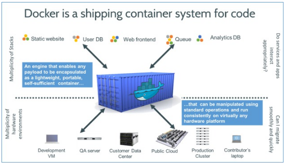
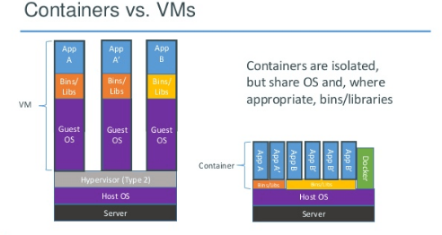
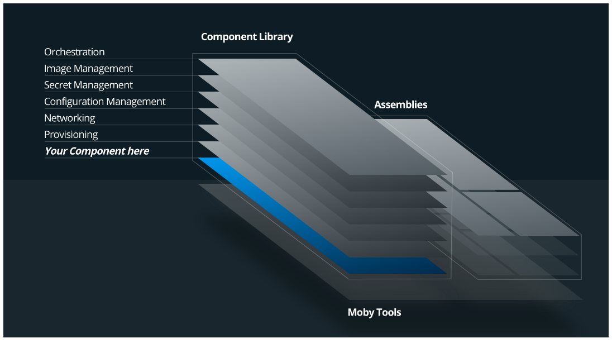
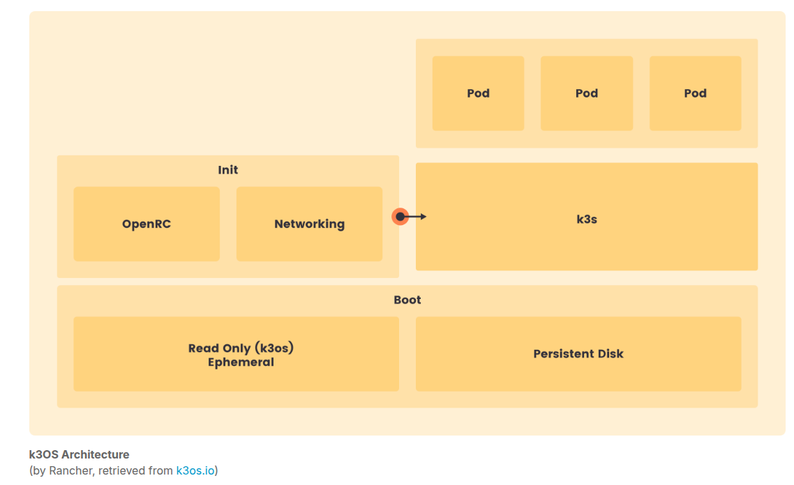
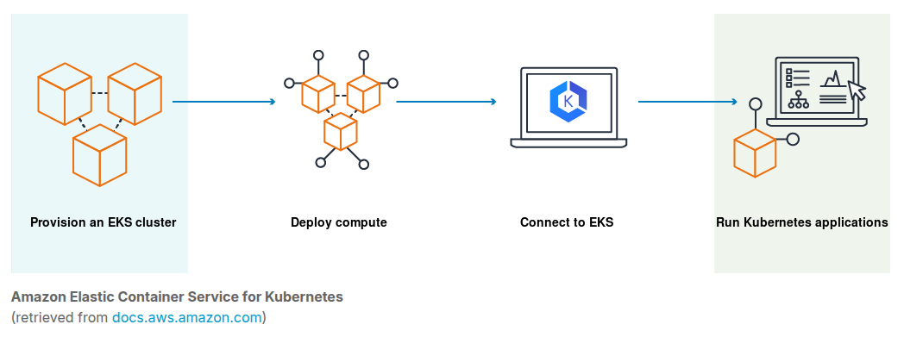
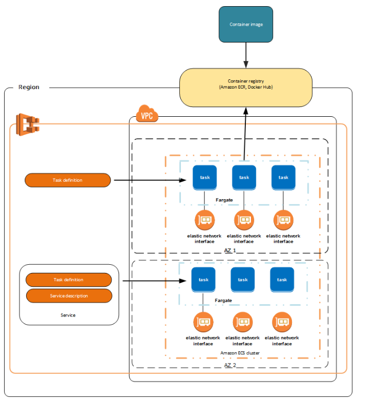

#### Introduction to Cloud Infrastructure Technologies (LFS151)

##### 1. Introduction

##### 2. Virtualization

##### 3. Infrastructure as a service- IaaS

##### 4. Platform as a service- PaaS

##### 5. Containers

##### 6. Containers: Micro oses for containers

##### 7. Containers: Container Orchestration

##### 8. Unikernels

##### 9. Microservices

##### 10. Software-defined networking and Networking for containers

##### 11. Software-defined sotrage and storage management for containers

##### 12. DevOps and CI/CD

##### 13. Tools for cloud infrastructure: Configuration management

##### 14. Tools for cloud infrastructure: Build and release

##### 15. Tools for cloud infrastructure: Key-value pair storage

##### 16. Tools for cloud infrastructure: Image building

##### 17. Tools for cloud infrastructure: Debugging, loggingand monitoring for containeraized applications

##### 18. Service mesh

##### 19. IoT

##### 20. Serverless Computing

##### 21. Distributed Tracing

---

##### 1. Introduction

- Key features of Cloud Computing:

1. Speed and Agility
2. Cost
3. Easy Access to Reources
4. Maintenance
5. Multi-tenancy
6. Reliability
7. Scalability and Elasticity
8. Security

---

- Cloud deployment models:

  1. Private Cloud: designate and operated solely for one organization.
  2. Public Cloud: open to the public
  3. Hybrid Cloud: mix between private and public
  4. Community Cloud: formed by multiple organizations sharing common cloud infra
  5. Distributed Cloud: formed by distributed systems connected to a single network
  6. Multicloud: one org, uses multiple clod providers to run its workload-to avoid vendor lock in
  7. Poly Cloud: one org, uses multiple clouds for specific services

---

- Virtualization: the ability to create a virtual version of a physical compute resource, including virtual hardware platform, OS, virtual storage device and virtual compute resource.

---

- Virtual Machine (VM): represents isolated collection of emulated resources, behaving like an actual physical system.

---

- Hypervisor: specialized virtualization software that runs on a host machine. Its capable of creating multiple isolated virtual operating environments, each composed of virtualized resources that are then made available to guest systems. They have 2 different classes.

- Type 1 hypervisor: native or bare-metal- runs directly on top of a physical host machine's hardware, without the need for a host OS.

- Found in enterprise settings:

  - AWS Nitro
  - IBM z/VM
  - Microsoft Hyper-V
  - Nutanix AHV
  - Oracle VM Server for SPARC
  - Oracle VM Server for x86
  - Red Hat Virtualization
  - VMWare ESXi
  - Xen.

- Type 2 hypervisor: hosted, runs on top of the host OS. Typically they are for end-users.

  -Found in:

  - Parallels Desktop for Mac
  - VirtualBox
  - VMware Player
  - VMware Workstation.

- Exceptions: hypervisors matching both categories, often used for redundancy reasons under hypervisors from type 1 and type 2. They are Linux kernel modules that act as both types of hypervisors.

  Examples:

  - KVM
  - bhyve

- Hypervisors enable virtualization of computer hardware such as CPU, disk, network, RAM and allow installation of guest VMs on top of them. Its possible to create multiple guest VMs with different OS on a single hypervisor(Ex. Linux native machine as host, with type 2 hypervisor can have multiple guest machines with different OS- Linux and Windows).

- Virtualization allows hardware to become virtualized, virtual systems may be created with the help of emulators as well. System emulations that occurs on both system and user space levels, such as QEMU. QEMU is flexible to allow usage in conjuction with a hypervisor such as KVM.

---

##### KVM Overview

- KVM (Kernel-based Virtual Machine) is a full virtualization solution for Linux on x86 hardware.

- KVM is a loadable virtualization module of the Linux kernel and it convers the kernel into a hypevisor capable of managing guest Virtual Machines.

- Originally designed for the x86 hardware, it has also been ported to FreeBSD, S/390, PowerPC, IA-64, and ARM as well.

- High-level overview of the KVM/QEMU Virtualization environment:


- KVM is open source software that provides hardware-assisted virtualization to support various OS- Linux distros, Windows, Solaris, etc.

- KVM enables device abstraction of network interfaces, disk but NOT THE PROCESSOR! KubeVirt, QEMU and virt- manager are examples of user tools for KVM Virtual Machine management.

- KVM supports nested guests- allowing VMs to run within VMs. Also supports hotpluggable device such as CPUs and PCI devices. **Overcomming** ( This means that more virtualized CPUs and memory can be allocated to virtual machines than there are physical resources on the system. This is possible because most processes do not access 100% of their allocated resources all the time.) is possible as well as for the allocation of additional virtualized resourecs that may not be available on the system. To achieve it KVM dynamically swaps resources from another guest that is not using the type of resource needed.

- KVM benefits: open source, can reduce costs, supports many different OSes, para-virtualization of Ethernet cards, disk I/O, scalable, advanced security.

---

##### Virtual Box

- Virtual vox is an x86 and AMD64/Intel64 product from Oracle, capable of running guest OSes. Easy to use multi-platform type-2 hypervisor.

- Benefits: open source, free to use, runs on Linux, Windows, macOS and Solaris, provides teleportaion-live migration.

---

##### Vagrant Overview

- Benefits of VMs:

  - Reproductible environment
  - Management of multiple projects, each isolated and restricted in its own environment.
  - Sharing the environment with other teammates
  - Keeping the development and deployment enviroments in sync
  - Consistently running the same VM on different OSes leveraging hypervisors such as VirtualBox, VMware and KVM.

  Vagrant by HashiCorp helps automation of VMs management by providing end-to-end lifecycle utility- the vagrand CLI. Its cross platform and a key feature is extensibility. Usually shipped with limited features but can be extended with plugins. Supports Docker- allowing management of Containers and Virtual Machines.

**Vagrantfile**

- it describes how VMs should be configured and provisioned. It is a text file with Ruby syntax, containing all the information about configuring and provisioning set of machines.

- It may include the machine type, image, networking, provider-specific information, and provisioner details. While it is portable, there should be only one Vagrantfile per project.

```
# -*- mode: ruby -*-
# vi: set ft=ruby :

Vagrant.configure("2") do |config|
      # Every Vagrant development environment requires a box.
      # You can search for boxes at
      # ht‌t‌ps://app.vagrantup.com/boxes/search
      config.vm.box = "ubuntu/focal64"

      # Set the HOSTNAME of the guest VM
      config.vm.hostname = "vagrant-host"

      # Create a private network, which allows host-only access
      # to the machine using a specific IP
      config.vm.network "private_network", ip: "192.168.56.100"

      # Vagrant VirtualBox provider specific VM properties
      config.vm.provider "virtualbox" do |vb|
           # Set VM name to be displayed in the VirtualBox VM Manager window
           vb.name = "vagrant-vm"
           # Customize the amount of CPUs on the VM
           vb.cpus = 2
           # Customize the amount of memory (2GB RAM) on the VM
           vb.memory = 2048
      end

      # Share an additional folder to the guest VM. The first argument is
      # the path on the host to the actual folder. The second argument is
      # the path on the guest to mount the folder. And the optional third
      # argument is a set of non-required options.
      # config.vm.synced_folder "../data", "/vagrant_data"

      # Vagrant shell provisioner to automatically
      # install packages 'vim', 'curl', 'podman'
      config.vm.provision "shell", inline: <<-SCRIPT
           sudo apt update
           sudo apt install -y vim curl
           sudo mkdir -p /etc/apt/keyrings
           curl -fsSL ht‌tps://download.opensuse.org/repositories/devel:kubic:libcontainers:unstable/xUbuntu_$;(lsb_release -rs)/Release.key | gpg --dearmor | sudo tee /etc/apt/keyrings/devel_kubic_libcontainers_unstable.gpg > /dev/null
           echo "deb [arch=$(dpkg --print-architecture) signed-by=/etc/apt/keyrings/devel_kubic_libcontainers_unstable.gpg] htt‌ps://download.opensuse.org/repositories/devel:kubic:libcontainers:unstable/xUbuntu_$;(lsb_release -rs)/ /" | sudo tee /etc/apt/sources.list.d/devel:kubic:libcontainers:unstable.list > /dev/null
           sudo apt update -qq
           sudo apt -y upgrade
           sudo apt install -qq -y podman
           echo NGINX PODMAN CONTAINER RUNNING ON VIRTUALBOX VM > /vagrant-demo
           echo Provisioned at: >> /vagrant-demo
           date >> /vagrant-demo
      SCRIPT

      # Vagrant Podman provisioner automatically installs Podman
      # and then runs the 'nginx' image in a container
      # (We have pre-installed Podman because of provisioner bugs)
      config.vm.provision "podman" do |p|
           p.run "nginx"
      end
end

```

- The vagrant command reads the configuration given in the configuration file and does different operations, like up, ssh, destroy, etc. The vagrant command also has sub-commands like box to manage Box images, rdp to connect to VMs using Remote Desktop Protocol (RDP), etc.

---

**Vagrant Boxes**

- Boxes are package format for the Vagrant environment.
  The Vagrantfile requires an image, which is then used to instantiate Virtual Machines. In the example above, we have used ubuntu/focal64 as the base image. If the image is not available locally, then it can be downloaded from a central image repository such as Vagrant Cloud box repository provided by HashiCorp. Box images can be versioned and customized to specific needs simply by updating the Vagrantfile accordingly.

---

**Providers**

- Are a underlying engines or hypervisors used to provision VMs or containers. Although the default Vagrant provider is VirtualBox, it also supports Hyper-V, VMware, and Docker out of the box. Custom providers such as AWS may be configured as well.

---

**Synced Folders**

- With the Synced Folders feature, we can sync a directory on the host system with a VM, which helps the user manage shared files/directories easily. In our example, if we uncomment the line describing the synced folder attribute, then the ../data folder from the current working directory of the host system would be shared with the /vagrant_data folder of the VM.

```
# config.vm.synced_folder "../data", "vagrant_data"
```

---

**Provisioning**

- allow us to automatically install software and make configuration changes after the machine is booted. It is part of the vagrant up process. There are many types of provisioners available, such as File, Shell, Ansible, Puppet, Chef, Docker, Podman, Puppet, and Salt. In the example below, we used Shell as the provisioner to update the VM and then install the vim and curl packages.

```
config.vm.provision "shell", inline: <<-SCRIPT
     sudo apt update
     sudo apt install -y vim curl
SCRIPT
```

---

**Plugins**

- Mainly used to extend the functionality of Vagrant.

---

**Networking**

- Vagrant provides high-level networking options for port forwarding, network connectivity, and network creation. These networking options represent an abstraction that enables cross-provider portability. That is, the same Vagrantfile used to provision a VirtualBox VM could be used to provision a VMware machine.

---

**Multi-Machine**

- A project's Vagrantfile may describe multiple VMs, which are typically intended to work together or may be linked between themselves.

---

**Vagrant Benefits**

- It automates the setup of one or more VMs, which results in saved time, increased productivity, and lower operational costs.
- It introduces consistency in infrastructure provisioning through Vagrantfile.
  -It is a flexible cross-platform tool.
- It provides support for Docker containers in addition to VMs provisioned with VMware, VirtualBox, and Hyper-V.
- It is easy to install and configure.
- It is very useful in multi-developer teams.

---

##### Infrastructure As A Service

**Infrastructure as a Sercvice (IaaS)**

- Definition: cloud sercice model that provides on-demand physical and virtual computing resources, storage, network, firewall and load balancers. IaaS uses hypervisors such as Xen,KVM, VMware ESxi, Hyper-V or Nitro.

- Infrastructure as a Service is the backbone of all other cloud services, providing computing resources. After the provisioning of the computing resources, other services are set up on top. IaaS enables developers to provision and destroy isolated test environments as needed, when needed, quickly, and safely. The provisioning process can be easily reproduced to add consistency to the test environment, not only by the same developer, but by an entire team if desired.

---

##### Amazon EC2 Overview

- AWS is one of the leading cloud providers, part of the Amazon's IaaS model is the Amazon Elastic Compute Cloud(Amazon EC2) service. It allows individual users and nterprises alike to build a reliable, flexible and secure cloud infrastructure for their applications and workloads on the AWS platform.

- EC2 instances are in fact Virtual Machines, when provisioning-> VMs are on top of hypervisors that run directly on Amazon's infra. AWS has CLI, at the center of Amazon EC2 are various type-1 hypervisors (Xenm/KVM/Nitro). There is free tier with term duration allowing new users to test the tools.

- EC2 Tools :
- Amazon Machine Images (AMI): pre-configured images with the information needed to launch EC2 instances, They include OS and collection of software packages.
  -Instance types : virtual machine profile of the instance that is launched. each instance can be preconfigured before deploying.

- Additional toos for EC2 instances maay include0 VPC(virtual private cloud) for network isolation, SG(security groups) for VPC networks to control EC2 inbound/outbloud traffic, amazon- elastic block store- EBS- persistent storage attachment. Elastic Ip to remap static IP, cloud watch, auto scalling.

---

##### Azure Virtual machine overview

- Microsoft Azure is a leading cloud services provider, with products in different domains, such as compute, web and mobile, data and storage, Internet of Things (IoT), and many others. The Azure Virtual Machine service allows individual users and enterprises alike to provision and manage compute resources, both from a web Portal or the Azure Cloud Shell, a flexible command line utility configurable to use either Bash or PowerShell.

- Azure cloud services are enabled by the Azure Hypervisor, a customized version of Microsoft Hyper-V type-1 hypervisor. The Azure Hypervisor promises high efficiency, performance, and scalability over a small footprint thanks to the optimization of the custom Hyper-V hypervisor coupled with its tight integration with the physical infrastructure.

- Azure users are able to manage various instance aspects such as the Operating System, VM size, storage, networking, and firewall rules.

- The VM Image field defines the base Operating System or the application for the VM. Both Linux VMs and Windows VMs can be launched from images available through the Azure Marketplace.

- The VM size determines the type and capacity of the compute, memory, storage and network resources for the VM to be launched.

---

##### Digital Ocean Droplet

- DigitalOcean is a leading cloud services provider, aiming its cloud platform at both individual users and enterprises. DigitalOcean helps you create a simple cloud quickly, as it promises IaaS virtual instances set up within seconds. DigitalOcean cloud services enable application deployments and scaling on a cloud infrastructure available worldwide, leveraging network and storage flexibility together with security and monitoring tools.

- In the DigitalOcean ecosystem, the virtual compute instances are called droplets, and they are Linux-based VMs launched on top of the KVM type-1 hypervisor, with SSD (Solid-State Drive) as their primary storage disk.

- DigitalOcean offers paid cloud services, but users can take advantage of a short-term credit towards cloud services, part of a free tier offering aimed to encourage users to explore and become familiar with its offerings.

- DigitalOcean droplets are easy to configure, users being able to manage the resource profile, guest Operating System, application server, security, backup, monitoring, and more.

- Resource profiles are directly associated with DigitalOcean cost plans and are categorized in Shared CPU and Dedicated CPU plans.

- The Shared CPU plan includes the Basic Droplets with burstable vCPU and memory that can be configured to support the running of web servers, forums, and blogs.

---

##### Google Compute Engine

- Google Compute Engine (GCE) service allows individual users and enterprises alike to build a reliable, flexible, and secure cloud infrastructure for their applications and workloads on Google's platform. GCP offers an easy to use Console, which is a web interface for cloud resources management.

- GCE instances are in fact Virtual Machines. When provisioning GCE instances on the GCP infrastructure, we are provisioning VMs on top of hypervisors that run directly on Google's physical infrastructure. In addition to the web Console, GCP also offers a command line interface (CLI), a tool to manage resources with command line tools and scripts if necessary.

- GCE services are enabled by the KVM type-1 hypervisor, running directly on Google's physical infrastructure and allowing for VMs to be launched with Linux and Windows guest Operating Systems.

---

##### IBM cloud Virtual Servers

- IBM Cloud Virtual Servers service, also known as Virtual Machines, one of the many services providing cloud compute services. IBM Cloud Virtual Servers provide interoperability between virtual and bare-metal servers by being deployed on the same VLANs as the physical servers. When you create an IBM Cloud Virtual Server, you can choose between multi-tenancy or single-tenancy environments, and also high-performance local disks or enterprise SAN storage.

- IBM Cloud is the successor of two joined technologies - the IBM mainframe and virtualization. IBM treats virtualization with some level of flexibility. While it uses IBM z/VM and IBM PowerVM, two powerful hypervisors, to manage its own virtual workload, the users of IBM Cloud are allowed to choose between XenServer, VMware, and Hyper-V hypervisors when managing bare-metal instances. This level of hypervisor flexibility is one of the advantages of IBM Cloud, and one of the top reasons why users pick IBM Cloud over another cloud service provider.

- When provisioning IBM Cloud Virtual Servers, users are able to manage different server aspects, such as profile, image, software package add-ons, attached storage, network interface bandwidth, internal and external firewall rules, IP addresses, and VPN.

---

##### Linode Compute Instances

- Linode combines a diverse set of offerings with the user friendliness of an easy to use management dashboard. Its popular compute, storage, network, and resource management tools blended with Akamai’s advanced content delivery network (CDN) and security services turned the joint venture into a powerful cloud services provider. Users can take advantage of the Linode Compute service to provision robust, secure, yet inexpensive infrastructure that can satisfy a vast array of computing requirements.

---

##### Oracle Cloud Compute VMs

- A commonly used infrastructure product is Cloud Compute, which includes several options to support various types of I/O intensive workloads, high-performance computing (HPC), and artificial intelligence (AI). These options are represented by Cloud Compute Instances that include Virtual Machines (VMs), Bare Metal Servers, GPU-optimized VMs and Bare Metal Servers, alongside Autonomous Linux instances, and instances optimized for Container Registries and Container Engines for Kubernetes.

- Oracle Cloud Infrastructure Compute Virtual Machines are offered in many shapes with Oracle Compute Units (OCPUs) to support a wide range of workloads and software platforms, allowing for storage support customization from remote block storage to high local SSD storage capacity.

---

##### OpenStack

- OpenStack allows users to build a cloud computing platform for public and private clouds. OpenStack was started as a joint project between Rackspace and NASA in 2010. In 2012, a non-profit corporate entity, the OpenStack Foundation, was formed to manage it while receiving the support of more than 500 organizations. OpenStack is an open source software platform released under an Apache 2.0 License, and it is currently part of the OpenInfra Foundation.

---

###### Vultr Cloud

- Vultr is a younger cloud services provider that aims to simplify the way cloud is consumed by developers and businesses. Through its worldwide network of datacenters, Vultr enables its users to provision public cloud, cloud storage, single-tenant bare metal systems, and highly reliable high performance cloud compute environments.

- Vultr supports a wide range of business solutions, from simple Web Hosting, Machine Learning (ML), and AI to Blockchain, and High Performance Computing (HPC). It integrates shared virtual CPUs, AMD CPUs, Intel CPUs, and GPUs with regular SSD and NVMe SSD into its infrastructure offering a wide array of Cloud Compute Virtual Machines.

- Vultr is a paid offering; however (as of October 2023), it has a free offering through free credit, limited to the first 30 days of a newly opened account, aimed to encourage users to explore the Vultr Cloud Compute and Cloud Storage services and to become familiar with its most popular options and features.

---

#### Platform as a Service

---

##### PaaS Overview

- Platform as a Service (PaaS) is a cloud service model representing a class of cloud computing services that allow users to develop, run, and manage applications while concealing the tasks involved in the management of the underlying infrastructure. With PaaS, users are able to concentrate their efforts on building their applications, which is a great benefit to developers.

- Users have a choice between managed and self-managed PaaS solutions. Managed PaaS solutions are hosted by cloud computing providers like Amazon AWS, Microsoft Azure, Google Cloud Platform (GCP), IBM Cloud, and Oracle Cloud, while an on-premises PaaS can be deployed as a self-managed solution, using a platform such as Red Hat OpenShift. Such a Platform benefits the end user by abstracting infrastructure provisioning and application runtime dependencies installation, configuration, and maintenance.

- PaaS can be deployed on top of IaaS or independently on VMs, bare-metal servers, and containers.

---

##### Cloud Foundry

- Cloud Foundry (CF) is an open source Platform as a Service (PaaS) framework aimed at developers in large organizations, that is portable to any cloud, highly interoperable, has an architecture supporting any programming language, and integrates easily with various cloud and on-premises tools. In addition to supporting any type of application, it provides means for these applications to access external resources through application services gateway.

- While CF can be deployed on-premises, it is recommended to install it on one of the supported IaaS, such as Amazon AWS, Microsoft Azure, Google Cloud Platform (GCP), IBM Cloud, OpenStack, or VMware vSphere. Stable Cloud Foundry releases are also available through several certified commercial distributions as well, such as Atos Cloud Foundry, Cloud.gov, SAP Cloud Platform, VMware Tanzu (formerly known as Pivotal Cloud Foundry), or others.

- CF aims to address challenges faced by developers in large organizations through a collection of customized technologies. Popular core components such as the Cloud Foundry API, CF CLI, Korifi, Garden, Diego, Eirini, Paketo Buildpacks, Stratos UI, together with BOSH, Quarks, and a set of extensions such as the Open Service Broker API make up the Cloud Foundry platform.

---

##### Cloud Foundry BOSH

- Cloud Foundry BOSH is an open source tool for release engineering, deployment, lifecycle management, and monitoring of complex distributed systems, enabling developers to easily version, package and deploy software in a reproducible manner.

- BOSH aims to ease the process of building and administering consistently similar environments from development to staging and production. BOSH was designed to be the one tool to solve versioning, packaging, and reproducible software deployments as a whole, a collection of activities otherwise performed by tools such as Chef, Puppet, and Docker in various non-standard approaches.

---

**Cloud Foundry CLI (cf push)**

- This command is highly customizable, however, it can be easily run with default settings even by novice users of the Cloud Foundry platform. It supports popular programming languages such as Java, Node.js, Python, PHP, Go, Ruby, and .Net, but it can be extended to support additional languages and developer frameworks through community-developed buildpacks.

---

**Cloud Native Could Foundry- Kofiri**

- Converting CF into a cloud native tool is not an effortless process, however, the result is a CF project named Korifi. It is a CF offering redesigned from the ground up for another platform, Kubernetes, a popular container orchestrator.

- The Korifi project aims to abstract CF components and dependency configuration, enabling the developer to focus on building applications. This further helps to widen the environment options where CF can be deployed, as containers and container orchestrators are platforms supported by a large array of cloud services, IaaS, and certified solution providers.

---

##### Red Hat OpenShift

- It is built on top of the container technology orchestrated by Kubernetes. OpenShift can be deployed in the cloud as a managed service or as a self-managed deployment on a public or private cloud optimized to run containers and Kubernetes.

- It can be Managed (with AWS, IBM cloud, Azure), self-managed, Red hat Container platform, Red hat Kubernetes engine.

---

---

---

#### Containers

---

---

---

**Container Overview**

- Containers are used for isolation applications from one another to avoid conflicts between dependencies, libraries and runtimes.

- OS level virtualization allows to run multiple isolated user-space instances in parallel. These isolated user-space instances incliude the application, source code, required libraries and runtime to run the application without any external dependencies.

---

**Introduction to containers**

- Containers address the challenges with portability, when application needs to work consistently on multiple hardware and platforms.

Running application diagram:


By using a container technology such as Docker or Podman, the application and all its dependencies can be bundled in a box.

Docker Diagram:


---

**Images and Containers**

- The box containing app source code and all its dependencies and libraries is called an **image**. Runnin instance of the box is called a **container**. We can run multiple containers from the same image.

- Image contains application, dependencies and user-space libraries. User-space librareis like glibc enable switching from the user-space to the kernel-space. An image does not contain any kernel-space components.

- When a container from an image, it runs as a process on the host's kernel. It is the host kerne's job to isolate the container process and to provide resources for each container.

---

## **Building Blocks of Containers**

**Namespaces**

- Namespace wraps a particular global system resource like network and process IDs in an abstraction, that makes it appear to the processes within the namespace that they have their own isolated instance of the global resource.

- Global resources that are namespaced:

  - pid- provides each namespace to havethe same PIDs (Each container has its own PID 1)
  - net - allows each namespace to ahve its network stack. Each container has its own IP address.
  - mnt - allows each namespace to have its own view of the filesystem hierarchy.
  - ipc - allows each namespace to have its own interprocess communication.
  - uts - allows each namespace to have its own hostname and domain name.
  - user - allows each namespace to have its own user and group ID number spaces. A root user inside a container is not the root user of the host on which the container is runing.

---

**Control Groups- cgroups**

- Control groups are used to organize processes hierarchially and distribute system resourecs along the hierarchy in a controlled and configurable manner. cgrpups for Linux:

  - blkio
  - cpu
  - cpuacct
  - cpuset
  - devices
  - freezer
  - memory

---

**Union Filesystem**

- Union filesystem allows files and directories of separate filesystems, known as layers, to be transparently overlaid on top of each other, to create a new virtual filesystem. At runtime, a container is made of multiple layers merged to create a read-only filesystem. On top of a read-only filesystem, a container gets a read-write layer, which is an ephemeral layer and its local to the container.

---

**Container Runtimes**

---

- Origin: the first steps towards containerization can be traced back to 1979 with the process isolation achieved through chroot, followed by Linux Containers (LXC) released in 2008, it was the launch of Docker in 2013 that allowed containers to become more popular. Docker was able to hide all the complexities in the background and came up with a simple workflow to share and manage both images and containers. Docker achieved this level of simplicity through a collection of tools that interact with a container runtime on behalf of the user. The container runtime ensures the containers' portability, offering a consistent environment for containers to run, regardless of the infrastructure.

- Lore: Once containers have become popular and container orchestration was emerging as a concept with Kubernetes becoming its primary implementation, in 2014 we saw a new container runtime being born - rkt, implementing a newly introduced set of standards, the App Container (appc) specification defining the Application Container Image (ACI) format. Shortly after, a new standard has been introduced in 2015, the Open Container Initiative (OCI), setting the stage for several new projects such as Skopeo, Buildah, and Podman, all providing sets of open source tools to allow users a quicker, more secure, daemonless, and less resource-intensive containerization experience. Kaniko has also been introduced, a project aiming to integrate the Dockerfile-based container image build process with Kubernetes, or any other environment that cannot run a Docker daemon. While the containers landscape was evolving, a new container runtime has been introduced, CRI-O - a lightweight runtime implementing Kubernetes' Container Runtime Interface (CRI) standard to allow OCI-compliant containers to be run and managed by the container orchestrator.

---

**Container Runtimes Variations:**

---

**runC**

- General info: In order to prevent vendor locking from companies, a governance structure was created: The Open Container Initiative (OCI), under Linux foundation. The governance body came with both runtime and image specification to create standard for the Operating system and application containers.

- **runC**: is the CLI tool for spawning and running containers according to these specification, also cagegorized as low-level runtime. **runc** is a Go-language based tool that created ans starts container processes. An OCI container runtime is expected to fork off the first process in the container, but Go does not have good support for the fork/exec model of computing. Go follows a threading model that expects programs to fork a second process and then to exec immediately.

---

**crun**

- General info: much faster low-memory footprint OCI- conformant runtime written in C, Crun is lighter thatn runc. C is not multi-threaded but it follows the fork/exec model meeting the OCI runtime expectation.

---

**containerd**

- General info: OCI- compliant container runtime with focus on simplicity, robustness and portability. High-level runtime, it runs as a daemon and manages the entire lifecycle of containers. Available for both Linux and Windows. Docker, also run as a daemon is a containerization platform that uses containerd as a runtime to manage runC containers.

---

**CRI-O**

- General info: OCI compatible runtime, implementation of the Kubernetes Container Runtime Interface. Lighweight, high-level alternative to using Docker as the runtime for Kubernetes.

---

---

---

### **Containers vs VMs**

---

---

---

- General Info: A VM is provisioned with the help of a hypervisor, the software layer that virtualizes a host system's hardware resources such as CPU, memory and networking to allow a guest OS to be installed and take advantage of them. Various OS can be installed. There are multiple layers for an app to run- guest OS, hypervisor and even host OS.

- Containers can run directly as a processes on the host OS. There is no middle layer as we seen in the VMs. containers provide near-native performance. Very light footprint, so we can pack more containers than VMs on the same physical machine. However we need to chech if the containers are compatible with the host OS.



---

**Docker**

- Docker Platform is a collection of development tools that follow client-server architecture with Docker client connecting to a Docker Host server that runs the Docker Daemon to execute commands for containers and images management in responce to client requests.

- Docker is capable of running rooted containers by defaults. It is also capable of rootless container mode aiming to address issues with security.

- Docker Personal- free for individual developers, education, small businessses.
- Docker Pro- professional developers, image pulls from Docker hub, private repositories.
- Docker Team- subscription for developer collaboration.
- Docker Business- subscriptin extends the developer experience with features such as image access, control plane, etc.

---

**Basic Docker Operations**

- Some of the basic docker cli commands.

```
- List images available in the local cache:
$ docker image ls

-Pulling an alpine image from the registry into the local cache:
$ docker image pull alpine

- Run a container from an image (if the image is not found in the local cache, it will be pulled from the registry). The run command is equivalent of docker container create followed by docker container <id> start:
$ docker container run -it alpine sh

- Run a container in the background (-d option) from an nginx image:
$ docker container run -d nginx

- List only running containers:
$ docker container ls

- List all containers:
$ docker container ls -a

- Inject a process inside a running container. This will start a bash shell in interactive (-i option) terminal (-t option) mode inside the container:
$ docker container exec -it <container_id/name> bash

- Stop a running container:
$ docker container stop <container id/name>

- Delete a stopped container:
$ docker container rm <container id/name>

```

---

**Podman**

---

**Summary**: Podman or Pod manager - open source, daemonless tool designed to simplyfy the searching, running, building, sharing and deploying of application using OCI containers and images. Provides similar CLI to Docker CLI. Podman relies on an OCI- compliant Container Runtime such as runc to create the running containers, making it a great alternative containerization tool to Docker. Another advantage- can run containers in rootless mode by default, while rooted mode is also supported and desired. Image building process- uses Containerfile, similar in format to the popular Dockerfile.

- Red Hat, developed Podman, created 2 additional tools- Bulidah- supports container image builds one step at a time by taking an interactive approach to processeing Dockerfile instructions, Skopeo- tool for working with both local and remote repositories.

- The Docker CLI interacts with the Docker daemon prior to invoking the containerd daemon responsible to run the runc runtime, while Podman is a daemonless tool capable of running the runc runtime without an intermediary daemon such as containerd.


---

**Basic Podman Operations**

- For smooth transition w ecan set following alias **docker=podman**

Short list of podman CLI commands:

```
- List images available in the local cache:
$ podman image ls

- Pulling an alpine image from the Docker Hub registry into the local cache:
$ podman image pull docker.io/library/alpine

- Run a container from an image (if the image is not found in the local cache, it will be pulled from registry). The run command is equivalent of podman container create followed by podman container <id> start:
$ podman container run -it alpine sh

- Run a container in the background (-d option) from an nginx image from the Docker Hub registry:
$ podman container run -d docker.io/library/nginx

- List only running containers:
$ podman container ls

- List all containers:
$ podman container ls -a

- Inject a process inside a running container. This will start a bash shell in interactive (-i option) terminal (-t option) mode inside the container:
$ podman container exec -it <container_id/name> bash

- Stop a running container:
$ podman container stop <container id/name>

- Delete a stopped container:
$ podman container rm <container id/name>

```

---

**Nerdctl / crictl**

- Alternative runtimes to Docker.

- Basic Operations:

```
List images available in the local cache:
$ nerdctl images

Pulling an alpine image from the Docker Hub registry into the local cache:
$ nerdctl pull docker.io/library/alpine

Run a container from an image (if the image is not found in the local cache it will be pulled from the registry):
$ nerdctl run -it alpine sh

Run a container in the background (-d option) from an nginx image from the Docker Hub registry:
$ nerdctl run -d docker.io/library/nginx

List images available in the local cache:
$ crictl images

Pulling an alpine image from the Docker Hub registry into the local cache:
$ crictl pull alpine

Run a container from an image (if the image is not found in the local cache it will be pulled from the registry):
$ crictl run -it alpine sh

List running containers:
$ crictl ps
```

---

**Project Moby**

---

- Summary: Docker runs on different platforms and architectures: bare metal (both x86 and ARM), Linux, macOS, and Windows. We can also find pre-configured VM images to run Docker on popular cloud and virtualization providers.

- It is an open source project that provides a framework for assembling different container systems to build a container platform like Docker. Individual container systems provide features such as image, container, and secret management.

- Moby is particularly useful for engineers who want to build their container-based system, to customize and patch an existing Docker build, or just to experiment with the latest container technologies. It uses a Lego-like approach to assemble various open source toolkits, such as:

  - LinuxKit - to build minimal Linux distributions for containers.
  - InfraKit - to manage infrastructure in a declarative manner.
  - SwarmKit - to orchestrate distributed systems at scale.
  - containerd - as container runtime.
  - runc - to spawn and run OCI-compliant containers.
  - Notary - for trusted data sets.
  - LibNetwork - for networking.

- However, Moby is not recommended for application developers in search of an easy way to use the container system to run their containerized applications.



---

---

---

### Micro OSes for containers

---

---

---

- Why to run applicatons in containers? To aim for lightweight isolated environments for them. By doing so, we can remove pakcages that are not essential to boot the base OS and run container-related service. Those trimmed versions are called- specilized OSes or Micro OSes for containers. They allow for faster container startup and provide a lightweight container enviromnent that is secrure and easy to customize.

Example of microOS:


---

---

**Alpine Linux Overview**

---

---

- independent, non-commercial Linux distro designed for security, simplicty and resource efficiency. Built on top of BusyBox.

- small between 5MB and 8MB per container or 130 mb as minimal stanadlone OS install is quire resouce-efficient.

- uses its own package manager- apk, OpenRC init system and set-up scripts. users can add packages as PVR, iSCSi storage controllers, a mail server container or an embedded switch.

- it allows:

  - diskless mode: default mode where the entire system runs from RAM
  - data mode: mostly runs from ram, but mounts /var as a writable data partition.
  - sys mode : typical hard disk install that mounts /boot, swap and /.

- It provides increased security by compiling user binaries as Position Independent Executables (PIE) with stack smashing protection.

---

- Variants:
  - Standard- requires network connection
  - Extended- includes the most used packages, and runs from RAM
  - Netboot- Includes kernel, initramfs and modloop
  - Mini root filesystem- minimal for container and chroots
  - Virtual- lighter kernel and Standard
  - Raspery Pi- (includes the raspberry kerne)
  - Generic ARM- includes the default ARM kernel with the uboot bootloader.

---

---

**BusyBox Overview**

---

---

- Used for Embedded Linux, combines very small version of several popular Unix utilities into a single compact executable.

- Size between 1 MB and 5MB, licensensed under GNU license.

- Modular and highly customizable. its can be easily ported to FreeBSD, Solaris and macOS.

- Can be built on various architectures: ARM, CRIS, H8/300, x86, ia64, x86_64, m68k, MIPS, PowerPC, S390, SH3/4/5, Sparc, v850e, and x86_64.

- Can be found running in products by Cisco, ASUS, Synology, Western Digital, Sharp, Linksys, Dell, NetGear, Belkin, Siemens, Trendnet, and others.

---

---

**Fedora CoreOS overview**

---

---

FCOS- it combines CoreOS container Linux and Fedora Atomic Host while aiming to provide the best container host to run containerized workloards securely and at scale.

- CoreOS is operable in both clusters and standalone instance. In addition it is optimized to work with Kubernetes, but runs well without containerized workload orchestrator.

---

- Features:

  - Ignition from CoreOS Container Linux: provisioning utility designed specifically for CoreOS Container Linux, which allows users to manipulate discks during early boot, such as parititioning disks, formatting parititions, writing files and configuration users. Ignitions runs early in the boot process (in the initramfs) and runs its configuration before the userspace boot, which provides advandef features to administrators.

  -rpm-stree from FAH- can nont manage indivitual packages on Atomic Host, as there is no rpm or other related commands. To get any required service, you would have to start a respective container. Atomic Host has bootable, immutable and versioned filesystem one is used to boot the desystem and the other is used to fetch updates from upstream. rpm-ostree is the tool to manage those two versioned filesystems.

  - SELinux hardening from FAH- containers secured with SELinux providecolse-to-VM isolation, security and increased flexibility and efficiency.

- Installation methods:
- Cloud lanuchable: To launch directly on Amazon's AWS Platform.

- Bare metal and virtualized: from ISO, PXE(Preboot Execution Environment) or Raw, vms on OpenStack, Quemu, Virtualbox, VMWare

- Cloud operators (Alibaba Cloud, AWS, Azure, DigitalOcean, Exoscale, GCP, IBM Cloud, OpenStack, and Vultr.)

---

**Flatcar Container Linux**

- Flatcar Container Linux is a drop-in replacement for Red Hat CoreOS Container Linux, being directly derived from CoreOS and enabling a seamless in-place migration. Users of CoreOS can effortlessly migrate to Flatcar Container Linux either by modifying a deployment to install Flatcar Container Linux, or by updating directly from Red Hat CoreOS Container Linux.

- Benefits:
  - It is a container-optimized Linux OS distribution.
  - An immutable/read-only filesystem makes it less vulnerable.
  - A minimal OS implies a minimized attack surface.
  - It receives automated security updates and patches.
  - As a CoreOS successor, it supports two easy migration methods from Red Hat CoreOS Container Linux to Flatcar Container Linux.
  - It runs on bare-metal and virtualization platforms such as QEMU, libVirt, VirtualBox, and Vagrant.
  - It runs on public clouds such as Amazon EC2, GCE, Azure, Equinix, VMware, and DigitalOcean.
  - Its first time boot is supported by the Ignition provisioning utility.
  - Supports containerd and Docker container runtimes for Kubernetes clusters.

---

**k3OS Overview**

- k3OS - the Kuberenetes Operating System is a Linux distribution that aims to minimize the OS maintenance tasks in a Kuberenetes cluster. IT was designed to work iwth Rancher's K3s lightweight Kuberenetes distirbution.

- K3OS speeds up the k3s cluster boot time, at the boot time the k3OS image becomes available to k3s and the cluster takes full control over all the nodes maintenance, eliminating the need to log into each individucal node for upgdrades orother maintenance activities.

- Benefits:
  - minimalist OS that elimiates unnecessary libraries and services.
  - decreases complexity and boot time
  - It is highly secure due to small code base and a decreased attack surface.
    -OS configuration is simplfied with **cloud-init**



---

**Ubuntu Core Overview**

- UC is a lightweighr version of Ubuntu, for IoT devices. Size around 260mb. Ubuntu Core works with software packages called snaps (like ubuntu server and ubuntu desktop).

- Bigger than Alpine Linux but ahead of much larger OSes like CoreOS (around 800mb).

- Securitu is top concern for the designer of UbuntuCore:

  - hardened security with immutable packages and persistend digital signatures.
  - strict application isolation
  - reduced attack surface by keeping a small OS, stipped down to bare essentials.
  - automatic vulnerability scanning of packages.

- Ubuntu Core was designed with extreme reliability, implemented by:

  - transactional updates that increase OS and data resiliency by allowing automate rollbacks when erroes are encountered.
  - automated restore points to allow returns to the last working boot in th ecase of unsuccessful kernel update.
  - consistent application data snapshots.

- UC is built for enterprise- by secure app stora management and license compliance.

- UC is designed to run on bare-metal on hypervisors such as KVM, or wire range of hardware. Top features are:
  - immutable image for simple and consistent installation and deployment.
  - isolated applications run with explicit permissions such as read-only access to the filesystem.
  - transactional updates.
  - security at snap level.
  - AppArmor
  - Seccomp

---

- Snaps are secure isolated, dependecy free portable software pakcages for Linux, including:

  - automatic updates,
  - automated recovery in the case of failed updates.
  - critical update provision for unscheduled updates.
  - flexible hardware and network conditions support for unpredictable systems, redundancy roll-backs.

  - snap : application package format and the CLI
  - snapd : the background service managing and maintaining snaps.
  - snapcraft : framework cincluding hte command to build custom snaps
  - snap store- repository to share and store snaps

- Types of snaps :
  - kernel- defines the linux kernel
  - gadget- defines specific system properties
  - core- execution environment for application snaps
  - app- including applications, daemons and various tools.

---

**VMware Photon OS overview**

- minimal linux container host provided by VMware, optimized for cloud- native applications. Designed with a small footpring in order to boot extremely quickly on VMwave vSphere deployments and on cloud computing platforms.

- Photon OS can be deployed on AWS EC2, GCE and Azure instances, while supporting a variaty of container formats as a container host or as a kubernetes node.

- Minimal version: lightweight container host runtime environment including a minimum of packaging and functionality to mangage containers while still remainig a fast runtime environment.

- full version- packages of tools for development, testing and deployment of containerized applications.

- yum- compatible package managed called Tiny DNF (tdnf) manages services with systemd.

- security-hardenend Linux, kernel and other aspects are built with the recommendations provided by the Kernel self- protection project.

- easily managed, patched and update.

- also supports Apache Mesos.

---

---

---

## **Container Orchestration**

---

---

---

**Overview**

- Container orchestration is an umbrella concept that encompasses container scheduling and cluster management. Container scheduling becomes a policy-driven mechanism that automates the decision process that distributes containers across the nodes of the cluster. However, cluster operators are allowed to control the scheduling process through custom policies or scheduling properties.

- The decision making process during scheduling is aided by cluster management aspects such as the state of existing workloads and cluster node resources availability. With cluster management orchestrators, we can manage the resources of cluster nodes, as well as add or delete nodes from the cluster through the cluster scaling mechanism. Some of the available solutions for container orchestration are:

  - Kubernetes
  - Docker Swarm
  - Nomad
  - Amazon ECS.

---

---

**Kuberenetes Overview**

---

---

- Kubernetes is an Apache 2.0- licensed open source project for automating deployment operations, and scaling of containerized applications. Started by google in 2014. in 2015- CNCF accepted Kubernetes as its first hosted project. Supported runtimes-containerd, CRI-O, Docker Engine nad Mirantis Container Runtime.

---

- Achritecture of Kuberenetes:


--

- Key Komponents:

  - Cluster: Cluster is a collection of systems (bare-metal or virtual) and other infra resources used by Kubernetes to run containerized applications.

  - Control-Plane Node: a system that takes containerized workload scheduling decisions, manages the worker nodes, enforces access control policies, and reconciles changes in the state of the cluster. Its main components are the kube-apiserver, etcd, kube-scheduler, and kube-controller-manager responsible for coordinating tasks around container workload scheduling, deployment, scaling, self-healing, state persistence, state reconciliation, and delegation of container management tasks to worker node agents. Multiple control-plane nodes may be found in clusters as a solution for High Availability.

  - Worker Node: A system where containers are scheduled to run in workload management units called Pods. The node runs a daemon called kubelet responsible for intercepting container deployment and lifecycle management related instructions from the kube-apiserver, delegating such tasks to the container runtime found on the node, implementing container health checks, enforcing resource utilization limits, and reporting node status information back to the kube-apiserver. kube-proxy, a network proxy, enables applications running in the cluster to be accessible by external requests. Both node agents - kubelet and kube-proxy, together with a container runtime are found on worker nodes and on control-plane nodes as well.

  - Namespace: The namespace allows us to logically partition the cluster into virtual sub-clusters by segregating the cluster's resources, addressing the multi-tenancy requirements of enterprises requiring ab isolation method for their projects, applications, users, and teams.

---

- **Key API resources**:

- **Pod**: The pod is a logical workload management unit, enabling the co-location of a group of containers with shared dependencies such as storage Volumes. However, a pod is often managing a single container and its dependencies such as Secrets or ConfigMaps. The pod is the smallest deployment unit in Kubernetes.

- A pod can be created independently, but it is lacking the self-healing, scaling, and seamless update capabilities which Kubernetes is know for. In order to overcome the pod's shortcomings, controller programs, or operators, such as the ReplicaSet, Deployment, DaemonSet, or the StatefulSet are recommended to be used to manage pods, even if only a single application pod replica is desired.

```
apiVersion: v1
kind: Pod
metadata:
  name: nginx-pod
  labels:
    run: nginx-pod
spec:
  containers:
  - name: nginx
    image: nginx:1.17.9
    ports:
    - containerPort: 80
```

---

- **ReplicaSet**

- mid-level controller, or operator, that manages the lifecycle of pods. It rolls out a desired amount of pod replicas, uses state reconciliation to ensures that the desired number of application pod replicas is running at all times, and to self-heal the application if a pod replica is unexpectedly lost due to a crash or lack of computing resources.

---

- **Deployment**

- Top-level controller that allows us to provide declarative updates for pods and ReplicaSets. We can define Deployments to create new resources, or replace existing ones with new ones. The Deployment controller, or operator, represents the default stateless application rollout mechanism. Typical Deployment use cases and a sample deployment are provided below:

  - Create a Deployment to roll out a desired amount of pods with a ReplicaSet.
  - Check the status of a Deployment to see if the rollout succeeded or not.
  - Later, update that Deployment to recreate the pods (for example, to use a new image) - through the Rolling Update mechanism.
  - Roll back to an earlier Deployment revision if the current Deployment isn’t stable.
  - Scale, pause and resume a Deployment.

- Sample of deployment:

```
apiVersion: apps/v1
kind: Deployment
metadata:
  name: nginx-deployment
  labels:
    app: nginx-deployment
spec:
  replicas: 3
  selector:
    matchLabels:
      app: nginx-deployment
  template:
    metadata:
      labels:
        app: nginx-deployment
    spec:
      containers:
      - name: nginx
        image: nginx:1.17.9
        ports:
        - containerPort: 8
```

---

- **DaemonSet**

- controller, or operator, that manages the lifecycle of node agent pods. It rolls out a desired amount of pod replicas while ensuring that each cluster node will run exactly one application pod replica. It also uses state reconciliation to ensures that the desired number of application pod replicas is running at all times, and to self-heal the application if a pod replica is unexpectedly lost due to a crash or lack of computing resources.

---

- **Service**

- The Service is a traffic routing unit implemented by the kube-proxy providing a load-balancing access interface to a logical grouping of pods, typically managed by the same operator. The Service enables applications with DNS name registration, name resolution to a private/cluster internal static IP. It can reference a single pod or a set of pods managed by ReplicaSets, Deployments, DaemonSets, or StatefulSets.

- Example:

```
apiVersion: v1
kind: Service
metadata:
  name: frontend
  labels:
    app: nginx-deployment
    tier: frontend
spec:
  type: NodePort
  ports:
  - port: 8080
    targetPort: 80
  selector:
    app: nginx-deployment
    tier: frontend
```

---

- **Label**

- The Label is an arbitrary key-value pair that is attached to resources like a pod or a ReplicaSet. In the code examples we provided, we defined labels with keys such as run, app, and tier. Labels are typically used to tag resources of a particular application, such as the Pods of a Deployment, to logically group them for management purposes - for updates, scaling, or traffic routing.

---

- **Selector**

- Selectors allow controllers, or operators, to search for resources or groups of resources described by a desired set of key-value pair Labels. In the examples provided, the frontend Service will only forward traffic to Pods described simultaneously by both labels app: nginx-deployment and tier: frontend.

---

- **Volume**

- The Volume is an abstraction layer implemented through Kubernetes plugins and third-party drivers aimed to provide a simplified and flexible method of container storage management with Kubernetes. Through Kubernetes Volumes, containers are able to mount local host storage, network storage, distributed storage clusters, and even cloud storage services, in a seamless fashion.

---

**Key Features of Kubernetes**

- Automatically distributes containers on cluster nodes based on container's resource requirements, cluster technology and other custom constrains.

- Supports horizontal scaling through the CLI or UI. In addition, it can auto-scale based on resource utilization.

- Supports rolling updates and rollbacks.

- It supports several volume drivers from public cloud providers such as AWS, Azure, GCP, and VMware, together with network and distributed storage plugins like NFS, iSCSI, and the CephFS driver to orchestrate storage volumes for containers running in pods.
- It automatically self-heals by restarting failed containers, rescheduling containers from failed nodes, and supports custom health checks to ensure containers are continuously ready to serve.
- It manages sensitive and configuration data for an application without rebuilding the image.
- It supports batch execution.
- It supports High Availability of the control-plane node to add control plane resiliency.
- It eliminates infrastructure lock-in by providing core capabilities for containers without imposing restrictions.
- It supports application deployments and updates at scale.
- It supports cluster topology aware routing of traffic to service endpoints.

---

**Kubernetes Hosted Solutions and Platforms**

- Amazon Elastic Kubernetes Service (Amazon EKS)
  Offers a managed Kubernetes service on AWS.
- Azure Kubernetes Service (AKS)
  Offers managed Kubernetes clusters on Microsoft Azure.
- Google Kubernetes Engine (GKE)
  Offers managed Kubernetes clusters on Google Cloud Platform.
- IBM Cloud Kubernetes Service
  Fully-managed Kubernetes service at scale, providing continuous availability and high availability, multi-zone, and multi-region clusters.
- NetApp Project Astra (fusion between NetApp and Stackpoint.io)
  Provides Kubernetes infrastructure automation and management for multiple public clouds optimized for stateful application data lifecycle management.
- Oracle Container Engine for Kubernetes (OKE)
  Enterprise-grade Kubernetes service offering highly available clusters optimized to run on Oracle Cloud Infrastructure.
- Red Hat OpenShift
  Offers managed Kubernetes clusters powered by Red Hat on various cloud infrastructures such as AWS, GCP, Microsoft Azure, and IBM Cloud.
- Vultr Kubernetes Engine (VKE)
  A managed Kubernetes service integrated with Vultr cloud load balancers and storage services.
- VMware Tanzu Kubernetes Grid (TKG)
  An enterprise-grade multi-cloud Kubernetes service that runs both on-premises in vSphere and in the public cloud.

- Additional hosted solutions:

- Managed Kubernetes by Canonical, a Kubernetes as a Service offering with built-in monitoring, analytics, security and compliance, optimized for multi-cloud deployment.
- D2iQ Enterprise Kubernetes Platform (DKP) is a managed Kubernetes service that incorporates features of DC/OS.
- Kubermatic Kubernetes Platform automates Kubernetes cluster management on premises and in the public cloud.
- Mirantis Kubernetes Engine, an Enterprise Kubernetes Platform, formerly Docker Enterprise, manages containerized workloads on any infrastructure.
- Platform9 Managed Kubernetes (PMK) is a managed SaaS that simplifies Kubernetes management on premises and in the public cloud.
- Rackspace Managed Platform for Kubernetes (MPK) - Powered by Platform9 Managed Kubernetes (PMK) solution, is a Kubernetes as a Service offering built-in monitoring, alerting, security management, infrastructure as code (IaC) to provision the entire stack. It is a flexible, cross-cloud portable solution.
- Rancher Kubernetes Engine (RKE) is a Kubernetes distribution that runs in containers on any platform.

---

**Amazon EKS**

- Users are no longer involved in the infrastructure management, deployment, and maintenance of the Kubernetes control plane. EKS provides a scalable and highly-available control plane that runs across multiple AWS availability zones. It can automatically detect the unhealthy Kubernetes control plane nodes and replace them as needed.

- EKS supports cluster autoscaling, to dynamically add worker nodes into the cluster, based on the workload and resource utilization. It also integrates with Kubernetes Role-Based Access Control (RBAC) to support AWS IAM authentication.

- Although master nodes are managed by AWS, users will still need to pay the hosting cost. They will also have to pay for the worker nodes.



---

**Azure Kubernetes Service (AKS)**

- AKS also supports cluster autoscaling to dynamically add worker nodes into the cluster, based on the workload and resource utilization. It supports Kubernetes Role-Based Access Control (RBAC) and can integrate with Azure Active Directory for identity and security management.

- With AKS, users only pay for the agent/workers nodes that get deployed, while the control-plane nodes are managed by AKS for free.

---

**Google Kubernetes Engine (GKE)**

- GKE Kubernetes can be integrated with all GCP services, like the Google Cloud operations suite for monitoring, tracing, diagnostics, logging, identity and access management, etc.

---

**Docker Swarm**

- Native container orchestration tool from Docker. Swarm mode, logically groups multiple Docker Engines in to a swarm or a cluster that allows for applications to be deployed and managed at scale.

- Swarm Manager Nodes: accept commands on behalf of the cluster and make scheduling decisions. They manintain the cluster state and store it using the Internal Distributed State Store, which uses the Raft consensus algorithm. One or more nodes can be configured as managers for fault-tolerance. When multiple managers are present, they are configured in active/passive modes.

- Swarm Worker Nodes: Run Docker Engine and the sole purpose of the worker nodes is to run the container workload given by the manager nodes.


---

**Features of Docker Swarm**

- compatible with Docker tools and API
- provides native docker support for networking and volumes.
- it can scale up to large numbers of nodes.
- supports failover and high availability for the cluster manager for fail-tolerance.
- uses declarative approach to define the desired state of the various services of the application stack.
- for each service you can declare the number of tasks you want to run. swarm manager automatically adapts by adding or removing tasks to maintain the desired state.
- docker swarm manager node constantly monitors the cluster state and reconciles any differences between the actual state and your expressed desired state.
- communication between the nodes of docker swarm is enforced with Transport Layer Security (TLS).
- supports rolling updates to control a delay between service depolyment to different sets of nodes. if rollout is unsuccessful you can roll back a task to a previous version of the service.

---

**Nomad Overview**

- HashiCorp Nomad is a cluster manager and resource scheduler from HashiCorp, which is distributed, highly available, and scales to thousands of nodes. It is designed to run microservices and batch jobs, and it supports different types of workloads, from Docker containers, VMs, to individual Java applications. In addition, it is capable of scheduling applications and services on different platforms like Linux, Windows, and Mac, both on-premises and public clouds.

- Although an alternative to the Kubernetes container orchestrator, it can run in conjunction with Kubernetes in a multi-orchestrator pattern, complementing each other especially in large enterprises where multiple types of applications need to be deployed and managed on diverse infrastructures through mixed scheduling mechanisms.

- It is distributed as a single binary, which has all of its dependency and runs in a server and client mode. To submit a job, the user has to define it using a declarative language called HashiCorp Configuration Language (HCL) with its resource requirements. Once submitted, Nomad will find available resources in the cluster and run it to maximize the resource utilization.

- Example of sample job:

```
# Define the hashicorp/web/frontend job
job "hashicorp/web/frontend" {

    # Job should run in the "us" region
    region = "us"

    # Run in two datacenters

    datacenters = ["us-west-1", "us-east-1"]

    # Only run our workload on linux

    constraint {
        attribute = "$attr.kernel.name"
        value = "linux"
    }

    # Configure the job for rolling updates
    update {
        # Stagger updates every 30 seconds
        stagger = "30s"

        # Update a single task at a time
        max_parallel = 1
    }

    # Define the task group together with an individual task (unit of work)
    group "frontend" {
        # Ensure we have enough servers to handle traffic
        count = 10

        task "web" {
            # Use Docker to run our server
            driver = "docker"
            config {
                image = "hashicorp/web-frontend:latest"
            }

            # Specify resource limits
            resources {
                cpu = 500
                memory = 128
                network {
                    mbits = 10
                    dynamic_ports = ["http"]
                }
            }
        }
    }
}
```

---

**Nomad Features**

- handles both cluster management and resource scheduling.
- It supports multiple workloads, like Docker containers, VMs, unikernels, and individual Java applications.
- It has multi-datacenter and multi-region support. We can have a Nomad client/server running in different public clouds, while still part of the same logical Nomad cluster.
- It bin-packs applications onto servers to achieve high resource utilization.
- In Nomad, millions of containers can be deployed or upgraded by using the job file.
- It provides a built-in dry run execution facility, which shows the scheduling actions that are going to take place.
- It ensures that applications are running in failure scenarios.
- It supports long-running services, as well as batch jobs and cron jobs.
- It provides a built-in mechanism for rolling upgrades.
- It can run in conjunction with Kubernetes in a multi-orchestrator pattern.
- It seamlessly integrates with Terraform, Consul, and Vault for provisioning, networking, and sensitive data management.
- Blue-green and canary deployments are supported through a declarative job file syntax.
- If nodes fail, Nomad automatically redistributes the applications from unhealthy nodes to healthy nodes.

---

---

##### Cloud Container Orchestration services

---

---

**Amazon ECS Overview**

- Fully managed containers ochestration services that is fast, secure and highly scalable, making it easy to run, stop and manage containers on a cluster.Has 3 different launch modes :

---

- Fargate Launch type: AWS Fargate allows us to run containers without managing servers and clusters. In this mode, we have to package our applications in containers along with CPU, memory, networking and IAM policies. Do not have to provision, configure and scale clusters of virtual machines to run containers as AWS will take care of that.



---

- EC2 Launch type: Can provision, patch and scale at the ECS cluster. This gives more control to our servers and provides a range of customization options.


---

- External launch type: enables to run containerized application on premises, on our physical/virtual infra with the help of amazon ECS anywhere.

---

** AWS ECS Components**

- Cluster: It is a logical grouping of tasks or services. With the EC2 launch type, a cluster is also a grouping of container instances.

- Container istance: It is only applicable if we use the EC2 launch type. We define the Amazon EC2 instance to become part of the ECS cluster and to run the container workload.

- Container Agent: It is only applicable if we use the Fargate launch type. It allows container instances to connect to your cluster.

- Task Definition: It specifies the blueprint of an application, which consists of one or more containers.

- Example:

```
{
"containerDefinitions": [
  {
    "name": "wordpress",
    "links": [
      "mysql"
    ],
    "image": "wordpress",
    "essential": true,
    "portMappings": [
      {
        "containerPort": 80,
        "hostPort": 80
      }
    ],
    "memory": 500,
    "cpu": 10
  },
  {
    "environment": [
      {
        "name": "MYSQL_ROOT_PASSWORD",
        "value": "password"
      }
    ],
    "name": "mysql",
    "image": "mysql",
    "cpu": 10,
    "memory": 500,
    "essential": true
  }
],
"family": "hello_world"
}
```

- Scheduler: places tasks on the cluster
- Service: It allows one or more instances of tasks to run, depending on the task definition. f there is an unhealthy task, then the service restarts it. One elastic load balancer (ELB) is attached to each service.

- Example:

```
{
    "cluster": "",
    "serviceName": "",
    "taskDefinition": "",
    "loadBalancers": [
        {
            "loadBalancerName": "",
            "containerName": "",
            "containerPort": 0
        }
    ],
    "desiredCount": 0,
    "clientToken": "",
    "role": "",
    "deploymentConfiguration": {
        "maximumPercent": 200,
        "minimumHealthyPercent": 100
    }
}
```

- Task: a running container instance from the task definition.

- Container: container created from the task definition

---

**AWS ECS Features**

- It is compatible with Docker containers and Windows containers as well.
- It provides a managed cluster so that users do not have to worry about managing and scaling the cluster.
- The task definition allows the user to define the applications through a JSON file. Shared data volumes, as well as resource constraints for memory and CPU, can also be defined in the same file.
- It provides APIs to manage clusters, tasks, etc.
- It allows easy updates of containers to new versions.
- The monitoring feature is available through AWS CloudWatch.
- The logging facility is available through AWS CloudTrail.
- It supports third party hosted Docker registries, the public Docker Hub, or the Amazon Elastic Container Registry (ECR).
- AWS Fargate allows you to run and manage containers without having to provision or manage servers.
- It allows you to build all types of containers. You can build a long-running service or a batch service in a container and run it on ECS.
- You can apply your Amazon Virtual Private Cloud (VPC), security groups and AWS Identity and Access Management (IAM) roles to the containers, which helps maintain a secure environment.
- You can run containers across multiple availability zones within regions to maintain High Availability.
- It can be integrated with AWS services like Elastic Load Balancing (ELB), Virtual Private Cloud (VPC), Identity and Access Management (IAM), Amazon ECR, AWS Batch, Amazon CloudWatch, AWS CloudFormation, AWS CodeStar, AWS CloudTrail, and more.

---

**Azure Container Instances**

- ACI is a solution designed for scenarios where container isolation is desired for simple applications, automated tasks, or jobs because it only provides some of the basic scheduling capabilities of dedicated orchestration platforms. Therefore, when advanced features such as service discovery and auto-scaling are desired, as provided by full container orchestration platforms, then the recommended solution is Azure Kubernetes Service (AKS). However, ACI can be used in conjunction with an orchestrator such as AKS in a layered approach, to schedule and manage single containers while the orchestrator manages the multi-container groups.

- **Features:**

- They expose containers directly to the internet through IP addresses and fully qualified domain names (FQDN).
- Allow user interaction with the environment of a running container by executing commands in the container through a shell.
- Offer VM-like application isolation in the container.
- Allow for resource specification, such as CPU and memory.
- They allow containers to mount directly Azure File shares to persist their state.
- They support the running of both Linux and Windows containers.
- They support the scheduling of single- and multi-container groups, thus allowing patterns like the sidecar pattern.

---
