# Introduction to Kubernetes (LFS158)

### 1. Introduction

### 2. From Monolith to Microservices

### 3. Container Orchestration

### 4. Kubernetes

### 5. Kubernetes Achitecture

### 6. Installing Kubernetes

### 7. Minikube: Installing local Kuberneets Clusters

### 8. Accessing Minikube

### 9. Kubernetes Building Blocks

### 10. Authentication, Authorization, Admision control

### 11. Services

### 12. Deploy Standalone application

### 13. Kubernetes Volume management

### 14. Configmaps And Secrets

### 15. Ingress

### 16. Advanced Topics

---

---

### 1. Introduction

---

**Overview**

- beginning to use Kubernetes for container orchestration who need guidelines on how to start transforming their organization with Kubernetes and cloud native patterns.

---

### 2. From Monolith to Microservices

---

**Overview**

- What is a Monolith? - Being a large, single piece of software which continuously grows, it has to run on a single system which has to satisfy its compute, memory, storage, and networking requirements. The hardware of such capacity is not only complex and extremely pricey, but at times challenging to procure.

- Since the entire monolith application runs as a single process, the scaling of individual features of the monolith is almost impossible. It internally supports a hardcoded number of connections and operations. However, scaling the entire application can be achieved by manually deploying a new instance of the monolith on another server, typically behind a load balancing appliance - another pricey solution.

- During upgrades, patches or migrations of the monolith application downtime is inevitable and maintenance windows have to be planned well in advance as disruptions in service are expected to impact clients. While there are third party solutions to minimize downtime to customers by setting up monolith applications in a highly available active/passive configuration, they introduce new challenges for system engineers to keep all systems at the same patch level and may introduce new possible licensing costs.

---

- Microservices: (Modern way of chopping into pieces a large infrastructure with a modular approach) - Microservices can be deployed individually on separate servers provisioned with fewer resources - only what is required by each service and the host system itself, helping to lower compute resource expenses.

- Microservices-based architecture is aligned with Event-driven Architecture and Service-Oriented Architecture (SOA) principles, where complex applications are composed of small independent processes which communicate with each other through Application Programming Interfaces (APIs) over a network. APIs allow access by other internal services of the same application or external, third-party services and applications.

---

### 3. Container Orchestration

---

**Overview**

- Container images allow us to confine the application code, its runtime, and all of its dependencies in a pre-defined format. The container runtimes like runC, containerd, or cri-o can use pre-packaged images as a source to create and run one or more containers. These runtimes are capable of running containers on a single host, however, in practice, we would like to have a fault-tolerant and scalable solution, achieved by building a single controller/management unit, a collection of multiple hosts connected together. This controller/management unit is generally referred to as a container orchestrator.

---

**Container Orchestration**

- What is a Container? - They are application-centric method to deliver high-performing, scalable application on any infrastructure of your choice. Containers are best suited to deliver microservicesby providing portable, isolated virtual environments for applications to run without interference from other running applications.

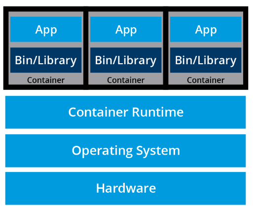

- Microservices are lightweight application written in various programming language with specific dependencies, libraries and environmental requirements. To ensure that application has everything it needs to run successfully it is packaged together with its dependencies.

- Containers encapsulate microservices and their dependencies byt do not run them dirrectly. Containers run container images.

- A container image bundles the application along with its runtime, libraries, and dependencies. and it represents the source of a container deployed to offer an isolated executable enviroment for the application. Containers can be deployed from a specific image on many platforms, such as workstations, VMs, public cloud... etc.

---

**Container Orchestration**

- In Dev environments, running containers on a single host for development and testing of applications may be suitable option. However, when migrating on to a QA and PROD environments, that is no longer viable option because the applications nad services need to meet specific requirements:

  - fault tolerance,
  - on-demand scalability
  - optimal resource usage
  - auto-discovery to automatically discover and communicate with each other
  - accessibility from the outside world
  - seamless updates/rollbacks without any downtime

- Container orchestrators are tools which group systems together to form clusters where containers deployment and management is automated at scale while meeting the requirements. Those clustered systems confer the advantages of distributed systems, such as increase in- performance, efficiency, reliability, workload distribution and reduced latency.

- There are many container orchestration tools: Amazon Elastic Container, Azure Container instances, Azure Service Fabric, Kubernetes, Nomad, Docker swarm.

- Why we use them? - we can manually maintain a couple of containers or write scripts to manage the lifecycle of dozens of containers, orchestrators make things much easier for users especially when it comes to managing hundreds or thousands of containers running on a global infrastructure.

- With container orcestrators we can:

  - Group hosts together while creating a cluster, in order to leverage the benefits of distributed systems.
  - Schedule containers to run on hosts in the cluster based on resources availability.
  - Enable containers in a cluster to communicate with each other regardless of the host they are deployed to in the cluster.
  - Bind containers and storage resources.
  - Group sets of similar containers and bind them to load-balancing constructs to simplify access to containerized applications by creating an interface, a level of abstraction between the containers and the client.
  - Manage and optimize resource usage.
  - Allow for implementation of policies to secure access to applications running inside containers.

- Deployment of Container Orchestration: Most container orchestrators can be deployed on the infrastructure of our choice - on bare metal, Virtual Machines, on-premises, on public and hybrid clouds. Kubernetes, for example, can be deployed on a workstation, with or without an isolation layer such as a local hypervisor or container runtime, inside a company's data center, in the cloud on AWS Elastic Compute Cloud (EC2) instances, Google Compute Engine (GCE) VMs, DigitalOcean Droplets, IBM Virtual Servers, OpenStack, etc.

- In addition, there are turnkey cloud solutions which allow production Kubernetes clusters to be installed, with only a few commands, on top of cloud Infrastructures-as-a-Service. These solutions paved the way for the managed container orchestration as-a-Service, more specifically the managed Kubernetes as-a-Service (KaaS) solution, offered and hosted by the major cloud providers.

---

### 4. Kubernetes

---


**Overview**

- What is Kubernetes? - Open-source system for automating deployment, scaling and management of containerized appliactions.

- called also k8s, inspired by Googl'es Borg system > a container and workload orchestrator for its global operations. Writen in Go.

- . Several features/objects of Kubernetes that can be traced back to Borg, or to lessons learned from it, are:

  - API servers
  - Pods
  - IP-per-Pod
  - Services
  - Labels.

---

**Kubernetes Features**

1. Automatic bin packing
   Kubernetes automatically schedules containers based on resource needs and constraints, to maximize utilization without sacrificing availability.
2. Designed for extensibility
   A Kubernetes cluster can be extended with new custom features without modifying the upstream source code.
3. Self-healing
   Kubernetes automatically replaces and reschedules containers from failed nodes. It terminates and then restarts containers that become unresponsive to health checks, based on existing rules/policy. It also prevents traffic from being routed to unresponsive containers.
4. Horizontal scaling
   Kubernetes scales applications manually or automatically based on CPU or custom metrics utilization.
5. Service discovery and load balancing
   Containers receive IP addresses from Kubernetes, while it assigns a single Domain Name System (DNS) name to a set of containers to aid in load-balancing requests across the containers of the set.

6. Automated rollouts and rollbacks
   Kubernetes seamlessly rolls out and rolls back application updates and configuration changes, constantly monitoring the application's health to prevent any downtime.
7. Secret and configuration management
   Kubernetes manages sensitive data and configuration details for an application separately from the container image, in order to avoid a rebuild of the respective image. Secrets consist of sensitive/confidential information passed to the application without revealing the sensitive content to the stack configuration, like on GitHub.
8. Storage orchestration
   Kubernetes automatically mounts software-defined storage (SDS) solutions to containers from local storage, external cloud providers, distributed storage, or network storage systems.
9. Batch execution
   Kubernetes supports batch execution, long-running jobs, and replaces failed containers.
10. IPv4/IPv6 dual-stack
    Kubernetes supports both IPv4 and IPv6 addresses.

- Additional Features: Kubernetes supports common Platform as a Service specific features such as application deployment, scaling, and load balancing, but allows users to integrate their desired monitoring, logging and alerting solutions through optional plugins.

- For example, support for role-based access control (RBAC) is stable only as of the Kubernetes 1.8 release, while cronjob support is stable only as of release 1.21.

- **NB!** One of the main strengths- portability. It can be deployed in many environments such as local or remote Virtual Machines, bare metal, or in public/private/hybrid/multi-cloud setups.

---

---

---

### 5. Kubernetes Achitecture

---

---

---

**Kubernetes Cluster Architecture**

- Kubernetes Architecture can be described as: cluster of compute systems ategorized by their distinct roles

- 1. One or more control plane.
- 2. One or more worker nodes (optional but recommended)

- Components of Kubernetes Cluster:


---

---

**Control Plane Node**

- provides a running environment for the control plane agents responsible for managing the state of a Kubernete cluster, and its braind behind all oprations inside the cluster. The control plane components are agent with very distict roles in the cluster's management. In order to communicate with k8s cluster > user sends requests to the control plane >CLI tool/web UI/API.

- **Important to keep control plane running at all costs.** Losing control plane may introduce downtime, causing service disruption to clients with possible loss of business. To ensure such fault tolerance we need to have control plane node replicas. They need to be configured in High-availabilit(HA) mode.

- Only one of the control plane nodes is dedicated to actively managing the cluster, the control plane components stay in sync across the control plane node replicas. This type of configuration adds resiliency to the cluster's control plane, should the active control plane node fail.

- To make the Kubernetes cluster state persistent-> all cluster configuratio data is saved to a istributed key-value store which only holds cluster state related data, no client workload generated data.

- The key-value store may be configured on the conrol plane (stacked topology) or on its dedicated host (external topology) to help reduce the chances of data store loss by decoupling i from the other control plane agents.

- In the stacked key-value store topology, HA control plane replicas ensure the key-value store's resilency as well. However that is not the case with external key-value store topology where the dedicated key-value store hosts have to be separately repolicated for HA, a configuration that introduces the need for additional hardware- > additional operational costs.

---

---

**Control Plane Node Components**

- control plane node runs the following essential control plane components and agents: API server, scheduler, controller managers and key-value store.

- control plane node runs- container rintime, node agent (kubelet), proxy (kube-proxy), optional add-ons for observability- dashboard, cluster level monitoring, and logging.

---

- **API SERVER**

---

- All administarative tasks are coordinated by the kube-apiserver, a central control plane component runing on the control plane node.

- The API server intercepts RESTful calls from users, administrators, developers, operators and external agents, then validates and processes them. During processing the API server reads the K8s cluster's current state from the key-value store, and after a call's execution the resilting state of the k8s cluster is saved in the key-value store for persistence.

- The API server is the oncrol control plane component to talk to the key- value store. both to read from and to save kubernetes cluster state information > acting as a middle interface for any other control plane agent inquiring about the cluster's state.

- The API server is highly configurable and customizable. It can scale horizontally, but it also supports the addition of custom secondary API servers, a configuration that transfors the primary API server into a proxy to all secondary, custom API server, routing all incoming RESTFUL calls to them based on custom defined rules.

---

- **Scheduler**

- The role of the kube-scheduler is to assign new workload objects, such as pods encapsulating containers, to nodes- typically worker nodes. Duging the scheduling process, decisions are made based on current Kubernetes cluster state and new workload object's requirements.

- The schedulers obtains from the key-value store, vi a the API server, resource usage data for each worker node in the cluster. The scheduler also receives from the API server the new workload object's requirements which are part o its configuration data. Requirements may include contstraints that users and operators set, such as scheduling work on a node labeled with disk==ssd key-value pair.

- The scheduer also takes n account QoS(Quality of Service) requirements, data locality, affinity, anti-affinity, taints, tolration, cluster topology, etc. Once all the cluster data is available the scheduling algorithm filters the nodes with predicates to isolate the possible node candidates which then are scored with priorities in order to select the one node that satisfies all requirements for hosting the new workload. The outcome of the decision process is communicated back to the API server, which den deelgates the workload deployment with other control plane agents.

- The scheduler is highly configurable and customizable through schduling polcies, plugins and profiles. Additional custome schedulers are also supported, then the objects configuraton data should include the name of the custome schduler expected to make the schduling decision for that particular object, if no such data is include the default schduler is selected instead.

- A scheduler is extremely important and complex in multi-node Kubernetes cluster, while in a sngle-node Kubernetes cluster possibly used for learning and development purposes, the scheduler job is quite simple.

---

**Controller managers**

- Controller managers are components of the control plane node running controllers or operator processes to regulate the state of the K8s cluster. Controllers are watch loop processes continuously running and comparing the cluster's desired state( provided by objects configuration data) with its current state (obtained from the key-value store via the API server). In case of mismatch, corrective action is taken in the cluster until its current state matches the desired state.

- The kube-controller-manager runs controllers or operators responsible to act when nodes become unavailable, to ensure container pod counts are as expected to create endpoints, service accounts and API access tokens.

- The cloud-controller manager runs- controllers or operators responsible to interact wit hthe underlying infrastructure of a cloud provider when nodes become unavailable to manage storage volumes when provided by a cloud service and to manage a load balancing and routing.

---

**Key-Value data store**

- **etcd** is open source project under CNCF. etcd is a strongly consistent, distributed key-value data store used to persist a Kubernetes cluster's state. New data is written to the data store only by appending to it, data is never replaced in the data store. Obsolete data is compacted or shredded periodically to minimize the sie of the data store.

- out of all control plane components, only the API server is able to communicate with the etcd data store.

- etcd's CLI management tool- edcdctl, provides snapshot save and restore capabilities which come n handly especially for a single etcd instance Kubernetes cluster- common in development and learning environments. However in stage nad production environments, it is extremely important to replicate the data stors in HA mode for cluster configuration data resiliency.

- Some Kubernetes cluster bootstrapping tools, such as kubeadm, by default provision stacked etcd control plane nodes, where the data store runs alongside and shares resources with the other control plane components on the same control plane node.


- For data isolation from the control plane components, the bootstrapping process can be configured for an external etcd topology, where the data store is provisioned on a dedicated separate host, this reducing the cahnces of an etcd failure.


- Both Stacked and external etcd topologies support HA configurations. etcd is based on the RAFT consensus Algo > which allows a collection of mahines to work as a coherent group that can survive the failures of some of its memebrs. ANy given time, one of the nodes in the group wil be the leader and the rest of them will be followers.

- etcd handles leader elections and can tolerate node failure, including leader node failures. Any node can be treated as a leader.

- The leader/followers hierarchy is distinct fomr the primary/secondary hierarchy meaning that neither node is favored for the leader role and neither node outrands other nodes. A leader will remain active until it fails at which point in time a new leader is elected by the group of healthy followers.


---

**Worker Node Overview**

- worker node provide a running environment for client applicatios. These apps are microservices running as application containers. In k8s the application container are encapsulated in PODS, controlled by the cluster control plane agent running on the control plane nodes.

- Pods are schedulerd on worker nodes, where they find required compute, memory and storage resources to run, and networking to talk to each other and the outside worlds. A pod is the smalled scheduling work unit in K8s. It is a logical collection of one or more container schdeculed together nad the collection can be started, stopped or rescheduled as a single unit of work.

- In a multi-worker Kubernetes cluster, the network traffic between client users and the containerized applications deployed in PODS is handled directly by the worker nodes, and its not routed through the control plane node.

---

**Worker Node Components**

- A worker node has the following components, contaiainer runtime, node agent- kubelet, kubelet-CIR shims, proxy- kube-proxy and add-ons (for DS, observability components> dashboards, cluster-level monitoring and logging and device plugins).

- Container Runtime: k8s is described as "container orchestration engine" it lacks the capability to directly handle nad run containers. In order to managea containr's lifecycles Kubernetes requires a container runtime on the node where a pod and its container are to be scheduled. A runtime is required on each node of a k8s cluster, both control plane and worker.

- Recommendntation is run the K8s control plane coponents as containers, hence the necessity of a runtime on the control plane nodes. k8s supports- CRI-O, containerd, Docker engine, Mirantis Container Runtime.

---

**Node agent- kubelet**

- The kubelet is an agent running on each node, contro plane and workers and it communicates with the control plane. It recieves POD definitions, primarily from the API server and interacts with the container runtime on the node to run containers associated with the POD. It also monitos the health and resources of pods running containers.

- The Kubelet connects to container runtimes through a plugin based interface- the Container Runtime interface (CRI). CRI consists of protocl buffers , gRPC API, libraries and addtional specification and tools in order to connect to interchangeable container runtimes, kubelet uses a CRI shim- an application which provides a clear abstaction layer between kubelet and the container runtime.

- Container runtime interface diagram:


- The kubelet acting as grpc client connects to the CRI shim acting as grpc server to perform container and image operations. The CRI implements two services: ImageService and RuntimeService. The ImageService is responsible for all image-related operations, while the RuntimeService is responsible for all pod and container-related operations.

---

**kubelet- CRI shims**

- Originally the kubelet agent supported only a couple of container runtimes, first Docker Engine, followed by rkt, through a unique interface model integrated directly in the kubelet source code. However, this approach was not intended to last forever even thugh it was especially beneficial for docker. After tht k8s migrated to CRI- a flexible method to integrate with various container runtimes without the need to recompile its source code.

- Shims are Container Runtime Interface (CRI) implementations, interfaces or adapters, specifi to each ocntainer runtime supported by K8s.

---

**cri-containerd**

- cri-containerd allows containers to be directly created and managed with containerd at kubelet's request

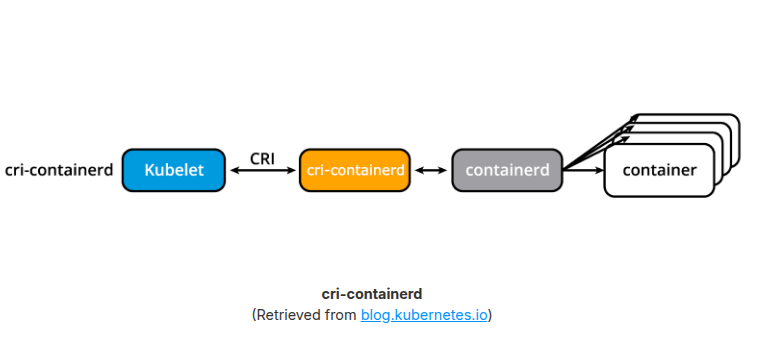

**CRI-O**

- CRI-O enables the use of any Open Container Initiative (OCI) compatible runtime with k8s, such as runC:

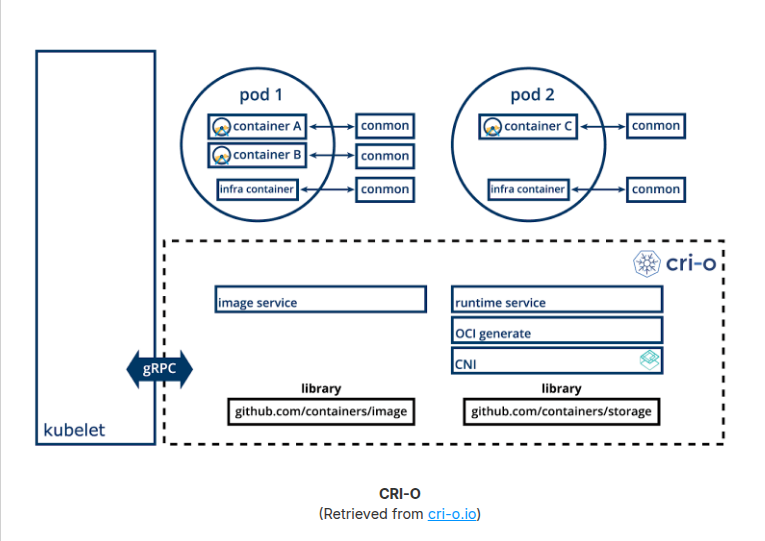

**dockershim and cri-dockerd**

- before later k8s update, the dockershim allowed containers to be created and managed by invoking the Docker Engine and its internal runtime containerd. Due to Docker Engine's popularity, this shim was the default. after modern updates the dockershim is no longer maintained by the k8s project, its specific code is removed from the kubelet source code, thus will no longer be supported by the kubelet node agent of k8s.

- As a result, Docker, Inc., and Mirantis have agreed to introduce and maintain a replacement adapter, cri-dockerd that would ensure that the Docker Engine will continue to be a container runtime option for Kubernetes, in addition to the Mirantis Container Runtime (MCR). The introduction of cri-dockerd also ensures that both Docker Engine and MCR follow the same standardized integration method as the CRI-compatible runtimes.

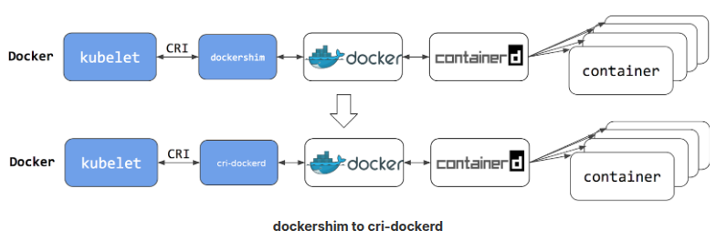

---

**Proxy- kube-proxy**

- Kube-proxy network agent whch runs on each node, control plane nd workers, responsible for dynami updates and maintenance of all networking rules on the node. it abstracts the details of pods networking and forwards connection requests to the containers in the Pods.

-Kube-proxy is responsible for TCP, UDP and SCTP stream forwarding on random forwarding across a set of POD backends of an application and its implements forwarding rules defined by users through Service API objects.

- Kube-proxy node agent operates in conjunction with the iptables of the node. Iptables is a firewall utinility created for the linux os that can be managed by users via CLI.

---

**ADD-ONS**

- Add-ons are cluster features and functionality not yet available in k8s and therefore we need 3rd pary plugs and services.

- DNS, Dashboard, Monitoring, Logging, Device Plugins.

---

**Networking CHallenges**

- Decoupled microservices based applications rely heavily on networking in order to mimic the tight-coupling once available in the monolithic era. As conetainerized microservices orchestrator it needs to address a few distinct networking challenges:

      - container to container communication inside pods.
      - pod to pod communiation on the same node and acrss cluster nodes
      - service to pod communication within the same namespace and across cluster namespaces
      - external to service communication for clients to access applications in a cluster.

- all of these challenges must be addressed by a kubernetes cluster and its plugins.

**Container-to- Container** communication inside pods:

- making use of the underlying host operating system's kernel virtualization features, a container runtime creates an isolated network space for each contaner it starts. On Linux, this isolated network space is referred to as network namespace.

- a network namespace can be shared across containers or with the host operating syste,

- When a grouping of containers defined by a POD is started, a special infrastructure Pause container is initialized by the Container Runtime for the sole purpose of creating a network namespace for the Pod. All additional containers, created through user requests, running inside the POD will share the Pause container's network namespace so that they can all talk to each other via localhost.

**Pod-to-Pod comunication across nodes**

- In a Kubernetes cluster Pods, groups of containers, are scheduled on nodes in a nearly unpredictable fashion. Regardless of their host node, Pods are expected to be able to communicate with all other Pods in the cluster, all this without the implementation of Network Address Translation (NAT). This is a fundamental requirement of any networking implementation in Kubernetes.

- The Kubernetes network model aims to reduce complexity, and it treats Pods as VMs on a network, where each VM is equipped with a network interface - thus each Pod receiving a unique IP address. This model is called "IP-per-Pod" and ensures Pod-to-Pod communication, just as VMs are able to communicate with each other on the same network.

- Containers share the Pod's network namespace and must coordinate ports assignment inside the Pod just as applications would on a VM, all while being able to communicate with each other on localhost - inside the Pod.

- containers are integrated with the overall Kubernetes networking model through the use of the Container Network Interface (CNI) supported by CNI plugins. CNI is a set of specifications and libraries which allow plugins to configure the networking for containers. While there are a few core plugins, most CNI plugins are 3rd-party Software Defined Networking (SDN) solutions implementing the Kubernetes networking model. In addition to addressing the fundamental requirement of the networking model, some networking solutions offer support for Network Policies. Flannel, Weave, Calico, and Cilium are only a few of the SDN solutions available for Kubernetes clusters.

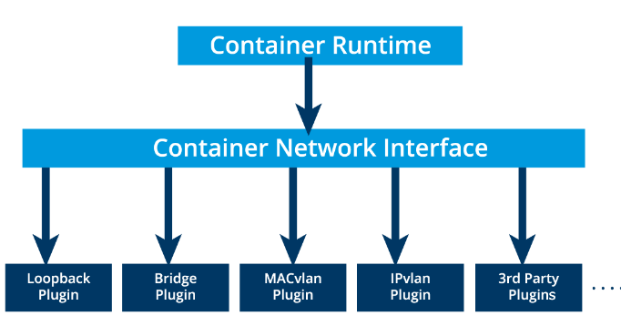

- The container runtime offloads the IP assignment to CNI, which connects to the underlying configured plugin, such as Bridge or MACvlan, to get the IP address. Once the IP address is given by the respective plugin, CNI forwards it back to the requested container runtime.

**External-to-Pod Communication**

- A successfully deployed containerized application running in Pods inside a Kubernetes cluster may require accessibility from the outside world. Kubernetes enables external accessibility through Services, complex encapsulations of network routing rule definitions stored in iptables on cluster nodes and implemented by kube-proxy agents. By exposing services to the external world with the aid of kube-proxy, applications become accessible from outside the cluster over a virtual IP address and a dedicated port number.

---

---

---

### 6. Installing Kubernetes

---

---

---

**Kubernetes Configuration types**

1. ALL-in-One Single-Node Installation: all the control plane and workder components are installed and running on a single-node. while its useful for learning, development and testing its not recommended for production purposes

2. Single-Conrol Plane and Multi-Worker installation: we havea single control plane node running a stacked etcd instance. multiple worker nodes can be managed by the control plane node.

3. Single-Contol Plane with single-node etcd and a multi-workder Installation: single control plane node with external etcd instance. multiple worker nodes can be managed by the control plane node.

4. Multi-Contol Plane and Multi- Worker Installation: multiple control plane nodes configured for High-Availability (HA), with each control plane node running a stacked etcd instance. The Etcd instances are also configured in an HA etcd clisted and multiple worker nodes can be managed by the HA control plane.

5. MUlti-Control Plane with Multi-node etcd and multi-worker installation: multiple control plane nodes configured in HA mode, with each control plane node paired with an external etcd instace. The External etcd instances are also configured in an HA etcd cluste and multiple workder nodes can be managed by HA control plane. Most advanced cluster config + recommended for production environments.

- NB! With the complexing increasesing, the hardware resource requirement also grow.

---

**Infrastructure for Kubernetes**

- Upon a decision is made on the installation type, there needs to be an infrastructure support most common requirements fall into fields of :

1. set up k8s on bare metal, public cloud, private or hybrid cloud?
2. Which OS? Linux? Red-Hat or Debian or Windows?
3. Which networking CNI solution is needed?

---

**Installing Local Learning Clusters**

- There are different variations of k8s clusters that we can implement.

1. Minikube: single and multi-node local k8s cluster recommended for a learning environment deployed on a single host.
2. Kind: multi-node K8s cluster deployed in a docker containers acting as kubernetes nodes, for learning
3. Docker Desktop: Including a local k8s for docker users.
4. Podman Desktop: Including kubernetes integration for Podman Users.
5. Microk8s: local and cloud k8s cluster for developer and production from Canonical
   6.K3S- lightweight cluster for local deployments, originally from Rancher.

---

**Installing Production Clusters with Deployment Tools**

- There are several recommended tools: kubeadm, kubespray, kops.

- Kibeadm: first-class citizen of k8s ecosystem- recommended method to bootstrap a multi-node producting ready HA k8s clusters, on premises or in the cloud. it can also bootstrap a single-node cluster for leanring. it does not support the provisioning of hosts thay should be provisioned separately with a tool of admin's choice.

- Kubespray: known as kargo, allows installation of HA production ready clusters on AWS, GCP, Azure, Open stack, vSphere or bare metal. is based on Ansible and is available fro most linux distros.

- kops: enables to create, upgrade and maintain production-grade HA kubernetes clustrs from the CLI, it can provision the required infrastructure as well, currently AWS an GCE are officially suppored. Support for Digital Ocean and OpenStack is in beta.

- Windows support fo Kuberntes- at time of these notes- only Windows Server 2019 and Windows Server 2022 are suppored by Kubernetes, but the control plane nodes are limited to running on Linux only.

---

---

---

### 7. Minikube: Installing local Kubernetes Clusters

---

---

---

**Overview**

- Minikube- easiers most flexible and popular methods to run all in one or multi node local Kubernets cluster isolated by VM or Cotnainers run directly on workstations. Its a tool responsible for installation of Kubernets components, cluster bootstrapping and cluster tear-down when no longer needed. It includes additional features aimed to ease the user interaction with the kubernetes cluster, but its a fully functional non-production kuberernetes cluster for learnning purposes.

---

**Minikube**

- Minikube is one of the easiers , most flexible and popular methods to run an all in one or multi-node local Kubernetes cluster Directly on a local workstation.

- It installs and runs on any native OS such as Linux, MacOs or Windows, In order to take full advantage of all its features, a Type-2 Hypervisor or a Container Runtime should be installed on the local workstation, to run in conjuction with Minikube. The role of the hypervisor or container runtime is to offer an isolated infrastructure for the Minikube kubernttes cluster components, that is easily reporducible, easy to use and tear down.

- The isolation of the cluster components from our daily environment ensure tht once no longer needed, the minikube components can be safely removed leaving beind con configuration canges to our workstations thus no traces of their experience. This does not mean however that we are responsible for the provisioning of any VMs or containers with guest OS with the help of the hypervisors or container runtime. Minikune includes the ncessary adapters to interact directly with the isolation software of choice to build all its infrastructure as log as the type-2 hypervisor or container runtime is installed on our workstation.

- Minikube is built on the capabilities of the libmachine library originally designed by Docker to buld Virtual machine container hosts on any physical infrastructure. Making Minikube very flexible.

- Minikube can be also installed without an isolation software, on bare metal > leading to in permanent configuration changes to the host OS. To prevent such permanent onfiguration changes, a second form of isolation can be achieved by installing Minikube inside a VM provisioned with a Type-2 Hypervisor of choice, and a desktop OS of choice (with GUI). As a result when installed inside VM Minikube will end up making configuration changes to the guet environment, still isolated from the host workstation. Therefore, now we have two distinct methods to isolate the minikube environment from our host workstation.

- The isolation software can be specified by the user with --driver option, otherwise Minikube will try to find a preferred method for the host OS of the workstation.

- Once dedicated on the isolation method, the next step is to determine the required number of Kubernetes cluster nodes, and their sizes in terms of CPU, memory and disk space. Minikube invokes the hypervisor of choice to provision the infrastructure VMS which will host the Kuberenetes cluster nodes, or the runtime of choice to run infrastructure containrs that host the cluster nodes.

- Regardless of the isolation method and expected cluster and node sizes, a local minikube Kubernetes cluster will ultimately be impacted and/or limited by the physical resource of the host workstation.

- We have to be mindful of the needs of he host OS and any utilities it may be running, then the needs of the hypervisor or the container runtime, and finally the remaining resources that can be allocated to our Kubernetes cluster. for learning environmend reccomendations are - 2cpu cores, 2 gb ram- 8GB RAM recommended and 20+ GB disk storage space. IF there is a migration of big production based clusted this should be adjusted.

- THe kubernetes nodes are expected to access the internet as wel for software update, container image downloads and for client accessibility.

-After the nodes provisioning phase, Minikube invokes kubeadm to bootstrap the kubernetes cluster components inside the previously provisioned nodes. We need to ensure that we have the needed hardware and software to built our environment.

---

**Requirements for minikube**

- use one of the most robust and stable isolation methods as a driver, the VirtualBox hypervisor, to provision the VM(s) which host the components of the Kubernetes cluster. While no longer the preferred driver due to slower startup times when compared with other methods, it is still one of the most stable drivers for Minikube on Linux and Windows. However, the VirtualBox hypervisor is no longer compatible with macOS on ARM chipset (M1, M2, and M3), therefore Docker will be used instead.

- VT-x/AMD-v virtualization- may need to be enabled on the local workstation for certain hypervsiors.

- kubectl- command line client (CLI) is a binary used to access and manage any Kubernetes cluster. It is installed through Minikube and accessed through the minikube kubectl command, or it can be installed separately and run as a standalone tool.

- Type-2 hypervisor or container runtime: without a specified driver,Minikube will try to find an installed hypervisor or a runtime, in the following order of preference(On a linux host): docker, kvm2, podman, vmware and virtualbox. If multiple isolation software installations are found, such as docker and virtualbox Minikune will picker docker over virtualbox if no desired driver is specified by the user.

- Hypeviros and cntainer runtimesuppored by various workstation OSes:

      1. Linux- VirtualBox, KVM2 and QEMU hypervisors or docker and podman runtimes
      2. MacOS- virtualbox, hyperkit, vmware fusion, parallels and quemu hypervisors or docker/podman runtimes.
      3. Windows- virtualbox, hyperv, vmware workstation, qemu hypervisors or docker and podman runtimes.

- NB! Minikube supports a **--driver=node** on Linux, an optionm that runsthe Kubernetes Components bare-metal directly on the host OS and not inside a VM. With this option a Docker installation is requiredand a Linux OS on the local workstation but no hypervisor installation (for advanced users)

- Internet connection on the first Minikunbe run-> is needed for packages, dependencies updates and to pull images needed to initialize the Minikube Kubernetes cluster components. Subsequent Minikube runs will require an internet connection onlywhen a new container images needed to be pulled from a public container registry or when deployed containerized application need it for client accessibility. Once a container images has been pulled it can be reused from the local container runtime image cache without internet connection.

---

**Minikube Linux Install**

- Minikube on Ubuntu Linux LTS with VirtualBox v7.0.

- no other isolation software is installed on the workstation.

- Steps:

1. Verify the virtualization support on the Linux OS:

```
$ grep -E --color 'vmx|svm' /proc/cpuinfo
```

2. Download and install VirtualBox.

3. Download and install Minikube (offisial installation guide x86-64>Stable) Update tthat most up to date package repositiries are used in the process.

- this is binary download option, distribution neutral installation approach:

```
$ curl -LO \
https://github.com/kubernetes/minikube/releases/latest/download/minikube-linux-amd64

$ sudo install minikube-linux-amd64 /usr/local/bin/minikube && rm minikube-linux-amd64
```

- NB! we can replace /latest/ with a particular version, such as /v1.31.2/ will download that specified Minikube version.

4. Start minikube. (it can be staretd with the minikube start command).

- the command bootstraps a single-node cluster with the latest supported stable Kubernetes version release. for specific kubernetes version the **-kuberentes-version** option can be used as such: /v1.31.2/ will download that speified Minikube version.

```
minikube start
```

- for specific version we can make it like:

```
minikube start --kubernetes-version=v1.27.1
```

- In case there are other vitualization driver candidates for minikube on the workstation,it is good practice to supply the desired driver with ** --driver=virtualbox**

```
$ minikube start --driver=virtualbox
```

- **NB!** -if there is an error message that reads "Unable to pick a default driver" > Minikube was not able to locate an one of the supproted hypervisors or runtimes. The recommendation is to install or re-install a desired isolation tool and ensure its executable is found in the default **PATH** of your OS distribution.

- **NB!** - if there is an error message that reads "The vboxdrv kernel module is not loaded" means tht the critical VirtualBox kernel module may not be available. Workarounds:

  - re-install Virtualbox on workstation
  - install C compiler that may be missing from workstation and then build the kernel modle. for ubutin 22.04 LTS OS - can be build with **sudo /sbin/vboxconfig**

- after rebuild is finished- start minikube with vritualbox using the start command and then can be cheked with status command

```
$ minikube status
```

- to stop minikube

```
$ minikube stop
```

- to remove minikube

```
$ minikube delete
```

---

**Minikube MacOS Install**

- Use case: virtualbox v0.7 / Docker Desktop, NO other isolation software is installed on Mac. (There is no KyperKit, VMware Fusion, Paralles or QEMU)

- If Mac is with Inter processor-> VirtualBox Hypervisor. M1,M2, M3 workstations> Docker Desktop

- **NB!** - For other hypervisors or container runtimes and minikube versions steps may vary- READ THE MANUAL!

- Steps:

1. Docker Desktop for Mac from official page.
2. Instal Minikube (official installation guide)
3. Check known issues
4. Binary download option with:

```
$ curl -LO https://github.com/kubernetes/minikube/releases/latest/download/minikube-darwin-amd64

$ sudo install minikube-darwin-amd64 /usr/local/bin/minikube
```

- ARM64:

```
$ curl -LO https://github.com/kubernetes/minikube/releases/latest/download/minikube-darwin-arm64

$ sudo install minikube-darwin-arm64 /usr/local/bin/minikube
```

5. Start Minikube:

```
$ minikube start --driver=docker
```

6. Check minikube status
7. Stop/Delete comands are the same as previous linux install

---

**Minikube Windows Install**

- Minikube installation windows 10 and 11 with VirtualBox v7.0, instalation assume no other isolation software is installed on Windows workstation.

- Steps:

1. Verify virtualization support for windows system.

```
PS C:\WINDOWS\system32> systeminfo
```

2. Install VirtualBox hypervisor for widosts hosts with the .exe package.
3. install the minikube via the installer.exe package.
4. Start Minikube

```
PS C:\WINDOWS\system32> minikube start --driver=virtualbox
```

5. Check Status

```
PS C:\WINDOWS\system32> minikube status
```

6.Stop/remove minikube.

---

**Command Breakdown Notes**

- **minikube start**: by default selects a driver isolation software, such as a hypervisor or a container runtime, if one (VirtualBox) or multiple are installed on the host workstation. In addtion downloads latest Kubernetes version components. After download- provisions single VM named **minikube** (min 2 CPUs, Memory-6GB, Disk-20gb) or docker container to host the default single-node all in one kubernetes cluster.

- once the node is provisionend, it bootstraps the Kuberenetes control plane (with kubeadm tool) and it installs the latest version of the default container runtime, Docker, that will serve as running environment for the containerized application we will deploy to the Kubernetes cluster.

- the command generates a default minikube cluster withthe specifications described aboce and it will store these specs so that we can restart th default cluster whnever desired. The object that stores the specification of our cluster is called **profile**. Minikube allows users to create custome reusable clusterss that can be all managed from a single com,mand line client.

- **minikube profile**: allows us to view the status of all our clusters in a table formatted output, if you have created only the default minikubeclister- we could list the properties that define with. Command looks like:

```
$ minikube profile list
```

- the rerun will look like:

```
|----------|------------|---------|----------------|------|---------|---------|-------|--------|
| Profile  | VM Driver  | Runtime |       IP       | Port | Version | Status  | Nodes | Active |
|----------|------------|---------|----------------|------|---------|---------|-------|--------|
| minikube | virtualbox | docker  | 192.168.59.100 | 8443 | v1.28.3 | Running |     1 | *      |
|----------|------------|---------|----------------|------|---------|---------|-------|--------|
```

- table presents the columns associated with the default properties such as the profile name: minikube, the isolation driver: VirtualBox, the container runtime: Docker, the Kubernetes version: v1.28.3, the status of the cluster - running or stopped. The table also displays the number of nodes: 1 by default, the private IP address of the minikube cluster's control plane VirtualBox VM, and the secure port that exposes the API Server to cluster control plane components, agents and clients: 8443.

- **Creation of multiple reusable clisters** : we can use the command **minikube start**, with the custom profiles with **--profile or -p** flags. Several of the isolation drivers support craetion of node VMs or node containers of custome sizes as well.

- Examples of complex start commands that allow custome clusters with minikube. TO be used with already **Installed** Docker/Podman drivers. NO need for **CNI**

```
$ minikube start --kubernetes-version=v1.27.10 \
  --driver=podman --profile minipod

$ minikube start --nodes=2 --kubernetes-version=v1.28.1 \
  --driver=docker --profile doubledocker

$ minikube start --driver=virtualbox --nodes=3 --disk-size=10g \
  --cpus=2 --memory=6g --kubernetes-version=v1.27.12 --cni=calico \
  --container-runtime=cri-o -p multivbox

$ minikube start --driver=docker --cpus=6 --memory=8g \
  --kubernetes-version="1.27.12" -p largedock

$ minikube start --driver=virtualbox -n 3 --container-runtime=containerd \
  --cni=calico -p minibox

```

- After cluster profiles are available the default minikube and custom the table in the profile list will look different (with more profiles).

- Active marker will indicate the target cluster profile of the minikube command line tool, the target cluster can be set to minibox with the command

```
$ minikube profile minibox
```

- it can be also set to default with the:

```
$ minikube profile minikube
$ minikube profile default
```

---

**Command Breakdown Notes part 2**

- for commands as **start, stop,node, etc** are profile aware, meaning that the user is required to explicitly specify the target cluster of the command, through its profile name.

- the default minikube cluster, can be managed without specifying profile name. Stopping and re-starting clusters, minibox cluster (explicintly) and default minikube cluster (implicityly) like:

```
$ minikube stop -p minibox

$ minikube start -p minibox

$ minikube stop

$ minikube start
```

- to display the version of the current Minikube

```
$ minikube version
```

- Completion is helpful post installation. For ubuntu is:

```
$ sudo apt install bash-completion

$ source /etc/bash_completion

$ source <(minikube completion bash)

- and then run the command to confirm:

$ minikube completion bash
```

- to allow users to list the nodes of a cluster, add new control plane/worker nodes, delete existing cluster nodes, start ot stop individual nodes of a cluster

```
$ minikube node list

$ minikube node list -p minibox

```

- to display cluster control plane node's IP address or another nodes' IP with the --node or -n flags.

```
$ minikube ip

$ minikube -p minibox ip

$ minikube -p minibox ip -n minibox-m02

```

- when a cluster config is no longer of user, the cluster profile can be deleted. detele command is profile aware- **it deletes the default minikube cluster i fno profile is specified, or a custom cluster if its profile is specified**.

```
$ minikube delete

$ minikube dele -p minibox

```

-Note to self- Minikube command line refrence pages.

---

---

---

### 8. Accessing Minikube

---

---

---

**Overview**

- Healthy runninng K8s cluster can be accessed via any one of the following methods: CLI tools and scripts, web-bases UI, APIs from CLI.

1. CLI- kubectl is the Kuberentes Command line interface (CLI) to manage resource and application. very flexible, can be used solo or part of scripts/tools. once required credentials and clster access points have been configured for kubeCTL, it can be use remotely from anywhere to access a cluster.

2. Web based UI - Kubernetes dashboard.

3. API- main component of the K8s control plane is the API server- responsbile for exposing the Kuberentes APIs. accessible via both CLI and dashboard Ui.

- API server is accessible through its endpoints by agents and users possessing the requred credentials.

- API directory Tree:


- Api directory tree of kubernetes can be divided into three independed group types:

- Core group (/api/v1): Pods, Services, Nodes, Namespaces, ConfigMaps, Secrets

- Named group (/apis/$NAME/$VERSIOn)-
  API version that have different level of stability:

  - Alpha level: it may be dropped at any point in time without notice.

  ```
     /apis/batch/v2alpha1.
  ```

  - Beta level: it is well-tested, but the semanditcs of objects may change in incompativle ways in a subsequent beta or stable release.

  ```
  /apis/certificates.k8s.io/v1beta1.
  ```

  - Stable level- appears in releases software for many subsequest versions

  ```
     /apis/networking.k8s.io/v1.
  ```

- System-wide: consist of system-wide API endpoints (/healthz, /logs, /metrics, /ui, etc.)

---

**Kubectl**

- **Overview**: allows us to mange local Kubernetes clusters local clusters like Minikube or remote cloud clusters. It is installed **BEFORE** installing an starting Minikube, but it can also installed after cluster bootsrapping step.

- A minikube installation has its own kubectl CLI installed and ready to use.

- However, it is somewhat inconvenient to use as the kubectl command becomes a subcommand of the minikube command. Users would be required to type longer commands, such as minikube kubectl -- <subcommand> <object-type> <object-name> -o --option, instead of just kubectl <subcommand> <object-type> <object-name> -o --option. While a simple solution would be to set up an alias, the recommendation is to run the kubectl CLI tool as a standalone installation.

- once installed **kubectl** receives its configuration automatically from Minikube Kubernetes cluster access.

-NB with diferent k8s cluster setups, we may need to manually configure the cluster access points and certificates required by kubectl to securely access the cluster.

- Check k8s documentation for methods of kubectl.

---

**kubectl Linux install**

- we need to install the kubectl binary

```
$ curl -LO "htt‌‌ps://dl.k8s.io/release/$(curl -L -s \
htt‌‌ps://dl.k8s.io/release/stable.txt)/bin/linux/amd64/kubectl"

$ sudo install -o root -g root -m 0755 kubectl /usr/local/bin/kubectl

```

- to install specific version of kubectl:

```
$ curl -LO ht‌‌tps://dl.k8s.io/release/v1.28.3/bin/linux/amd64/kubectl
```

- version verification can be made with:

```
$ kubectl version --client
```

- post installation shell autocompletion

```
$ sudo apt update && sudo apt install -y bash-completion

$ source /usr/share/bash-completion/bash_completion

$ source <(kubectl completion bash)

$ echo 'source <(kubectl completion bash)' >> ~/.bashrc
```

---

**kubectl macOS install**

- it can be installed with the homebrew package manager.

- to install it , we need stable binary

```
$ curl -LO "htt‌ps://dl.k8s.io/release/$(curl -L -s \
https://dl.k8s.io/release/stab...)/bin/darwin/amd64/kubectl"

$ chmod +x ./kubectl

$ sudo mv ./kubectl /usr/local/bin/kubectl

$ sudo chown root: /usr/local/bin/kubectl
```

- to install specific kubectl version we need the following command:

```
$ curl -LO htt‌ps://dl.k8s.io/release/v1.28.3/bin/darwin/amd64/kubectl
```

- Homebrew installation goes like:

```

$ brew install kubectl

or

$ brew install kubernetes-cli

The installed version can be verified with:

$ kubectl version --client
```

- after those install we can add shell outcompletion.

---

**kubectl Windows install**

- we need the binary and to make use of the curl command. once downloaded the binary needs to be added to the PATH

```
example of path:

https://dl.k8s.io/release/v1.28.3/bin/windows/amd64/kubectl.exe


```

- if curl is installed from the CLI:

```
curl -LO "htt‌ps://dl.k8s.io/release/v1.28.3/bin/windows/amd64/kubectl.exe"
```

- to check installation

```
$ kubectl version --client
```

- after installation shell autocompletion can be istalled with POWERSHELL.

---

**kubectl Configuration file**

- to access th e k8s cluster, thee kubectl clined needs the control plane done endpoint and appropriate credentials to be able to securely interact with the API server running on the control plane node.

- When starting Mnikube, the process creates by default a configuration file **config** in the **.kube** directory, residing in the user's **home** directory.

- the configuration file has all the connection details required by kubectly. The kubectl binary parses this file to find the control plane node's connection endpoint, along with thre required credentials. Multiple kubeconfig files can be configured with a cingle kubectl client.

- to look at the connection details we can either display the contend of the **~/.kube/confing** or run

```
$ kubectl config view
/lists the config file's content to securely access the server
```

-Once kubectl is installed we can display information about the Minikube Kubernetes cluster with the **kubectl cluster -info**

```
$ kubectl cluster-info
/shows control plane's Ip address and the endpoint of the coredns server
```

- **NB!** with the installed kubernetes cluster installed by Minikube in the directory ~/.kube/config automatically, this is not the case for kubernetes clusters installed by other tools. In other cases the config file has to be created manually with sometimes re-configured to suit various networking and client/sever setups.

---

**Kubernetes Dashboard**

- provides web-based user interface for Kubernetes cluster management. Minikube installs the dashboard as an addon, but it is disabled by defalt. Priord to using the dashboard we are required to enable the dashboard addon, together with the usage metrics from the Kubernetes cluster.

- to access the dashboard from Minikube, we can use the minikubedashboard command and also enable the required addons with:

```
$ minikube addons list

$ minikube addons enable metrics-server

$ minikube addons enable dashboard

$ minikube addons list

$ minikube dashboard

```

- if the browser is not opened we can troubleshoot with the following command:

```
$ minikube dashboard --url
```

- thn we need to copy paste the displayed URL in a new tab. logout/login or reboot may be needed.

---

**APIs with kubectl proxy**

- when we type **kubectl proxy** command, kubectl authenticates with the API server on the control plane node and makes services available on the default proxy port 8001.

```
$ kubectl proxy
```

- it locks the terminal for as long as the proxy is running, unless we run it in the background (with kubectl proxy &).

- When kubectl proxy is running we can send request to the APi over the localhost on th default proxy port 8001 (from another terminal since the proxy lock the first terminal when running in the foreground)

```
$ curl http://localhost:8001
```

- with curl we requested all the API endpoints from the API server. we can explore several path combination with curl or with a browser:

```
http://localhost:8001/api/v1

http://localhost:8001/apis/apps/v1

http://localhost:8001/healthz

http://localhost:8001/metrics
```

---

**API authentication**

- If we do not use the **kubectl proxy** we need to authenticate to the API server when sending API requests. We can authenticate by providing a Bearer Token when using curl command or by proving a set of keys and certificates.

- Bearer Token: an access token that can be generated by the authentication server (the API server on the control plane node ) at the client's request.

- Using bearer token, the client can securely communicate with the Kubernetes API server without providing additional authentication details, and then access resources. The token may need to be provided again for subsequent resource access requests.

- To create access token for the **default** ServiceAccount and grant special permission to access the root directory of the API (special permission that was not necessary if the kubectl proxy was used).

- The special permission will be a set through a RBAC policy. The policy of the **clusterrole** defined below which is granted through the **clusterorolebuinding** definition. The special permission is only needed to access the root directory of the API, but not needed to access /api , /apis or other subdirectories.

The commands areas follows:

```
$ export TOKEN=$(kubectl create token default)

$ kubectl create clusterrole api-access-root --verb=get --non-resource-url=/*

$ kubectl create clusterrolebinding api-access-root --clusterrole api-access-root --serviceaccount=default:default

Retrieve the API Server endpoint:

$ export APISERVER=$(kubectl config view | grep https | cut -f 2- -d ":" | tr -d " ")


# Confirm that the APISERVER stored the same IP as the Kubernetes control plane IP by issuing the following two commands and comparing their outputs:

$ echo $APISERVER

# Returns
htt‌ps://192.168.99.100:8443

$ kubectl cluster-info

# Returns
Kubernetes control plane is running at htt‌ps://192.168.99.100:8443 ...
```

- Access the API Server using the curl command

```
$ curl $APISERVER --header "Authorization: Bearer $TOKEN" --insecure
```

- we can run additioanl curl commands to retrieve details about specific API groups. These commands should work even without the special permission defined and granted to the default ServiceAccount Associated with the access token

```
$ curl $APISERVER/api/v1 --header "Authorization: Bearer $TOKEN" --insecure

$ curl $APISERVER/apis/apps/v1 --header "Authorization: Bearer $TOKEN" --insecure

$ curl $APISERVER/healthz --header "Authorization: Bearer $TOKEN" --insecure

$ curl $APISERVER/metrics --header "Authorization: Bearer $TOKEN" --insecure
```

- instead of the access token, we can extract the cliend certificate, client key and certificate autheority data from the **.kube/config** file. Once extracted they can be encoded and then passed with a curl command for authentication.

- The command only works with the base 64 encoded cliend certificate, key and certificate authority data (illustrative purposes)

```
$ curl $APISERVER --cert encoded-cert --key encoded-key --cacert encoded-ca
```

---

---

---

### 9. Kubernetes Building Blocks

---

---

---

#### Kubernetes Object Model

**Overview**

- Kubernetes become a industry leader due to its advanced application lifecycle management capabilities- via its rich object model. The model had few features that are represented as persistend entities in the k8s cluster:

- what containerized applications are running.
- the nodes where the containerized applications are deployed.
- application resource consumption
- policies attached to applications, like restart/upgrade, fault tolerance, ingress/egress.

- with each oject we declare our intent, or the desired state of the object, in the **spec** section. k8s system manages the status section for objects, where it records the actual state of the object.

- at any given moment, the K8s Contropl plane tries to match the object's actual state to the object desired state. Object definition manifest must include other fields that specify the version of the API we are referencing as the **apiVersion** , the object type as **kind**, and additional data helfupl to the cluster or user- **metadata**.

- in certain object definitions, we find different sections that replace spec, they are **data** and **stringData**. Both sections facilitate the declaration of information that should be stored by their respecive objects.

- in k8s object types are : Nodes, namespaces, Pods, ReplicaSets Deployments, DaemonSets.

- when we create an object, the object's configuration data section from below the spec field as to be submitted to the Kubernetes API server. The API request to create an object must have the spec section, describing the desired state as well as other details. the API server accepts objec definitions in a JSON format, most ofthen we provide such definition manifests in YAML format >> converted by **kubectl** in a JSON payload and sent to the server.

---

**Nodes**

- Nodes are virtual identities assigned by k8s to the systems part of the cluster- whether Virtual Machines, bare-metal, containers, etc. These identitites are unique to each system and are used by the cluster for resources accounting and monitoring purposes. Which helps with workload as management throught the cluster.

- Each node is managed with the help of 2 k8s node agents- kubelet nad kube-proxy, while the node also hosts a container runtime. The runtime is needed to run all containerized workload on the node- control plane agents and user workloads.

- kubelet and kube-proxy node agents are responsible for executing all local workload management related tasks- interact with the runtime to run containers, monitor containers and node health, report anby issues and node state to the API server, and manage network traffic to containers.

- on thier functions there are two types of nodes: **control plane** and **worker**. Typical k8s cluster includes at least one control plane node, but it may include multiple control plane nodes for the HA(high availability) of the control plane. With that cluster also includes one or more worker nodes to provide resource redudndacy in th ecluster. There are cases for bootstrapping sincle-all-in-one cluster as a single node on single VM, bare-metal or container when high-availability and resource redundancy are not of importance.

- minikube allows usto bootstrap multi-node clusters with dedicated control plane nodes, however if the host system has limited physical resources we can bootsrat single-all-in-one cluster as a single node on a single VM or container and explore from thre.

- Node identities are created and assigned during the cluster bootstrapping process by the tool responsible to initialize the cluster agents. Minikube uses default kubeadm bootstrapping tool to initialize the control plane node during the init phase and grow the cluster by adding worker or control plane nodes with the join phase.

- Control plane nodes run the contol plane agents, such as API server, Scheduler, Controller Manager and etcd in addition to the kubelet and kube-proxy node agents , the container runtime and the addo-ons fo container networking, monitoring logging DNS, etc.

- worker nodes run the kubelet and kube-proxy node agents the container runtime and add-ons for container networking, monitoring, logging.

- the Control plane node and worker node represent the k8s cluster. A cluster's nodes are system distributed either on the same private network, across different networks, even across different cloud networks.

---

**Namespaces**

- If we are using the same K8s cluster for multiple users and teams, we can partition the cluster into virtual sub-clusters using namespaces. The names of the resources/objects created inside a Namespace are unique , **but not across namespaces in the cluster**

- we can check a list of ann Namespaces with the command

```
kubectl get namespaces
```

- k8s crates 4 namespaces out of the box: 1. kube-system 2. kube-public 3. kube-node-lease 4. default

- **kube-system** namespace contains the objects created by the Kubernetes system, mostly the control plane agents.

- **kube-public** is special Namespace, which is unsecured and readable by anyone, used for special purposes such as exposing public (non-sensitive) information about the cluster.

- **kube-node-lease** newest namespace, which holds node lease objects used for node heartbeat data.

- **default** namespace containers the objects and resourecs created by administrators and developers, objects are assigned to it by default unless another Namespace name is provided by the user.

- **NB**- Good practice is to create additional namespaces as desired to virtualize the cluster and isolate users, developer teams, application or tiers.

- to create namespaces we would use the following command:

```
$ kubectl create namespace new-namespace-name
```

- Namespaces are one of the modest desired features of Kubernetes, securing its lead against competititos, as it provides solution to multi-tenancy requirement.

- Resourec quotas help users limit the overall resources consumed within Namespaces while Limitedranges help limit the resources consumed by individual Containers and their enclosing objects inn a namespace.

---

**Pods**

- A pod is the smallest k8s workload object. IT is the unit of deployment in K8s, which represents a single instance of the application.

- A pod is logical collection of one or more containers, enclosing and isolating them to ensure that they:

- are scheduled together on the same host with the Pod.

- share the same network namespac, meaning that they share a single IP address originally assigned to the pod.

- Have access to mount the same external storage(volumes) and other common dependencies.

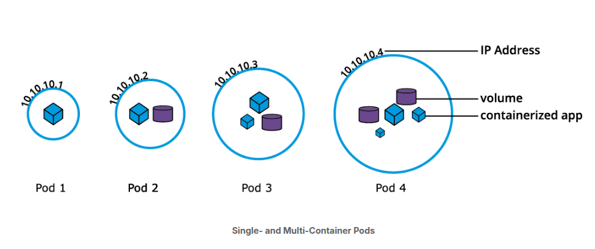

- Pods are ephemeral in nature, and **they do not have the capability to self-heal themselves**. That is the reason they are used with controllers or operators (controllers=operators), which handle Pods's replication, fault tolerance, self-healing etc. Examples of controllers: **Deployments, RepicaSets, DeaemonSets, Jobs**.

- When an operator is used to manage an application, the Pod's specification is nested in the controller's definition using the pod template.

- example of stand-alone pod object's definition in YAML format, wtihout an operator.

```
apiVersion: v1
kind: Pod
metadata:
  name: nginx-pod
  labels:
    run: nginx-pod
spec:
  containers:
  - name: nginx-pod
    image: nginx:1.22.1
    ports:
    - containerPort: 80
```

- this is a declarative method to define an object, and can server as a template for a much more complex pod definition manifest if needed.

- The **apiVersion field must specify** v1 for the POd object definition, the second required field is kind-> specifying the POD object type. The third required field is metadata, holds the object's name and optional labels and annotations. The fourth required field spec marks the beginning of the block defininng the desired state of the pod object- also named **PodSpec**.

- In the example our pod creates a single container running on the nginx:1.22.1 - image pulled from a container image registry(dockerhub).

- The containerport field specifies the contaier port to be exposed by k8s resources for inter-application access or external client access.
- spec contents are evaluated for scheduling purposes, then the kubelet of the selected node becomes responsible for running the container image with the help of the container runtime of the node. The pods's name and labels are used for workload accounting purposes.

- the definition manifest if stored by a **def-po.yaml** file is loaded into the clusterto run the desired POD and its associated container image.

- example is with create/ but advanced k8s practioners may opt to use apply instead:

```
$ kubectl create -f def-pod.yaml
```

- writing up definition manifests, may prove to be time consuging because YAML is **extemely sensitive to indentation**. When edition such definition manifests keepin mind that each indent is two blank spaces wide and TAB should be omitted.

- imperatively, we can sumply run the POD defined above without the definition manifest as:

```
$ kubectl run nginx-pod --image=nginx:1.22.1 --port=80
```

- the command generates a definition manifest in YAML, but we can generate a JSON definition file just as easily with :

```
$ kubectl run nginx-pod --image=nginx:1.22.1 --port=80 \
--dry-run=client -o json > nginx-pod.json
```

Both the YAML and JSON definition files can serve as templates or can be loaded into the cluster respectively as such:

```
$ kubectl create -f nginx-pod.yaml
$ kubectl create -f nginx-pod.json
```

- **NB!** practice Pod operations with additional commands such as:

```
$ kubectl apply -f nginx-pod.yaml
$ kubectl get pods
$ kubectl get pod nginx-pod -o yaml
$ kubectl get pod nginx-pod -o json
$ kubectl describe pod nginx-pod
$ kubectl delete pod nginx-pod
```

---

**Labels**

- labels in k8s are key-value pairs attached to Kubernetes objects such as Pods, ReplicaSets, Nodes, Namespaces and Persistent Volumes.

- Labels are sed to organize and select subset of objects, based on the requirements in place. Many objects can have the same label/s. Labels do not provide uniqueness to objects. Controllers use labels to logically group together decoupled objects, rather than using objectss names or IDs.

- In the diagram we have two label keys: **app** and **env**. Based on our requirements: we have given different values to our four Pods. The label **env=dev** logically selects and groups the top two Poads, while the label **app=frontend** logically selects and groups the left two Pods. We can select one of the forus pods- bottom left by selecting two labels: **app=frontend AND env=qa**.


---

**Label Selectors**

- Controllers or operators and Services, use label selectors to select a subset of objects. Kubernetes supports two types of Selectors:

- **Equality-Based Selectors** : allow filtering of objects based on Label keys and values. Matching is achieved using the =, == (equals, used interchangeably), or != (not equals) operators. For example with **env==dev** or **env=dev** we are selecting the objects where the env label key is set to value dev.

- **Set-Based Selectors** : allows filtering of objects based on a set of values. We can use **in,notin** operators for label values, and **exist/does not exist** operators for label keys. For example with **env in (dev,qa)** we are slecting objects where env label is se to either dev or qa with !app we select objects with no label key app.


---

**ReplicationControllers**

- a complex operator that ensures a specified number of replicas of a POD are running at any given time the desired version of the application container, by contstantly comparing the actual state with the desired state of the managed application. If there are mode Pods than the desired count the replication controller randomly terminates the number of Podds exceeding the desired count and if there are fewer Pods than the desired count, then the replication controller requests addtional pods to be created until the actual count matches the desired count.

- Generally we do not deploy a pod independently as it would not be able to restart itself if terminad in error because a pod misses the much desired self-healing feature that k8s otherwise promises. The recommendd method is to use some type of an operator to run and manage pods.

- in addition, ReplicationController operator, also supports application updates.

- Default recommended controller is the deployment which configures a ReplicaSet controller to manage application Pod's lifecycle.

---

**ReplicaSets**

- ReplicaSet is in part the next- generation ReplicationController as it implements the replication and self-healing aspects of the Replication Controller. ReplicaSets supports both equality- and set-based selectors, while ReplicationControllers only support equality-based selector.

- When a single instance the risk of crashing is really high. To avoid such issues- we can run parallel multiple instances of the application > High Availability.

- The lifecycle of the application defined by a POD will be overseen by a controller- The ReplicaSet. With its help we can scale ne number of PODS running a specific application container image. Scaling can be accomplished manually or with the use of autoscaller.

- In the example: a ReplicaSet, with the replica count set to 3 for a specific Pod Template. Pod 1, Pod 2 and Pod 3 are identical, running the same application container image, being cloned from the same Pod template.

- For now the current state matches the desired state, keep in mind however th 3 Pod replicas are identical-> running an instance of the same application, same configuration, they are distict through unique Pod name nad Ip address. The Pod object ensures that the application can be individually placed on any worker node of the cluster as a result of the scheduling process.


- example of ReplicaSet object's definition manifest in YAML. Uses declarative method and it can serve as a template to more complex ReplicaSet definition if needed:

```
apiVersion: apps/v1
kind: ReplicaSet
metadata:
  name: frontend
  labels:
    app: guestbook
    tier: frontend
spec:
  replicas: 3
  selector:
    matchLabels:
      app: guestbook
  template:
    metadata:
      labels:
        app: guestbook
    spec:
      containers:
      - name: php-redis
        image: gcr.io/google_samples/gb-frontend:v3
```

- the definition manifest if stored by redis-rs.yaml file is loaded into the cluster to run a set of three identical Pod replicas and their associated container image. While create is in the example below, advanced k8s users may choose apply instead:

```
$ kubectl create -f redis-rd.yaml

```

- **NB!** practice and check commands as:

```
$ kubectl apply -f redis-rs.yaml
$ kubectl get replicasets
$ kubectl get rs
$ kubectl scale rs frontend --replicas=4
$ kubectl get rs frontend -o yaml
$ kubectl get rs frontend -o json
$ kubectl describe rs frontend
$ kubectl delete rs frontend


```

- ReplicaSet : one of the Pods is forced to unexpectedly terminate (due to insufficient resources, timeout, hosting node crashed).

- image displaying the replicaset:

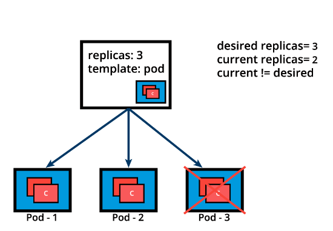

- the replicaSet detects that the current state is no longer matching the desired state and triggers a request for an additional Pod to be create, thus ensuring that the currrent state matches the desired state.

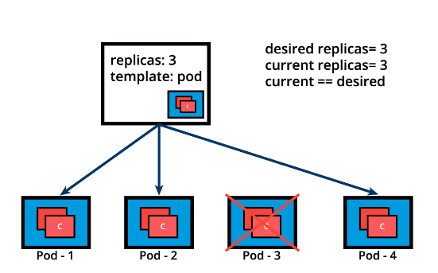

- ReplicaSets can be used independently as Pod controllers byt they only offer a limited set of features. A set of complementary features are provided by Deploymnts (the recommended controllers for the orchestration of pods).

- deployments manage the createtion, deletion and updates of Pods. a deployment automatically creates a ReplicaSet which then creates a Pod. there os no need to manage ReplicaSets and pods seprately, the deployment will manage them on our behalf.

---

**Deployments**

- Deployment object provide declarative updates to Pods and ReplicaSets. The DeploymentController is part of th control plane node's controller manager, and as a controller it also ensures that the current state always matches the desired state of our running containerized application. It allows for seamless application updates and rollbacks knows as -> RollingUpdate strategy through rollouts and rollbacks and it directly manages its ReplicaSets for application scaling. It also supports a disruptive, less popular update strategy called Recreate.

- example of a Deployment objects's definition manifest in a YAML format. Represents the declarative method to define an object and can serve as a template for much more complex deployment definition manifest if desired:

```
apiVersion: apps/v1
kind: Deployment
metadata:
  name: nginx-deployment
  labels:
    app: nginx-deployment
spec:
  replicas: 3
  selector:
    matchLabels:
      app: nginx-deployment
  template:
    metadata:
      labels:
        app: nginx-deployment
    spec:
      containers:
      - name: nginx
        image: nginx:1.20.2
        ports:
        - containerPort: 80
```

- File Breakdown:

1. apriVersion field is the first required field and it specifies the API endpoint on the API server which we want to connect to.
2. kind- specifying the object type > Deplyment, but it can be many different thins such as (Por, ReplicaSet, Namespace, Service).
3. metadata- holds the object's basic information such as name, annotations, labels and namespaces.
4. spec- marks the beginning of the block defining the desired state of the Deployment object. (3 replicas, that is 3 instances of th POD are running at any given time.). The Pods are created using the Pood Template defined in spec.template. A nested object such as the Pod being part of a Deployment, retains its metadata and spec and loses its own apiVersion and king- both being replaced by template. In spec.template.spec we defined the desired state of the Pod. Our Pod creates a single container running the nginx:1.20.2 from Docker hub.

- The definition manifest if stored by a def-deploy.yaml file is loaded into the cluster to run a set of three identical por replicas and their associated container image, together with their managing ReplicaSet. While create is exemplified below, advanced users might choose- apply

```
$ kubectl create -f def-deploy.yaml
```

- Imperatively, we can simply run the Deployment defined above without the definition manifest as such. The following is a multi-line command that should be srelect in its entirety for copy/paste.

```
$ kubectl create deployment nginx-deployment \
--image=nginx:1.20.2 --port=80 --replicas=3
```

- when we need a sterter definition manifest, knowing how to generate one can be a life-saver. The imeprative command with addtional flags such as dry-run and the yaml output can generate the definition template instead of running the Deployment, while the tempalte is then stored in the nginx-deploy.yaml file.

```
$ kubectl create deployment nginx-deployment \
--image=nginx:1.20.2 --port=80 --replicas=3 \
--dry-run=client -o yaml > nginx-deploy.yaml
```

- there is option so we can generate a deployment definition manifest in JSON:

```
$ kubectl create deployment nginx-deployment \
--image=nginx:1.20.2 --port=80 --replicas=3 \
--dry-run=client -o json > nginx-deploy.json
```

- to load both Yaml and Json definition files can server as templates or can be loaded into the cluster respectivelly as such:

```
$ kubectl create -f nginx-deploy.yaml
$ kubectl create -f nginx-deploy.json
```

- Once the Deployment object is created the Kubernetes system attaches the status field to the object and populates it with all necessary status fields.

- In the grapth below is a new Deployment which creates a ReplicaSet A which then creates 3 Pods, with each Pod Templlate configured to run one nginx:1.20.2 container image. In this case the replicaSet A is associated with the nginx representing a state of the Deployment, its recorded as Revision 1.


- when we need to push updates to the application managed by the Deployment object. lets change the Pods tempatete and updated the container image from nginx:1.20.2 to nginx:1.21.5. The Deployment triggers a new ReplicaSet B for the new container image versioned 1.21.5 and this association represents a new recorded state of the Deployment, Revision 2. The seamless transition between the two ReplicaSets, from ReplicaSet A with three Pods versioned 1.20.2 to the new ReplicaSet B with three new Pods versioned 1.21.5, or from Revision 1 to Revision 2, is a Deployment rolling update.

- **Rolling update** is triggered when we update specific properties of the Pod Template for a deployment. While planed canges such as updating the container image, container port, volumes, and mounts would trigger a new Revision, other operations taht are dynamic in nature like scaling or labeling the deployment do not trigger a rolling update, this do not change the Revision number.

- Once the rolling pdate has completed, the Depoloyment will show both ReplicaSets A nd B where A is scaled to 0(zero) pods and B is scaled to 3 Pods. This is how the Deployment records its prior state configuration setting , known as Revisions.

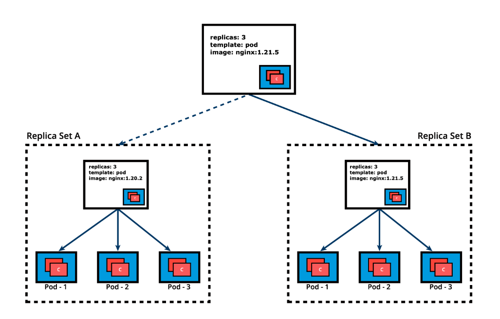

- Explanation: Once ReplicaSet B and its 3 pods versioned 1.21.5 are ready the Deployment starts actively managing them. However, the Deployment keeps its prior configuration states saved as Revision which play a key factor in the rollback capacity of the Deployment- returning to a prior known configuration state. In our example if the performance of the new nginx:1.21.5 is not satisfactory, the Deployment can be rolled back to a prior Revision, in this case from Revision 2 back to Revision 1 running nginx:1.20.2 once again.

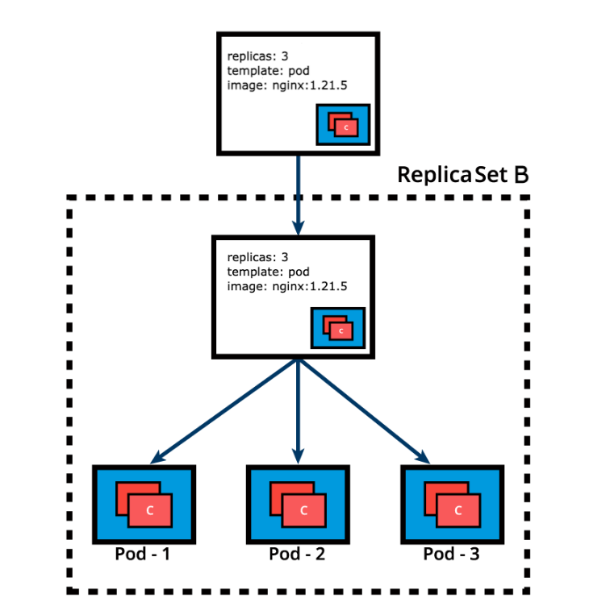

- **NB!** practice commands:

```
$ kubectl apply -f nginx-deploy.yaml --record
$ kubectl get deployments
$ kubectl get deploy -o wide
$ kubectl scale deploy nginx-deployment --replicas=4
$ kubectl get deploy nginx-deployment -o yaml
$ kubectl get deploy nginx-deployment -o json
$ kubectl describe deploy nginx-deployment
$ kubectl rollout status deploy nginx-deployment
$ kubectl rollout history deploy nginx-deployment
$ kubectl rollout history deploy nginx-deployment --revision=1
$ kubectl set image deploy nginx-deployment nginx=nginx:1.21.5 --record
$ kubectl rollout history deploy nginx-deployment --revision=2
$ kubectl rollout undo deploy nginx-deployment --to-revision=1
$ kubectl get all -l app=nginx -o wide
$ kubectl delete deploy nginx-deployment
$ kubectl get deploy,rs,po -l app=nginx
```

---

**DaemonSets**

- Daemonsets are operators designed to manage node agents. They resemble ReplicaSet and Deployment operators when managing multiple Pod Replicas and application updates. but the DaemonSets present a distinct fueature that enforces a single pod replicate to be placed per Node, on all the Nodes or on a select subset of nodes.

- In contrast ReplicaSet and Deployment operators by default have no controle over the scheduling and placement of multiple Pod replicas on the same Node.

- DaemonSet operatorrs are commonly used in cases when we need to collect monitoring data from all nodes or to run storage networking or proxy daemons on all nodes, to ensure that we have a specific type of Pod running on all nodes at all times. They are critical API resources in multi-node Kubernetes clusters.

- The kube-proxy agent running as a pod on every single node in the cluster or the Calico or Cilium networking node agent implementing the Pod Networking across all nodes of the cluster are examples of applications managed by the DaemonSet operators.

- When na Node is added to the cluster a Pod from a given DaemonSet is automatically placed on it. Although it ensures an automated process, the DaemonSet's Pods are placed on all cluster's Nodes by the controller itself, and not with the help of the default Scheduler. Wehen any one Node crashes or it is removed from the cluster, the respecive DaemonSet operated Pods are garbage collected. If a daemonSet is deleted all pod replicas it created are deleted as well.

- The placement of DaemonSet Pods is still governed by scheduling properties which may limit its Pods to be placed only on a subset of the cluster's Nodes. This can be achieved with the help of Pod schduling properties such as nodeSelectors, node affinity rules, taints and tolerations. This ensures the Pods of a DaemonSet are placed only on specific Nodes, such as workers if desired. However the default Schduler can take over the schduling process if a corresponding feature is enabled accepting again node affinity rules.

- example of a DaemonSet object's definion manifest in yaml:

```
apiVersion: apps/v1
kind: DaemonSet
metadata:
  name: fluentd-agent
  namespace: default
  labels:
    k8s-app: fluentd-agent
spec:
  selector:
    matchLabels:
      k8s-app: fluentd-agent
  template:
    metadata:
      labels:
        k8s-app: fluentd-agent
    spec:
      containers:
      - name: fluentd
        image: quay.io/fluentd_elasticsearch/fluentd:v4.5.2
```

- if stored by fluentd-ds.yaml file is loaded into the cluster to run a set of identical Pod replicas, with their associated container image, matching in count the number of cluster nodes.

```
$ kubectl create -f fluentd-ds.yaml
```

- **NB!** Reviews following topics:

```
$ kubectl apply -f fluentd-ds.yaml --record
$ kubectl get daemonsets
$ kubectl get ds -o wide
$ kubectl get ds fluentd-agent -o yaml
$ kubectl get ds fluentd-agent -o json
$ kubectl describe ds fluentd-agent
$ kubectl rollout status ds fluentd-agent
$ kubectl rollout history ds fluentd-agent
$ kubectl rollout history ds fluentd-agent --revision=1
$ kubectl set image ds fluentd-agent fluentd=quay.io/fluentd_elasticsearch/fluentd:v4.6.2 --record
$ kubectl rollout history ds fluentd-agent --revision=2
$ kubectl rollout undo ds fluentd-agent --to-revision=1
$ kubectl get all -l k8s-app=fluentd-agent -o wide
$ kubectl delete ds fluentd-agent
$ kubectl get ds,po -l k8s-app=fluentd-agent
```

---

---

---

### 10. Authentication, Authorization, Admision control

---

---

---

#### Overview

---

- To access and manage Kubernetes resources or objects in the cluster, we need to access a specific API nedpoint on the API server. Each access request goes through the following access control stages:

1. Authentication: authenticate a user based on credentials provided as part of API requests.

2. Authorization: authorizes the API requests submitted by the authenticated user.

3. Admission control: Software modules that validate and/or modify user requests.

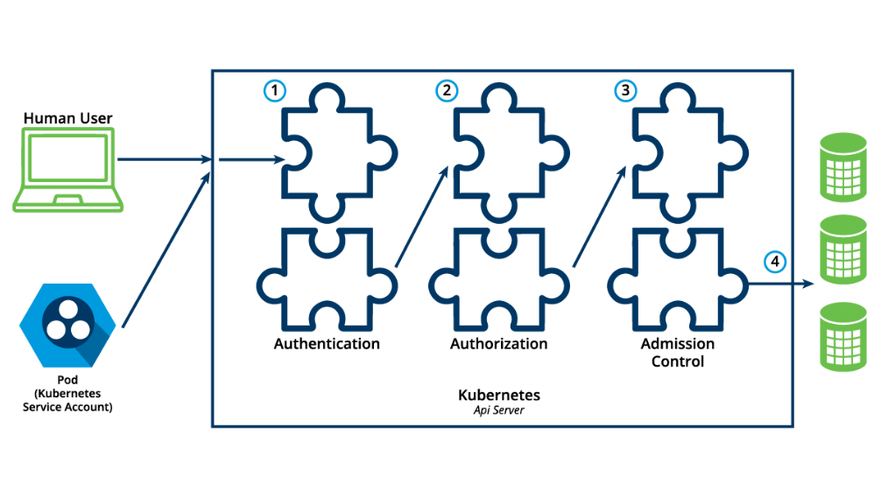

---

#### Authentication

- k8s does not have an object called user nor does it store usernames or other related details in its objective store. However even without that, kubernetes can use usernames for the authentication phase of the API access control, and to request logging as well.

- types of users that k8s supports:

1. Normal users- they are managed outside of the kubernetes cluster via intedependent services like User/Client certificates, a file listing usernames/passwords, google account.

2. Service Accounts- allow in-cluster processes to communicate with the API server to perform various operations. Most of the Service Accounts are created automatically via the API server, but they can also be created manually. The Service Accounts are tied to a particular Namespace and mount the respective credentials to communicate with the API server as Secrets.

---

- if properly configured, k8s can also support annonymous requests, along with requrest from Normal Users and Service Accounts. User impersonation is also supported allowing a user to act as another user > helpful for administrators when troubleshooting authorization policies.

- for authetntication k8s uses series of authentication modules:

1. X509 Client Certificates
   To enable client certificate authentication, we need to reference a file containing one or more certificate authorities by passing the --client-ca-file=SOMEFILE option to the API server. The certificate authorities mentioned in the file would validate the client certificates presented by users to the API server. A demonstration video covering this topic can be found at the end of this chapter.
2. Static Token File
   We can pass a file containing pre-defined bearer tokens with the --token-auth-file=SOMEFILE option to the API server. Currently, these tokens would last indefinitely, and they cannot be changed without restarting the API server.
3. Bootstrap Tokens
   Tokens used for bootstrapping new Kubernetes clusters.
4. Service Account Tokens
   Automatically enabled authenticators that use signed bearer tokens to verify requests. These tokens get attached to Pods using the Service Account Admission Controller, which allows in-cluster processes to talk to the API server.
5. OpenID Connect Tokens
   OpenID Connect helps us connect with OAuth2 providers, such as Microsoft Entra ID (previously known as Azure Active Directory), Salesforce, and Google, to offload the authentication to external services.
6. Webhook Token Authentication
   With Webhook-based authentication, verification of bearer tokens can be offloaded to a remote service.
7. Authenticating Proxy
   Allows for the programming of additional authentication logic.

- it is possible to enable multiple autheticators, and the first module to successfully authenticate the request short-circuits the evaluation. To ensure successful user authentication, we should enable at least 2 methods: service account tokens auth and one of the user authenticationrs.

---

#### Authorization

- After a successful authentication, user can send the API request to perform different operations. Here, these API requests get authorized by K8s using various authorization modules that allow or deny the requests.

- Some of the API requests attributes that are reviewed by K8s include user, group, Resource, Namespace or API group. These attribtes are evaluated against policies, if the evaluation is successful then the request is allowed otherwide is denied. Similar to the Authentication step, Authorization has multiple modules or authorizers. More than one module can be configured for one k8s cluster, an each module is cheked in sequence. if any authorizer approves or denies a request, the that decision is returned immediately.

- **Auhtorization Modes**

- 1. **Node** : node authorization is a special-purpose authorization mode which specifically authorizes API requests made by kubelets. It authorizes the kubelet's read operations for services, endpoint or nodes, and writes operations for nodes, pods and events. for more info RTFM

- 2. **Attribute-Based Access Control(ABAC)** : with the ABAC authorized, Kuberenetes grands access to API requests, which combine policies with attributes. In the following example, user bob can only read Pods in the Namespace **lfs158**

```
{
  "apiVersion": "abac.authorization.kubernetes.io/v1beta1",
  "kind": "Policy",
  "spec": {
    "user": "bob",
    "namespace": "lfs158",
    "resource": "pods",
    "readonly": true
  }
}
```

- to enable AABC mode, we start the API server with the --authorization-mode=ABAC option, while specifying the autorization policy with --autrorization-policy-file=PolicyFIle.json.

- 3.**Webhook** : in webhook mode k8s can request authorization decision to be made by third-party services, which would return true for successful authorization, and false for failure. In order to enable the Webhook authorizer, we need to start the API server with the --authorization-webhook-config-file=SOME_FILENAME option, where some_filename is the configuration of the remote authorization service.

- 4. **Role-Based Access Control** (RBAC): with RBAC we regulate the access to resources based on the Roles of individual users. In k8s, multiple Roles can be attached to subjects like users, service accounts, etc. While creating the Roles, we restrics resource access by specific operation such as **create, get, update,patch**. The se operations are referred to as verbs. In RBAC, we can two kinds of Roles:

- Role: A role grants access to the resources within a specific Namespace.

- ClusterRole: A ClusterRole grants the same permissions as Role does, but its scope is cluster-wide.

- exmaple of Role:

```
apiVersion: rbac.authorization.k8s.io/v1
kind: Role
metadata:
  namespace: lfs158
  name: pod-reader
rules:
- apiGroups: [""] # "" indicates the core API group
  resources: ["pods"]
  verbs: ["get", "watch", "list"]


```

- the Manifest defines a pod-reader role, which has access only to read the pods and **lfs158** Namespace.

- Example of cluster ClusterRole:

```
apiVersion: rbac.authorization.k8s.io/v1
kind: ClusterRole
metadata:
  name: cluster-admin
rules:
- apiGroups:
  - '*' # All API groups
  resources:
  - '*' # All resources
  verbs:
  - '*' # All operations
- nonResourceURLs:
  - '*' # All non resource URLs, such as "/healthz"
  verbs:
  - '*' # All operations
```

- The manifest defines a cluster- admin cluster role that is fully permissive.

- Once the role is created, we can bind itot users with a RoleBinding object. There are 2 kinds of RoleBindings:

1. RoleBinding: IT allows us to bind users to the same namespace as a Role. We could also refer to a ClusterRole in RoleBidinding, which would grant permissions to Namespace resources defined in a the ClusterRole within the RoleBinding's Namespace.

2. ClusterRoleBinding: it allows us to grant access to resourcesat at a cluster- level and to all Namespaces.

- Example of RoleBinding:

```
apiVersion: rbac.authorization.k8s.io/v1
kind: RoleBinding
metadata:
  name: pod-read-access
  namespace: lfs158
subjects:
- kind: User
  name: bob
  apiGroup: rbac.authorization.k8s.io
roleRef:
  kind: Role
  name: pod-reader
  apiGroup: rbac.authorization.k8s.io
```

- the manifest defines a bid between the cluster-admin ClusterRole and all usrs of the group system:admins.

- To enable RBAC mode, we start the API server with the --authorization-mode=RBAC option, allowing us to dynamically configure policies.

---

#### Authentication and Authorization Steps

- guide is performed in the environment- **/var/lib/minikube/certs** and RBAC mode of authorization for : Minikube v1.32, Kubernetes v1.28, containerd 1.7.8.

- Start minikube:

```
$ minikube start
```

- to preview the content of kubectl clients' configuration manifest, observing the only context minikube and the only user minikube, created by default (output)

```
$ kubectl config view
```

- create **lfs158** namespace

```
$ kubectl create namespace lfs158
```

- create rbac directory and cd into it:

```
$ mkdir rbac
$ cd rbac/
```

- create new user bob on your workstation, set bob's passwords as well (system will prompt to enter password twice)

```
~/rbac$ sudo useradd -s /bin/bash bob
~/rbac$ sudo passwd bob

```

- create private key for the new user bob with the openssl tool, create a certificate singing request for bob with the same openssl:

```
~/rbac$ openssl genrsa -out bob.key 2048

----
~/rbac$ openssl req -new -key bob.key \
-out bob.csr -subj "/CN=bob/0=learner"


```

- create a YAML definition manifest for a certifica singing request object and save it with a blank value on the request field

```
~/rbac$ vim signing-request.yaml

apiVersion: certificates.k8s.io/v1
kind: CertificateSigningRequest
metadata:
  name: bob-csr
spec:
  groups:
  - system:authenticated
  request: <assign encoded value from next cat command>
  signerName: kubernetes.io/kube-apiserver-client
  usages:
  - digital signature
  - key encipherment
  - client auth
```

- view certificate, encode it base64, and assign it to the reuqest field in the singing-request. yaml

```
~/rbac$ cat bob.csr | base64 | tr -d '\n','%'
```

```
~/rbac$ vim singing-request.yaml
```

- create certificate singing request object, then list the certificate, signing request objects. it will show a pending state

```
~/rbac kubectl create -f signing-request.yaml
```

```
~/rbac$ kubectl get csr
```

- approve certificate signing request object, then list the certificate signging request objects again. it will show both approved and issued states

```
~/rbac$ kubectl certificate approve bob-csr
```

```
~/rbac$ kubectl get csr
```

- extract the approved certificate from the certificate signing request, decode it with base64 and seve it as a certificate file.

```
~/rbac$ kubectl get csr bob-csr \
-o jsonpath='{.status.certificate}' | \
base64 -d > bob.crt

~/rbac$ cat bob.crt
```

- configure kubectl client's configuration manifest with user bob's credentials by assigning his key and certificate:

```
~/rbac$ kubectl config set-credentials bob\ --client-certificate=bob.crt --client-key=bob.key
```

- create a new context entry in the kubectl client's configuration manifest for user bob, associated with lfs158 namespace in the minikube cluster:

```
~/rbac$ kubectl config set-context bob-context \
--cluster=minikube --namespace=lfs158 --user=bob
```

- viewthe contents ofthe kubectl client's configuration manifest again, obeserving the new context entry bob-context, and the new user entry bob

```
~/rbac$ kubectl config view
```

- while the default minikube context, create a new deployment in the lfs158 namespace

```
~/rbac$ kubectly -n lfs158 create deployment nginx --image=nginx:alpine
```

- from the new contxt bob-context try to list pods. the attempt will fail becuase user bob has no permissions configured forthe bob-context:

```
~/rbac$ kubectly --context=bob-context get pods
```

- with the following steps will assign a limited set of permision to user bob in the bob-context

- to create a yaml config manifest for a pod-reader role object , which allows only get, watch, list actions in the lfs158 namespace agains pod resources. Then create the role object and list in from the default minikube context, but from the lfs158 namespace.

```
~/rbac$ vim role.yaml

apiVersion: rbac.authorization.k8s.io/v1
kind: Role
metadata:
  name: pod-reader
  namespace: lfs158
rules:
- apiGroups: [""]
  resources: ["pods"]
  verbs: ["get", "watch", "list"]

~/rbac$ kubectl create -f role.yaml

#returns
role.rbac.authorization.k8s.io/pod-reader created

~/rbac$ kubectl -n lfs158 get roles


#returns
NAME         CREATED AT
pod-reader   2022-04-11T03:47:45Z
```

- create a yaml config manifest for a rolebinding object, which assigns the permissions of the pod-reade Role to usr bob. Then create the rolebinding object and list it from the default minikube context, but from lfs158 namespace:

```
~/rbac$ vim rolebinding.yaml

apiVersion: rbac.authorization.k8s.io/v1
kind: RoleBinding
metadata:
  name: pod-read-access
  namespace: lfs158
subjects:
- kind: User
  name: bob
  apiGroup: rbac.authorization.k8s.io
roleRef:
  kind: Role
  name: pod-reader
  apiGroup: rbac.authorization.k8s.io

~/rbac$ kubectl create -f rolebinding.yaml

#returns
rolebinding.rbac.authorization.k8s.io/pod-read-access created

~/rbac$ kubectl -n lfs158 get rolebindings

#returns
NAME              ROLE              AGE
pod-read-access   Role/pod-reader   28s

# Now that we have assigned permissions to bob, we can successfully list pods from the new context bob-context.

~/rbac$ kubectl --context=bob-context get pods

#returns
NAME                     READY   STATUS    RESTARTS   AGE
nginx-565785f75c-kl25r   1/1     Running   0          7m41s
```

---

#### Admission Control

---

- **Overview**: admission controllers are used to specify granular access control policies, which include allowing priviledge container, checking on resource quote, etc.

- We can force these policies using different admission controllers like LimitRanger, ResourceQuote, Default Storage Class, AlwaysPullimage. They come into effect only after API request are authenticated and authorized. Admission controllers fall under 2 cagetories- validating or mutating- but there are controllers that are both validating and mutating. The mutating controllerss can modify the request objects.

- to use admission controls, we must start the K8s API server with the --enable-admission-plugins, which takes a comma-delimited, ordered list of controller names such as:

```
--enable-admission-plugins=NamespaecLifecycle, ResourecQuota, PodSecurity, DefaultStorageClass
```

- k8s has some admission controllers enabled by default, for more info RTFM.

- k8s admission control can also be implemented though custom plugins, for a dynamic admission control method. These plugins are develiped as extensions and run as admission webhooks.

---

---

---

### 11. Services

---

---

---

#### Overview

---

- Microservices driven acrhitecture aims to decouple the components of an application, microservices still need agents to logically tie or group them together for management purposes, or to load balance traffic to the ones that are part of such logical set.

- Service objects used to abstract the communication between cluster internal microservicer with the external world.

- Service offers a single DNS enry for a stateless containerized application managed by a common load balancing access point to set a pods logically grouped and managed by a controller such as Deployment, ReplicaSet or DaemonSet.

---

**Accessing Application Pods**

- to access the application, a user or noather application needs to be connect to a Pod running the target application. As Pods are ephemeral in nature, resources like IP addresses allocated to them cannot be static. Pods could be terminated abruptly or be rescheduled absed on existing requirements.

- Scenario: an operaor manages a set of Pods and a user/client is accessing the pods directly by using their individual IP addresses. This access method requires the cluent to retrieve the target Pods' IP addresses in advance, introducing an unnecessary overhead for the client.


- unexpectedly , on of the Pods athe user/client is accessing is terminated, and a new Pod is createdd by the controller. The new pod will be assigned a new IP address that will not be immediately known by the user/clienbt. If the client tries to watch the target Pods's IP addresses for any changes/updates, this will result in an inefficient approach that will only increase the client's overhead.

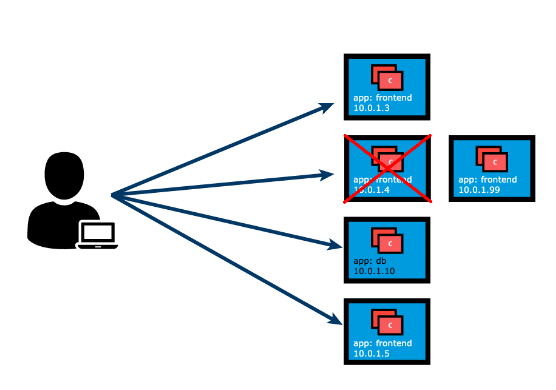

- To overcome this situation, k8s provides a higher-level abstraction called Service- which logically groups Pods and defines a policy to access them. This grouping is achieved via Labels and Selectors.

- This logical grouping strategy is used by Pod controllers such as ReplicaSets, Deployments and even Daemon Sets. Below is Deployment definition manifest for the frontend app, to aid with the correlation of Labels, Selectors and port values between the deployment controller, its Pod replicas and the service definition manifest.

```
apiVersion: apps/v1
kind: Deployment
metadata:
  labels:
    app: frontend
  name: frontend
spec:
  replicas: 3
  selector:
    matchLabels:
      app: frontend
    template:
      metadata:
        labels:
          app: frontend
      spec:
        containers:
        - image: frontend-application
        name: frontend-application
        ports:
        - containerPort: 5000
```

---

#### Services

---

- Labels and Selectors use a key-value pair format. In the following graphical representation, app is the label key, **frontend** and **db** are label balues for different pods.

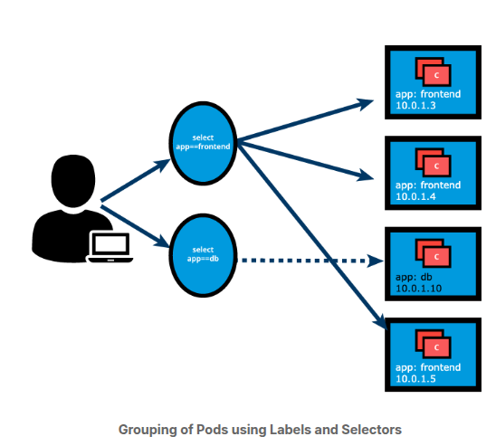

- Using the selectors app==frontend and app=db, we group Pods into two logical sets: one set with 3 Pods, and one set with a single pod.

- we assign a name to the logical grouping > known as Service. Ther Service name is also registered with the cluster's internal DNS service. In our example , we create two Service, **frontend-svc** and **db-svc**, and they have the app==frontend and the app==db Selectors, respectively.

- Services can expose single Pods, ReplicaSets, Deployments, DaemonSets and StatefulSets. When exposing the Pods managed by an operator, the Service's selector may use the same label as the operator. A clear benefit of a service is that it watches application Pods for any changes in count and their respective IP addresses while automatically updating the list of corresponding endpoints.

- Even a single-replica application, run by a single Pod, the Service is beneficial during self-healing (replacement of a failed Pod) as it immediately directs traffic to the newly deployed healthy pod.

---

**Service Object Example**

- declarative method to define an object, and can serve as a template for a much more complex Service definition manifest if desired. By omitting the Service type from the definition manifest, we create the default service type, the ClusterIP type.

```
apiVersion: v1
kind: Service
metadata:
  name: frontend-svc
spec:
  selector:
    app: frontend
  ports:
  - protocol: TCP
    port: 80
    targetPort: 5000
```

- The above definition manifest, if stored by a frontend-svc.yaml file is loaded into the cluster to set up the necessary routes and rules to send traffic to the Pod replicas of the earlier defined frontend Deployment. While create is shown, apply can be used also

```
$ kubectl create -f frontend-svc.yaml
```

- imperatively we can use direct method to expose the deployment's pods. The following is a multi-line command :

```
$ kubectl expose deploy frontend --name=frontend-svc\
--port=80 --target-port=5000
```

- The expose command parses the refenced Depolyment object to extract valuable pairing details such as Name, Label, Selectro or containerPort to populate these values in the Service object.

- In cases when the Service port and Service **targetPort** values are expected to be distinct (80 and 5000) it is best to explicitly supply these values with the expose command. Also, we want to change the name of the Service with the name option (default behaviour is for the Service object to inherit the exposed Deployment name's frontend)

- Another imperative method is set up the same Service from aboceis through the **create service** command. The command below first sets up a **frontend** Service with **frontend** Label and **frontend** Selector in **dry-run** mode, it updates the service name to frontend-svc and then loads the definition in the cluster.

```
$ kubectl create service clusterip frontend \
--tcp=80:5000 --dry-run=client -o yaml \
| sed 's/name: frontend/name: frontend-svc/g' \
| kubectl apply -f -

```

- we are creating a frontend-svc Service by selecting all the Pods that have the label key=app set to value=frontend. By default each Service receives an IP address routable only inside the cluster, known as ClusterIP. In our example we have 172.17.0.4 and 172.17.0.5 as clusterIps assined to our fronend-svc and db-svc Services

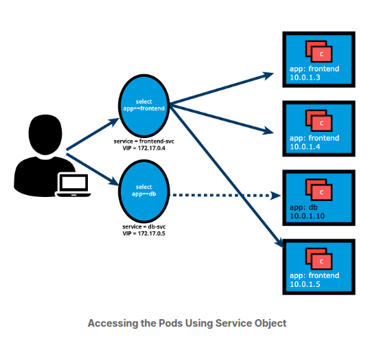

- The user/client now connects to a Service via ClusterIP, which forwards traffic to one of the Pods attached to it. A service provides load balancing by default while selecting the Pods for traffic forwarding.

- Service forwards traffic to pods, we can select the **targetPort** on the Pod which receives the traffic. In image- fronend-svc Service receives request from the user/client on port: 80 and then forwards these requests to one of the attached Pods on the targetPort: 5000. If the **targetPort** is not defined explicitly, then traffic will be forwarded to Pods on the Port on which the service receives traffic-> in this case the **targetPort** implicitly is assigned the value of the port. It is very important to ensre that the value of the **targePort** which is 500 in this exmaple, matches the value of the **containerPort** of the Pod spec section.

- A logical set of a Pods's Ip address, along with the **targetPort** is referred to a Service endpoint. in example , the fronend-svc Service has 3 endpoints: 10.0.1.3:5000, 10.0.1.4:5000, and 10.0.1.5:5000

- endpoints are created and managed automatically by the Service, not by the Kuberenes cluster administrators or developers.

- service associated endpoints can be listed with:

```
$ kubectl get service,endpoints frontend-svc
$ kubectl get svc,ep frontend-svc
```

---

**Kube-proxy**

- each cluster node runs a daemon called kube-proxy, a node agent that watches with the API server on the control plane node for the addition, updates and removal of Services and endpoints. Kube-proxy is responsible for implementing the Service configuration on behalf of an administrator or developer. In orded to enable traffic routing to an exposed application running in Pods.

- In example: for each new Service, on each node, kube-proxy configures iptables rules to capture the traffic for its ClusterIp and forwards it to one of the Service's endpoints. Therefore any node can receive the external traffi and then route it internally in the cluster based on the iptables rules. When the Service is removed, kube-proxy removes the corresponding iptables rules on all nodes as well.


- Just as a kubep-proxy node agent runs reduntandttly on each cluster node, the Iptables are populate in a reduntadant fashion by their respecive node agents so that each iptables instance stores complete routing rules for the entire cluster. This helps with the Service objects implementation to reproduce a distributed load balancing mechanism.

---

**Traffic Policies**

- The kube-proxy node agent together with the iptables implement the load-balancing emchanism of the Service when traffic is being routed to the application Endpoints. Due to restricting characteristics of the iptables this load-balancing is random by default. > Meaning the Endpoint Pod to receive the request forwarded by the Service will be randomly slected out of many replicas. The mechanism does not guarantee that the selected receiving Pod is the closest oreven on the same node as the requester, threfore not the most efficient mechanism. Since this is the iptables supported load-balancing mchanism, if we desire better outcome > we need to to take advantage of traffic policies.

- Traffic Policies- allows users to instruct the kube-proxy on the context of the traffic routing. There are 2 options: Cluster and Local.

  1. Cluster- allows kube-proxy to target all ready Endpoints of the Service in the load-balancing process. This is the default behaviour of the Service even when the traffic policy property is not explicitly declared.

  2. Local- isolates the load- balancing process to only include the Endpoints of the Service located on the same node as the requester Pod, or perhaps the node that captured inboud external traffic on its NodePort. This might come with issues> if Service does not have a ready endpoint on the node where the requester pod is running the Srvice will not route the request to Endpoints on other nodes to satisfy the request because it will be dropped by kube-proxy.

- both option ara available for requests generated internally from within the cluster, or externally from applications and clients running outside the cluster. The Service definition manifest blow defines both internal and external Local traffic policies. Both are optional settings, and can be used independent of each other, where one can be defined without the other

```
apiVersion: v1
kind: Service
metadata:
  name: frontend-svc
spec:
  selector:
    app: frontend
  ports:
    - protocol: TCP
      port: 80
      targetPort: 5000
  internalTrafficPolicy: Local
  externalTrafficPolicy: Local
```

---

**Service Discovery**

- Services are the primary mode of communication between cntainerized applications managed by k8s, it is helpful to be able to discover them at runtime. k8s supports two methods for discovering Services.

  1. **Environment variables**: As soon as the Pod Starts on any worker node, that kubelet daemon runnin on that node adds a set of environment variables in the Pod of all active Services. For example, if we have an active Service called redis-master, which exposes port 6379, and its ClusterIP is 172.17.0.6 then on a newly created pod, we can see the following enviroment variables:

  ```
  REDIS_MASTER_SERVICE_HOST=172.17.0.6
  REDIS_MASTER_SERVICE_PORT=6379
  REDIS_MASTER_PORT=tcp://172.17.0.6:6379
  REDIS_MASTER_PORT_6379_TCP=tcp://172.17.0.6:6379
  REDIS_MASTER_PORT_6379_TCP_PROTO=tcp
  REDIS_MASTER_PORT_6379_TCP_PORT=6379
  REDIS_MASTER_PORT_6379_TCP_ADDR=172.17.0.6

  ```

- with this solution we need to be careful while ordering our Service, as the Pods will not have the enviromnent variables set for Services which are created after the Pods are created.

2. **DNS** : k8s has an add-on for DNS, which creates a DNS recoed for each Service and its format in my-svc.my-namespace.svc.cluster.local. Services within the same Namespace find other Services just by theri names. If we add a Service redis-master in ;my-ns Namespace, all Pods in the same my-ns Namespace lookup the Service just by its name, redis-master. Pods from other Namespaces, such as test-ns, lookup the same Service by adding the respective Namespace as a suffix, such as redis-master.my-ns or providing the FQDN of the service as redis-master.my-ns.svc.cluster.local.

This is the most common and highly recommended solution. For example, in the previous section's image, we have seen that an internal DNS is configured, which maps our Services frontend-svc and db-svc to 172.17.0.4 and 172.17.0.5 IP addresses respectively.

If we had a client application accessing the frontend application, the client would only need to “know” the frontend application’s Service name and port, which are frontend-svc and port 80 respectively. From a client application Pod we could possibly run the following command, allowing for the cluster internal name resolution and the kube-proxy to guide the client’s request to a frontend Pod:

```
$ kubectl exec client-app-pod-name -c client-container-name -- /bin/sh -c curl -s frontend-svc:80
```

---

**ServiceType**

- While defining a Service, we can also choose its access scope. We can decide whethe the Service: - only accessible within the cluster. - accessible from within the cluster and the external world. maps to an entity which resides either inside or outside the cluster.

- Access scope is decided by **ServiceType** property, defined when creating the Service.

---

**ServiceType: ClusterIP and NodePort**

- ClusterIP is the default ServiceType. A Service receives a Virtual IP address, known as its ClusterIP. This Virtual IP address is used for communicating with the Service and is accessible only from within the cluster. The frontend-svc Service definition manifest now includes an explicit type for ClusterIP. If omitted, the default ClusterIP service type is set up:

```
apiVersion: v1
kind: Service
metadata:
  name: frontend-svc
spec:
  selector:
    app: frontend
  ports:
  - protocol: TCP
    port: 80
    targetPort: 5000
  type: ClusterIP

```

- NodePort ServiceType, in addition to a ClusterIP, a high-port, dynamically picked from the default range 30000-32767, is mapped to the respective Service, from all the worker nodes. For example, if the mapped NodePort is 32233 for the service frontend-svc, then, if we connect to any worker node on port 32233, the node would redirect all the traffic to the assigned ClusterIP - 172.17.0.4. If we prefer a specific high-port number instead, then we can assign that high-port number to the NodePort from the default range when creating the Service.

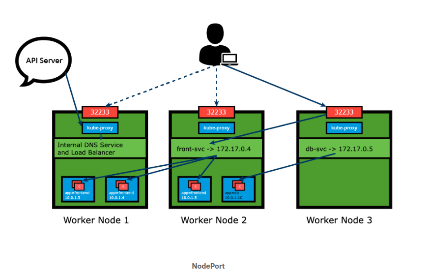

- The NodePort ServiceType is useful when we want to make our Services accessible from the external world. The end-user connects to any worker node on the specified high-port, which proxies the request internally to the ClusterIP of the Service, then the request is forwarded to the applications running inside the cluster. Let's not forget that the Service is load balancing such requests, and only forwards the request to one of the Pods running the desired application. To manage access to multiple application Services from the external world, administrators can configure a reverse proxy - an ingress, and define rules that target specific Services within the cluster.

- The NodePort type has to be explicitly declared in the Service definition manifest or with the imperative methods explored in an earlier lesson - the expose and create service commands. Declaring the nodePort value 32233 is optional, ensuring there is no conflict. We are reusing the earlier definition and commands updated for the NodePort type and declaring the nodePort value where supported:

```
apiVersion: v1
kind: Service
metadata:
  name: frontend-svc
spec:
  selector:
    app: frontend
  ports:
  - protocol: TCP
    port: 80
    targetPort: 5000
    nodePort: 32233
  type: NodePort


```

- kubectl commands

```
$ kubectl expose deploy frontend --name=frontend-svc \
--port=80 --target-port=5000 --type=NodePort

$ kubectl create service nodeport frontend-svc \
--tcp=80:5000 --node-port=32233
```

---

**ServiceType: LoadBalancer**

- With the loadbalancer servicetype we can do the following:

1. NodePort and ClusterIP are automatically created, and the external load balancer will route to them.

2. The service is exposed at a static port on each workder node.

3. The service is exposed externally using the underlying cloud provider's load balancer feature.

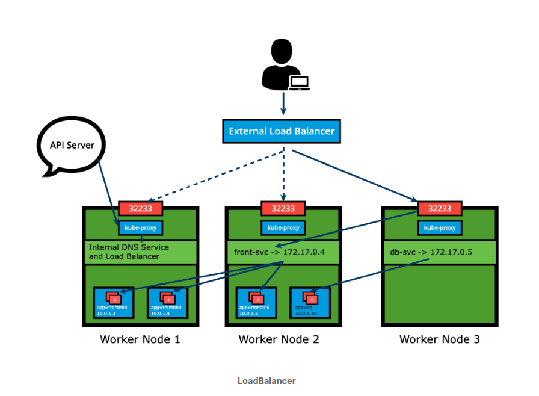

- **LoadBalancer** ServiceType will only work if the underlying infrastructure supports the automatic creation of Load balancers and have the respective support in Kubernetes, as is the case with the Google Cloud Platform and AWS. If no such feature is configured, the Loadbalancer IP address field is not populated, it remains in Pending State, but the Srvice will still work as a typical NodePOrt type Service.

---

**ServiceType: ExternalIP**

- A Service can be mapped to an ExternalIP address if it can route to one or more of the worker nodes. Traffic that is ingressed into the cluster with the ExternalIP (as destination IP) on the Service port, gets routed to one of the Service endpoints. This type of service requires an external cloud provider such as GCP or AWS and a Load Balancer configured on the cloud provider's infrastructure.


- **NB!** ExternalIps are not managed by Kubernetes. The cluster administrator needs to congure the routing which maps the ExternalIP address to one of the nodes.

---

**ServiceType: ExternalName**

- ExternalName is special serviceType that has no Selectors and does not define any endpoints. When accessed within the cluster, it returns a **CNAME** necord of an externally configured Service.

- The primary use of this ServiceType is to make externally configured Services, like **my-database.example.com** available to applications inside the cluster. If the externally defined Service resides within the Namespace, using just the name my-database would make it available to other applications and Services within that Namespace.

---

**Multi-Port Services**

- A service resource can expose multiple ports at the same time if required. Its configuration is flexible enough to allow for multiple groupings of ports to be defined in the manifest. This is a helpful feature when exposing Pods with one container listening on more than one port, OR when exposing Pods with multiple containers listening on one or more ports.

- Example of multi-port Service:

```
apiVersion: v1
kind: Service
metadata:
  name: my-service
spec:
  selector:
    app: myapp
  type: NodePort
  ports:
  - name: http
    protocol: TCP
    port: 8080
    targetPort: 80
    nodePort: 31080
  - name: https
    protocol: TCP
    port: 8443
    targetPort: 443
    nodePort: 31443
```

- Breakdown: the **my-service** Service resource exposes Pods labeled app=myapp with possibly one container listening on ports 80 and 443, as described by the two **targetPort** fields. The Service will be visible inside the cluster on its **ClusterIP** and ports **8080 and 8443** as described. It will be accessible to incoming request from outside the cluster on the two **nodePort** fields **31080 and 31443**. When manifests decribe multiple ports, they need to be named as well for clarity as described by the two **spec.port.name** fields with values **http nad https** respecively. This Service is configured to capture traffic on ports 8080 and 8443 from within the cluster and ports 31080 and 31443 from outside the cluster and forward that traffic to the ports 80 and 443 respecively of the Pods running the container.

---

**Port Forwarding**

- Port Forwarding: exposure mechanism in Kubernetes, allows users to easily forward a local port to an application port. Thanks to its flexibility the application port can be a Pod container port, a Service port and Even a Deployment container port (from its Pod template).

- This allows the users to test and debug their application running in a remote cluster by targeting a port on their local workstation (either http://localhost:port or http://127.0.0.1:port) , a solution for remote cloud clusters or virtualized premises clusters.

- Port forwarding can be utilized as an alternative to the NodePort Service type because it does not require knowledge of the public IP address of the K8s Node. As long as there are no firewalls blocking access to the desired local workstation port, such as 8080 in examples, the port forwarding method can quickly allow access to the application runnin in the cluster.

- Port forwarding can be achieved by using the following methods:

```
$ kubectl port-forward deploy/frontend 8080:5000

$ kubectl port-forward frontend-77cbdf6f79-qsdts 8080:5000

$ kubectl port-forward svc/frontend-svc 8080:80
```

- Breakdown: all commads forward to port 8080 of the local workstation to the container port 500 of the Deployment and Pod respecively, and to the Service port 80. While the Pod resource type is implicit, threfore optional and can be omitted, the depoloymed and service resource types are required to be explicitly supplied in the presented syntax.

---

---

---

### 12. Deploy Standalone application

---

---

---

#### Overview

---

- Breakdown of how to deploy an application using k8s webui and CLI. Exposure the application with a NodePort type service and access it from outside the Minikube cluster.

---

#### Deployment Steps

- How to depoloy an nginx webserver using the nginx container image from Dockerhub.

- Start Minicube and verify its running with commands:

```
$ minikube start

$ minikube status
```

- Start the Minikube Dashboard. To access the k8s web Ui we need the command:

```
$ minikube dashboard
```

- will open up a browser with the k8s web ui to manage containerized applications. by default, the dashboard is connected to the default Namespace. All operation will be performed inside the default Namespace.

- **NB!** if browser is not opening browser, need to verify output in terminal. Be mindful for the port number. Then logout/login + reboot might be needed.

- To deploy a webserver using the nginx image, from the dashboard we need to follow the + symbol. From there we can create an application using valid Yaml/Json configuration data, from a definition manifest file or manually from the "Create from form tab."

- If we pick the last option, we need to provide the following application details:

  1. application name- set to web-dash
  2. container image to nginx
  3. replica count, or number of pods > 1
  4. Service is External, Port 8080, target port 80, Protocol TCP
  5. name default

- For more advanced options we can pick Labels, Namespace, Resource Request.

- By default Label is set to the application name. (ex- k8s-app: web-dash), set to all objects cread by this Deployment: Pods and Sercice exposed.

- When hitting the Deploy button, we trigger the deployment. As expected the Deployment web-dash will create a ReplicaSet

- after the deployment we can use resource navigation panel to check depoloyments, ReplicaSets and pods in the default Namespace.

- resources displayed by the dashvoard match one-to-one resources displaed from the CLI via kubectly. We can list all the deployments in the default Namespace using the kubectl get deployments:

```
$ kubectl get deployments
```

- list ReplicaSets, we can list all the ReplicaSets in the default Namespace using the following command:

```
$ kubectl get replicasets
```

- list the pods, we can list all the pods in the default namespace using:

```
$ kubeclt get pods
```

- shorthad for all the Deployment, Replicaset and Pods:

```
$ kubectl get deploy, rs, po
```

---

**Exploring Labels and Selectors**

- Labels and selectors play important role in logically grouping a subset of objects to perform operations.

- how to display Pod's details. We can look at an object details using the kubectly describe command , even specify which particular pod we want:

```
#example

$ kubectl describe pod web-dash-74d8bd488f-dwbzz
```

- **kubectl describe** command always displays more details of a pod.

- in order to list the pods with their attached labels we need (**-L**) option to be added. we can add extra columns in the output to list Pods with their attached Label Keys and their values> we can add-> k8s-app and label2.

```

$ kubecstl get pods -L k8s-app,label2
```

- with it all the pods are listed, with the value set to web-dash , we can see that in the column, as none of the pods have label2 label key, no values are listed under the column

- to select the pods with a given label, we need to use a selector with the kubectl get pod command, we can use the **-l** option. in the following example we are selecting all the Pods that have the k8s-app label key set to value web-dash:

```
$ kubectl get pods -l k8s-app=web-dash
```

- we can use something like k8s-app=webserver (non existent) and it will return nothing

```
$ kubectl get pods -l k8s-app=webserver
```

---

**CLI deployment steps**

- in order do depoloy via the CLI we need to delete the first deployment. with the following command:

```
$ kubectl delete deployments web-dash
```

- When we delete a deployment it also deletes the ReplicaSet and pods it created.

- afther that we need to create a YAML definition manifest, looking like the example:

```
apiVersion: apps/v1
kind: Deployment
metadata:
  name: webserver
  labels:
    app: nginx
spec:
  replicas: 3
  selector:
    matchLabels:
      app: nginx
  template:
    metadata:
      labels:
        app: nginx
    spec:
      containers:
      - name: nginx
        image: nginx:alpine
        ports:
        - containerPort: 80
```

- We can also use the Imperative approach, to generate manifest for the proposed webserver deployment:

```
$ kubectl create deployment webserver \
--image=nginx:alpine --replicas=3 --port=80 \
--dry-run=client -o yaml > webserver.yaml
```

- the script will create the deployment from the yaml definition manifest. While kubectl create may seem , lets use kubectl apply. The -f option of kubectl apply command allows us to pass a YAML definition manifest as an object's specification or a URL to a configuration file from the web. To create a webserver deployment it will look like:

```
$ kubectl apply -f webserver yaml
```

- this will also create Replicasets and 3 pods as described in the YAML definition manifes. to check we need the command:

```
$ kubectl get replicasets
```

- to check pods:

```
kubectl get pods
```

- as an alternative we can deploy the webserver application with the following command:

```
$ kubectl create deployment webserver --image=ngingx:alpine --replicas=3 --port=80
```

---

#### Exposing Application Steps

---

- With ServiceTypes we can define the access method for a Service, for a NodePort ServiceType, k8s opens up a static port on all worker nodes. If we connecto to that port from any node, w are proxied to the clusterIp of the Service. To ad NodePort ServiceType we need to create a yaml file with the following content:

```
apiVersion: v1
kind: Service
metadata:
  name: web-service
  labels:
    app: nginx
spec:
  type: NodePort
  ports:
  - port: 80
    protocol: TCP
  selector:
    app: nginx
```

- **NB** we desired Service name: web-service is expected to be different from the label and selector app:nginx, therefore the more complex multi-line command should be like:

```
$ kubectl apply -f webserver -svc.yaml
```

- more direct method will be with expose command

```
$ kubectl expose deployment webserver --name=web-service --type=NodePort
```

- after that to check application list of services we use:

```
$ kubectl get services
```

- its not necessary to create the Deployment firs, and the Service after, if using the imperative method to generate both the Service and Deployments objects or their respective definition manifest. They can be created in any order. A Service will find and connect Pord based on the Selector. However, the deployment objects should be created before the Service if the expose command is expected to be use to generate the Service.

- To get more details about Service:

```
$ kubectl describe service web-service
```

- For testing between pod IP and Service Endpoinds we can test with:

```
$ kubectl get po -l app=nginx -o wide

$ kubectl get ep web-service

# or a single more complex command

$ kubectl get po,ep -l app=nginx -o wide
```

---

**Accessing an Application**

- Our app is runnin on Minikube VM node, to access it we need the ip, but we need to also use the port that we have set previously

```
$ minikube ip
```

- after getting Ip we can open it via browser, or use the command

```
$ minikube service web-service
```

- our requestst could be served by either one of the 3 endpoints logically grouped by the Service since Service acts as a Load balancer in front of its endpoints.

- if the command is not working, and the browser does not display the Nginx welcome page, we can use the troubleshooting command:

```
$ minikube service web-service --url
```

- we can also try to take advantage of the port forwarding, if we assure port 8080 to the service port 80, we will able to use

```
kubectl port-forward svc/web-service 8080:80
```

- for Minikube clusters on the Docker Driver, the NodePort cannot be accessed from the host workstation due to limitation of the Docker networking model. When this happens we can use the **minikube tunnel**. This option allows the Service ClusterIP to be directly exposed on the host as External IP. First expose the webserver application through a Loadbalancer Service, and then we need to enable the tunnel:

```
$ kubectl  expose deployment webserver --name=web=lb ==type=LoadBalancer --port=8080

$ minikube tunnel

$ kubectl get services
```

- in the browser the following URL, loadbalancer service external ip + service port 8080 should display the Nginx welcome page.
- double check that the External IP of the service maybe different.

---
