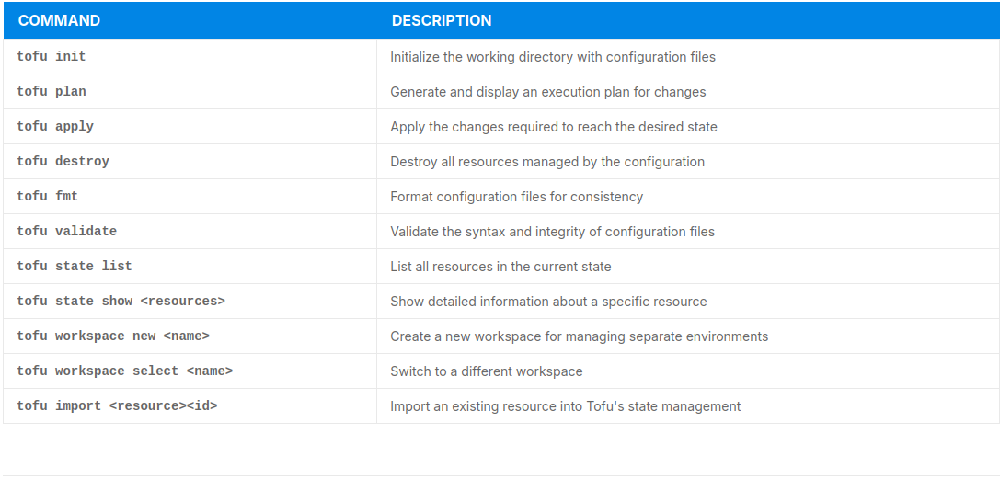

### LFEL1009 Getting started with OpenTofu

---

- Managing infrastructure can be complicated > in order to achieve consistency, its easier to define infrastructure as code- IaC. There are two ways to write it: declarative, where you describe the desired outcome, and imperative, where you list the steps to get there. 

- OpenTofu, simiral to Terraform.
- When provisioning the manual way face the following challenges: Human Error, Inconsistency, Scalability Issues, Time Consumption, Limited Agility. manual provisionin provides more hands-on contol over every step > but more  error prone. 

- Benefits of IaC: Consistency and Reliability, Automation and Efficiency, Version Control and Traceability, Scalability, Faster Recovery and Deployment, Cost efficiency.

---

- Declarative vs Imeperative Approaches: declarative also knows as functional and imperative (procedural) > boils down to what vs how. 

- Declarative: describes end state of the infrastructure. IaC tool determines how to make it happen. Simple and easy to use. It focuses on result, but keeps environments consistent since the tool handles the details automatically. But its harder to troubleshoot.

- Imperative: defines exact steps or commands to reach the desired state, with specific instructions. Gives more control over how tasks are done.

---

- OpenTofu: OpenTofu is an infrastructure as code tool that lets you define both cloud and on-prem resources in human-readable configuration files that you can version, reuse, and share. You can then use a consistent workflow to provision and manage all of your infrastructure throughout its lifecycle. OpenTofu can manage low-level components like compute, storage, and networking resources, as well as high-level components like DNS entries and SaaS features.

- OpenTofu > fork of Terraform due to different license. 

---

- **Installation**

- initial steps: 
```
1. Download the Installer script:

curl -fsSL https://get.opentofu.org/install-opentofu.sh -o install-opentofu.sh

2. Grant execute permissions and review the script:

chmod +x install-opentofu.sh && less install-opentofu.sh

3. Install using the script:

./install-opentofu.sh --install-method standalone
```

- **core workflow** 

1. Write: You define resources that may span multiple cloud providers and services. For example, you might create a configuration to deploy an application on virtual machines within a Virtual Private Cloud (VPC) network, complete with security groups and a load balancer.

2. Plan:  During the planning phase, OpenTofu generates a detailed execution plan outlining its specific infrastructure actions. This plan describes precisely which resources will be created, updated, or destroyed by comparing the current state of your infrastructure with the desired state defined in your configuration files. By providing this execution plan, OpenTofu allows you to review and understand all proposed changes before they are implemented, ensuring that the modifications align with your expectations and reducing the risk of unintended consequences.

3. Apply: Once you approve the execution plan, OpenTofu implements the proposed changes by performing the necessary operations in the correct sequence. It respects all resource dependencies to maintain the integrity of your infrastructure. This means that resources are created, updated, or destroyed in an order that ensures each resource is ready when another depends on it.


---

- **tofu CLI**: CLI for Opentofu, allows users to define, provision and manage cloud infrastructure resources in a consistent and automated manner. 

- Sample tofu commands: 



- OpenTofu works on a specific language. used for configuration files taht tell opentofu what to do, install plugins create infra resources like servers or networks and collecting essential data. Language lets us define how reseoruces depend on each other, so Opentofu knows which tasks take priority. We can create multiple similar resourse from a single block of code. 

```
#basic  elements of the language

<BLOCK TYPE> "<BLOCK LABEL>" "<BLOCK LABEL>" {
  # Block body
  <IDENTIFIER> = <EXPRESSION> # Argument
}
```
- blocks are used to group settings and represent an object, like a resource. each block has a specific type, can include labels for identification, contains body with arguments and other nested blocks. key-features are controlled via top-level blocks. 

- arguments are used inside blocks to assign specific values to names, defining settings for a resource or feature. 

- expressions represent values, either directly or by referencing or combining other values. they are use as values for arguments or within other expressions. 

- language is declarative > describe desired outcome. Order of blocks and how they're arranged in files doesn't matter much. Opentofu focuses on the relationships between resources (either defined directly or inferred).


---

- when using providers: check with the registy : https://github.com/opentofu

- OpenTofu’s command-line tool automatically downloads and installs the required providers. If you’re working on an existing setup and make changes to the provider configuration, you’ll need to reinitialize the project to update the installed providers and ensure everything works correctly.

Example: 
```
provider "aws" {
    region = "us-east-1"
}
```

- **resources**: fundamental elemts of the infra. building blocks that you can define in your config files to manage and interact with various services and platforms. Each resources corresponds to a specific object or service provided by cloud providers, SaaS platforms or other APIs.

- **resources**:  model real-world infrastructure objects such as vms, databases storage buckets, networking components and more. they are declared using simple and human-readable syndax in OpenTofu, typicall with a .tf extension. each resource block specifies the type of resource, its unique name within the configuration and its properties or settings. 

- example syntax: 
```
resource "<PROVIDER>_<TYPE>" "<NAME>{
  # Configuration arguments
}
```
- example:

```
resource "aws_instance" "web_server" {
  ami           = "ami-0c55b159cbfafe1f0"
  instance_type = "t2.micro"
  tags = {
    Name = "WebServer"
  }
}
```

---

- **state**: system to keep track of your infra, how connects to real-world resources. it enables OpenTofu to determine what changes are needed when updating your configs. 

- OpenTofu, saves the state in a local file called teraform.tfstate. but local storage can be challenging. It is recommended to use a remote state storage solution, such as **TACOS** (TF Automation and Collaboration Software). 

- State is important, as OT creates a new resource because of changes in the config, it records which resource it is so it can update or delete later if needed. 

- OT(OpenTofu) supports Amazon S3, Azure Blob, Google cloud storage, Consul, tacos, Alibaba cloud. 

---

- **Provisioninig Infrastructure with OpenTofu**: relies on 3 command, plan apply and destroy. all commands require initialized working directory and act only on the curently selected workspace. 

1. **tofu plan**: looks at your config to determine what you want your resources to look like. it compares desired state to what's actually in your current infra. Uses state data to match real-world resources with the ones youve declared and checks the current status of each resource using the provider's API. 

- After identification of differences, **tofu plan**: shows summary of the changes needed to reach your desired setup. it does not change your infrastructure, it provides a plan for what needs to be done. 

- we run tofu plan to validate our configs and ensure that the actions in proporses are what we expect. we can save the plan and use tofu apply later to make those exact changes to the infra. 

2. **tofu apply**: starts the same way as tofu plan. by figuring out what changes need to be made to your resources. It takes it further: **makes those changes using provider's API**. before any changes, conformation is required (unless skipped before).

- tofu apply creates a new plan before applying changes and shows it to you when asking for confirmation. OR we can give it a plan file what you previously created with tofu plan >> execute specific set of approved changes reliably. 

3. **tofu destroy**: deletes all resources managed in your current working directory and workspace. Uses state data to identify real-world objects that correspond to your managed resources. (also asks for permission before executing).

- tofu destroy removes every resource from your config file, then running tofu apply but with no need to edit the config. (used for provisioning similar resources in future)

---

#### **OPEN TOFU UNIQUE FEATURES** 

- **State Encryption**: begins with version 1.7, we can protect state file at rest using built-in encryption. Client-side state encryption, all encryption /decryption occurs localy before the state file is transmitted or stored. 

- there are different key-management options, depending on environment: 

```
    PBKDF2 – Password-based key derivation for simple local configurations
    AWS KMS – Use managed encryption keys in Amazon Web Services for centralized security
    GCP KMS – Leverage Google Cloud’s Key Management Service for enterprise-grade key handling
    OpenBao – Integrate with OpenBao (Vault-compatible) to manage secrets securely across distributed environments
```

- encryption affects access to our infrastructure state:  we can test disaster recovery plan, create temporary backup, back up encryption keys securely. 

- example: initialize OT config and encrypt state file with **AWS KMS**: 
```
tofu init
tofu state encrypt --key-provider="aws-kms://alias/my-tofu-key"
```

- **Early Variable and Local Evaluation**: since OT 1.8 we can use variables and locals in module source and version fields, evaluated early in the configuration lifecycle. (no need for hardcoded module sources), single variable update automatically propagates the change wherever it is used.

- **Provider Iteration with for_each**: since 1.9 we can use **for_each** to dynamically generate multiple provider configs. It improves maintainability and easy of use for multi-cloud/environment setups. 
- example: instead of writing individual provider blocks for each AWS region, we can use a simple loop to generate configurations for all required regions automatically. 

- **Selective resource exclusion with the exclude flag**: 1.9 version of OT,we can add the **-exclude** flag to selectively exclude specific resources from plan and apply operations. We can apply changes only where needed while leaving the rest of the infra untouched. minimizes risk and reduces blast radius during critical operations. 
- example:
```
# applying changes to configuration but skips updates to both the network module and the logs S3 bucket:

tofu apply -exclude="module.network" -exclude="aws_s3_bucket.logs"
```

---

- **Instalation**

- Ubuntu host. before installation always update and install tools needed: 
```
# initial commands
sudo apt-get update
sudo apt-get install -y apt-transport-https ca-certificates curl gnupg
curl -fsSL https://get.opentofu.org/install-opentofu.sh -o install-opentofu.sh
chmod +x install-opentofu.sh && ls -l install-opentofu.sh
less install-opentofu.sh
sudo ./install-opentofu.sh --install-method snap
tofu -h
tofu -install-autocomplete
```

- To initialize and create a local Resource
```
# in main.tf 
resource "local_file" "hello_world" {
filename = "${path.module}/demo.txt"
content = <<-EOF
Hello World!!!
Welcome to the fascinating world of OpenTofu!
EOF
}

tofu fmt
mkdir demo && mv main.tf demo/ && cd demo
tofu init
tofu validate
tofu plan
tofu apply
ls demo.txt && cat demo.txt
tofu destroy
ls demo.txt

```

- How to deploy it on EC2 VM on AWS 
```
1. Create a separate directory for storing your OpenTofu code:
mkdir newproject && cd newproject
2. Using the editor of your choice, create the file main.tf with the content below:
provider "aws" {
region = "us-east-1"
access_key = "xxxxxxxxxxxxxxxxxxxxxxx"
secret_key = "xxxxxxxxxxxxxxxxxxxxxxxx"
}
resource "aws_instance" "firstvm" {
ami = "ami-053b0d53c279acc90"
instance_type = "t2.micro"
subnet_id = "subnet-xxxxxxxxxx"
}

#define secret keys outside of codebase
export AWS_ACCESS_KEY_ID="your-access-key"
export AWS_SECRET_ACCESS_KEY="your-secret-key"


tofu fmt
tofu init
tofu plan
tofu apply
tofy destroy
```

---

