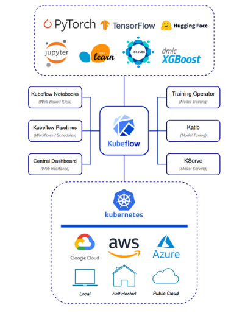

 # Introduction to AI/ML tools with KUBEFLOW

 - Link to documentation: https://www.kubeflow.org/docs/

 ## The Model Application Relationship and the Power of Reproducibility

 - Models and applications work to drive business outcomes. 

 - Model. What is it? Takes data as request and responds with prediction based on learned patterns. (prediction based on the its training experience). ex: recomendation engine.

 - When using recommendation model, the data inclues user interaction data (viewed, purchased or rated + demographic info, item attributes, as wel as contextua information.) Understanding user preferences and behaviour pattern. 

 - Predictions:is a response from the model to the application. often formated in JSON, tensor or arrays. in ML a prediction is the output generated by a model after it has been trained on a dataset and then provided with new unseen data. Nature of output varies significantly depending on the model type and the specific task. 

 - Prediction could be a category or label in a classification task, regression task- could be a continuous value. 

---

- **Types of Models**

- Different types of modules: 
1. Regression Model: for predicting continuous values (sales, forecasting or determinig price trends).
2. Classification Model: cathegorizing data into predefined classes, spam detection in emails or image recognition.
3. Clustering Models: identify inherent groups in data, which are helpful in market segmentation or ogranizing large data sets. 
4. Time-series models: analyzing time-ordered data to forecast future pints in the series: stock prices or weather predictions.
5. Dimensionality reduction models: used to simpplify data, reduce its complexity and retain essential feature, often used in data visualization.
6. Neural Networks: can learn comples patterns through laters of interconnected nodes, pivotal in deep learning applicaitons like language translation or autonomous vehicles. 

---

- **Models acts as the brain for the application**. The application uses the model's response to determine logical flow. The application's logic is implemented based on the context of the model's outputs. Instead of a developer hardcoding the desired inputs and outputs, the model learns patterns based on the data. The model tests itself on how well it learned a concept and improved its known patterns during the training process. 

---

- **Practice application**: application whose job is to determined if a picture is or is not a duck and then sort the duck images into a "book f ducks". 

- Without machine learning, sample code: 

```
// Pseudocode for Duck-or-not-duck image recognition

// define the main function

function isitADuck (image):
    // step 1 check for correct format
    if not isValidImageFormat(image):
    return "Error: Invalid image format. Please upload JPG or PNG."

    //step 2 analyze color spectrum of image
    predominantColors = analyzePredominantColors(image)
    if "yellow" not in predominantColors: 
    return "Probably not a duck. Ducks are often yellow."

    // step 3: look for shape of a beak
    if not detectShape(image, "beak"): 
    return "Probably not a duck. No beak detected"

    //step 4: check for webbed feet
    if not detectShape (image, "webbed feet"):
    return "Might be a duck, but can't confirm without seeing webbed feet."

    //step 5: analyze the image for a quacking sounds
    if detectSound (image,"quack")
    return "Definetely a duck. It quacks!"

    //step 6: ued advanced duck detection logic (experimental)
    if advandcedDuckDetectionAlgorithm(image): 
    return "Based on analysis, this is indeed a duck"

    //if all else fails
    return "Uncertain if this is a duck, Please consult with expert."
```

- that looping over with so many possibilities might be too hard to implement.

---

- Alternative approach: train a model to be automated version of a duck expert. Application asks a model "is this a duck?"

- In order to train a duck detection model: we need a dataset. ML experts spent time finding and curating data, to do so we need to manually label images of ducks as "duck" or "not_duck". Manual labeling is called human in the loop. 

- The model is only good as the data and the human's ability to develop valuable labels. Adjusting data to improve the model is data-centric approach to AI. 


- Approach of machine learning for Duck or not duck detection method in pseudocode. 

```
#step 1 prepare the labeled dataset

labeledData = loadDataset ("duck_image_dataset.csv")

# example dataset format: [image_path, label]
#label is either a "duck" or "not_duck"

#step 2 pre-process the data
preprocessedData = preprocessData(labeledData)
# preprocessing steps include resizing images, normalizing pixel values

#step 3: spli In at the dataset into training and testing 
set trainSet, testSet = splitDataset(preprocessedData, trainSize=0.8)

#step 4: Iitialize the machine learning model
# using convolutional neural network (CNN) suitable image classificaion.
model = initializeCNNModel()

#step 5: train model on the training set
trainModel (model. trainSet)

#step 6: Evaluate the model on the testing set to check its performance
evaluationResults = evaluateModel(odel, testSet)
print ("Model accuracy on test set: ", evaluationResults.accuracy)

#step 7 use trained model to predict new images function predictDuck(image):
preprocessedImage = preprocessedImage(image)
prediction = model.predict(preprocessedImage)
if prediction == "duck"
    return "This is a duck."
else: 
    return "This is not a duck."
```

---

- To create a book of duck photographs with the pictures we need an application. App will use the model to get an is_duck or not_duck response like any other function call, but then use that value to do something with the duck image.

```
{
    "prediction": "duck",
    "confidence": 0.95, 
    "message" : "This is a duck."
}
```

- prediction is the model's classification result, indicating that iage has been identified as a duck. 
- confidence: decimal value representing the model's confidence in its prediction ( on a scale from 0 to 1, where 1 is absolute certainty). 0.95 = 95%. 
- message provides human readable interpretation of the prediction.

---

- Pseudocode for an app calling a duck identification model. have dictionary for simplicity's sake, app will have the sorted pictures and can then build a online book or other outpt with those images. 

```
#step 1: load pre-trained duck indentification model 

model = loadmodel ("path to model")

#step 2: Define the path for input images

inputImagePath = "path to input images"

// Step 3: Process and predict each image in the input path
processImages(inputImagePath)

// Function to load the pre-trained model
function loadModel(modelPath):
    // Load and return the model from the specified path
    // This could involve deserializing the model file into a model object
      return model

// Function to process images in the specified path
function processImages(imagePath):
    // Retrieve a list of image files from the specified path
    imageFiles = getImageFiles(imagePath)

    // Loop through each image file
    for imageFile in imageFiles:
    // Load the image
    image = loadImage(imageFile)

    // Preprocess the image for the model
    preprocessedImage = preprocessImageForModel(image)

    // Predict if the image is a duck
    isDuck = predictDuck(preprocessedImage, model)

    // Initialize an empty dictionary to act as the fake "duck_book" object
    duck_book = {"duck": [], "not_duck": []}

    // Handle the prediction result
    if isDuck:
      print(imageFile + " is a duck.")
      duck_book["duck"].append(imageFile)
    else:
      print(imageFile + " is not a duck.")
      duck_book["not_duck"].append(imageFile)


```

- Unanswered questions: 
1. how does a model detect ducks if we did not explain to it what a duck is? 
2. does the model look for specific feather patterns, colors, beak size or plumage?
3. do we teach models to detect a duck the same way we teach humans? 

---

- **Deep Learning** the model in sue analyzes more abstract patterns and characterist through its layers. Each layer activates specific nodes at a certain magnitures to pass information onto the next layer. 

- The first layer is called input layer, and the final layer is the output layer. in Convolutional Neural Network (CNN), the initial layers may begn by detecting simple edges and textures. 

- Deeper layers combine initial findings into complex patterns, not recognizable to humans. Model learsn these feature during training by adjusting its internal parameters to reduce prediction errors, identifying combination of abstract patterns map to a duck. 

- Loss function is reduced through backpropagation and gradient descent to fnd a global minimum. network leverages te chain rule- > allows the model to generalize from the training data and accurately identify duck in new, unseen images, even if the specific appearance varies widely from the examples it was trained on. 

---

- Features concept: (specific case features-color of feathers shape of beak, size of duck)

---

- **Developing and Deployng duck classifier**. 

- Two main concepts stand out: reporoducibility and replicability. As well as how containerization can help support both. 

- **reporoducibility**: means using the same datase of duck/ non-duck images along with the identical model arhcitecture and parameters to achieve the same accuracy and performance metrics. 

- involves documention, training process and dataset used > so everyone can replicate our outcome. 

- **replicability**: testing with new, unseed datasets of bird images while maintaining the same model systems adn expecting similar performance levels. 

- challenges: sourcing relevant and varied data that accurately represent the broader applicatn context.

- **determinism**: any process or algo operate predictably, producing the same amoun of input every time. Determinism is crucial in contexts where reproducibility and consistency of results are essential, such as in safety-critical applications or when diagnosing issues and improving models.

- **conteinerizatin and reporoducibility**: our model needs to work all kinds of customer environments. Either by adopting a model registry like MLflow or utilizing object storage line MinIo. 

- **hashing**: ensures the integliry of build systems and safeguards agains compromise. 

---

### Model Development Lifecycle

---

- model development lifecycle is the journey from concept to development to retiring  a model. 

- first stage: problem defition and scoping stage. 

- Duck app problem definition: " We require a system that enables users to classify ducks in images easily without needing Avian biology or machine learning expertise. Although we possess a comprehensive dataset of bird images, we aim to direct users efficiently to specific information about ducks, including visual characteristics and species details, based on their queries. Our application requires an intuitive interface that doesn't demand users to learn complex query languages or undergo extensive training to use the application." 

- Data extraction Stage. Key factors: 

1. Access to Data
2. Data Gathering Methods
3. Volume of data
4. Data Freshness
5. Data Format and accessibility

- tools often use for ETL: Talend, Apache beam. 

- Data Analysis Stage. Key factors: 

1. Data Relevance
2. Feature Importance
3. Data Cleaning
4. Feature Engineering

- tools used: pandas, matplotlib, seaborn, notebooks

- Data Preparation Stage.  Key factors: 

1. Dataset Division 
2. Feature Selection and Clearning
3. Scaling and Encoding

- tools used: scikit-learn (python), pandas, tensorflow

- Model Training stage. Duck classifier: can be used with Pytorch. There are other supportted frameworks that are supported with Kubeflow. 

- Model Serving. Tools: Nvidia Triton interface server, TensorFlow Serving, Seldon Core Serving, Kserve.

- Model Monitoring: Prometheus.

---
### MLOPS AND Machine Learning Toolkits

- MLOPS was inspired by DevOps philosophies. ML engineering to be familiar with the model lifecycle and the automation required for stable model deployment. Main goal: stabilit and reproducibility. 

- CI/CD in MLOps: CI: generating and depoloying code efficiently by aboiding repetitive errors through rigorous testing. CD: adresses bug outages and enhances user satisfaction by deploying updates in manageable incremenetst to facilitate easy adjustments in case of production issues. 

- MLT- Machine learning Toolkit: Kubeflow. Flyte. These capabilities allow users to define, schedule, and monitor complex data and machine learning pipelines, ensuring that various steps in the model lifecycle are controlled and reproducible.

- MLOps Maturity levels: 
0. Manual process
1. Continuous Intergration
2. Continuous Delivery
3. Continuous Training
4. Full MLOps

---

### Kubeflow Intro

---

- Machine learning toolkit that aims to deploy workflow on Kubernetes in simple portable and scalable ways.  

- Kubeflow mission: composability, portability and scalability.

- Composability: ability to assemble and disassemble various workflow components quickly. 

- Portability: ml workflos are migratable and executable across and org's environments. 

- Scalability: current work and allocate additional compute resources  to accomodate new tasks. (dynamic allocation of resources)

- Technical advantage of Kubeflow: flexible and composable nature of kubeflow, allows it to remain neutral regarding tool choices.

---

- **Main components of Kubeflow**: Central Dashboard, Kubeflow Notebooks, Kubeflow Pipelines, Kaib and Training operator. 

- Diagram shows overview of Kubeflow architecture. K8s abstracts away the public clouds. 




---


- **K8s scaling kubeflow** :  Kubernetes provides a way to scale a cluster (the fleet of machines running your code) based on demand. If a node ( a single machine within your cluster) has no scheduled jobs, the autoscaler will remove the node from the cluster. A typical example is the need to provision GPU nodes for a particular machine-learning task. GPU nodes are expensive to run. A CPU node may cost $0.03398 / vCPU an hour, whereas adding GPU to that node could cost $0.35 per GPU per hour for a low-performance GPU. Teams want to ensure they don’t provide the cluster with expensive nodes only for them to remain idle. Kubernetes will schedule jobs to the node based on a resource request and remove the node from the cluster once the GPU-powered job is complete.


---

- **Kubeflow Cental Dashboard**: he Kubeflow Central Dashboard is a service that improves a team's capability to interface with the Kubeflow machine learning services. The dashboard enables teams to create notebooks, visualize experiments, see model endpoints, and more. The Kubeflow Central Dashboard can be exposed externally to the cluster so teams can access it via their browsers. Kubeflow has APIs for orchestration, yet many teams use the Kubeflow Central Dashboard as their initial user experience when interfacing with Kubeflow. The dashboard is very customizable should teams want to add additional application options for their end users. The Kubeflow Central Dashboard is namespaced, so end users only see what the platform team allows. The Kubernetes and Istio Role-Based Access Control functionality logically separate teams and controls service-to-service traffic via policies.


- **Kubeflow Notebooks**: Kubeflow Notebooks provide integrated development environments (IDEs) for teams to leverage. The notebooks can be Jupyter, RStudio, or VisualStudio Code servers by default, but you can customize the server images to fit your organizational needs and non-negotiables. The notebook graphical user interface (GUI) allows data teams to request resources and specific images for their specialized ML/AI tasks. Kubeflow, with the help of Kubernetes, will schedule the notebook server and expose it so the end user can leverage the IDE. Notebook servers are namespaced, but multiple team members can be allocated to a single namespace and collaborate on the same notebook server. Often, individuals have their namespaces while teams have separate collaborative ones. Since namespaces are merely logical barriers, teams must provision a different cluster if they want physical separation. The notebook servers also provide namespaced terminal access to the underlying Kubernetes cluster. Below is a screenshot of the Kubeflow Notebooks UI within the Kubeflow Dashboard. The UI contains options for launching a notebook, including notebook type, CPU/RAM settings, GPU settings, and options for defining data volumes.


- **Kubeflow Pipelines**: Kubeflow Pipelines (KFP) is the workflow orchestration tool for the Kubeflow project. Kubeflow pipelines are modular components connected to handle one or many machine-learning tasks. KFP enables teams to schedule jobs across their Kubeflow cluster. The pipelines are namespaced, and due to this feature, platform teams can use the Kubernetes resources quota functionality to restrict resource allocation across the cluster. Why are resource quotas essential to ML teams? Resource quotas help regulate the profitability of ML projects. Pipelines can scale very quickly and consume a lot of resources. This scaling often leads to teams facing an expensive cloud bill. The higher the cloud bill, the more valuable a model must be to ensure project profitability. Resource quotas create guardrails for model development teams, allowing teams to be more intentional when allocating resources to a specific project and improving the odds of project profitability.

KFP also provides a directed acyclic graph (DAG) to help troubleshoot and visualize pipeline runs. Below is a picture of a pipeline DAG. The arrows represent the logical flow of the pipeline from input to output.


- **Katib**: Katib is a Kubernetes-native project for automated machine learning or AutoML. AutoML is a field of artificial intelligence that focuses on automating the process of applying machine learning to real-world problems. Katib aims to make machine learning more accessible to non-experts and to improve efficiency for experienced practitioners. Katib is often considered a hyperparameter tuning solution but supports early stopping and neural architecture search (NAS). 


- **Training Operator**: The Kubeflow Training Operator, formerly the unified training operator, is a framework-agnostic way to submit training jobs to Kubeflow. The training operator allows you to use Kubernetes manifests to simplify job submissions. For instance, IT departments are no longer required to configure a Spark cluster manually on an as-needed basis. A data professional can directly submit a Kubeflow manifest, which automatically provisions a Spark cluster and submits the specified Spark job to this newly established cluster. The allocated resources from the completed job are then released, and the cluster can be scaled down. In the case of a static on-prem environment, we can ensure our cluster has as many resources as possible for other tenants.


--- 

### Kubefolow Distributions: Community support / vendor support

---

- Kubeflow is a machine learning toolkit that runs on Kubernetes. Kubernetes runs on infrastructure that may or may not run on a cloud. That infrastructure can be orchestrated by APIs that are subject to the lifecycle of the underlying orchestration software. Making sure all these moving parts run smoothly requires cross-functional expertise and support that organizations are willing to pay either internal or external teams to provide.

- The demand for support and expertise fuels vendors' efforts to offer resources to end users through paid contributors and build solutions that integrate other tools. Vendor support is ultimately good for the open source community. These vendors contribute on behalf of the organizations, paying them and pushing features based on customer business needs. Vendor contributors can support many customers simultaneously, especially when managing common vulnerabilities.

- Vendor contributors also gain experience from various customer environments, providing insight to the community on what directions may help the project. Customers can tap into a vendor’s expertise and resources when paying them for support. These vendors support open source communities by allocating their resources, such as subject matter experts (SMEs), support teams, and infrastructure, to contribute to project development. In return, these vendors charge their customers a fee to ensure their business's sustainability. Still, vendor contributors are just one type of contributor.

- Non-vendor organizations can decide whether to pay a vendor for support and contributions or hire an internal team to do so instead. Contributors not associated with a vendor contribute to a project in service to supporting their internal customers (in the case of Kubeflow, data scientists or MLEs) as part of an internally facing development team. This type of contributor may have other proprietary integrations or systems that require support; therefore, it's economically viable for their organization to pay a dedicated team to contribute to an open source project while supporting internal tooling. The tribal knowledge the team has of their open source solution’s integration with the organization's systems improves their ability to support internal teams and make specialized improvements to their tooling. Some of these improvements may make sense to push upstream, and others will remain internal to the organization. These contributors provide much-needed input to directly support an open source project and often push features based on their specific end-user needs. These features can then be leveraged across the community.

---

### Unified Training Operator and machine learning connection with k8s

---

- Before the introduction of Kubernetes, teams wishing to use TensorFlow would manually set it up on individual virtual machines (VMs) or physical servers. Configuring infrastructure involved manually configuring networking, installing dependencies, ensuring consistent environments across all nodes, and managing the starting and stopping of processes. Developers were responsible for ClusterSpecs for each TensorFlow deployment, consisting of a list of IP addresses and ports where different workers and parameter servers must be started. You can learn more about distributed TensorFlow before Kubernetes via this D2IQ blog post.

- With the introduction of Kubernetes, teams could improve TensorFlow deployments by scheduling pod clusters and bootstrapping them together (i.e., configuring the ClusterSpec). Kubernetes alleviates the previous complexity hurdles by allowing teams to quickly iterate on TensorFlow deployments and configure them from a centralized location, dramatically improving ML workloads' operationalization, portability, and scalability. No more logging into various remote servers to install dependencies, configure traffic, add new workers, or fix other misconfigurations.

- Kubernetes lets us do things like:

    Quickly redeploy newer versions of TensorFlow
    Upgrade previous TensorFlow runs
    Scale TensorFlow deployments
    Move TensorFlow deployments closer to data sources
    Pin workload dependencies
    Offload resource management from ML teams (i.e., volume provision, memory allocation, and GPU scheduling)

- ML teams can focus on the essential complexity of data-driven business problems instead of managing framework lifecycle and deployment patterns. Let’s inspect a Kubernetes Tensorflow deployment to understand better how this all worked.

- kubectly describe: 
```
 Controlled By: TFJob/dist-mnist-for-e2e-test
Containers:
  tensorflow:
    Container ID:   containerd://e8770b758346542f7284c7fa8db2410b156aea75bab11726d9fe0435a5455d99
    Image:      kubeflow/tf-dist-mnist-test:latest
    Image ID:   docker.io/kubeflow/tf-dist-mnist-test@sha256:9178e8b522e3d54f98bc4b041608f772e545fe70edb1afb1f388a7ed9a62d410
    Port:       2222/TCP
    Host Port:  0/TCP
    State:      Running
    Started:    Wed, 28 Feb 2024 04:16:09 +0000
    Ready:      True
    Restart Count: 0
    Environment:
    TF_CONFIG: {"cluster":{"ps":["dist-mnist-for-e2e-test-ps-0.christensenc3526.svc:2222","dist-mnist-for-e2e-test-ps-1.christensenc3526.svc:2222"],"worker":["dist-mnist-for-e2e-test-worker-0.christensenc3526.svc:2222","dist-mnist-for-e2e-test-worker-1.christensenc3526.svc:2222","dist-mnist-for-e2e-test-worker-2.christensenc3526.svc:2222","dist-mnist-for-e2e-test-worker-3.christensenc3526.svc:2222"]},"task":{"type":"ps","index":0},"environment":"cloud"}
    Mounts:

From the output, notice the environment variable configuration:

TF_CONFIG:
{"cluster":{"ps":["dist-mnist-for-e2e-test-ps-0.christensenc3526.svc:2222","dist-mnist-for-e2e-test-ps-1.christensenc3526.svc:2222"],"worker":["dist-mnist-for-e2e-test-worker-0.christensenc3526.svc:2222","dist-mnist-for-e2e-test-worker-1.christensenc3526.svc:2222","dist-mnist-for-e2e-test-worker-2.christensenc3526.svc:2222","dist-mnist-for-e2e-test-worker-3.christensenc3526.svc:2222"]},"task":{"type":"ps","index":0},"environment":"cloud"}

Specifically, the pod service details such as

dist-mnist-for-e2e-test-ps-1.christensenc3526.svc:2222

Continuing our story, let's look at the output from a kubectl get services | grep mnist command below:

dist-mnist-for-e2e-test-ps-0                          ClusterIP      None           <none>                                              2222/TCP                                              26h
dist-mnist-for-e2e-test-ps-1                          ClusterIP      None           <none>                                              2222/TCP                                              26h
dist-mnist-for-e2e-test-worker-0                      ClusterIP      None           <none>                                              2222/TCP                                              26h
dist-mnist-for-e2e-test-worker-1                      ClusterIP      None           <none>                                              2222/TCP                                              26h
dist-mnist-for-e2e-test-worker-2                      ClusterIP      None           <none>                                              2222/TCP                                              26h
dist-mnist-for-e2e-test-worker-3                      ClusterIP      None           <none>                                              2222/TCP                                              26h
```

- Using Kubernetes, we improved the orchestration of TensorFlow jobs by:

    Centralizing the configuration and orchestration of the TensorFlow framework
    Configuring pods that can be clustered and scheduled across any node
    Used services to ensure ingress and egress traffic
    Registered our services with KubeDNS
    Launched a TensorFlow job on the cluster

- These tasks may seem like quality-of-life changes, but Kubernetes is still a very involved solution. Working with Kubernetes means facing the inherent challenges of distributed systems, such as ensuring enough replicas, the pods are correctly configured, and the code is configured adequately within a pod’s containers.

- Beyond the Kubernetes resource configuration:

    Kubernetes requires specific node configurations for things like port availability
    The Kubernetes nodes have operating systems that may need support
    The Kubernetes nodes must be able to communicate with each other across the network
    Load balancers must be configured to handle ingress traffic

- Managing all this infrastructure involves understanding the nature of systems spread across multiple machines. Solutions such as Kubeadm, have abstracted away the deployment and management of core Kubernetes, but much of the complexity remains. 

---

