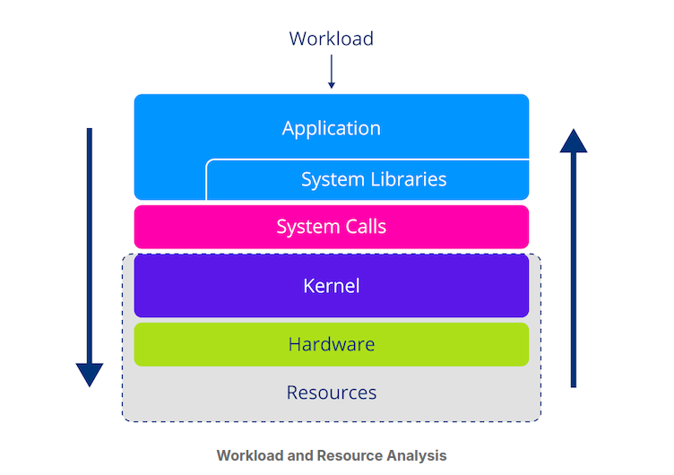
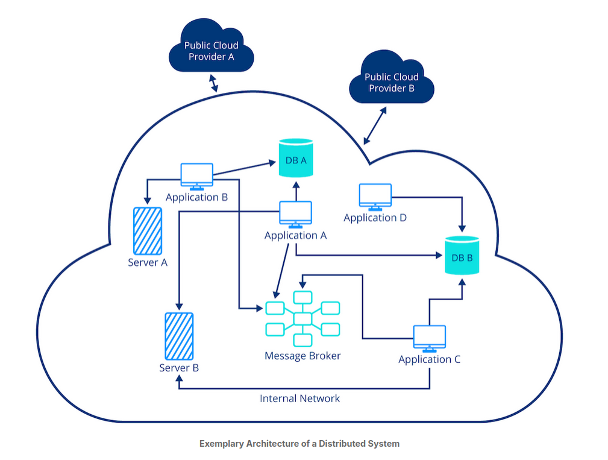
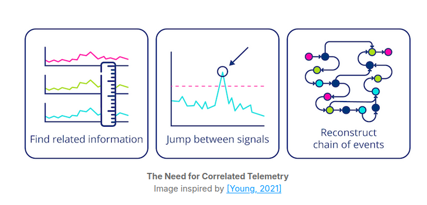

### Getting Started with OpenTelemetry- LFS148

----

- What is Observability? - is a measure of how well the internal states of a system can be inferred from knowledge of its external outputs. AKA how easy you can understand whats happenning inside a system. (application or service).

- Distributed system is a network of independent computers or nodes, working together to perform tasks as if they were a single system. Modern systems are used in conjuction with clod computing, where different parts of an application run on different servers to share resources and balance the workload. (in this situation observability becomes crucial).

- How to make a distributed system observable? Need to model its state in a way that lets us reason about its behaviour. The model is composed of three factors: 

1. Workload: the operations a system performs to fulfill its objectives, when a user send a request > distributed system breaks it down into smaller tasks handled by different services. Often called transactions
2. Software abstractions: provides the structure of the distributed system. This includes elements such as a load balancers, services, pods and containers and more.
3. Rerources: physical machines that provide the computational resources > RAM, CPU, HDD, network. 

- Workload and Resource Analysis: 

- Often app developers typically contentrate on workload-related aspects, where are operationas teams tend to look at physical resources.

- to Understand a system we must combine inssights from multiple angles and figure out how they relate to one another. This is done by a combinations of logs, metrics and traces. 

---

- **LOGS** what is a log? log is an append-only data structure that records events occuring in a system. Log entry consists of timestamp, message to describe details of the event. 

- There are different types of logs in terms of formatting, logs from http web-server are bound to look different from kernel logs. log formats also vary with consumers. Most common logs are key/value pairs to make them machine readable: known as structured logging. 

- **METRICS**: logs provide detailed information about indivicdual events. Metrics are high-level view of the current state of a system. 

- Metrics are single numerical value derived by applyin a stattistical measure to a group of events. They represent aggregate. Four common types of metrics: 
1. Counter
2. Gauge
3. Histogram
4. Summary

- **Traces**: In a distributed environment, we need to understand the chain of events in a system. in distributed setting we can not track back traces to a single line of code, Google developed Dapper, popularized concept of distributed tracing. Tracing is logging on steroieds. 

- Example of a distributed system: 

---

- Traces, logs and metrics are the three pillars of Observability. Observability- process of automatically collecting and transmitting data from remote or distributed systems to monitor, measure and track the performance or status of those systems. 

-  logs, metrics, and traces share many similarities in their lifecycle and components. Everything starts with instrumentation that captures and emits data. The data has to have a specific structure defined by a format. Then, we need a mechanism to collect and forward a piece of telemetry. Often, there is some kind of agent to further enrich, process, and batch data before ingesting it in a backend. This process typically involves a database to efficiently store, index, and search large volumes of data. Finally, there is a frontend analysis to make the data accessible to the end-user. However, in practice, we develop dedicated systems for each type of telemetry, and for good reason: Each telemetry signal poses its own unique technical challenge. These challenges are mainly due to the different natures of the data. 

- Breakdown of the pillars of observability:

1. There are different categories of telemetry
2. Each pillar has its own unique strengths and stands on its own
3. Pillars are complementary and must be combined to form a stable foundation for achieving observability

---

- **Siloed Telemetry vs Non-Siloed Telemetry**

- traditional tracking systems, lack the mechanisms to reconstruct the chain of events. some also do not support standartized query language or interfaces to search and analyze logs effectively. 

- Lack of instrumentation standard leads to low quality data.
- Observability usually has high barrier for entry. 

---

- **OpenTelemetry TLDR**

- OTel- FOSS designed to provide unified telemetry, vendor-neutrality and to be cross-platform. 
- Otel is not all in one monitoring tool, not a data storage or dashboard solution. not a pre-configured monitoring tool, nor performance optimizer. 

---

**OTEL Signal Specification(language agnostic)**

- Otel is organized into signals, which include tracing, metrics and logging. every signal is develped as standalone component. 

- There are 3 aspects of them: 

1. Definiton of terms, to establish a common vocabulary and shared understanding. 
2. API specification: 
- defines (conceptual) interfaces that implementations must adhere to
- ensures that implementations are compatible with each other
- includes the methods that can be used to generate, process, and export telemetry data
3. SDK specification: 
- guide for developers
- defines requirements that a langauge- specific implementation of the API must meet to be compliant.
- concept of configuration processing and exporting telemetry data. 

- Also Otel defines semantic conventions and OTel protocol.