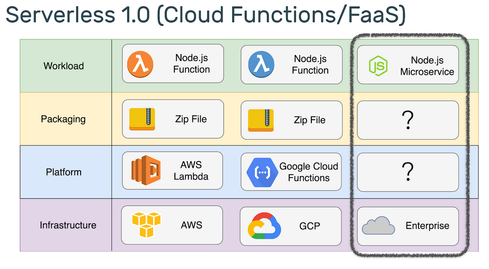
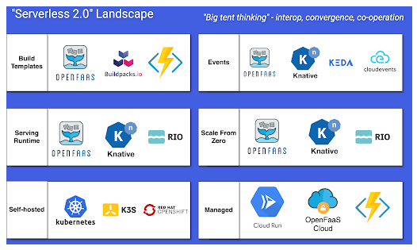
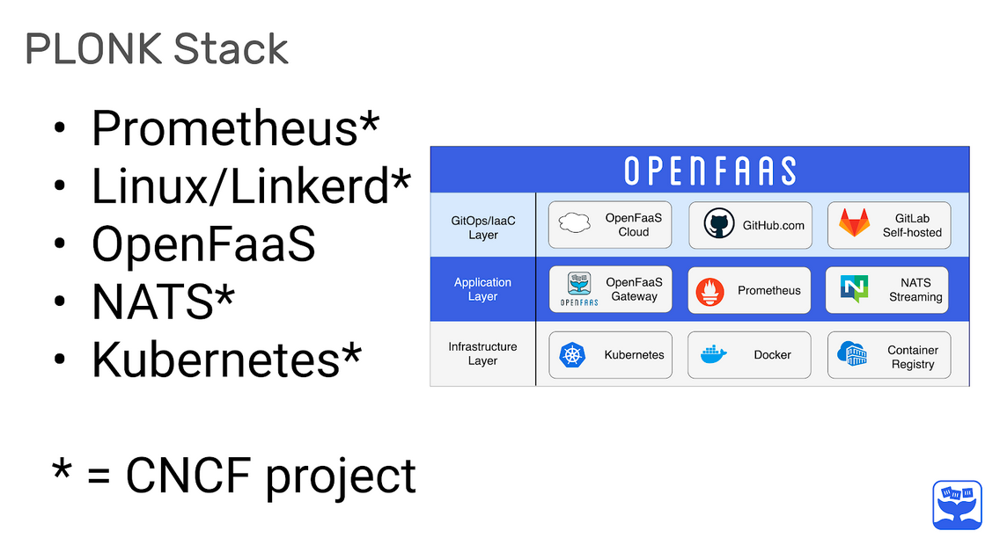
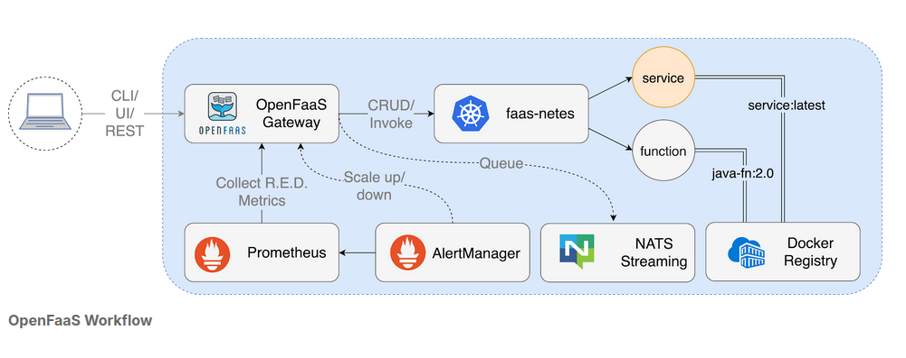
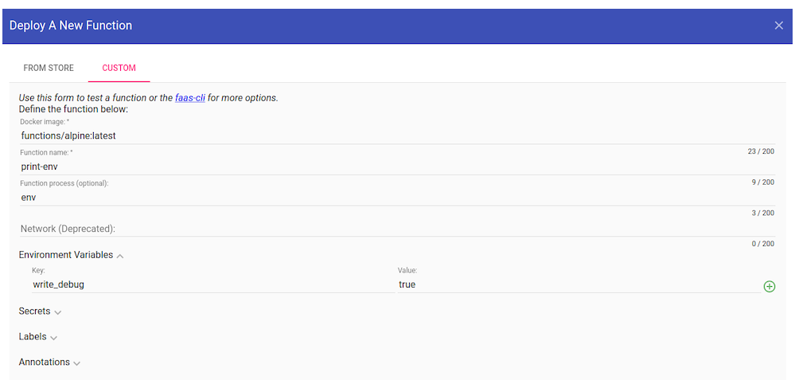

# LFS 157 Introduction to Serverless on Kubernetes

-----

### Introduction to Serverless. 


- **What is Serverless?**: There are 2 approaches of the term. One is FaaS- Fucntion as a service and Serverless. 

- Serverless is an abstract term, it refers to the experience a user or customer has and represents a continuum of how close one needs to work with hardware and infrastructure. 


- As we move on the axis we see that along with a decreasin convern for infrastructure, there is also a decomposition of the workload and a reduction it its size. Serveless is an approach and architectural pattern, FaaS, providing a concrete way to apply the technology and ideals. 

- Characteristics of Functions:
1. Allow the developer to focus on code rather than infrastructure and deployment artifacts. 
2. Create smaller artifacts and fewer lines of code because they have fewer responsibilities. 
3. They can be either event-driven (triggered by adatabase, object sore, pub-sub) or deployed as REST endpoints and accessed via HTTP. 
4. They are easy to manage because they do not rely of underlying storage. 
5. They are isomorphic- meaning that each fucntion has to conform to a given runtime interface. 

---

- **Serverless Platforms**: serveless platform is responsible for auto-scaling, which are divided into 2 forms:

1. Scaling functions down to save costs and reduce load on the system when functions are idle. Not all platforms support scaling to zero and scaling backfrom zero replicas tends to involve a latency penalty called-> "cold-start" as the code is re-deployed or re-initialized. 

2. Scaling up functions proprtially as demand on a particular endpoint increases. 

- **NB!** that developers should care less about infrastructure, and write small blocks of code that are easy to deploy..

---

### State of Serverless of CNCF

---

- CNCF splits into offerings: which can be istalled and operated on a cluster and offerings which are hosted as a SaaS product. 

- Smallest primitive for workloads in k8s is the Pod, which can be made up of one or more containers- such as the main workload and then a helper, such as proxy or a log collector. The pod loads the code and the user-space from a container image which is sotred in a container registry. 

- to access Pods within a cluster, various k8s networking primiteves come intoplay, such as a Service, load balancer and igress. 

- bare essentials for serverless on k8s are :

1. Container image with function code or an executable inside.
2. Registry to host the conytainer image. 
3. A Pod to run the container image. 
4. A Service to access the Pod. 

- Projects may add components on top of this stack, such as a UI, and API gateway, Ingress automation, auto-scaling, APIs and many more. 

--- 

- **Serverless 1.0 vs Serverless 2.0**

- **Serverless 1.0**: cloud vendors create independent products without concern of portability or migrating between products. Moving AWS lambda to Azure function: would include: reworking he signature, different way zip file is structured, difference in manageged services accessibility, ability zones, regions and limittation to RAM and functions. 



- **Serverless 2.0**: workloads are far more portable than 1.0. Is stored in an OCI-compatible container image. Exposes an HTTP server on port 8080.Can be configured with environment variables. 

- Below is example of Serverless 2.0 projects



----

- **OpenFaaS**: created so developers could use their own hardware to run functions using Docker Containers. It has: 
1. Buld Templates
2. Serving runtime
3. Events
4. Scale from Zero
5. Managed

- tagline of OpenFaaS is “Serverless Functions Made Simple”. 

- **PLONK**: Prometheus, Linux, OpenFaaS, NATS and Kubernetes are combined, we get the PLONK stack, much like LAMP (Linux, Apache, MySQL, and PHP) or JAM (JavaScript APIs Markdown).




- In order to have the Plonk stack requires Conteiner Registry and Container Runtime such as Docker or Containerd.

- **PLONK INFRASTRUCTURE LAYER**: 
1. Docker provides a packaging image format, which is portable between clouds. 
2. Container registry holds each version of our function, meaning that we can version it and benefit from distribution, security scanning and mary other features from other CNCF projects like Harbor Registry. 
3. Kubernetes- provides the control plane to turn our function: adding fail-over, High availability scale-out and secret management. 

- **PLONK APPLICATION LAYER**: 
1. OpenFaaS Gateway- is similar to a reverse proxy like Nginx, kong or Caddy. Main job- to expose and manage containers running our functions. It does have its own REST API and can be automated. Popular client is -faas-cli. 
2. Prometheus-  for metrics and instumentation. used for understanding health and performance.Alert manager is used to fire off alerts to notify. 
3. NATS- provides a way to queue up requests and defer them to a later execution. 


-**PLONK GitOps Layer/IaaC LAYER**- Github- to build and deploy functions using its  Travis integration or its own Github action and container registy. GitLab- full suite of tools that can create pipelines. 

----

- **Conceptual Architecture for OpenFaaS**



- Application layer to show all components working together. Each function is a Docker image, which means it needs a name and a tag. The tag can be used for version control with semver. One of the endpoints si a service, which goes to show that microservices and function can co-exist and work well together with Serverless. 

- Interaction with OpenFaaS happens through REST API, metrics will be available through Prometheus. 

- Core functionality provided by OpenFaaS Gateway: 
1. Create, list, update and delete functions.
2. Scale function replicas. 
3. Invoke a function.
4. Query health, metrics, and scaling status of functions.
5. Create, list and delete secrets
6. View logs from functions.
7. Queue-up asynchronous requests.

- Three ways of interactin with the REST API tend to be: 
1. Using CLI (faas-cli)
2. Using the built-in UI
3. Via rest API directly from application or via cURL.

----

- **Events, Triggers and Invocations**: All communication within OpenFaaS happens over HTTP using rest. It is poweful when coupled with events and triggers. 

- A trigger is a way to invoke a function, with a simple HTTP call being the simplest option. Most OpenFaaS are built with the connector-sdk, open source add-on that lets developers write connectors between an even source and functions.

- Triggers include: 
1. Apache Kafka- pub/sub system used by enterprise companies.
2. cron- time-based invocation
3. SQS- trigger via AWS SQS
4. NATS- a high-speed messaging CNCF project
5. Minio- an open source S3 replacement and object store
6. RabbitMQ- traditional message queue
7. MQTT- pub/sub system ofter used with IOT devices. 


----

### Setting up Kubermetes and OpenFaaS

- Preffered way to deploy OpenFaaS is deploying it to k8s. either locally via cluster on the laptop or a cloud managed service. 

- There is a lightweight and portable option named **faasd**- https://github.com/openfaas/faasd

- Using cloud Kubernetes service pros and cons: 
- Pros: 
1. Low overhead
2. Integration with cloud services
- Cons:
1. Cost per node in the cluster
2. Cost for the cluster control plane (aws and gcp have cost/ Azure does not for the free tier).

- experimentation candidates: Azure, faasd.

- Suing cluster locally pros and cons:
- Pros:
1. Fastest.
2. Possibly Free
- Cons:
1. Computer slowdown
2. Battery drain
3. No public IP unless tunel is used (https://inlets.dev/)

- Course recoomendadion: cloud k8s services. If domain is owned ( we can add TLS to the functions). Minimum requirements - Public cloud cluster with 2-3 nodes with 2-4GB RAM and 2vCPUs on each node.

- For local Clusters : minikube, Docker Desktop, Microk8s, k3d(uses k3s).

---

- **Helm and adkade**

- Configuration files for a k8s application are distributed as a set of static YAML files. Having static files makes customization and distribution hard > hence Helm and Kustomize. 

- **Helm**: Can publish their own set of configuration for their application- caled Cahart, that can be discovered, istalled and updgraded and a managed with helo or third-party automation tools. Biggest difference over static YAML files is that can be fine-tuned.

- Fine tunig Helm chart- what domain name to use, or what the maximum timeout is fot an http microservice. They can be customezed with **values.yaml** file or by passing in the --set key=value flag to the helm install or upgrade command.

- **EXAMPLE  OF HELM COMMANDS, IF YOU RUN > BIG KABOOM, TRUST**

- Helm 3, add chart to repo, update local index

```
helm repo add stable ht‌tps://kubernetes-charts.storage.googleapis.com

helm repo update

```

- install chart, pass in values. yaml or overrite each option with --set such as **persistence.enabled=false** which turns off permanent storage requests for Postgresql. 

````
helm upgrade --install postgresql stable/postgresql --set persistence.enabled=false
```` 

- Charts can be removed with: 

```
helm delete postgresql

```

------

- **arkade** : CLI, written in Go provides seris of apps , kubernetes-dashboard, istio, OpenFas, Postgesql, cert-manage, mongoDB. 

- to install: 
```
curl -sLS ht‌tps://get.arkade.dev | sudo sh
arkade --help
```

- each app has available flags, they can be used with --help
```
arkade install --help
```

- to get further information:
```
arkade install openfaas --help
```

- with such options we can configure whether there is a a loadbalancer in use (--load-balancer) or if we want 1 replica of the OpenFaas Gateway (--gateways 1) or several (--gateways N)

- arkade provides application to obtain HTTPS certificates, such as openfaas-ingress app. 
```
arkade install openfaas-ingress --help
```

---

- **Deployment Steps**

- if there is no Helm3 installed, OpenFaaS will download it automatically for you. 

```
arkade instal openfaas
```

- after installation the following steps should be followed: 

```
# Get the faas-cli
curl -SLsf ht‌‌tps://cli.openfaas.com | sudo sh

# Forward the gateway to your machine
kubectl rollout status -n openfaas deploy/gateway
kubectl port-forward -n openfaas svc/gateway 8080:8080 &

# If basic auth is enabled, you can now log into your gateway:
PASSWORD=$(kubectl get secret -n openfaas basic-auth -o
jsonpath="{.data.basic-auth-password}" | base64 --decode; echo)
echo -n $PASSWORD | faas-cli login --username admin --password-stdin

faas-cli store deploy figlet
faas-cli list

```

----

### OpenFaaS Featues

- **Gateway UI** we can access the passwords and port-forwarding command at any time with **arkade info openfaas**. 

- to obrain auto-generated password to log in: **arkade info openfaas**. Under  # If basic auth is enabled, you can now log into your gateway: -> are the command to assing password to an environment variable and log in from the CLI. 

- to seet PASSWORD environment variable:
```
PASSWORD=$(kubectl get secret -n openfaas basic-auth -o jsonpath="{.data.basic-auth-password}" | base64 --decode; echo)
```
- then echo it in the terminal to view passwords **echo $PASSWORD**.

- Copy pass, open UI, navigate to ht‌tp://127.0.0.1:8080 (its ok to be HTTP instead of HTTPS- port-forwarding command runs over encrypted connection)

- Then User- Admin and the password from before to log in. Password can be changed at any time. we can also use OpenID connect, available separately. 

- Gateway landing. (OpenFaas- one of rare projects that provide UI). 

- **Deploy new function**: then on search, look for **certinfo**, deploy certinfo- > it is used to check when a TLS certificate will expire. 

- **Invoking a fucntion**: enter a domain and **INVOKE**, it will be gray until the function has been downaloade from a container registy and started in a k8s cluster. 

- **custom tab**: need to delete any fields that are visible and copy infor as example. Once deployed, the fucntion will execute the bash command **env** and priint out all the environment variables in the container.




-----

- **Print Environment Variables**: -write_debug environment variable is read back. This function can be useful for debugging the container environments and even shows taht even a bash command can operate as a function. we can copy the above with the function **alpine/function:latest** and change the **fprocess** to execute a different command. 

- To add a function that runs the cal command and print a calender with name **print-cal**. 

```
curl -sL ht‌tp://127.0.0.1:8080/function/print-cal
```

- Ready/Not ready field: Long wait time in Not ready can imply the following: 
1. large container image, 
2. image not pushed to a container registy
3. node does not have enough disk space for the container image
4. run out of RAM in my cluster
5. code is crashing when starting.


- URL: can be used to copy and open fucnton in a browser or invode it using curl

- image: shows Docker image, and tag being used. can check which version of a function has been deployed.

- Invocation count: global count of invocations read from the pre-build Prometheus time-series. 

- Each function can be deleted asynchronously > it takes time to dissapear. 

----

- **CLI**: the cli for OpenFaaS (faas-cli) > written in Goland and acts as a HTTP client tothe OpenFaas Gatetway component. 

```
# to get help with cli

faas-cli --help

# Search and deploy pre-made functions from the Function Store or find a function template for your specific language:

    faas-cli store list/deploy
    faas-cli template store list/pull

# Create, build, and publish a function followed by deploying it to your cluster:

    faas-cli new
    faas-cli build
    faas-cli push
    faas-cli deploy

# List, inspect, invoke, and troubleshoot your functions:

    faas-cli list
    faas-cli describe
    faas-cli invoke
    faas-cli logs

# Authenticate to the CLI, and create secrets for your functions:

    faas-cli login
    faas-cli secret
```

---

