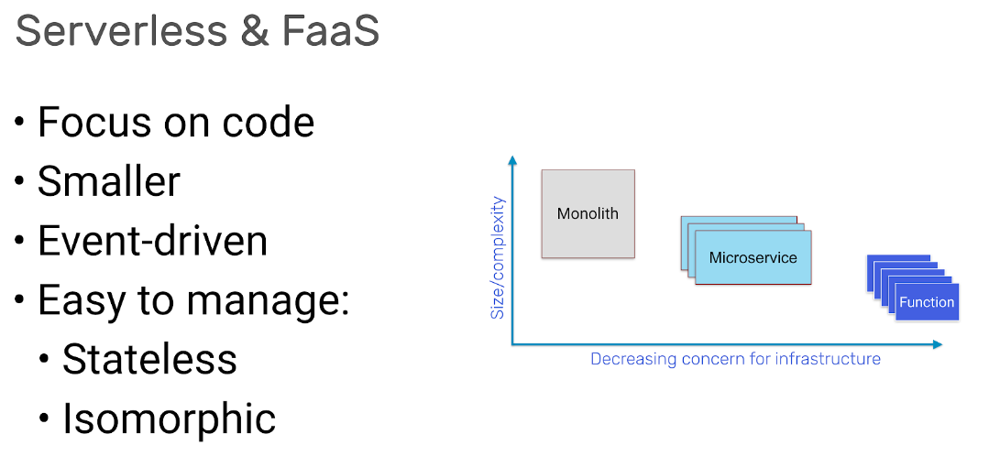

# LFS 157 Introduction to Serverless on Kubernetes

-----

### Introduction to Serverless. 


- **What is Serverless?**: There are 2 approaches of the term. One is FaaS- Fucntion as a service and Serverless. 

- Serverless is an abstract term, it refers to the experience a user or customer has and represents a continuum of how close one needs to work with hardware and infrastructure. 



- As we move on the axis we see that along with a decreasin convern for infrastructure, there is also a decomposition of the workload and a reduction it its size. Serveless is an approach and architectural pattern, FaaS, providing a concrete way to apply the technology and ideals. 

- Characteristics of Functions:
1. Allow the developer to focus on code rather than infrastructure and deployment artifacts. 
2. Create smaller artifacts and fewer lines of code because they have fewer responsibilities. 
3. They can be either event-driven (triggered by adatabase, object sore, pub-sub) or deployed as REST endpoints and accessed via HTTP. 
4. They are easy to manage because they do not rely of underlying storage. 
5. They are isomorphic- meaning that each fucntion has to conform to a given runtime interface. 

---

- **Serverless Platforms**: serveless platform is responsible for auto-scaling, which are divided into 2 forms:

1. Scaling functions down to save costs and reduce load on the system when functions are idle. Not all platforms support scaling to zero and scaling backfrom zero replicas tends to involve a latency penalty called-> "cold-start" as the code is re-deployed or re-initialized. 

2. Scaling up functions proprtially as demand on a particular endpoint increases. 

- **NB!** that developers should care less about infrastructure, and write small blocks of code that are easy to deploy..

---

### State of Serverless of CNCF

---

- CNCF splits into offerings: which can be istalled and operated on a cluster and offerings which are hosted as a SaaS product. 

- Smallest primitive for workloads in k8s is the Pod, which can be made up of one or more containers- such as the main workload and then a helper, such as proxy or a log collector. The pod loads the code and the user-space from a container image which is sotred in a container registry. 

- to access Pods within a cluster, various k8s networking primiteves come intoplay, such as a Service, load balancer and igress. 

- bare essentials for serverless on k8s are :

1. Container image with function code or an executable inside.
2. Registry to host the conytainer image. 
3. A Pod to run the container image. 
4. A Service to access the Pod. 

- Projects may add components on top of this stack, such as a UI, and API gateway, Ingress automation, auto-scaling, APIs and many more. 

--- 

- **Serverless 1.0 vs Serverless 2.0**

- **Serverless 1.0**: cloud vendors create independent products without concern of portability or migrating between products. Moving AWS lambda to Azure function: would include: reworking he signature, different way zip file is structured, difference in manageged services accessibility, ability zones, regions and limittation to RAM and functions. 


- **Serverless 2.0**: workloads are far more portable than 1.0. Is stored in an OCI-compatible container image. Exposes an HTTP server on port 8080.Can be configured with environment variables. 

- Below is example of Serverless 2.0 projects


----

- **OpenFaaS**: created so developers could use their own hardware to run functions using Docker Containers. It has: 
1. Buld Templates
2. Serving runtime
3. Events
4. Scale from Zero
5. Managed

- tagline of OpenFaaS is “Serverless Functions Made Simple”. 

- **PLONK**: Prometheus, Linux, OpenFaaS, NATS and Kubernetes are combined, we get the PLONK stack, much like LAMP (Linux, Apache, MySQL, and PHP) or JAM (JavaScript APIs Markdown).


- In order to have the Plonk stack requires Conteiner Registry and Container Runtime such as Docker or Containerd.

- **PLONK INFRASTRUCTURE LAYER**: 
1. Docker provides a packaging image format, which is portable between clouds. 
2. Container registry holds each version of our function, meaning that we can version it and benefit from distribution, security scanning and mary other features from other CNCF projects like Harbor Registry. 
3. Kubernetes- provides the control plane to turn our function: adding fail-over, High availability scale-out and secret management. 

- **PLONK APPLICATION LAYER**: 
1. OpenFaaS Gateway- is similar to a reverse proxy like Nginx, kong or Caddy. Main job- to expose and manage containers running our functions. It does have its own REST API and can be automated. Popular client is -faas-cli. 
2. Prometheus-  for metrics and instumentation. used for understanding health and performance.Alert manager is used to fire off alerts to notify. 
3. NATS- provides a way to queue up requests and defer them to a later execution. 


-**PLONK GitOps Layer/IaaC LAYER**- Github- to build and deploy functions using its  Travis integration or its own Github action and container registy. GitLab- full suite of tools that can create pipelines. 

----

- **Conceptual Architecture for OpenFaaS**


- Application layer to show all components working together. Each function is a Docker image, which means it needs a name and a tag. The tag can be used for version control with semver. One of the endpoints si a service, which goes to show that microservices and function can co-exist and work well together with Serverless. 

- Interaction with OpenFaaS happens through REST API, metrics will be available through Prometheus. 

- Core functionality provided by OpenFaaS Gateway: 
1. Create, list, update and delete functions.
2. Scale function replicas. 
3. Invoke a function.
4. Query health, metrics, and scaling status of functions.
5. Create, list and delete secrets
6. View logs from functions.
7. Queue-up asynchronous requests.

- Three ways of interactin with the REST API tend to be: 
1. Using CLI (faas-cli)
2. Using the built-in UI
3. Via rest API directly from application or via cURL.

----

- **Events, Triggers and Invocations**: All communication within OpenFaaS happens over HTTP using rest. It is poweful when coupled with events and triggers. 

- A trigger is a way to invoke a function, with a simple HTTP call being the simplest option. Most OpenFaaS are built with the connector-sdk, open source add-on that lets developers write connectors between an even source and functions.

- Triggers include: 
1. Apache Kafka- pub/sub system used by enterprise companies.
2. cron- time-based invocation
3. SQS- trigger via AWS SQS
4. NATS- a high-speed messaging CNCF project
5. Minio- an open source S3 replacement and object store
6. RabbitMQ- traditional message queue
7. MQTT- pub/sub system ofter used with IOT devices. 


----

### Setting up Kubermetes and OpenFaaS

- Preffered way to deploy OpenFaaS is deploying it to k8s. either locally via cluster on the laptop or a cloud managed service. 

- There is a lightweight and portable option named **faasd**- https://github.com/openfaas/faasd

- Using cloud Kubernetes service pros and cons: 
- Pros: 
1. Low overhead
2. Integration with cloud services
- Cons:
1. Cost per node in the cluster
2. Cost for the cluster control plane (aws and gcp have cost/ Azure does not for the free tier).

- experimentation candidates: Azure, faasd.

- Suing cluster locally pros and cons:
- Pros:
1. Fastest.
2. Possibly Free
- Cons:
1. Computer slowdown
2. Battery drain
3. No public IP unless tunel is used (https://inlets.dev/)

- Course recoomendadion: cloud k8s services. If domain is owned ( we can add TLS to the functions). Minimum requirements - Public cloud cluster with 2-3 nodes with 2-4GB RAM and 2vCPUs on each node.

- For local Clusters : minikube, Docker Desktop, Microk8s, k3d(uses k3s).

---

- **Helm and adkade**

- Configuration files for a k8s application are distributed as a set of static YAML files. Having static files makes customization and distribution hard > hence Helm and Kustomize. 

- **Helm**: Can publish their own set of configuration for their application- caled Cahart, that can be discovered, istalled and updgraded and a managed with helo or third-party automation tools. Biggest difference over static YAML files is that can be fine-tuned.

- Fine tunig Helm chart- what domain name to use, or what the maximum timeout is fot an http microservice. They can be customezed with **values.yaml** file or by passing in the --set key=value flag to the helm install or upgrade command.

- **EXAMPLE  OF HELM COMMANDS, IF YOU RUN > BIG KABOOM, TRUST**

- Helm 3, add chart to repo, update local index

```
helm repo add stable ht‌tps://kubernetes-charts.storage.googleapis.com

helm repo update

```

- install chart, pass in values. yaml or overrite each option with --set such as **persistence.enabled=false** which turns off permanent storage requests for Postgresql. 

````
helm upgrade --install postgresql stable/postgresql --set persistence.enabled=false
```` 

- Charts can be removed with: 

```
helm delete postgresql

```

------

- **arkade** : CLI, written in Go provides seris of apps , kubernetes-dashboard, istio, OpenFas, Postgesql, cert-manage, mongoDB. 

- to install: 
```
curl -sLS ht‌tps://get.arkade.dev | sudo sh
arkade --help
```

- each app has available flags, they can be used with --help
```
arkade install --help
```

- to get further information:
```
arkade install openfaas --help
```

- with such options we can configure whether there is a a loadbalancer in use (--load-balancer) or if we want 1 replica of the OpenFaas Gateway (--gateways 1) or several (--gateways N)

- arkade provides application to obtain HTTPS certificates, such as openfaas-ingress app. 
```
arkade install openfaas-ingress --help
```

---

- **Deployment Steps**

- if there is no Helm3 installed, OpenFaaS will download it automatically for you. 

```
arkade instal openfaas
```

- after installation the following steps should be followed: 

```
# Get the faas-cli
curl -SLsf ht‌‌tps://cli.openfaas.com | sudo sh

# Forward the gateway to your machine
kubectl rollout status -n openfaas deploy/gateway
kubectl port-forward -n openfaas svc/gateway 8080:8080 &

# If basic auth is enabled, you can now log into your gateway:
PASSWORD=$(kubectl get secret -n openfaas basic-auth -o
jsonpath="{.data.basic-auth-password}" | base64 --decode; echo)
echo -n $PASSWORD | faas-cli login --username admin --password-stdin

faas-cli store deploy figlet
faas-cli list

```

----

### OpenFaaS Featues

- **Gateway UI** we can access the passwords and port-forwarding command at any time with **arkade info openfaas**. 

- to obrain auto-generated password to log in: **arkade info openfaas**. Under  # If basic auth is enabled, you can now log into your gateway: -> are the command to assing password to an environment variable and log in from the CLI. 

- to seet PASSWORD environment variable:
```
PASSWORD=$(kubectl get secret -n openfaas basic-auth -o jsonpath="{.data.basic-auth-password}" | base64 --decode; echo)
```
- then echo it in the terminal to view passwords **echo $PASSWORD**.

- Copy pass, open UI, navigate to ht‌tp://127.0.0.1:8080 (its ok to be HTTP instead of HTTPS- port-forwarding command runs over encrypted connection)

- Then User- Admin and the password from before to log in. Password can be changed at any time. we can also use OpenID connect, available separately. 

- Gateway landing. (OpenFaas- one of rare projects that provide UI). 

- **Deploy new function**: then on search, look for **certinfo**, deploy certinfo- > it is used to check when a TLS certificate will expire. 

- **Invoking a fucntion**: enter a domain and **INVOKE**, it will be gray until the function has been downaloade from a container registy and started in a k8s cluster. 

- **custom tab**: need to delete any fields that are visible and copy infor as example. Once deployed, the fucntion will execute the bash command **env** and priint out all the environment variables in the container.


-----

- **Print Environment Variables**: -write_debug environment variable is read back. This function can be useful for debugging the container environments and even shows taht even a bash command can operate as a function. we can copy the above with the function **alpine/function:latest** and change the **fprocess** to execute a different command. 

- To add a function that runs the cal command and print a calender with name **print-cal**. 

```
curl -sL ht‌tp://127.0.0.1:8080/function/print-cal
```

- Ready/Not ready field: Long wait time in Not ready can imply the following: 
1. large container image, 
2. image not pushed to a container registy
3. node does not have enough disk space for the container image
4. run out of RAM in my cluster
5. code is crashing when starting.


- URL: can be used to copy and open fucnton in a browser or invode it using curl

- image: shows Docker image, and tag being used. can check which version of a function has been deployed.

- Invocation count: global count of invocations read from the pre-build Prometheus time-series. 

- Each function can be deleted asynchronously > it takes time to dissapear. 

----

- **CLI**: the cli for OpenFaaS (faas-cli) > written in Goland and acts as a HTTP client tothe OpenFaas Gatetway component. 

```
# to get help with cli

faas-cli --help

# Search and deploy pre-made functions from the Function Store or find a function template for your specific language:

    faas-cli store list/deploy
    faas-cli template store list/pull

# Create, build, and publish a function followed by deploying it to your cluster:

    faas-cli new
    faas-cli build
    faas-cli push
    faas-cli deploy

# List, inspect, invoke, and troubleshoot your functions:

    faas-cli list
    faas-cli describe
    faas-cli invoke
    faas-cli logs

# Authenticate to the CLI, and create secrets for your functions:

    faas-cli login
    faas-cli secret
```

---

- **Function and Template Store**: store enables collaboration and re-use. Implemented with JSON. PRs(pull requests) can be sent to public github. Function store was added first and can be acessed via cli. 
```
faas-cli store list
faas-cli store deploy

# to return top 5 results
faas-cli store list | head -n 5

# to filter resuls for the word analysis
faas-cli store list | grep Analysis

#to inspect before proceeding
faas-cli store inspect SentimentAnalysis

# to deploy
faas-cli store deploy SentimentAnalysis

- functions can be invoked via UI, via curl or CLI

# we have to invoke the function with a negative and positive sentence sentiment and see what level of polarity and subjectivy we can create (values are between -1.0 and 1.0)

echo "I had a terrible dinner tonight, I must learn to cook" | faas-cli invoke sentimentanalysis

# it will return 
{"polarity": -1.0, "sentence_count": 1, "subjectivity": 1.0}

# more positive sentence.
echo "breakfast tacos are amazing" | faas-cli invoke sentimentanalysis

#it will return
{"polarity": 0.6000000000000001, "sentence_count": 1, "subjectivity": 0.9}
```
- in the example sentence is rated highly on subjectivy- meaning its opinion. 

- Practical application can be to segment customer reviews from a product website and we can look into negative/positive reviews. Can be used on a forum or on a message board to detect bullying.

- faas-cli invoke- uses unix pipe we can sent a whole file to examine.

-----

- practical application: Project Gutenberg, provides copyright free books, they can be downloaded in plain text.
```
curl -sL ht‌tp://www.gutenberg.org/cache/epub/5623/pg5623.txt -o pg5623.txt cat pg5623.txt | faas-cli invoke sentimentanalysis -o pg5623.txt cat pg5623.txt | faas-cli invoke sentimentanalysis 

# it will return: 
{"polarity": 0.05546477366050716, "sentence_count": 3932, "subjectivity": 0.25133792915996667} 

# curl can be piped directly into the funtcion

curl -sL ht‌tp://www.gutenberg.org/cache/epub/5623/pg5623.txt | cat pg5623.txt | faas-cli invoke sentimentanalysis

```

- invocation will take longer with second example, and the function deletes 3932 sentences.
- we can **combine functions** that fetch a comment from a list of customer reviews AND the sentimentanalysis function to determine its sentiment. (IF THEY ARE USING MACHINE LEARNING- 1-2GB RAM is the requirement.)

```
# examples of functions are: 

    Inception
    Input the URL of an image and receive a JSON classification of its contents as the result.
    Colorization
    Give the URL to a black and white image, and have a color image returned to you that you can save to disk.
    Open NSFW Model
    Find out whether the image on the given URL is generally safe for work (SFW).
    Tesseract OCR
    For a given image URL as the input, you will receive the text that was detected when analyzing the image.
```

---

### Build Function with Python

- **Templates from Function Store** are use to scaffold a funtions. They are structured and can be obtained via:
1. OpenFaaS repository
2. OpenFaaS Incubator via template store
3. Creating your own templates. 

- **Creating your own templates**: start with Git repository and store the templates in it. Commands for addtional info: 
```
    ./template/
    The top level folder is always named template and cannot be moved.
    
    ./template/NAME/
    Then we have a subfolder, i.e. NAME, such as python3.
    ./template/NAME/.template.yml
    Within this file, you have the template’s name, any options for bundles of system package to install, and an optional welcome message printed after faas-cli new.

    ./template/NAME/Dockerfile
    Each template must have a Dockerfile to be built.
    ./template/NAME/handler/index.ext
    Then we have the main entry point for the function; here we either work with STDIO or HTTP and the name for python3 is index.py.

    ./template/NAME/handler/handler.ext
    Then we have the user-facing code. This is the example of a handler, which you see after running faas-cli new - the name for python3 is handler.py.

    ./template/NAME/handler/packages.ext
    Some templates offer package installation through a packages file in the handler folder; an example would be requirements.txt for python3.

```

---

- **Functions with Python**: Need to follow the sotrage when creating a function. Variations are: local container registry, registry hosted by your cloud provider or managed registry. Primary use is Docker Hub, but other options are - Quay, Bitnami, Jfrog or Harbor.

- Docker hub environmet variable example: 
```
export OPENFAAS_PREFIX=yourRegistryPrefix

# self-hosted container registry variant
export OPENFAAS_PREFIX=my-registry.openfaas.com/yourRestryPrefix
```

- Creating a functionwith Python3 and faas is simple with the command:
```
faas-cli new --lang python3 api
```

- api can be repladed with any other name.

- After creating the function there will be three files: 
1. api.yml
2. api/handler.py
3. api/requirement.txt

- We eed to edit the **handler.py** withthe following:
```
#handler upon creation

def handle(req):
    return req


# needs to be edited to
def handle (req):
    return "Input: {}".format(req)    
```
- **requirements.txt** - file can be used to install pip modules at build time. pip modules add support for MySQL or Numpy.

- **apy.yml** contains information on how to buld and deploy function:
```
version: 1.0
provider:
  name: openfaas
  gateway: ht‌tp://127.0.0.1:8080
functions:
  api:
    lang: python3
    handler: ./api
image: yourRegistryPrefixWillBeHere/api:latest
```
- Core aspects: 
1. lang: name of the template to build with.
2. handler: the folder (not the file) where the handlr code is to be found. 
3. image: Docker image name to build with its appropriate prefix for use with **docker build/push** (best practice- to leave to latest version.)

- Provider fileds are optional- but provide alternative to hard-code alternative gatway address. 

- 3 parts to get the function up and running: 
1. faas-cli build- creates local container image, and install any other files needed. 
2. faas-cli push- transfer the container image from local Docker library up to the hosted registry.
3. faas-cli deploy- using OpenFaaS REST API- create a depolyment inside the k8s cluster and a new pod to serve traffic. 

- all cam be combined with faas-cli up
```
faas-cli up -f api.yml

# it will return 
ht‌‌tp://127.0.0.1:8080/function/api
```
- after this command, we can invoke the function using, UI, curl or personal application code as well as faas-cli.

```
curl --data "bytes" ht‌tp://127.0.0.1:8080/function/api

#it will return bytes

```

- how to print Hello World
1. edint function code ( build/api/function/handler.py), change return req to return "Hello World". 
2. call faas-cli to invoke the function:
```
faas-cli up -f api.yml curl ht‌tp://127.0.0.1:8080/function/api

# will return
Hello World
```

---

- **PIP Addition**

- To add pip we need to add the following line in **./api/requirements.txt**
```
Jinja2
```

- Jinja2 ca be use to turn HTML template to HTML file. More on the Documentation: https://jinja.palletsprojects.com/en/stable/ 

- After that Edit > Edit handler **./api/handler.py**
```
from jinja2 import Template

def handle(req):
    t = Template("Hello {{name}}")
    res = t.render (name="John")
    return res
```
- after the edit to invoke the function:
```
curl ht‌tp://127.0.0.1:8080/function/api

# it will return
Hello John
```

----

- **Parse JSON Request** : how to parse input from our function given inJSON into an object, being able to access keys on it and their values for use in the template. Itwill allow to accept multiple arguments into our function.
```
from jinja2 import Template
import json

def handle(req):
    input = json.loads(req)

    t = Template ("Hello {{name}})
    res = t.render(name=input["name"])
    return res
```
- after that to invoke the function: 
```
faas-cli up -f api.yml

curl ht‌‌tp://127.0.0.1:8080/function/api --data-binary '{ "name": "Randy" }'
```

- To pass even more than one value into the function: 
```
from jinja2 import Template
import json

def handle (req):
    input = json.loads(req)

    t = Template("{{greeting}} {{name}}")
    res = t.render(name= input["name], greeting=input["greeting])
    return res
```
- to invokoe the funtion: 
```
curl ht‌tp://127.0.0.1:8080/function/api --data-binary '{ "name": "Jan", "greeting": "Hallo" }'

# it will return 
Hallo Jan
```

----

- **Compiling Dependecies**: majority of OpenFaaS templates are based upon Alpine Linux, many pip modules will work with Alpine. But might run into issues, best practice- using Debial alternative where available. (we can use **pytho3-debian**).We can convert and even add dependecy numpy. 

- To convert we need to edit the files: 
1. **api.yml** > set **lang: python3 -> lang:pytho3-debian**
2. **requirements.txt** > remove everying then add **numpy**
3. **handler.py** ( set up 2 arrays with the values, 1,2,3,4 and then use numpy's dot method to find the dot product):
```
import numpy as np

def handle(req):
    a = np.array([1,2,3,4])
    b = np.array([1,2,3,4])
    return a.dot(b)
```

- then return faas-cli up to see the pre-built binary being collected for numpy.
- to invoke the function: **curl ht‌tp://127.0.0.1:8080/function/api**
- The result is 30: 1x1=1, 2x2=4, 3x3=9, 4x4=16, 1+4+9+16=30

----

### Configuring a Function

----

- Open FaaS Watchdog: http proxy written in Golang, embedded into the container with your function. It has 2 versions: 
1. Classic- created in 2016, for each requet it receives, it will work and execute a process. Advantages: Any process can become serverless without any modifications.Disadvantages: when used to create many processes under high traffic contions, it will add latency to the response time for each request. 

2. of-watchdog- it has HTTP mode, forks your process only once at start-up, then communicates it over HTTP until the function is killed or scaled down. Advantages: use of connection pools, reduces latency of each call, reduces latency and bandwidth cost for machine learning models. 

- most of-watchdog templates have an http sufix or a reference to an HTTP server framework- Flask/Express.

- We can run our Docker container without the Openfaas watchdog as song as it conforms to serverless 2.0 definitoon. Used for- porting existing code or services over, before potentially remowrking them to use a function template. 

---

- **Controlling Function's HTTP Resonse with OpenFaaS Watchdog**

- for Python we can use **python3-flask and python3-http** templates. Flask tempalte uses similar format > easy to port exisiting function. Template needs to be pulled in from template store. 

```
export OPENFAAS_PREFIX=yourRegistryPrefix
faas-cli template store pull python3-flask-debian
faas-cli new --lang python3-flask-debian http-api 

# it will return empy handler
def handle(req):
    return req

```

- how to return custom HTTP response code
```
def handle(req):
    return "There was an error with the server", 500

# will return 500 (internal server error instead of 200)
```

- returning a custom http header
```
def handle(req):
    return (
        '{"status":"accepted the request"}', 201,
        {"Content-Type": "application/json"},
    )
# alerting client taht the response is in JSON format, it can be customized    
```
- serializing the response to JSON (response is going to be object in-memory, needing to be serialized and send to client)
```
def handle(req):
    # Create an object
    res = {"status": "ok"}

    # Change one of the values within the object
    res["status"] = "resource not found"

    # Also set the HTTP status code to “not found”
    code = 404

    # use json.dumps to serialize the response
    return (
      json.dumps(res),
      code,
      {"Content-Type": "application/json"},
    )
```

- Working with binary data: by default- OpenFaaS templates accept a string input that can be overridden to a raw binary body. (if you want to accept a file as an input and store it or process it insome way).

- to make it we need to add the following to **functionName.yml**
```
functions:
    functionName:
        other:configurations
        environment:
            RAW_BODY: True
```

---


- Image manipulation function, to take a color Jpeg image to return it as a black and white image. Steps:
1. Start a new function: 
```
export OPENFAAS_PREFIX=yourRegistryPrefix 
faas-cli template store pull python3-flask-debian
faas-cli new --lang python3-flask-debian bw-api
```
- using Debian > Pillow needs to be compiles, requres toolchain, not efficient on Alpine Linux.

2. add to bw-api/requirements.txt:
```
Pillow
```

3. Create a new function:
```
from PIL import Image
import io

def handle(req):
    buf = io.BytesIO()
    with Image.open(io.BytesIO(req)) as im:
        im_grayscale = im.convert("L")
        try:
            im_grayscale.save(buf, format='JPEG')
        except OSError:
            return "cannot process input file", 500, {"Content-type": "text/plain"}

        byte_im = buf.getvalue()
        # Return a binary response, so that the client knows to download
        # the data to a file
        return byte_im, 200, {"Content-type": "application/octet-stream"}
```
4. Add **RAW_BODY** to function's yaml file:
```

functions:
  bw-api:
    lang: python3-flask-debian
    handler: ./bw-api
    image: yourRegistryPrefix/bw-api:0.1.0
    environment:
      RAW_BODY: True
```
5. Run faas-cli up and test with image. 
```
# 5.1 use image under Creative Commons license:
curl -sLS ht‌tps://upload.wikimedia.org/wikipedia/commons/8/85/The_Golden_Gate_Bridge_and_Comet_C2020_F3_NEOWISE_and.jpg -o /tmp/golden-gate.jpg

# 5.2 send data as binary input into fuction and have it save to local file bw.jpg
curl --data-binary @/tmp/golden-gate.jpg ht‌tp://127.0.0.1:8080/function/bw-api > bw.jp
```

----

- **Building and Serving Websites**: Simplest way to serve web pages and microservices from OpenFaaS is using a Dockerfile template and a Flask microservice.

- Functions can also serve static HTML pages, render tempates or a mix of both, byreading a file from disk and returning it through the function along with an appropriate content-type. 

- how to make HTTP template: 

```
faas-cli template store pull python3-http
faas-cli new --lang python3-http homepage --prefix containerRegistryPrefix
```

- after we run previous commands we need to add the following to the **homepage/handler.py**: 
```
from pathlib import Path

def get_file(path):
   mime = "text/plain"

   if path.endswith(".css"):
       mime = "text/css"
   elif path.endswith(".html"):
       mime = "text/html"
   elif path.endswith(".js"):
       mime = "text/javascript"

   code = 200

   file_name = Path(path).name
   text = ""
   if ".." in path:
       text = "unauthorized: unable to traverse outside of main directory"
       code = 401
   else:
       try:
           with open("./function/static/" + file_name) as f:
               text = f.read()
       except:
           text = "not found"

   return code, text, mime

def handle(event, context):
   path = event.path
   if path == "/" or path =="":
       path = "/index.html"
   code, text, mime = get_file(path)

   return {
       "statusCode": code,
       "body": text,
       "headers": {
           "Content-type": mime
       }
   } 
```

- **get_file() function- inspects the filename extension to determine the content-type and send abck to the browser. We need it a browser will not parse and load a JS file or stylesheen when the content type is plain text or plain html.

- to create a separate JS file and CSS, we need to run as follows:
```
mkdir -p homepage/static

cat >>./homepage/static/index.html <<EOF

<html>
<head>
   <link rel="stylesheet" href="index.css">
   <script src="index.js"></script>
</head>
<body>
   <div id="main">Loading...</div>
</body>
</html>
EOF

cat >>./homepage/static/index.js <<EOF
setTimeout(function() {  
   document.getElementById("main").innerHTML = "Loaded. OK."
}, 1000)

EOF

cat >>./homepage/static/index.css <<EOF
body { font-size: 15pt; font-family: 'Courier New', Courier, monospace; }

EOF
```

- after that we need to run **faas-cli up -f homepage.yml**

- to access the page: **ht‌tp://127.0.0.1:8080/function/homepage/**


---

- **Troubleshooting and Logs**: heavily based on kubernetes, we can use similar commands. 

```
# to get logs from function's container
faas-cli logs Name
kubectl logs -n openfaas-fn deploy/NAME


# to check events in the openfaas-fn namespace, check for crash or node out ofresources

kubectl get events --sort-by=.metadata.creationTimestamp -n openfaas-fn


#to check logs of the OpenFaas Core Services: 

kubectl logs -n openfaas deploy/gateway -c gateway
kubectl logs -n openfaas deploy/gateway -c faas-netes


# forgotten password
arkade info openfaas

```

- k8s logs are kept as long as k8s is able, and removed when scale down or delete a function. (lightweight options is loki with openfaas-loki)

- if functions is not updating: 
1. functions is unable to start
2. edit tag in image field with a new version, cluster to check for change. 
2. 1. always push to the same latest tag and have versioning.
3. configuring timeouts.default is 60s. default timeout is set relatively high at 60 seconds in the OpenFaaS core services and then 10 seconds at the function level. The function cannot have a timeout value that is greater than that of the gateway but can have one that is lower. That means any functions with a larger timeout than the gateway's timeout will end prematurely.

- Timeout customization: Classic Watchdog an OpenFaaS have common timeout values: 
1. read_timeout
2. write_timeout

```
functions:
  go-long:
    lang: golang-middleware
    handler: ./go-long
    image: yourRegistryPrefix/go-long:0.1.3
    environment:
      write_timeout: 30s
      read_timeout: 30s
      exec_timeout: 30s 
```

- The functions as specified as Golang durations. You can use a single unit (1m) or combine them (2m30s). The default OpenFaaS installation has a timeout of around 2 minutes (2m). Therefore, we can extend our timeout up to that value without any reconfiguration of the cluster.

- **of-watchdog**: adds a new variable: **exec_timeout**=> can terminate in-flight request immediately without letting it finish. 

---

- **SECRETS FOR API TOKENS AND PASSWORDS**: Serverless application will need to make use of 3rd party API or services as object storage and databases. OpenFaaS offers secret management with k8s secrets so you can store the required tokens and credentians safely. A secret can control access to our function, due to them being public in OpenFaaS. 

- Methods of authentication: 
1. API token in the header: secret token or API key is sent in the header of the request. Both sender and receiver must share token ahead of time.
2. Hash-based Message Authentication Code(HMAC): used commnly with webhooks- from resources like - Github, Paypal, Stripe. both sender and reciever share a common secret but never transmit it, they sign the payload using the shared key. 
3. Oauth2: used with enterprise websites and SAAS producs, lets the user decouple authentication from their paltform and relies on 3rd party for authentication.

- for testing we will use first approach. never transmit the API key over an unencrypted HTTP connection (ht‌tp://), unless it is using the approach > kubectl port-forward. To create a secret
```
faas-cli secret create
```
We reate an API key to control access to our B&W function. We need another template to do so:

````
# 
export OPENFAAS_PREFIX=yourRegistryPrefixHere
faas-cli template store pull python3-http-debian
faas-cli new --lang python3-http-debian bw-api-protected

#function will look like
def handle(event, context):
    return {
        "statusCode": 200,
        "body": "Hello from OpenFaaS!"
    }

# create a secret to protect the function endpoint:

echo YqzKzSJw51K9zPpQ3R3N > bw-api-key.txt
faas-cli secret create bw-api-key --from-file=bw-api-key.txt 

````

- in OpenFaaS secrets are mounted at /var/openfaas/secrets/NAME
```
from PIL import Image
import io

# Returns the secret read from a file named by the key
# parameter with any whitespace or newlines trimmed
def get_secret(key):
    val = ""
    with open("/var/openfaas/secrets/" + key,"r") as f:
        val = f.read().strip()
    return val

def handle(event, context):
    secret = get_secret("bw-api-key")
    if event.headers.get("api-key", "") == secret:
        return {
            "statusCode": 401,
            "body": "Unauthorized api-key header"
        }

    buf = io.BytesIO()
    with Image.open(io.BytesIO(event.body)) as im:
        im_grayscale = im.convert("L")
        try:
            im_grayscale.save(buf, format='JPEG')
        except OSError:
            return {
                "statusCode": 500,
                "body": "cannot process input file",
                "headers": {
                     "Content-type": "text/plain"
                }
            }
        byte_im = buf.getvalue()

        # Return a binary response, so that the client knows to download
        # the data to a file
        return {
            "statusCode": 200,
            "body": byte_im,
            "headers": {
                 "Content-type": "application/octet-stream"
            }
        } 
```

- in YAML file we need to add secret
```
functions:
 bw-api-protected:
   lang: python3-http-debian
   handler: ./bw-api-protected
   image: yourRegistryPrefix/bw-api-protected:0.1.0
   environment:
     RAW_BODY: True
   secrets:
     - bw-api-key
```

- Next steps: 
```
#Deploy the function and invoke it without the auth token.

faas-cli up -f bw-api-protected.yml

#Download the image again if you need it from Wikipedia:

curl -sLS ht‌‌tps://upload.wikimedia.org/wikipedia/commons/8/85/The_Golden_Gate_Bridge_and_Comet_C2020_F3_NEOWISE_and.jpg -o /tmp/golden-gate.jpg

#Invoke without auth:

curl --data-binary @/tmp/golden-gate.jpg ht‌tp://127.0.0.1:8080/function/bw-api-protected

#invoke it with the auth token and see the difference.

curl --data-binary @/tmp/golden-gate.jpg --header "api-key=$(cat ./bw-api-key.txt)" ht‌tp://127.0.0.1:8080/function/bw-api-protected > bw.jpg
```
---

- **Invoking Function Asynchronously**: OpenFaaS can run any function invocation in the background, and whilst the executions take just as long to complete, they can be run in parallel to save time and to hide the latency from the caller.

- There is a difference in 200ms, to elimate that latency we can use something like AWS S3/ or open source- Minio.
- we can use another function ro recieve the functions' response, or write custom http server and run it ourside of the Kubernetes cluster. 

- How to create a receiver function: 
```
export OPENFAAS_PREFIX=yourRegistryPrefix
faas-cli template store pull python3-http-debian
faas-cli new --lang python3-http-debian receive-photo
```

- edit receive-photo/handler.py:
```
def handle(event, context):

    return {
        "statusCode": 200,
        "body": "Received {} bytes from caller".format(len(event.body))
    }
```
- deploy the function with: 
```
faas-cli up -f receive-photo.yml
```

- downloading and converting will be looking like this:
```
curl -sLS ht‌tps://upload.wikimedia.org/wikipedia/commons/thumb/7/71/2010-kodiak-bear-1.jpg/640px-2010-kodiak-bear-1.jpg -o /tmp/bear.jpg

Next, let’s invoke the B&W conversion function, passing in the URL for the receive-photo function as the callback URL.

time curl -s --data-binary @/tmp/bear.jpg \
  --header "api-key=$(cat ./bw-api-key.txt)"\
  --header "X-Callback-Url: ht‌tp://gateway.openfaas:8080/function/receive-photo" \
ht‌tp://127.0.0.1:8080/async-function/bw-api-protected

Note that when calling the gateway from another function, we need to use gateway.openfaas instead of 127.0.0.1.

Run the following command to see the receive-photo function being called:

kubectl logs -n openfaas deploy/queue-worker

[#6] Invoking: bw-api-protected with 71849 bytes, via: ht‌tp://gateway.openfaas.svc.cluster.local:8080/function/bw-api-protected/
[#6] Invoked: bw-api-protected [200] in 0.037707s
[#6] Callback to: ht‌tp://gateway.openfaas:8080/function/receive-photo
[#6] bw-api-protected returned 52485 bytes
[#6] Posted result for bw-api-protected to callback-url: ht‌tp://gateway.openfaas:8080/function/receive-photo, status: 200


```
---

