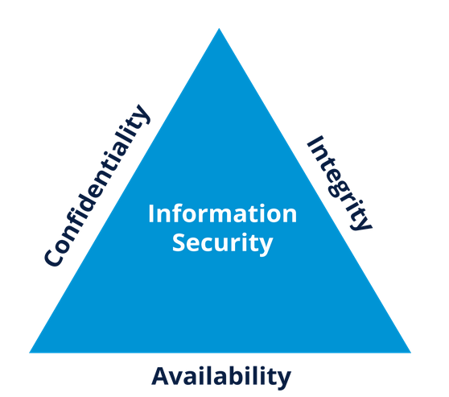
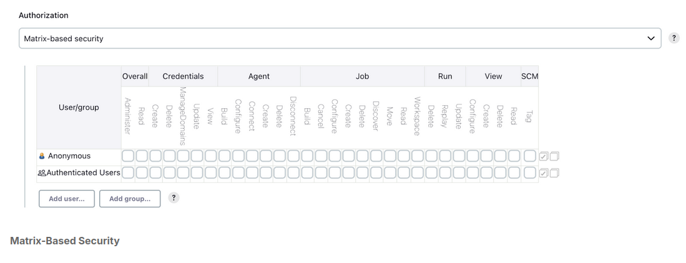
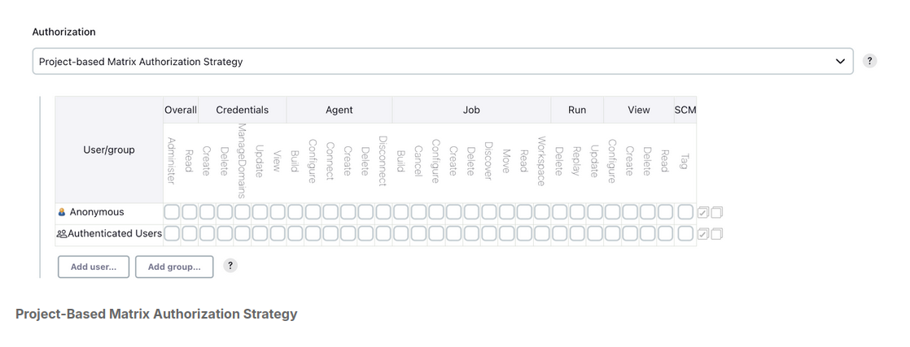
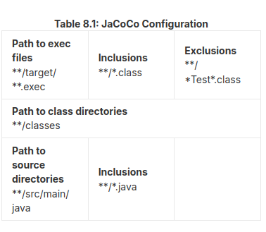
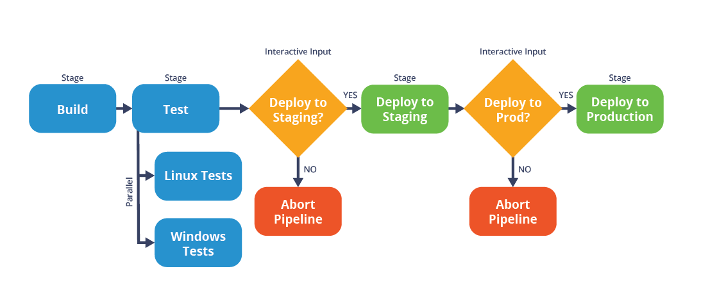

#### Introduction to Jenkins (LFS167)

##### 1. Introduction

##### 2. CI/CD Overview

##### 3. Jenkins Installation Basics

##### 4. Jenkins Dashboard

##### 5. Jenkins Plugins

##### 6. Jenkins Security

##### 7. Jenkins Jobs

##### 8. Freestyle Jobs

##### 9. Pipeline Jobs

##### 10. Distributed Builds Architecture

---


### 1. Introduction

---

- Introduction to Jenskins automation server with instructions how to use CI/CD workflow. 

----

### 2. CI/CD overview

---

- **Definition**:  Software development follows a flow, starting with identifying new features, planning, doing the actual development, committing the source code changes, running builds and tests (unit, integration, functional, acceptance, etc.), and deploying to production.


**Continuous Integration CI**: agile engineering practice originating from extreme programming methodology. Focuses on automated build and test for every change committed to the version control system by the developers. 

- Ingredients for CI: 

1. Version control system: it stores all the source code checked in by the teams and acts as the single source of truth. 
2. Automated build and unit test: Every commit that makes it to the version control system should be built and tested by an independent CI server. 
3. Feedback: given to developers on their commits.
4. Agreement on workways: its important that everyone is alligned.

- diagram of CI: 
  
  

---

**Continuous Delivery CD**: extension of CI, lets you automate the build and test process. Gives the capability to deploy to production frequently, it does not necessarily mean that you are automating the deployment. 

- its an automated way of deploying your releases to production. 

- diagram of Continous integration, Delivery and Deployment
  


---

**Deployment Pipelines**: or Continous delivery piplens are the cornerstone of continous delivery as they automate all stages (build, test release) of your software delivery process. 

- an automated pipeline allows all stakeholders to monitor the progress, eliminates the overhead of all the manual work, provides qick feedback and builds confidence in the code quality.
  
  -diagram of CDP(continous Delively Pipeline)


---

**Tools for Deployment pipeline**: 

- Tool example of a pipeline: 
  
1. GIT (store souce code)
2. Jenkins (CI tool > run automated builds)
3. xUnit/Selenium (run test suits)
4. Artifactory (binary repository to store build artifacts)
5. Ansible (configuration tool)
6. Dashboard (progress tracking)
7. Feedback (slack/email)

---

### 3. Jenkins Installation Basics

---

**General info**: Jenkins is writen in java, can be installed on different OS. Releases are LTS and weekly. Pre-requisites for installing Jenkins: 256mb ram, 1gb disk space, java 11/17, modern web-browser + Documentation. 

**Installation Channels**

1. Standalone WAR, Linux package manager, windows installers, Containers. 

2.  Standalone War- Jenkins runs as standalone application with its embedded Java servlet container Jetty. 
```
java -jar jenkins.war
```
- by defaults Jenkins uses port 8080. There is option to pass addtional JVM arguments by specifying **Jenkins_OPTS** and **Java_OPTS** 
```
java ${JAVA_OPTS} -jar jenkins.war
${Jenkins_OPTS}
```
- or with startup flags:
```
java -Dhudson.footerURL=http://example.org -jar jenkins.war \
```
- it will set java property to default footer on the Jenkins UI to example
- --httpPort, --prefix and --httpListenAddress are flags for Jenkins_OPTS,
- --httpPort=8083 will set Jenkins port to 8083 instead of default
- --prefix=/ci will add a prefix to the end of the Jenkins URL
- --httpListenAddress=127.0.0.1 binds Jenkins to the IP address.
  
- by the end jenkins service launcehd by the above command will be reachable only on 
```
http://127.0.0.1:8083/ci
```
---

**Installation Channels Linux**

---

- Example of Jenkins LTS with apt manager. 

```
Import the GPG key for Jenkins repo
curl -fsSL ht‌tps://pkg.jenkins.io/debian-stable/jenkins.io-2023.key | sudo tee \
  /usr/share/keyrings/jenkins-keyring.asc > /dev/null

# Add the repo to the list of sources
echo deb [signed-by=/usr/share/keyrings/jenkins-keyring.asc] \
  ht‌tps://pkg.jenkins.io/debian-stable binary/ | sudo tee \
  /etc/apt/sources.list.d/jenkins.list > /dev/null

#Update package index
sudo apt-get update
#Install Jenkins
sudo apt-get install jenkins

You can start, stop, and check the status of Jenkins by running the systemctl command: 

systemctl start|stop|status jenkins
```

- NB! Jenkins settings file is created at /etc/default/jenkins. If you want to make changes, yoiu will need to make them inside the file.
- startup script is located at /etc/init.d/jenkins
- home directory is set to /var/lib
- log file is located under /var/log/jenkins
---

**Installation Channels: Windows** 

- Windows package comes with JRE (java runtime environment). 
- Use the exe file and following the nstallation wizzard. 
---

**Installation Channels: Application containers**

- Distribution of Jenskins is ordinary WAR file, its easy to deploy it or any standard Java app server- Tomcat, Jetty, Glassfish. 
- 2 step approach: Copy jenkins.war to webapps directory. Restart application web container.
---
**Installation Channels: Docker**

- Install docker on the OS, install Jenkins Docker image, follow docket github steps

---
**Installation Channels: Kubernetes** 

- To run Jenkins in Kubernetes, you can make use of Helm charts. Official guidelines and github repo.
---

**Post-Installation steps** 

- Post-installation setup wizard (basic guidelines).
- Unlocking Jenkins: add a password
- Customizing plugins: either suggested plugins or custom select.
- Createing the First Administrator User.
- Ensure that jenkins URL is set correctly and click Save and Finish
- Accessing Jenking Home Page: http:<**YOUR IP ADDRESS**>:<**PORT**>
---

### 4. Jenkins Dashboard
---

- Couple of main sections: Header, Side Navigation, All view for Jobs, Monitoring Builds, Jenkins dashboard. 

---

- Jenkins Jobs: 
    1. Build Status (S)
    Uses color codes (described below in more detail).
    2. Health/Build Stability (W)
    Uses weather icons (described below in more detail).
    3. Job Name
    4. Last Success
    Displays when was the last time the job built successfully, and the related build number.
    5. Last Failure
    Displays when was the last time the build failed, and the related build number.
    6. Last Duration
    How long did the latest build take to run?
     (icon)
    7. To start a build.
   


---

### 5. Jenkins Plugins

---

- **Overview**- Plugins add user-needed functionality. All Jenkins Plugins are Java Archive (JAR) files with either an .hpi or jpi extension. Git plugin is marked like  **git.hpi**. 
- *Recommendation**: Use suggested plugins and build on top of them. 


---

- **Plugin Updates**: Via the plugin manager or with the advanced  Update site. -If your Jenkins is behinf a firewall + no direct access to Internet-> we need to configure an HTTP proxy server. 

- Enter the HTTP proxy server name, proxy port, and username used to authenticate with the proxy, and the password to configure your proxy settings. Click the Advanced button on the bottom right to enable the Test URL to validate proxy configuration fields. Finally, click the Submit button to submit the configuration.

---

- **Plugin Install**: Via the Webportal. Verify before installing. OR via Manual upload: we need to upload a .hpi or jpi file using the upload plugin option on advanced settings. (Useful for using older version of a plugin not currently available on the Jenkins update site/ custom plugin)
- On the webpage you can install / uninstall plugins quickly. 
- uninstalling a plugin may leave behind some plugin configuration data. Navigate to Jenkins > Manage Jenkins > Manage Old Data. You can view and purge all the unwanted data here.

--- 

- **Plugin Disable/Update**: Via the webportal. It can be re-enabled via the Enabled column and restart Jenkins server to make plugin operational. 

  - Updates via the webportal:  update plugins frequently on the option Download now and install after restart button. 
  

---
### 6. Jenkins Security

---

- Intellectual Property is valuable data nad its important to protect it. 
- CIA Tria- Confidentiality, availability and itegrity are the fundamental principles of information security. 

    Confidentiality determines the secrecy of your IP and prevents unauthorized access to restricted data.
    Integrity ensures that your IP is accurate and reliable, and it has not been modified from its original state while in transit or at rest.
    Availability is the ability of the users to access your IP. Information is of no use if it cannot be accessed.



- Your Jenkins server hosts your organizational intellectual property (IP) such as your source code, build artifacts, etc. Your Jenkins environment is also a fully distributed build system with Jenkins server and agents (more on this in a later section of this course) and each network connection is a potential point of entry. A malicious user could access your Jenkins environment to launch a Distributed Denial of Service (DDoS) attack or a bot or do any other mischief.

---

- **Securing Jenkins**: from v2.0 version security is enabled by default and are required to create an administrator user account in order to be able to login to Jenkins. (Post install Setup Wizard)

- CSRF Protection- Cross-Site Request Forgery- is an attack that forces an end user to execute unwanted action on web application in which they are currently authenticated. (Enabling it will protect your Jenskins environment from malicious attacks)

- TCP Port- in distributed set up, Jenkins can use a TCP port to communicate with the Agents. This post is disabled by default. If needed you can enable it by selecting either a fixed port or a Random Port. Choosing a fixed port is recommendeed as it makes it easier to manage the firewall rules and avoid port collision. 

- Markup Formatter: Jenkins allows user input in many configuration areas. Setting the Markup Formatter to plain text by default will elimiate any unsafe html or JS. 

---

- **Git Host Key Verification** : option available via the GIT Client plugin and it allows you to select how you would like to verify the SSH keys presented by the Git Repository servers (Github, Bitbucket, Gitlab). If you do not select an option (Known hosts file) strategy is used as default to verify all host keys using the **known_hosts** fule. 

---

- **Authentication** : Act of validating taht users are who they claim to be. There are 4 security realms that are supported out of the box: 

1. Delegate to Servlet Container: This realm delegates authentication to the servlet engine running Jenkins. For Instance > Tomcat Jboss, websphere have their own auth mechanisms. if using this realm you need to look into the servlet containr's authentication documentation. (Apache Tomcat 9).
2. Jenkins's own user database: uses Jenkins local Database and is enabled by default when you initially install jenkins> you have the option of letting your users sign up. However, be minful of the privileges.
3. LDAP - delatetes authentication to an external LDAP Service. Most companies already have Directory service for authentication. This option is more common for larger installations in organization that already have configured an external identitiy provider such as LDAP. This supports Activee Directory, OpenLDAP installations. It is highly tunable/ its biding can be sub-authenticated. You can take advantage of the caching mechanism to leverage load on LDAP servers/ Support for LDAP replicas.  
4. Unix User/Group Database: delegates auth to underlying Unix/Linux machine and it only works if you are running Jenkins on a Unix Server.  

---

- **Authorization** : Once a user/Grou is authenticated, you need to determine the actions of this user /group should be able to perform. Authorization always occurs in the context of authentication. 

1. Lightweight Authorization: 
    - Anyone can do anything: both authenticated and anonymous users to do anything. 
    - Legacy mode: this allows administrators to perform any action. All other users are restricted to read-only mode.
    - Logged-in users can do anything. The default strategy it allows all authenticated users to perform any action. 

2. Matrix- based Security: strategy allows you to define actions allowed for each user or group globally by using a matrix. On the vertical axis are the usrs or groups and on the horizontal axis you can configure the actions for the corresponding users/groups. 



3. Project- based Matrix Authorization Strategy: In addition to assigning permissions globally, Project based matrix authorization lets you define permissions for the individual Jenskins jobs. 



4. Credentials: Jenkins needs to authenticate itself agains other services: 
   -SCM repositories for retrieving source code (or pushing it)
   - Binary repositories for storing artifacts or fetching dependencies. 
   - Remote secured services for authentication such as LDAP
   - Deploy to secured environments. 
- Credentials creation: 1. you need to have Credentials-create permissions > Username > Credentials > Create Credentials > Add Credentials > RTFM. 

---

### 7. Jenkins Jobs

---

- **Overview**: A Jenkins job is a sequential set of tasks that are defined by a user. Typical steps include retrieving the latest source code, from version control, compiling it, running unit tests, building and storing the artifacts and notifying the end users of the outcome of the build.  JOb = project in the UI. 

- **Jenkings Job Types**: 
  1. Freestyle Project: Default type, most flexible to configureand is included as part of the core Jenkins. 
  2. Pipeline and Multibranch Pipeline: There are useful for creating end-end CI/CD pipelines. These pipelines require pipeline and Multibranch plugins to be installed. 
  3. This is useful for jobs with a large number of configurations. Its requires the matcix Project plugin to be installed. 
   
- **Jenkins Job Creation** : Jenkins dashboard > New Item > Enter type of job > Select approptiate ojb type > OK. 

- **Anatomy of a Jenkins Job**: 
   1. General Options: 
    1.1. Meta-information: basically information about the job. Job name and description are meta-information. (DO NOT PUT ANY JavaScript in the deccription field as it can pose a security risk).
    1.2. Disable Job: Option to stop it if you no longer need a job. 
    1.3. Build history Management: for every ran job, there is a buld log, artifacts metadata on the disk. To cap disk space consumption, you can set a build log retention by enabling it. 
    1.4. Build Management: common configurations are listed below.

    Quiet period
    Setting a wait time between builds.
    Retry count
    Setting a count for the number of times Jenkins will try to checkout from the configured SCM system until it succeeds.
    Block build when downstream job is building
    When this option is checked, Jenkins will prevent the current job from building when a child of this job is in the queue, or building.
    Display name
    Setting an optional name for the job which will be displayed throughout the Jenkins UI.

  2. Source Code management: Specify the details of the version control repository for building your source code. You have the flexibility to select the SCM tool + plugin.
   
  3. Build Triggers: 
   3.1. Build periodically: With cron-like syntax you can schedule periodic builds: scheduling every 15min. 
   3.2. Build after other projects are built.
   3.3. Poss SCM- you can poll SCM at a certain frequency using cron-like syntax. Jenkins will try to detect new commits and if there are any Jenkins will go ahead and run the build.
   3.4. Webhooks- you would want to trigger a new build as soon as source code change is detected so as to align with CI/CD goals. At the same time, you do not want to add polling overhead. The best way to navigate this is to let your SCM system handle it by webhooks. 

  4. Build Steps: 
   4.1. Build Environment- allows you to specify additional options for your builds- cleaning up the workspace prior to starting a build, setting up the required environment variables used in the build aborting builds that are stuck. These options are provided by various plugins - Workspace Cleanup, Credentials Binding, Build Timeout, and Timestamper to name a few. The more plugins you install, the more options you will see under this section.

   4.2 Build- The Build section comprises the actual steps to build your source code, run various tests (unit, integration, etc.), code quality, code coverage, and many more.
   4.2.3 Build Section: You can add one or more build steps, and re-order them however you like simply by dragging and dropping them.

    You may also choose to install plugins that suit your specific needs. Such plugins can contribute to additional build steps.
    4.3. Post-build Actions: Post-build actions are performed based on the result of the build status. Examples include notifying developers, publishing test reports, archiving build artifacts, triggering other build jobs, automated deployment, etc.

---

### 8. Freestyle Jobs

---

- **Overview**: Freestyle job- most versatile job type. allows us to build any type of project and its included by default > No need to install additional plugins. 

---

- **New Freestyle Job Creation**: example: alraedy have a small Java application, we will configure all the necessary tasks for this job such as retrieving the Java source code from version control, compiling and building it, runningtests, publishing the code coverage and statyc analysis reports and notification of the team os build status. 

- Dashboard > New Item > Freestyle Project (Using maven in the example). 
- Since the example app requires Java version 11 we can specify via the tools page: 
- Dashboard > Manage Jenkins > Global Tool Configuration page > ADD JDK.
- When we have a JDK we need to do the following steps: 
  - 1. Add a Name for the Java version you are trying to install. 
  - 2. Enter the path for **JAVA_HOME**. 
  - 3. Choose the JDK version from dropdown.
  - 4. Enter the credentials for your Oracle account. 
  - 5. Check the License Agreement 
  - 6. Save. 
  
- **NB!**: The option to choose a specific JDK version will only be activated if you have at least two JDKs configured on the Global Tool Configuration page (YOUR_JENKINS_HOME:8080/manage/configureTools). If you only have one JDK version configured, this version will be implicitly used by Jenkins. If you have no JDKs configured, Jenkins will use the system default path.

---

- **Source Code Management**: 

1. Make a repository. 
2. Configure the git repository under the SCM section of the demoapp-freestyle job: 
    - Scroll down to the Source Code Management section.
    - Select "Git".
    - Enter Repository URL (enter your GitHub repository URL).
    - Select Credentials to authenticate to the SCM repository.
    - Click Add > Jenkins to add the SCM credentials.
3. For credetianls we will gowith SSH Username with private key. 
   -  You will need to create an SSH key locally on your machine if you don't already have one, and then add the SSH key to your GitHub account.
   -  Be sure to select a Git Host Key Verification Strategy on the Global Tool Configuration page. For example, you can choose the "Accept first connection" strategy if you have Jenkins running on a newer operating system. It is easy to set up while still providing ssh key verification.
   -   Make sure to select SSH Username with private key for the credentials kind. Enter the private portion of your key (id_rsa file content) under the Private Key section. 

   - Once the credentials are added, you can view and select them from the credentials dropdown list.
4. For our java-app job, we will select the master branch.
---

- **Build Triggers**: we will use Poll SCM build trigger and set the polling to every 15min. 

- in the schedule bar as following: 
  ```
  H/15****
  ```

---

- **Build Environment**: we need to add a timestapm to the build console output. To enable > Build environment > Add timestamps to the Console Output. 

---

- **Build**: Add build step > Invode top-level Maven targets.
- Invoking Top-Level maven Targets will add a new build step and configuration. 
- Maven Version: maven3. To use this version you need to install maven 3: Dashboard > Manage jenkins > Global ool Configuration.
- Goals: clean verify site. 
- Options are as follows: 
  - clean: will wipe out any existing compiled sources in the target directory and start the build from a clean state
  - verify: will run any checks to verify the package is valid and meets quality criteria
  - site: will generate Java app project code coverage and static analysis reports

  - After that we go to advanced maven options. We need to specify the location of the POM file 
    ```
    POM: java-demo-app/pom.xml
    ```
  - Leave all other fields set to their default values. 
  - Save configuration. 

---

- **Post-Build Actions**: in our example app we will do the following post-build actions: 
    - Archive the build artifacts so we can use them later.
    - View code coverage trends so we can see the percentage of code that is executed as part of the tests.
    - View static analysis trends so we can measure the code defects.
    - Notify the team on the build status so that developers and team members can get quick feedback on the build, and take any necessary actions.
  
- Archive Build Artifacts: build stage generates a Java Archive (JAR).To archive the file for later use, choose add post-build action > Archive the artifacts and specify the location of the JAR file. 

  ```
  Files to archive: **/target/*.jar
  ```
  - this will look for all files with .jar extenstion recursively under all targe directories from the workspace's root. 

- Publish Code Coverage Report: coverage tool for java: JaCoCo ( to enable publishing JaCoCo reports, you first need to install the plugin.)
  - Add Post-build action > Record JaCoCo coverage report. 
  

- Static Analysis Reports: java app project uses the 2 tools: SpotBugs and PMD. Both of which help detect defects in Java code. 
    - we need the plugin Warning Next Generation: Add post-build action > Record compiler warning and static analysis results. 
    - From tool many select SpotBugs > Reporting Encoding to UTF-8. all other fields to their default values. 
    - 2nd tool PMD: Static Analysis Tools > Add Tool > Report encoding UTF- 8. 

- Email Notifications: Jenkings provides out of the box email support: Add Post-build action > Email Notification > specify target recipients for the emails. 
---

- **Build History** : Build now of the example java-app to trigger new build. 


---

### 9. Pipeline Jobs

---

- **Freestyle vs Pipeline Jobs/Projects**: With Jenkins setting up a Freestyle job is quite UI heavy. They provide flexibility to configure project they are not quite suitable to orchestrate complex CD scenarios. 

- **Pipeline Jobs**: can be accomplishes with:
1. Create a set of instructions written as a code to model complex workflows.
2. Provide a single-place visualization of different stages of workflow. 
3. Resume at certain poit of failure.
4. Store all Pipeline Code in SCM, so you can apply SCM best practices > versioning, tracking and auditing to the project configuration itself. 
  
---

- **Declarative vs Scripted Pipelines**: Pipeline is a Jenkins Job type to provide an enhanced way to model and visualize CI/CD workflow for a softwate delivery project. It is created by writing a bunch of instrucstions in a file called ** Jenkinsfile** which can be checked into an SCM repository.

- Jenkins Pipeline uses domain-specific languaged based on Apache Groovy to create, edit and view and run the CD pipelines. It can follow 2 syntactic rules: 
  1. Declarative Pipelines: Recent feature of Jenkins with richer set of functionality. They are expressed using a Domain Specific Language (DSL). Hence, thre is a lower learning curve and no prior knowledge of Apache Groovy is required. 
  2. Scripted Pipelines: Scripted Pipelines are not contrained by Jenkins pipeline DSL. Whihe such pipelines offer a lot of flexibility, they also require you to have knowledge of Apache Groovy. 
  
- NB! First focus on declarative then move to scripted pipelines. 
---

- **Pipeline Building Blocks**: A jenkins pipeline is made of sections, these sections can be defined in a Jenkinsfile.

1. **Agent**: Agent section specifies where the pipeline will run. The agent in this case means the build agent. You can specify a single agent for the entire pipeline or you can specify different agents for each stage of a pipeline. An agent can be stand-alone machine or a Docker-based container. Pipeline agents also support integration with k8s. You can configure a pipeline to directly launch a build agent inside a K8s pod. For more info RTFM. 

2. **Stages**: A pipeline is made of one or more stage directives. At a minimum, the stages section will contain at least one stage directive to do the actual work of a CI/CD pipepine. Stages can run sequentially orin a parallel. 

3. **Steps**: Each pipeline stage includes steps. A step is the smallest unit of execution. Actual work of the pipeline is done by the steps. Example: running a script or executing a comand. All such tasks are implemented as steps. 

4. **Post**: The post section defines additional steps that run upon the completion of a stage or a pipeline. IT is similar to the "Post build section" for a Jenkins Freestyle job. Typically cleanup tasks or notification steps are run as aport of the post section. 

- Exampe of Pipeline Jenkinsfile: 

```
pipeline {
  agent any
  stages {
    stage('Build') {
      steps {
        echo “Run build”
      }
    }
    stage('Test') {
      steps {
        echo “Run tests”
      }
    }
  }
}
```
- Declarative pipeline is enclosed within a pipeline {} block. 
- The pipeline has 2 stage: Buld and Test: each stage has only one step. Each step executes the **echo** command. You can have multiple steps inside a stage and all the steps will be executed serially. The agent any- statement at the start of the pipeline will make sure that any predefined build agent can run these stages. We can execute different stages on different agets. 

---

- **Creating a Declarative Pipeline**: there are 2 ways of creation: 1- Blue Ocean Editor, 2- Jenkins Pipeline Job type. 

1. **Blue Ocean Editor**: requires Blue Ocean Plugin. Jenkins project will not release any new functionality. 
2. **Jenkins Pipeline Job Type**: 
   a. Create a Pipeline Job type via the Jenkins UI. 
   b. Enter pipeline code directly / OR
   c. Use pre-committed pipeline code (Jenkinsfile) into an SCM repository.

- Pipeline job to simulate a typical CI/CD workflow with following set of stages: 
  1. Build- In this stage, source code is compiled and built, and an artifact is generated. 
  2. Test- In this stage, tests will be run in parallel on two different OS paltforms, Linux and Windows. 
  3. Deploy to staging environment (essentially a pre-productuon server), we will request for human approval. If approved, the artifacts will be deployed to staging.
  4. Deploy to Production- We will request for a human approval to deploy to production. If approved, artifacts will be deployed to the production environment. 
   


---

