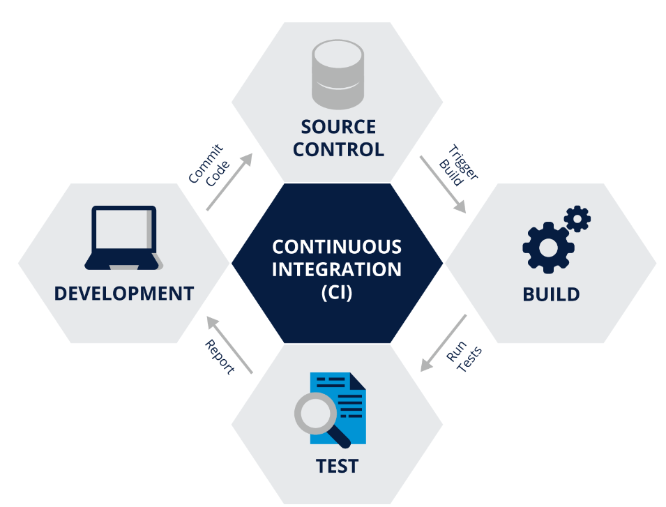
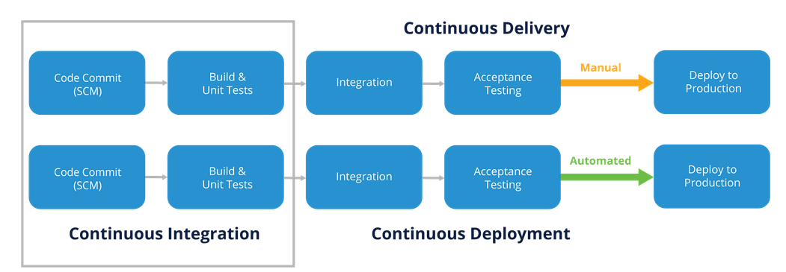
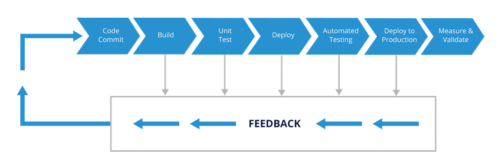
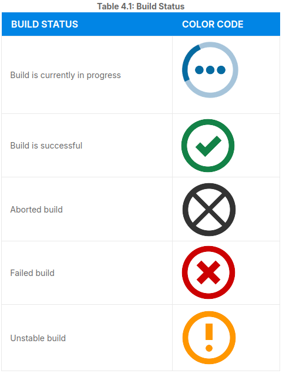
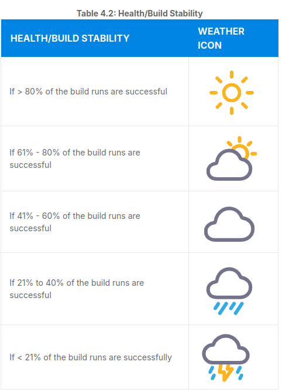

#### Introduction to Jenkins (LFS167)

##### 1. Introduction

##### 2. CI/CD Overview

##### 3. Jenkins Installation Basics

##### 4. Jenkins Dashboard

##### 5. Jenkins Plugins

##### 6. Jenkins Security

##### 7. Jenkins Jobs

##### 8. Freestyle Jobs

##### 9. Pipeline Jobs

##### 10. Distributed Builds Architecture

---


### 1. Introduction

---

- Introduction to Jenskins automation server with instructions how to use CI/CD workflow. 

----

### 2. CI/CD overview

---

- **Definition**:  Software development follows a flow, starting with identifying new features, planning, doing the actual development, committing the source code changes, running builds and tests (unit, integration, functional, acceptance, etc.), and deploying to production.


**Continuous Integration CI**: agile engineering practice originating from extreme programming methodology. Focuses on automated build and test for every change committed to the version control system by the developers. 

- Ingredients for CI: 

1. Version control system: it stores all the source code checked in by the teams and acts as the single source of truth. 
2. Automated build and unit test: Every commit that makes it to the version control system should be built and tested by an independent CI server. 
3. Feedback: given to developers on their commits.
4. Agreement on workways: its important that everyone is alligned.

- diagram of CI: 
  
  

---

**Continuous Delivery CD**: extension of CI, lets you automate the build and test process. Gives the capability to deploy to production frequently, it does not necessarily mean that you are automating the deployment. 

- its an automated way of deploying your releases to production. 

- diagram of Continous integration, Delivery and Deployment
  


---

**Deployment Pipelines**: or Continous delivery piplens are the cornerstone of continous delivery as they automate all stages (build, test release) of your software delivery process. 

- an automated pipeline allows all stakeholders to monitor the progress, eliminates the overhead of all the manual work, provides qick feedback and builds confidence in the code quality.
  
  -diagram of CDP(continous Delively Pipeline)



---

**Tools for Deployment pipeline**: 

- Tool example of a pipeline: 
  
1. GIT (store souce code)
2. Jenkins (CI tool > run automated builds)
3. xUnit/Selenium (run test suits)
4. Artifactory (binary repository to store build artifacts)
5. Ansible (configuration tool)
6. Dashboard (progress tracking)
7. Feedback (slack/email)

---

### 3. Jenkins Installation Basics

---

**General info**: Jenkins is writen in java, can be installed on different OS. Releases are LTS and weekly. Pre-requisites for installing Jenkins: 256mb ram, 1gb disk space, java 11/17, modern web-browser + Documentation. 

**Installation Channels**

1. Standalone WAR, Linux package manager, windows installers, Containers. 

2.  Standalone War- Jenkins runs as standalone application with its embedded Java servlet container Jetty. 
```
java -jar jenkins.war
```
- by defaults Jenkins uses port 8080. There is option to pass addtional JVM arguments by specifying **Jenkins_OPTS** and **Java_OPTS** 
```
java ${JAVA_OPTS} -jar jenkins.war
${Jenkins_OPTS}
```
- or with startup flags:
```
java -Dhudson.footerURL=http://example.org -jar jenkins.war \
```
- it will set java property to default footer on the Jenkins UI to example
- --httpPort, --prefix and --httpListenAddress are flags for Jenkins_OPTS,
- --httpPort=8083 will set Jenkins port to 8083 instead of default
- --prefix=/ci will add a prefix to the end of the Jenkins URL
- --httpListenAddress=127.0.0.1 binds Jenkins to the IP address.
  
- by the end jenkins service launcehd by the above command will be reachable only on 
```
http://127.0.0.1:8083/ci
```
---

**Installation Channels Linux**

---

- Example of Jenkins LTS with apt manager. 

```
Import the GPG key for Jenkins repo
curl -fsSL ht‌tps://pkg.jenkins.io/debian-stable/jenkins.io-2023.key | sudo tee \
  /usr/share/keyrings/jenkins-keyring.asc > /dev/null

# Add the repo to the list of sources
echo deb [signed-by=/usr/share/keyrings/jenkins-keyring.asc] \
  ht‌tps://pkg.jenkins.io/debian-stable binary/ | sudo tee \
  /etc/apt/sources.list.d/jenkins.list > /dev/null

#Update package index
sudo apt-get update
#Install Jenkins
sudo apt-get install jenkins

You can start, stop, and check the status of Jenkins by running the systemctl command: 

systemctl start|stop|status jenkins
```

- NB! Jenkins settings file is created at /etc/default/jenkins. If you want to make changes, yoiu will need to make them inside the file.
- startup script is located at /etc/init.d/jenkins
- home directory is set to /var/lib
- log file is located under /var/log/jenkins
---

**Installation Channels: Windows** 

- Windows package comes with JRE (java runtime environment). 
- Use the exe file and following the nstallation wizzard. 
---

**Installation Channels: Application containers**

- Distribution of Jenskins is ordinary WAR file, its easy to deploy it or any standard Java app server- Tomcat, Jetty, Glassfish. 
- 2 step approach: Copy jenkins.war to webapps directory. Restart application web container.
---
**Installation Channels: Docker**

- Install docker on the OS, install Jenkins Docker image, follow docket github steps

---
**Installation Channels: Kubernetes** 

- To run Jenkins in Kubernetes, you can make use of Helm charts. Official guidelines and github repo.
---

**Post-Installation steps** 

- Post-installation setup wizard (basic guidelines).
- Unlocking Jenkins: add a password
- Customizing plugins: either suggested plugins or custom select.
- Createing the First Administrator User.
- Ensure that jenkins URL is set correctly and click Save and Finish
- Accessing Jenking Home Page: http:<**YOUR IP ADDRESS**>:<**PORT**>
---

### 4. Jenkins Dashboard
---

- Couple of main sections: Header, Side Navigation, All view for Jobs, Monitoring Builds, Jenkins dashboard. 

---

- Jenkins Jobs: 
    1. Build Status (S)
    Uses color codes (described below in more detail).
    2. Health/Build Stability (W)
    Uses weather icons (described below in more detail).
    3. Job Name
    4. Last Success
    Displays when was the last time the job built successfully, and the related build number.
    5. Last Failure
    Displays when was the last time the build failed, and the related build number.
    6. Last Duration
    How long did the latest build take to run?
     (icon)
    7. To start a build.
   





---