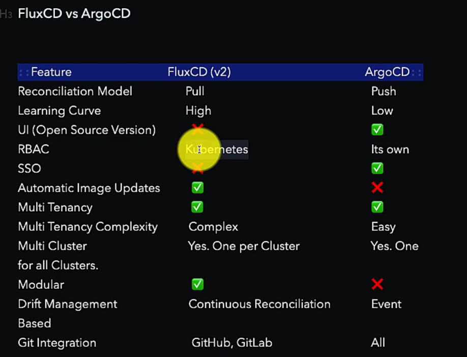

# Introduction to GitOps (LFS169)

### 1. Introduction

### 2. GitOps in Action

### 3. GitOps Concepts

---

---

---

### 1. Introduction

- **What is GitOps and what is it used for?** :

---

---

---

### 2. GitOps in Action

- Using 3 different repositories, 1 for the app , 1 for the deploy and 1 flux- fleet repo ( exclusively managed by the SRE team and has the cluster configuration and common infrastructure components).

- All of them are in yaml code.

- Steps will be as follows:

- 1: Set up the common infrastructure.
- 2: Onboard an Application Project.
- 3: Deploying application and all Microsrvices
- 4: Adding a release Strategy
- 5: End to End CD Workflow with Gitops
- 6: Disaster recovery.

- everything is contained in the gitops worlkflow and reflected in the messages.

- flagger - is a tool- for setting policies and strategies- blue green, progressive canary strategy.

---

---

---

### 3. GitOps Concenpts

---

**What is GitOps?**

- Running operations out of git. or Running operations by pull requests
- Very context specific: with the goal of continous delivery of Cloud Native applications typically to kubernetes.
- its a culmination of 4 technologies and practicies :

- IAC- writing infrastructure as a code (puppet, chef, ansible), vagrant and terraform later.
- Git- Version control system, (pull req, code reviews, branching models)
- CI/CD- continuous, automate processes of delivery
- Convergent platforms - should be able to be extandable and convergent. (api, extendible, convergent) (Kubernetes).

---

**GitOps Use Cases**

- Continous Delivery of Application Configurations
- Apply Release Strategies (Blue- Green / Rolling Update / Canary)
- Infrastructure rollout to Kubernetes( Ingress Controllers, Namespaces, RBAC Policies, Network Policies, CRDs )
- Disaster Recovery (Achievable relatively easy)
- Sync Secrets (Vault <==>k8s)
- Drift Detection (Notify / Reconcile)
- Deploy to Multiple Kuberenetes Clusters
- Securely Handoff Deployments to Devs (No Cluster access to Devs / Multi Tenancy / Separation of Concerns)
- Auto update K8s YAMLs on new image in Registry

---

**Principles and Practices of GitOps**

- 1st Principle (Write): - you should have 100% of your config as a Declarative code / typically Yaml code in the case of k8s (everything is exposed in API resources/ everything in k8s can be declared in code/codefied).

- 2nd Principle (Store): - Start using the git based workflows of Git, apply best practicles

- 3rd Principle (Apply): Once changes are approved, should automatically apply to the environment (k8s). Way to define of continous deployment.

- 4th Priciple (Check and Correct): Application of third principle by using a software agent, where sits and keeps reconciling with your envrionment. Also Called Reconciler in gitops terminology. It will check the config that you have defined in the git repo that is the desired state vs the current state. Keeps checking and apply if there is a drift/ or notify that there is a Drift(Drift detection between desired vs actual).

---

**Reconciliation Models: Pull vs Push**

- Ingredients : git repo to store code, container registry and that CD process and then a k8s cluster to sync. (Reconciler will watch and apply the cnages to k8s cluster)

- if its watch + apply = pull model
- if its a web hook + event = push model

- Pull: flexible and secure ( reconciler which can remain on private network- it does not need to be exposed to real world). Cluster credentials are not exposed in the form of Service Accounts.

  - also scalable- one reconciler per cluster
  - two way sync
  - continous drift managemen

- Push: (Reconciler needs to be exposed to the outside world), simple model - being one reconciler for multiple clusters (for smaller uses)
  - sequencing , ordering, dependecy managent is easier
  - based on event- we can save on bandwith, requests optimized.

---

**Tools**

- FluxCD, ArgoCD, JenkinX are the main tools for gitOps Use.

-How to Choose? Criteria: What are you looking for?

- CI + CD > JenkinsX (full-fledged solution)
- Just CD > ArgoCD/ FluxCD

- FLUXCD and ARGOCD: A lot in common. Both are:

  - based on GitOpsPrinciples
  - both are k8s native- deployed as CICDs and Operators
  - Are lighweight to Run
  - Sync Git with k8s
  - Setup Automated Continous delivecy to k8s
  - Support plain YAML Manifest
  - Support Helm Chards, Kustomize, Ksonnet, Jsonnet
  - Support Progressive releaseses with the help of Flagger/Rollut and Ingres Controllers/ Service Mesh
  - Support Garbage Collection (automatic deletion of resources on deletion of the same in GIT)
  - CNCF Projects

- Differences:

---

**Benefits**

1. Velocity (deploy faster)
2. Developer Centric
3. Quick and Easy Recovery(Mean time to Recover MTTR)
4. Secure (Separations of Concerns between CI and CD)
5. Auditability (Audit log outside of the cluster)
6. Self- Documented Code
7. Rollout with PR | Rollback with a Revert
8. Code is Reviewed
9. Observability (Single Source of Truth/ Detect Config Drifts)
10. Increase Stability | Reliability

---
