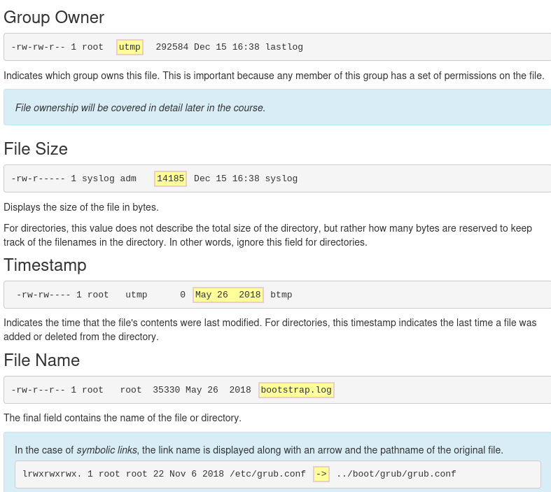

# LPI Linux Essentials
---

## Chapters

---

### Chapter 1 - Introduction to Linix

---

- Introduction to Linux. Linus originally named the project Freax, however, an administrator of the server where the development files were uploaded renamed it Linux, a portmanteau of Linus’ name and UNIX. The name stuck.

- GNU is a recursive acronym for “GNU’s Not Unix,” and it’s pronounced just like the African horned antelope that is its namesake.

- Linux started in 1991 as a hobby project of Linus Torvalds, a Finnish-born computer scientist studying at the University of Helsinki. Frustrated by the licensing of MINIX, a UNIX-like operating system designed for educational use, and its creator’s desire not to make it a full operating system, Linus decided to create his own OS kernel.

- From this humble beginning, Linux has grown to be the dominant operating system on the Internet, and arguably the most important computer program of any kind. Despite adopting all the requirements of the UNIX specification, Linux has not been certified, so Linux really isn’t UNIX! It’s just… UNIX-like.

- Prior to and alongside this development was the GNU Project, created by Richard Stallman in 1983. 

- Linux is Open Source: The source code may be written in any of hundreds of different languages. Linux happens to be written in C, a versatile and relatively easy language to learn, which shares history with the original UNIX. This decision, made long before it’s utility was proven, turned out to be crucial in its nearly universal adoption as the primary operating system for internet servers.

- People that say their computer runs Linux usually refer to the kernel, tools, and suite of applications that come bundled together in what is referred to as a distribution.
  
----

### Chapter 2 - Operating Systems. 

---


- An operating system is software that runs on a computing device and manages the hardware and software components that make up a functional computing system.


- Decision Points for choosing an OS: 
1. Role
2. Function
3. Life Cycle
4. Stability
5. Compatibility
6. Cost
7. Interface
   
---


### Chaper 3 - Working in Linux

----

- Using Linux everyday will increase the "fluency" with it.
  
- Applications need only follow the kernel’s Application Programming Interface (API) and therefore don’t have to worry about the implementation details. Each application behaves as if it has a large block of memory on the system; the kernel maintains this illusion by remapping smaller blocks of memory, sharing blocks of memory with other applications, or even swapping out untouched blocks to disk.
  
-  kernel also handles the switching of applications, a process known as multitasking. A computer system has a small number of central processing units (CPUs) and a finite amount of memory. The kernel takes care of unloading one task and loading a new one if there is more demand than resources available. When one task has run for a specified amount of time, the CPU pauses it so that another may run.

---

- There are 3 major categories for linux software: 
1. **Server Applications**: Software that has no direct interaction with the monitor and keyboard of the machine it runs on. Its purpose is to serve information to other computers, called clients. Sometimes server applications may not talk to other computers but only sit there and crunch data.
2. **Desktop Applications**: Web browsers, text editors, music players, or other applications with which users interact directly. In many cases, such as a web browser, the application is talking to a server on the other end and interpreting the data. This is the “client” side of a client/server application.
3. **Tools**: A loose category of software that exists to make it easier to manage computer systems. Tools can help configure displays, provide a Linux shell that users type commands into, or even more sophisticated tools, called compilers, that convert source code to application programs that the computer can execute.


---


- Early usage was for web-servers. Viewed by a web browser using HTTP/ HTTPS (Hypertext Transfer Protocol + Secured). 
- Then webpages could be static or dynamic. Web Browser requests a static page > web servers sends the file as it apears on the disk. Dynamic page: web server  > sends the request > to an application > application generates content. 

- Use inn private clouds: ownCloud / Nextcloud use it under the GNU AGPLv3 license. 

---

- Usage as Database Server: Database server applications form the backbone of most online services. Dynamic web applications pull data from and write data to these applications. For example, a web program for tracking online students might consist of a front-end server that presents a web form. When data is entered into the form, it is written to a database application such as MariaDB. When instructors need to access student information, the web application queries the database and returns the results through the web application.

- MariaDB is a community-developed fork of the MySQL relational database management system. It is just one of many database servers used for web development as different requirements dictate the best application for the required tasks.

- A database stores information and also allows for easy retrieval and querying. Some other popular databases are Firebird and PostgreSQL. You might enter raw sales figures into the database and then use a language called Structured Query Language (SQL) to aggregate sales by product and date to produce a report.


----

- Email Servers. 3 different tasks required to get email between people: 

1. **Mail Transfer Agent (MTA)** .The most well known MTA (software that is used to transfer electronic messages to other systems) is Sendmail. Postfix is another popular one and aims to be simpler and more secure than Sendmail.

2. **Mail Delivery Agent (MDA)**. Also called the Local Delivery Agent, it takes care of storing the email in the user’s mailbox. Usually invoked from the final MTA in the chain.

3. **POP/IMAP Server**. The Post Office Protocol (POP) and Internet Message Access Protocol (IMAP) are two communication protocols that let an email client running on your computer talk to a remote server to pick up the email.

- Dovecot is a popular POP/IMAP server owing to its ease of use and low maintenance. Cyrus IMAP is another option. Some POP/IMAP servers implement their own mail database format for performance and include the MDA if the custom database is desired. People using standard file formats (such as all the emails in one text file) can choose any MDA.

---

- **File Sharing**:  for Windows centric file sharing-**Samba**. Allows linux machine to behave like a windows machine so it can share files and participate in awindows domain. 

- **Netatalk project**: allows a linux machine to perform as a Apple Macintosh file server. Based on NFS- network File system. 

- **DNS**- Domain name system, oldest network directory systems. Convers IP to a unique identifier of a computer on the internet. Holds global information like the address of the MTA for a given domain name. 


- DNS is focused mainly on computer names and IP addresses. **LDAP**- Lightweight Directory Access Protocols is common directory system which powers Microsoft Active Directory. IN LDAP, an object is sotred in a tree and the position of that object on the tree can be used to rerive information about the object and what it stores. OpenLDAP is dominant program used in Linux Infra. 

- **Dynamic Host Configuration Protocl (DHCP)**- When a computer boots up, it needs an IP address for the local network so it can be uniquely identified. DHCP's job is to **listen for requrest and assign a free address from the DHCP pool**. ISC DHCP-is the most common open source DHCP server. 

---

- **Package management**: 

1. The Debian distribution, and its derivatives such as Ubuntu and Mint, use the Debian package management system. At the heart of Debian package management are software packages that are distributed as files ending in the .deb extension.

- The lowest-level tool for managing these files is the dpkg command. This command can be tricky for novice Linux users, so the Advanced Package Tool, apt-get (a front-end program to the dpkg tool), makes management of packages easier. Additional command line tools which serve as front-ends to dpkg include aptitude and GUI front-ends like Synaptic and Software Center.

2. RPM package management: RPM makes use of an .rpm file for each software package. This system is what distributions derived from Red Hat, including Centos and Fedora, use to manage software. Several other distributions that are not Red Hat derived, such as SUSE, OpenSUSE, and Arch, also use RPM.

- ‌⁠​​⁠​ Like the Debian system, RPM Package Management systems track dependencies between packages. Tracking dependencies ensures that when a package is installed, the system also installs any packages needed by that package to function correctly. Dependencies also ensure that software updates and removals are performed properly.

- The back-end tool most commonly used for RPM Package Management is the rpm command. While the rpm command can install, update, query and remove packages, the command line front-end tools such as yum and up2date automate the process of resolving dependency issues.

---

- **Security**

1. Cookies: As you browse the web, a web server can send back the cookie, which is a small piece of text, along with the web page. Your browser stores this information and sends it back with every request to the same site. Cookies are normally only sent back to the site they originated from, so a cookie from example.com wouldn’t be sent to example.org.

- However, many sites have embedded scripts that come from third parties, such as a banner advertisement or Google analytics pixel. If both example.com and example.org have a tracking pixel, such as one from an advertiser, then that same cookie will be sent when browsing both sites. The advertiser then knows that you have visited both example.com and example.org.

- With a broad enough reach, such as placement on social network sites with “Like” buttons and such, a website can gain an understanding of which websites you frequent and figure out your interests and demographics.

2. Passwords: Do not share them! Use 2fa, password manager. Division of access (root and admin) or RBAC.

----

### Chapter 4 - Open Source Software and Licensing

---

- Source code compiled into binary programs is one method of creating programs and running computing instructions. Another is the many types of interpreted languages, such as PERL, Python and even BASH scripting, where the code is not compiled, but fed to an interpreting program, typically a binary executable that understands and implements the instructions contained in the source code or scripts.

- Open source takes a source-centric view of software. The open source philosophy is that users have the right to obtain the software source code, and to expand and modify programs for their own use. This also meant the code could be inspected for backdoors, viruses, and spyware. By creating a community of developers and users, accountability for bugs, security vulnerabilities, and compatibility issues became a shared responsibility. This new, global community of computer enthusiasts was empowered by the growing availability of faster internet services and the world wide web.


----

- **Free Software Foundation**: 

- Only a few years after the development of the GNU project, Richard Stallman founded the Free Software Foundation (FSF) in 1985 with the goal of promoting free software. In this context, the word "free" does not refer to the price, but to the freedom to share, study, and modify the underlying source code. According to their website, the FSF believes that users should have "control over the technology we use in our homes, schools, and businesses".

- FSF also advocates that software licenses should enforce the openness of modifications. It is their view that if someone modifies free software that they should be required to share any changes they have made when they share it again. This specific philosophy is called copyleft. According to FSF, "copyleft is a general method for making a program (or other work) free (in the sense of freedom, not "zero price"), and requiring all modified and extended versions of the program to be free as well".

- The changes between GPLv2 and GPLv3 largely focused on using free software on a closed hardware device which has been coined Tivoization. TiVo is a company that builds a television digital video recorder on their own hardware and used Linux as the base for their software. While TiVo released the source code to their version of Linux as required under GPLv2, the hardware would not run any modified binaries. In the eyes of the FSF, this went against the spirit of the GPLv2, so they added a specific clause to version 3 of the license. Linus Torvalds agrees with TiVo on this matter and has chosen to stay with GPLv2.

---

### Chapter 5 - Command Line

---

- Command line provides precise control and greater speed to automate tasks via scripting. 

- Shell: a command line interpreter that translates command into actions. Most commonly used - Bash. 

- Bash features: 

1. Scripting: place commands in a file and then interpret it. Has some programming features > conditional statements and the ability to create functions (subroutines).
2. Aliases: ability to create short nicknames for longer commands. 
3. Variables- used to store infomation for the bash shell and the user. Can be used to modify how command and features work as well as provide system information. 

- The ~ symbol is used as shorthand for the user's home directory. Typically the home directory for the user is under the /home directory and named after the user account name; for example, /home/sysadmin.

---

- Commands: command is a software program that, when executed on the CLI performs action on the computer. 

```
command [options] [arguments]
```

- Options are used to modify the core behaviour of a command while argumes are used to provide addtional information (filename/username)

- NB! Linux is **case-sensitive**. Commands, options, arguments, variables and file names must be entered exactly.

- Argument can be used to specify something for the command to act upon.  Example: Ls is given a directory as argument > it listes the contents of that directory. 
  ```
    ls /etc/ppp
  ```
- ls accepts multiple arguments so we can have 2 directories listed as directories. 
  
- Options: to expand/modify the behaviour. (ex: ls -l > long listing)
- Other option is r( reverse), lists results in reverse alphabetical order (ex: ls -r)
- Most cases optioncas can be used together. Instead of having them as 2 options (which still can be used), they can be combines (ex: ls -lr).

- Order of combined option is not that important, the output will be the same.
  ```
    ls -l -r 
    ls -rl
    ls -lr
  ```

- By default **-l** option display sizes in bytes. to make it human readable we add **-h**.
  ```
    ls -lh
  ```

- Full word options are preceded by two dash --, -h > --human-readable. 

- When a command is used in the terminal is stored in a history list. Pressing arrow up displays the previous command on the prompt line. Left and Right arrow can be used for editing. 

```
history

#if the command is within the history list, it can be executed by 

! + number > !1/!2/!3

# to execute the nth command from the bottom of the history list, use !-n
!-3

# to execute last command !!

# to execute most recent iteration of a specific command > ! + command 
!ls
```
---

- **Variables**- feature that allows the user/shell to store data. 2 types of variables in Bash: local/ environment.
  
- Local variables: shell/local variables exist only in the current shell and can not affect other commands or applications. When the shell is closed > variable is lost. 

- To set value to a variable.
  ```
    variable=value
  ```
- If the variable already exists, the value of the variable is modified. If the variable name does not already exist, the shel creates a new local variable an dsets the value. 

- To display the value a variable we need to use echo $ +variable name (as argument).
```
variable1='something'

echo $variable1
something

```
----

- **Environment Variables**: also called global variables: system-wide. Used in all shells by Bash. Examples (PATH, HOME, HISTSIZE).

- HISTSIZE- variable defines how many previous command to store in the history list. 

```
echo $HISTSIZE
#will pring 1000

# to change it HISTSIZE=500
echo $HISTSIZE
500
```

- When run without arguments, the **env** command outputs a list of the environment variables. The list can be quite long. Hence w ecan use text search to filter that output. (env | grep variable1).
- The pipe character passes the output of the **env** to the **grep** command, which searches the output. 

- **export** is used to turn local variable into an environmental. 
  ```
  export variable

  # export variable1 (to make it environmental, otherwise grep does not work)
  # 1 export
  export varaible1
  # 2 extract
  env | grep variable1
  #grep will show the variable.
  ```

- **export** can also be used to make viariable an environment variable upon its creation by using assignment expression as argument. 

```
export variable2='else'
env | grep variable2

# we can also change value of environment variable
variable1=$variable1' '$variable2

# Environment variables can be removed using the **unset** command
unset variable22
```


---

- **Path Variable** : most important Bash variable. In contains a list that defines which directories the shell looks in to find commands. 

- If valid command is entered and the shell returns "command not found" error its because bash shell was unable to locate a command by that name in any of the directories included in the path. 

```
echo $PATH
```

- Think of it as an address of the directory that inclde step-by-step navigation directions.
- if custome software is installed on the system it may be necessary to modify the PATH to make it easier to execute these commands. 

- **NB! When updating the PATH variable, always include the current path, so as not to lose access to commands located in those directories. This can be accomplished by appending $PATH to the value in the assignment expression. Recall that a variable name preceded by a dollar sign represents the value of the variable.**. 

---

- **Command types**: the way to learn more aabout a command is to look at the where it comes from. The **type** command can be used to determine information about the command type. 
  
```
type command
```

- Internal commands, called built-in, are built into the shell itself. Example (**cd**), when using it shell already knows how to interpret it, requiring no additional programs to be started. 

- External Commands: are binary executables store in directories that are searched by the shell. (ls, cal,). The shell searches through the directories that are listed in the PATH variable to try and find a file named ls that it can execute. 

- If a command does not behave  as expected or if a command is not accessible that should be it, it can be good to know where the shell is finding the command or which version is using (easier troubleshooting), for this we have **which** command to display the full path of the command we are looking for. 

```
which command

#which ls
#which cal
```

- When path is returned, they can be also executed by typing the full path to the command: (ls > /bin/ls. cal > /usr/bin/cal).

- In some cases type may differ than which command. Hence we can put an option to have all locations displayed: 
```
# type -a echo 
echo is a shell builtin
echo is /bin/echo
```

----

- **Aliases**: they can be used to map longer command to shorter key sequences. When the shell sees an alias being executed it substitutes the longer sequence before proceeding to interpret commands. (Ex: ls -l is commonly aliased to l OR ll). Because these smaller commands are easier to type it becomes faster. 
```
# to check what aliases are set in the current shell- use **alias** command.
alias egrep='egrep --color=auto'                                       
alias fgrep='fgrep --color=auto'                                        
alias grep='grep --color=auto'                                          
alias l='ls -CF'                                                       
alias la='ls -A'                                                       
alias ll='ls -alF'                                                     
alias ls='ls --color=auto'
```

- Previous aliases are created by initialization files. these files are designed to make the process of  creating aliases automatic. 

- **Aliases Creation**: New aliases can be created using the lowwing format where **name** is the name to be given the alias and command is the command to be executed when the alias is run. 

```
alias name=command
```

- Aliases created in such way only persist while the shell is open. Once the shell is closed, the new aliases are lost. Each shell has its own aliases, so aliaces created in one shell wont be available in new shell that is opened. 

- **type** command can identify aliases to other commands. (ex. type ll).

----


- **Functions**: can be also built using existing commands > to either create new commands o rto override commands built-in to the shell or commands stored in files. Aliases and functions are normally loaded from the initialization files when the shell first starts. 

- Functions are more advanced than aliases and typically are used in Bash shell scripts. Functions are used to execue multiple commands. Example of function syntax: 
```
function name ()
{
  commands
}

```
- function can be anything that the admin wants to call the function. Commands are what commands admin wants to execute, be mindful of the braces and parenthesis. 

- functions are useful to be executed one at at a time instead of typing each command repeatedly. 
```
my report (){
  > ls Documents
  > date
  > echo "Document directory report
  > }
```

- When making such function, a **>** character will appear as a prompt to enter the commands for the function. Curly braces are used to let the shell know when a function begins and ends so as the exit the > prompt. 

- once a function is created, the function name acan be invoked from the bash promp to be executed.

---

- **Quoting**: Quotation marks are used throught Linux administation and most programmming languages. to let the system know that the information contained within should be iether ignored or treated in a way that is very different than it would normally. 

- Bash has single, double and back quotes. 

- Double quotes: stop the shell from interpreting some mechacharacters (special characters) including glob characters. 

- glob characters, also called wild cards, are symbos that have special meaning to the shell. They are interpreted by the shell itself before it attempts to run any command. Glob characters includes the asterisk *, question mark ?, and [] among others. 

- Within double quotes * is jus an asterisk and so on. Useful when you want to display something on the screen that is normally a special character to the shell 

- **Double quotes** still allow for command subtitution, variable substitution. ex> value of tha PATH is still displayed. 
```
sysadmin@localhost:~$ echo "The path is $PATH"                          
The path is /usr/bin/custom:/home/sysadmin/bin:/usr/local/sbin:/usr/local/bin:/usr/sbin:/usr/bin:/sbin:/bin:/usr/games
```

- **Single quotes**: it will prevent special characters, globs, variables command substitiuon from any interpretation by the shell. 


- **Backslash**: (single quote a single character)  when special characters are used inside-> they are not considered variables. but if you want to treat one as a variabele you can use backlash:
```
# double quotes: 
enter= sysadmin@localhost:~$ echo "The service costs $1 and the path is $PATH"

return= The service costs  and the path is /usr/bin/custom:/home/sysadmin/bin:/usr/local/sbin:/usr/local/bin:/usr/sbin:/usr/bin:/sbin:/bin:/usr/games 

# single quotes: 
sysadmin@localhost:~$ echo 'The service costs $1 and the path is $PATH' 
The service costs $1 and the path is $PATH 


sysadmin@localhost:~$ echo The service costs \$1 and the path is $PATH
The service costs $1 and the path is /usr/bin/custom:/home/sysadmin/bin:/usr/local/sbin:/usr/local/bin:/usr/sbin:/usr/bin:/sbin:/bin:/usr/games


```
---

- **Backquotes**: to specify a command within a command- > also called substitution. allows for more complex commands. 

```
sysadmin@localhost:~$ date                                           
Mon Nov  4 03:35:50 UTC 2018

sysadmin@localhost:~$ echo Today is date                               
Today is date

sysadmin@localhost:~$ echo Today is `date`                         
Today is Mon Nov 4 03:40:04 UTC 2018

```


- **Control Statements**:  allow to use multiple commands at once or run additional commands, used within scripts.

- **semicolon**: used to run multiple commands, one after the other. each command runs independently and consecutively regardsless of the result of the first command, the second runce once the first has completed then thier and so on. 

```
# example

command1; command2; command3

sysadmin@localhost:~$ cal 1 2030; cal 2 2030; cal 3 2030   

```

- **Double Ampersand &&**: acts like a logical "AND" if the first command is successful, then second command will also run. If first fails > second command will not run. 

```
sysadmin@localhost:~$ ls /etc/ppp                  
ip-down.d  ip-up.d           
sysadmin@localhost:~$ ls /etc/junk                             
ls: cannot access /etc/junk: No such file or directory


sysadmin@localhost:~$ ls /etc/ppp && echo success          
ip-down.d  ip-up.d        
success            

sysadmin@localhost:~$ ls /etc/junk && echo success          
ls: cannot access /etc/junk: No such file or directory

```

- **Double Pipe ||** : logical OR operator. Depending on the result of the first command, the second command will either run or be skipped. 

- With double pipe, the first command runs successfully second one is skipped. If first fails, the second command runs. "Either run this first command or the second one" 

```
sysadmin@localhost:~$ ls /etc/ppp || echo failed                 
ip-down.d  ip-up.d              
sysadmin@localhost:~$ ls /etc/junk || echo failed                  
ls: cannot access /etc/junk: No such file or directory             
failed

```

---

### Chapter 5 Lab Notes

---

- ls -l /home - with the /home argument, we can see that the /home directory is called
- whoami- displays user name of the current user. 
- uname- displays information about the current system. we can add option for traditional Unix- -n, in Linux in can be 2 hyphens followed by a word --nodename.
- pwd - print working directory.
- command history- can be accessed via up arrow hey or command history 
- which- command to determine if there is an executable file.
- type- used to determine inforamtionb about command type.
- aliases- used to map longer commands to shorter key sequences. 
- 
```
Single ' quotes prevent the shell from "interpreting" or expanding all special characters. Often single quotes are used to protect a string (a sequence of characters) from being changed by the shell, so that the string can be interpreted by a command as a parameter to affect the way the command is executed.

Double " quotes stop the expansion of glob characters like the asterisk (*), question mark (?), and square brackets ( [] ). Double quotes do allow for both variable expansion and command substitution (see back quotes) to take place.

Back ` quotes cause command substitution which allows for a command to be executed within the line of another command.

```

- $( before the command and ) after the command to accomplish command substitution: echo today is $(date).

- If you don't want the backquotes to be used to execute a command, place single quotes around them, OR \ character in front of each backquote character.
- Double quote " characters don't have any effect on backquote characters.

---

### Chapter 6 - Getting Help

---

- Man pages by typing man infront of a command. After that basic vi/vim navigation

- Nagivation resembles vi movement, check more in-depth. 

----

### Chapter 6 lab notes

---

- date : checks today's date
- for more information use man date- to open man pages, coming from Unix days- manual pages. Coommands for pan pages are in the graph. 
  


- Searches are NOT CASE SENSITIVE, and DO NOT WRAP around from the bottom to top. 
- To start a forward seach for the word "file": 
  ```
  /file

  # or other varians:
  /day /time /
  ```
- Once itmatches it will be highlighted, move to next highlight with n press. with back press N
- spacebar moves down one screen
- -k option for to the man command => keyword argument. 
  ```
  man -k password
  ```
- apropos- command views also man page summaries with a keyword
```
apropos password
```

- man -k = apropos command
- 

The different man pages are distinguished by "sections". By default there are nine sections of man pages:

- Executable programs or shell commands
- System calls (functions provided by the kernel)
- Library calls (functions within program libraries)
- Special files (usually found in /dev)
- File formats and conventions, e.g. /etc/passwd
    Games
- Miscellaneous (including macro packages and conventions), e.g. man(7)>, groff(7)
- System administration commands (usually only for root)
- Kernel routines

- to display differet section we need to use following command
```
man 5 passwd
```
- instead of using **man -f** to display all page, we can use **whatis** (the same command). 
- almost all system features have man pages, some of those features have advanced features called info pages. 
  ```
  info date
  ```
- info pages are easier to read ofr beginner linux users.
- while viewing info page, **Shift+h** for list of movement commands.
- **l** to return to viewing document.
- **q** to quit info pages 
- **locate**- to search for a file.
- The locate command makes use of a database that is traditionally updated once per day (normally in the middle of the night). This database contains a list of all files that were on the system when the database was last updated.
- As a result, any files that you created today will not normally be searchable with the locate command. If you have access to the system as the root user (the system administrator account), you can manually update this file by running the updatedb command. Regular users cannot update the database file.
- nother possible solution to searching for "newer" files is to make use of the find command. This command searches the live filesystem, rather than a static database. The find command isn't part of the Linux Essentials objectives for this lab, so it is only mentioned here. Execute man find if you want to explore this command on your own.
- **whereis** to find where a command is located. it looks only for commands and man pages.

---

### Chapter 7 - Navigating the Filesystem

----

- In linux everyting is considered a file. Directories are type of file used to store other files. (folder in other OS).
- Linux's top level directory is called root directory, symbolized with / character, additionally there are no drives in Linux, each physical device is accessible under a directory, as opposed to a drive letter. 
- Typicall system appears like:


---

- On most distros there is a directory called home under the root directory. Under this /home directory is a directory for each user on the filesystem. The directory name is the same as the name of the user, so user sysadmin would have directory called /home/sysadmin. 

- The home directory is an important directory. To begin with, when a user opens a shell, they should automatically be placed in their home directory, as typically this is where they do most of their work.

- Additionally, the home directory is one of the few directories where the user has full control to create and delete additional files and directories. On most Linux distributions, the only users who can access the files in a home directory are the owner and the administrator on the system. Most other directories in a Linux filesystem are protected with file permissions.

- Home directory has a special symbol that represents it: **~** the tilde character. So ~bob = /home/bob.

- to show where you are currently: PWD
```
pwd [OPTIONS]
```
- PWD prints the working directory which is the current location of the user within the filesystem 

- changing directories: **cd**
  ```
  cd [options] [path]
  ```
- the argument to the **cd** is actually a path. a list of directories separated by the / character. Paths are absolute and relative. 
- **absolute paths** allow the user to specify the exact location of a directory. It always starts at root directory and threfore it always begins with /.
- **relative paths** start from the currenyt directory. A relative pathgives directions to a file relative to the current location in the filesystem. they do not start with **/**. 

- **shortcuts**: **..** - represents one directory higher (parent directory). **.**- represent current directory.
- listing hidden files **ls -a** can be used to display the contents of a directory and the hidden files with **.** character, **.** files are customization files.
- long display listing: **ls -l** will display the metadata as well. 

- filetypes: 


- permissions: 


- ownership:


- breaking down information to human-size: 
```
ls -lh
#adding -h option with the -l / alone it will not work
```

- listing directories **-d** it will reffer to the curent directory, but it can be used with -l option. 
  ```
  ls -ld
  #it will indicate the information of the current directory not its contents. 
  ```

- if we needreverse order, we can use -r
  ```
  ls -R /etc/ppp
  ```
- if we need sorting
```
# ls sorts alphabetically by file name
ls /etc/ssh

# to sort by size we can use -S option
ls -S /etc/ssh

# if we combined l flag and S will list from largest to smallest and display actual size of file
ls -lS /etc/ssh

# to add human readable flag
ls -lSh /etc/ssh

# to sort files based on the time they were modified
ls -tl /etc/ssh

# if files were modified long ago w ecan use --full-time option
ls -t --full-time /etc/ssh

# if we need to performs a reverse sort we can have -r option, it can be combined with -S or -t options. this will sort files by size, smallest to larges:
ls -lrS /etc/ssh

# or list fils by modification date oldest to newes:
ls -lrt /etc/ssh
```
---

### Chapter 7 - Lab notes

---

- ls lists files, color can indicate what type the items is. 
```
Black or White   Regular file
Blue             Directory file
Cyan             Symbolic link file (filethat points to  
anoher file)
Green            Executable file (a program)

```

----


### Chapter 8 - Managing files and directories


---

- **Globbing**: glob characters are often referred to as wild cards. These are symbol characters that have special meaning to the shell. They allow you to specify patterns that match filenames in a directory. So instead of manipulating a single file at a time, you can easily execute commands that affect many files. >> Many files with a specific extention or a particular filename lenght. They can be used with any command.

---


- **Asterisk * Character** : used to represent zero or more of any character in a filename. To display all of the files in /etc directory that begin with letter t will be: 
```
echo /etc/t*
```

- The pattern t* matches any file in the /etc directory that begins with the character t followed by **zero** or more of any character. (any files that begin with the letter t).
  
- Asteristk character can be used at any place within the filename pattern. 
```
#examples
echo /etc/*.d
echo /etc/r*.conf


```
---

- **Question Mark ? Character**: represents any singlecharacter. Each ? matches exactly one character, no more and no less. 

```
# if you want to display all files in the /etc directory that begin with the letter t and have exactly 7 characters after the t

echo /etc/t???????

#if there are files in /etc with 20 character or more in filename (asterisk+question mark)
echo /etc/*????????????????????

#files with three-letter extensions by using the pattern
# echo /etc/*.???
```

---

- **Bracket [] Characters**. are used to match a single character by representing a range of characters taht are possible to match characters. 


```
# pattern will match any file that begins with either g or u character and contains zero or more additional characters 

echo /etc/[gu]*


```

- or they can be used to match a range of characters:
```
#command will match all files that begin with any letter between and including a and d

echo /etc/[a-d]*

# command will match pattern that contains at least one number

echo /etc/*[0-9]*

```
---

- **Exclamation Point ! Character**: used in conjunction with the square brackets [] to negate a range.
```
# matches any file that does not begin with D or P

echo /etc/[!DP]

# ! negates the range
echo /etc/[!a-t]

```

----

- **Listing with Globs**: ls is a command is normally used to listfiles in a directory, as a result using the echo might be strange choice, however **using ls can cause some problems when files using glob patterns**. 

- It is important to keep in mind that the shell itself not the commands echo or ls, that expand the glob pattern into corresponding file names. **(echo /etc/a*)** - is executed, the shell did before executing the echo command.

```
# ls /etc/a* command is run, what the shell would really run would be this:

ls /etc/adduser.conf  /etc/alternatives  /etc/apparmor  /etc/apparmor.d  /etc/apt

# ls /etc/a* is the same as running the following commands consecutively:

ls /etc/adduser.conf  
ls /etc/alternatives  
ls /etc/apparmor  
ls /etc/apparmor.d  
ls /etc/apt


```

- If the ls command is given a directory name, the command displays the contents of the directory (the names of the files in the directory), not just the directory name.

- When the ls command sees a filename as an argument, it just displays the filename. However, for any directory, it displays the contents of the directory, not just the directory name.

- There is a simple solution to this problem: always use the -d option with globs, which tells the ls command to display the name of directories, instead of their contents:
```
sysadmin@localhost:~$ls -d /etc/x*                                             
/etc/xdg
```

----

- **Copy files** : command cp is used to copy files. It requires a source and a destination. 
```
cp source destination
```
- The source is the fileto be copied. the destination is where the copy is to be located. (when successful the command soed not have any output).

---

- **copy verbose mode**:  -v option that causes cp command to produce output if successful. 
```
cp -v /ect/hosts ~
`ect/hosts' -> `/home/sysadmin/hosts'
```
- When the destination is a directory, the resulting new file keeps the same as the original file. To give the new file to a different name, we need to provide the new name as a part of the destination. 

- **copy / avoid overwriting data**: if the data exists, cp command can be destructive. if the destination file exist >> cp command >> overwrites the existing file's contents with the contets of the source file. 

- **copy / avoid overwriting data safeguards**: **-i** , interactive option. the cp command prompts the user to answer y or n for every copy. If a value of y (yes) were given, then the copy process would have taken place. However, the value of n (no) was given when prompted to overwrite the file, so no changes were made to the file.
```
sysadmin@localhost:~$ cp -i /etc/skel/.* ~                             
cp: -r not specified; omitting directory '/etc/skel/.'                          
cp: -r not specified; omitting directory '/etc/skel/..'                                   
cp: overwrite `/home/sysadmin/.bash_logout'? n                         
cp: overwrite `/home/sysadmin/.bashrc'? n                              
cp: overwrite `/home/sysadmin/.profile'? n                            
cp: overwrite `/home/sysadmin/.selected_editor'? n
```

- **copy / avoid overwriting data safeguards**: **-n**, to answer n to each propt automatically, we can use -n > meaning no clobber or no overwrite.
```
sysadmin@localhost:~$ cp -n /etc/skel/.* ~                                      
cp: -r not specified; omitting directory '/etc/skel/.'                          
cp: -r not specified; omitting directory '/etc/skel/..'

```

- **copy directories**: by default command does not copy directories, it will return error message. However we can use the option **-r** recursive, which allows the cp command to copy both files and directories. 
```
cp -r source_directory destination_directory
```
- **NB** We need to be careful will with option. The entire directory structure will be copied which could result in copying a lof of files and directories.
```
# -r and -R -> serve the same purpose.
# -R can be used with most commands, while -r can have different meaning with some commands.
cp -r -> means (copy recursively > both files and directories)
ls -r means reverse sort. 
```
----

- **moving files** : to move files we use the **mv** command. the syntax goes as follows: 
```
mv source destination
```

---

- **renaming with mv**: mv command can also rename a file, if the destinaiton for the mv command is a directory, the file is moved to the directory specified. The name of the file only changes if a destination file name is also specified. 
- if a destination directory is not specified, the file is renamed using the destination file name and remais in the source directory. 
```
sysadmin@localhost:~/Videos$ mv newexample.txt myfile.txt           
sysadmin@localhost:~/Videos$ ls
hosts  myfile.txt

# move the newexample.txt file from the current directory to the current directory and give the new file the name myfile.txt.

```

- **movement command also has the following options**
```
-i    | Interactive: Ask if a file is to be overwritten
-n    | No Clobber: Dont overwrite a destination file's contents
-v    | Verbose: Show the resulting move.

# there is no -r option as the mv command moves directories by default.

```

---

- **creating files** : to create an empty file, we use **touch** command. the size of the file is 0 bytes. touch doesnt place any data within the new file.

- **removing files**: to delete a file we can use the **rm** command. (it deletes files with no questions asked). Need to be minful when deleting multiple files by using glob characters. There is no command to undelete a file and no trash can from which to remover deleted files.
  ```
  # as a precaution we can add -i when deleting files
  ```

- **removing directories**: we can use the **rm** command when removing directories, BUT default behaviour is not NOT delete direcoties. 
- in order to use **rm** we need to add the **-r** recursive option.
- when we delete a directory, all of the files and subdirectories are deleted without any interactive question. **is best practice to use -i flag/for interactive**! 
- **rmdir** command is when a directory is empty.

---

- **creating directories mkdir**: to create a directory we can use the **mkdir** command. 

----

### Chapter 8 Lab notes


----


- Globbing: often refer to as "wildcard" characters. Using glob characters you matchh filenames using patterns. When glob characters are used, the shell will expand the entire pattern to match all files in the specified directory that match the patern. 

```
# if we use echo and the glob pattern * > will display all filenames in the current directory that match it. 

echo *

# * the asterisk, matches zero or more characters in a filename

# will display all the files in the current directory that start withthe letter D or the letter P
echo D*
echo P*


# asterisk can be used anywhere in the string. 

echo *s

# it can be also use multiple times or in the middle of several characters

echo D*n*S
returns > Documents Downloads

```

----

- Second globe character: **?** matches one unknown character, typing 6 of them will match six-character filenames

````
echo ??????
returns  > Public Videos

#NB! each ? must match exactly one character in a filename. 

# using ? with other characters will limit the matches. if we use D + 9?

echo D?????????
returns > Documents Downloads

--------------------------------------------------
# we can combine glob characters together. the command will display file names that are at least six characters long and end in the letter s.

echo ?????*s
returns > Documents Downloads Pictures Templates Videos       

# the echo comamnds means  >  "match filenames that begin with any five characters, then have zero or more of any characters and then end with an s character".
````

-----

- glob character **[]** : specifies which one character will be allowed. The allowed charaters can be specified as a range, a list or by what is knowsn as character class.

- the allowed characters can also be negated with an exclamation point !. 
```
# character of the file name can be either a D or a P
echo [DP]*

# the first character can be any character excepta DP or P
echo [!DP]*
------------
# range of characters. 
------------

# first character of the file name can be any character starting ad a D and ending at P. 
echo [D-P]*

# range of characters is negated, meanig any single character will match as long as it is not between the letter D and P
echo [!D-P]*

```

------

- Copy and movement of files. 

```
cp -v (-verbose option): tells us what the system is doing.

if we add a dot ., it will indicate the current directory as the target

cp -v /ect/hosts .

# The period . character is a handy way to say "the current directory". It can be used with all Linux commands, not just the cp command.


# to copy and PRESERVE FILE ATTRIBUTES with **-p** option
# date and permission modes will be preserved.

# to copy all files in a directory **-R**
mkdir Myetc
cp –R /etc/udev Myetc
ls –l Myetc
ls –lR Myetc


# toremove a directory, we can use the -r option to rm comamnd. 
rm-r Myetc

# rmdir can also be used (BUT IF THE DIRECTORY IS EMPTY)
-r option removes all directories and their contents recursively.
```

--- 

- moving a file is analogous to a **cut and paste**- the file is cut from the original location and pasted to the specified destination. 
```
touch premove
ls
mv premove postmove
ls
rm postmove

```
----

### Chapter 9 - Archiving and Compression


---

- Archiving is for one or more files need to eb transmitted or stored as efficiently as possible. There are two ways of achieving so: 
    1. Archiving: combines multiple files into one, which eliminates the overhead in individual files and makes the files easier to transmit.
    2. Compression: Makes files smaller by removing redundant information. 

- files can be compressed indivudually, or multiple files can be combined into a single archive and then subsequently compressed. The latter is still referred to as archiving. 
- when a file is decompressed, and one or more files are extracted, this is called un-archiving.

----

- Compression reduc3s the amount for data needed to store or transmit a file while storing it in such a way that the file can be restored. 

- Compression is usually achieved by compression algorithm.  
- There are 2 types of compression:
  1. Lossless- no information is removed from the files. Compressing a file and decompressing it leaves something identical to the original. 
  2. Lossy- information might be removed from the file. It is compressed in a such way that decompressing it will result in a file that is slightly different from the original. 

- Most image formats, such as GIF, PNG, and JPEG, implement some form of compression. JPEGs use lossy compression, while GIFs and PNGs are compressed but lossless. You can generally decide how much quality you want to preserve. A lower quality results in a smaller file, but after decompression, you may notice artifacts such as rough edges or discolorations. High quality will look much like the original image, but the file size will be closer to the original.
- Compressing an already compressed file will not make it smaller. This fact is often forgotten when it comes to images since they are already stored in a compressed format. With lossless compression, this multiple compression is not a problem, but if you compress and decompress a file several times using a lossy algorithm, you will eventually have something that is unrecognizable.

----

- most common tool is **gzip**: the syntax is as follows: 
```
gzip file.extension 

# example below
gzip longfile.txt

# to check the file we can use ls -l 

ls -l longfile*

# OR we can use the gzip with the flag

gzip -l longfile.txt.gz
```

- the compressed files can be resored to their original form using either the **gunzip** or the **gzip -d** command. 
  ```
  gunzip lognfile.txt.gz
  ```
- **gunzip** command is a script that calls **gzip** with the right parameters.
- other commands that are identical to **gzip/gunzip**: **bzip2/bunzip2**  / **xz/unxz**. 
- gzip uses Lempel-Ziv data compression algo, while bzip uses - Burrows-Wheeler block sorting(more CPU dependednt).
- xz uses the Lempel-Ziv-Markov chain algorithm which can result in lower decompressing CPU times taht are on par with gzip while proving better compression ration similar to the bzip2 tools. 

------

- Archiving Files: **tar** archive, takes in several files and creates a single output file that can be split up again into the original files on the other end of the transmission. 
- **tar** has 3 modes: 
1. Create: Make a new archive out of the  a series of files.
2. Extract: Pull one or more files out of an archive. 
3. List: Show the contents of the archive without extracting. 

- **create mode** : syntax is as follows: 
```
tar -c [-f ARCHIVE] [OPTIONS] [FILE...]
```

- Options: **-c** > create an archive
- Options: **-f ARCHIVE** > Use archive file. Arguments ARCHIVE will be the name of the resulting file. 
- Options: **-z** > compress or decompress archive using gzip
- Options: **-j** > compress or decompress an archive using the bzip2 command. 

```
# The first argument creates an archive called alpha_files.tar. The wildcard option * is used to include all files that begin with alpha in the archive:

sysadmin@localhost:~/Documents$ tar -cf alpha_files.tar alpha*


# The final size of alpha_files.tar is 10240 bytes.Normally, tarball files are slightly larger than the combined input files due to the overhead information on recreating the original files. Tarballs can be compressed for easier transport, either by using gzip on the archive or by having tar do it with the -z option.


sysadmin@localhost:~/Documents$ ls -l alpha_files.tar
-rw-rw-r-- 1 sysadmin sysadmin 10240 Oct 31 17:07 alpha_files.tar
-----

# ile extensions don’t affect the way a file is treated, the convention is to use .tar for tarballs, and .tar.gz or .tgz for compressed tarballs.

sysadmin@localhost:~/Documents$ tar -czf alpha_files.tar.gz alpha*
sysadmin@localhost:~/Documents$ ls -l alpha_files.tar.gz
-rw-rw-r-- 1 sysadmin sysadmin 417 Oct 31 17:15 alpha_files.tar.gz

```

----

- **List Mode**: the following syntax is used for list mode
```

tar -t [-f ARCHIVE] [OPTIONS]
```

- we can see, compressed or not what is inside by using the **-t** option. 
- Following options are useful:
  1. **-t** option > list the files in the archive
  2. **-j** option > Decompress with an **bzip2** command
  3. **-f ARCHIVE** option > operate on the given archive.

```
# this command will list contents of the folders.tbz archive
tar -tjf folder.tbz
```
- **tar** command will recurse into subdirectories automatically when compressing and will store the path info inside the archive.

---

- **Extract Mode**: following syntax
  ```
  tar -x [-f ARCHIVE] [OPTIONS]
  ```

- creatomg archives is often used to make multiple files easier to move.
- Options for extracting: 
  1. **-x** > Extract files from an archive.
  2. **-j** > Decompress with the bzip2 command.
  3. **-f ARCHIVE** > Operate on the given archive.
  4. **-v** > Verbose, to output the files processed.

```
# Options can be stringed together in one command
sysadmin@localhost:~/Downloads$ tar -xjf folders.tbz
sysadmin@localhost:~/Downloads$ ls -l
total 8
drwx------ 5 sysadmin sysadmin 4096 Dec 20  2017 School
-rw-rw-r-- 1 sysadmin sysadmin  413 Oct 31 18:37 folders.tbz


# verbose option: 
sysadmin@localhost:~/Downloads$ tar -xjvf folders.tbz

#It is important to keep the –f flag at the end, as tar assumes whatever follows this option is a file name. In the next example, the –f and –v flags were transposed, leading to tar interpreting the command as an operation on a file called v, which does not exist.


# If you only want some files out of the archive, add their names to the end of the command, but by default, they must match the name in the archive exactly, or use a pattern. 

sysadmin@localhost:~/Downloads$ tar -xjvf folders.tbz School/Art/linux.txt
School/Art/linux.txt
```

----

- **Compressiong and ZIP**: ZIP is the de facto archiving utility in Microsoft, Linux also supports it. The default mode of zip is to add files to an archive and compress it. 
```
zip [OPTIONS] [zipfile [file.....]]


# The first argument zipfile is the name of the archive to be created, after that, a list of files to be added. The following example shows a compressed archive called alpha_files.zip being created:

sysadmin@localhost:~/Documents$ zip alpha_files.zip alpha*
  adding: alpha-first.txt (deflated 32%)


# It should be noted that tar requires the –f option to indicate a filename is being passed, while zip and unzip require a filename and therefore don’t need you to inform the command a filename is being passed.

# zip command will not recurse into subdirectories by default. if we want to behave like tar we need to add **-r** flag. 

# -l option will list files in the .zip archives

# to be able to unzip commands we need to use unzip command

unzip School.zip

# if we want to extract a specific file, we will need to pass the directory components along with the filename OR use a wildcard

#1
sysadmin@localhost:~/Documents/tmp$ unzip School.zip School/Math/numbers.txt
Archive:  School.zip
 extracting: School/Math/numbers.txt

#2 
sysadmin@localhost:~/Documents/tmp$ unzip School.zip School/Art/*t
Archive:  School.zip
  inflating: School/Art/linux.txt
  inflating: School/Art/red.txt
  inflating: School/Art/hidden.txt
  inflating: School/Art/animals.txt

```
------

### Chapter 9 - Lab Notes


----


- Display the contents of a **tar** with the following options
  ```
  -t > list contents
  -v > verbose
  -f > filename
  ```

- files when backed recursivelly wil use relative path names.
- To create a tar file that is compressed, use the -z option. The -z option makes use of the gzip utility to perform compression.

```
tar –zcvf mybackups/udev.tar.gz /etc/udev
ls –lh mybackups
```

----

### Chapter 10 - Working with text

----

- Big portion of the files in a Linux system are text file, its important to understand how to view and mofify these files in various ways. 

- **cat** - command that is simple but useful. most popular function is to display the content of the text files. 
- cat command is good for small files, but not ideal choice for large files. 
- for large files is more useful to use a **pager** command to view contents. Pager commands display one page of data at a time, allowing you to move forward and backward in the file by using movement keys. 
- Two most commonly used pager commands: **less** and **more**. 
- **less**: command provides a very advanced paging cpability. its the default pager for the man command. 
- **more**: used since Unix, available on every distro, while less is not complicated as less. 

---

- to view a file with **less** command, pass the file name in an argument:
  ```
  less words
  ```
- to view help option for **less**, use the H key or Shift + H.


- **less** searching command. To start a search and look **FORWARD** from your position **/**, then type the text or pattern to match and press Enter. 
- **less** seaching **BACKWARD** from your current position **?**, then type the text or pattern. If more than one match can be found by a search, we can use **n** > next match , OR **SHIFT+N** to go to previous match. 
- **less** searches use patterns called regular expressions patterns. 

----

- **head** and **tail** are used to display only the first/last few lines of a file (or when used with a pipe  the output of a previous command).
- by default both **head** and **tail** display ten lines of the file that is provided as an argument.
- passing a number as an option for bot head an tail will return the specified number of lines instead of the specified 10. **-n** can also be be used
  ```
  head -n 3 /etc/sysctl/conf
  ```

- Negative Value option. (for **tail** -3 or -n 3 is the same). For **head** -3 will return first 3 lines. 
- Positive value option. **tail**: If the -n option is used with a number prefixed by the plus sign, then the tail command recognizes this to mean to display the contents starting at the specified line and continuing all the way to the end.

```
nl /etc/passwd | tail -n +25
```

- Live file changes can be viewed by using the -f option to the tail command—useful when you want to see changes to a file as they are happening.

- A good example of this would be when viewing log files as a system administrator. Log files can be used to troubleshoot problems and administrators often view them "interactively" with the tail command while performing commands in a separate window.

- For example, if you were to log in as the root user, you could troubleshoot issues with the email server by viewing live changes to the /var/log/mail.log log file. 

----


- **pipe character |**: can be used to send the output of one command to another. When a command has output or generates an error, the output is displayed to the screen, with pipes the output of one command becomes input for the next command.
```
# example: command itself will return a large number of files
ls /etc 

# with pipe version we can use head/tail so we can print the output LS > head > the shell returns result of head
ls /et | head
```
- pipes can be using conf consecutive multiple commands. its important to choose which commands are piped as each command only sees input from the previous command. 
```
#will return list of 10 commands
sysadmin@localhost:~$ ls /etc/ssh | nl

sysadmin@localhost:~$ ls /etc/ssh | nl | tail -5

sysadmin@localhost:~$ ls /etc/ssh | tail -5 | nl

# commands will return different outputs as the places of tail and nl are different hence the tail re-arranges the order.
```

----

- **Input/Output Redirection**: I/O allows the command line information to be passed to different streams. 
- **standard streams**: 
1. **STDIN**- standard input, information entered normally by the user via the keyboard. When command propmts the shell for data, the shell provides the user with the ability to type commands that, in turn, are sent to the command as **STDIN**. 
2. **STDOUT**- standard output,when a command functions without erroer the output it process is called STDOUT. By default is displayed in the terminalwindow where the command is executing. also known as stream or channel #1
3. **STDERR**- standard error, is error messages generated by commands,By default STDERR is displayed in the terminal window where the command is executing. also known as stream or channel #2. 

- Redirection is achieved by using the arrow < > characters.

- **STDOUT**: can be directed to files by using >. 
  ```
  # if we use echo with > it will create a file that was not existing before 
  
  echo "Line 1" > example.txt

  # we can read the file with cat command

  cat example.txt

  # however if we use > characters and echo another line, it will overwrite the command that we placed
  
  echo "New line 1" > example.txt

  # to prevent this from happenind and just add the new line we have to use >> characters to Append and NOT overwrite.
  ```

----


- **STDERR**- can be redirected similarly as STDOUT. When using the arrow to redirect (stream #1) is assumed unless another stream is specified. Stream #2 must be specified when redirecting STDERR by placing the number 2 preceding the arrow character 
```
# this ls command will not find anything
ls /fake
ls: cannot access /fake: No such file or directory

# one way to find out about SDTERR

sysadmin@localhost:~$ ls /fake > output.txt
ls: cannot access /fake: No such file or directory

#Because all command output goes either to STDOUT or STDERR, the output displayed above must be STDERR.

#2> indicates that all error messages should be sent to the file error.txt
sysadmin@localhost:~$ ls /fake 2> error.txt
```

---

- **Redirection of multiple stream**: oth STDOUT and STDERR can be sent to a file by using the ampersand & character in front of the arrow > character. The &> character set means both 1> and 2>
  ```
  sysadmin@localhost:~$ ls /fake /etc/ppp &> all.txt

  # when you use &>, the output appears in the file with all of the STDERR messages at the top and all of the STDOUT messages below all STDERR messages

  # If you don't want STDERR and STDOUT to both go to the same file, they can be redirected to different files by using both > and 2>. For example, to direct STDOUT to example.txt and STDERR to error.txt execute the following:

  sysadmin@localhost:~$ ls /fake /etc/ppp > example.txt 2> error.txt
  sysadmin@localhost:~$ cat error.txt
  ls: cannot access /fake: No such file or directory
  sysadmin@localhost:~$ cat example.txt
  /etc/ppp:
  ip-down.d
  ip-up.d
  ```
- The order in which the streams are specified does not matter.
  
---

- **STDIN** : redirection of STDIN > its important to understand why?. Very few command redirect STDIN. **cat** for example > if you do not specify a filename as an argument, they revert to using STDIN to get data.

- same logic goes for cat , if we use > overwrites, if we use >> appends. 
- **tr** (tr- translates) : command can be used to understand STDIN
```
tr 'a-z' 'A-Z''
```
- it will convert the inpit from lower case to upper case and then return what you type transformed/translated.
- **tr** translate does not support file name arguments. in order to do that we can use the arrow syntas to tell the shell to get STDIN from a file instead of a keyboard. 
```
tr 'a-z' 'A-Z' < example.txt
```

---

- **Sorting files or Input**: command **sort** can used to re-arrange the lines of files or input in either dictionary or numeric order. 
- **sort**: can re-arrange the output based on the contents of one or more fields. Fields are determined by a field delimiter container on each line. Delimiter- is a character that separates a string of text or data. it defauls to whitespace like spaces or tabs. 


---

- another option for **sort** is the **-r** option which is used to perform a reverse sort.
```
cat os.csv

sort -t, -k2 -k1n -k3 os.csv

-t, specifies the comma character as the field delimiter
-k2 sort by field #2
-k1n Numerically sort by field #1
-k3 sort by field #3
```

---

- **File statistics**: viewing them with command **wc**- word count, provides number of lines, words and bytes. it allows up to 3 statistics to be printed for each file provided, as well as toral of these statistics if more than one filename is porvided. 

- The output is in 3 columns:
  1. Number of lines
  2. Number of words
  3. Number of bytes
  4. File name
   
- **wc** alsoallows to view specific statisting with -l flagm to show number of lines, -w: just show the number of words, -c: to show the number of bytes. There can be combination any of the three flags.

---

- **Filter file Sections: cut**: cut command can extract columns of text from a file or a standard input. Primarily used with delimited database files. 
- by default **cut** expects its input to be separated by tab character, but the -d option can specify alternative delimiters such as colon or comma. -f option can specify whichfileds to dispay, either as a hyphenated range or a comma-separated list. 

````
# first, fifth, six and sevent fileds from the mypaawd database are displayed.
cut -d: --f1,5-7 mypasswd

# with -c flag can extract colums of text absed upn character position- useful when working with a fixed-width database files or command outputs. 

#fields of the ls-l are displaed in same character positions, so it will display the file type (charater 1), permissions (characters 2-10), a space (character 11) and a filename (characters 50+)
#ls -l | cut -c1-11,50-

````

-----

- **filter file contents: grep**: can be used to filter lines in a file or the output of another command that matches a specified pattern. it can be simple pattern or advanced with the use of regular expressions. 

```
# to find all the users that can
```

- for more granular control of the search we can use the -c option: in provides how many lines match the pattern. 
- to determine the original lune numbers, we can use the **-n** flag for grep. 
- **-v** flag inverts the match, outputting all lines that do not contain the pattern. 
- **-i** flag ignores the case (capitalization) distinctions, searches both upper and lower case.
- **-w** flag only returns lineswhich contain matches that form whole words. To form a word, character string mustbe preceded and followed by a non-word character. Word characters include letters, digits, and the underscore character.

---

- **Basic Regular Expressions**: known as reges, are a collection of special characters that are used to find simple or complex patterns in files. 
- Basic regular expressins linclude: 


- commands that can use regex are : grep, more and less.
-  it is good practice to use single quotes around regular expressions to prevent the shell from trying to interpret special meaning from them.

----

- **Period . character**: it matches any character except for the new line character. it can find any character that is used period for. Example:
```
grep 'r..f' red.txt
```
- it does not have to be exact match, it simply must contain the pattern. 
- it can be used any number of times. even to find all words that have for characters. Example:
```
grep '....' red.txt
```

----

- **Bracket [] characters**: when using . any possible character could match. If we want to specify exactly which characters we want to match we can use brackets. It makes possible to match from a list or a range. 
```
grep '[0-9]' profile.txt
```
- to find all lines in a profile text which have a number in them. we can also use this pattern [0123456789]. However in need to be a valid range [7-1]- it will give invalid range end. The range is specified in the ASCII table. The ASCII value of the letter a is 97 while the value of d is 100. Since 97 is smaller than 100, the range a-d (97-100) is a valid range.

- to match a character is **NOT** one of the listed characters, we need to start with **^**. Example:
```
grep '[^0-9]' profile.txt
```
- the command matches lines which contain non-numbers.


----

- **Asterisk * character**: to match zero or more character occurences or pattern preceding it. Example:
```
# e* would match zero or more occurences of the letter e.
grep 're*d' red.txt
```
- it also possible to match zero or more occurences of alist of characters by utilizing the square brackets. The pattern [oe]* , matches zero or more occurences of the o character or the e character. 
```
grep 'r[oe]*d' red.txt
```
- when used only one character *, isnt very helpful. to make it useful its good to create a patern which includes more than just the one character preceding it. 
```
grep 'ee*' red.txt
```

----

- **Anchor characters**: when performing pattern match, the match could occur anywhere on the line. Anchor characters are one of the ways regular expressions can be used to narrow odwn search results. 

- the caret (cicrumflex) **^**m is used to make sure a patterns appears at the beginning of the line. ^ must be the first character in the pattern to be effective. 

- second achor **$** can be used to ensure a patern at the end of the line. **$** must be the last character in the pattern to be effective as an anchor.

```
# caret pattern- first character of the pattern

grep '^root' /etc/passwd

# end anchor- last character of the pattern

grep 'r$' alpha-first.txt
```

----

- **Backlash \ character**:  to match a character that happens to be a special regular expression character. 

```
# re* matched every line which contained an r followed by zero or more of the letter e.
grep 're*' newhome.txt

# To look for an actual asterisk * character, place a backslash \ character before the asterisk * character:

grep 're\*' newhome.txt

```

---

- **extended regular expressions**: we can used **grep -E**

```
? - matches previous character zero or one time, optional character
+ - matches previous character repeated one or more times

| - alternation or like a logical "or" operator

```

- Examples: 

```
o match colo followed by zero or one u character followed by an r character:

sysadmin@localhost:~/Documents$ grep -E 'colou?r' spelling.txt
American English: Do you consider gray to be a color or a shade?
British English: Do you consider grey to be a colour or a shade?

To match one or more e characters:

sysadmin@localhost:~/Documents$ grep -E 'e+' red.txt
red
reef
reeed
reed
reel
read                     

To match either gray or grey:

sysadmin@localhost:~/Documents$ grep -E 'gray|grey' spelling.txt
American English: Do you consider gray to be a color or a shade?
British English: Do you consider grey to be a colour or a shade?

```

----

### Chapter 10 - Lab notes

---

- **grep** uses regular expressions. 
- **grep -E** searches extended regular expressions. or **egrep**. 
- **fgrep** match literal characters.
- **Best practice**: Use single quotes (not double quotes) around regular expressions to prevent the shell program from trying to interpret them.

- **^** character can be used to match a pattern at the beginning of a line.
- **$** character matches the pattern at the end of a line. 
- **.** character to match any single character
- **|** pipe acts an "or" operator. grep does not recognize the pipse as the alternation operator by default. it includes pipe as a plain character in the patten to be matched. in order fog grep to read it i should be sued with -E flag **grep -E 'sshd|root|operator' passwd**.

- **egrep** we can use pipe to check the following regular epxpression. Look for string **nob and non**
```
egrep 'no(b|n)' passwd
```
- parentheses (), are to limit the scope of the | chracter. Without them it means that "match either nob or n". 
- **grep** can be used with []- to specify range. 
```
head passwd | grep '[0-9]'
```

- You can use { } characters with a number to express that you want to repeat a pattern a specific number of times; for example: {3}. The use of the numeric qualifier requires the extended mode of grep:
```
grep -E '[0-9]{3}' passwd
```

- and it will return 
```
sync:x:4:65534:sync:/bin:/bin/sync                                              
nobody:x:65534:65534:nobody:/nonexistent:/usr/sbin/nologin                      
_apt:x:100:65534::/nonexistent:/usr/sbin/nologin                                
systemd-network:x:101:102:systemd Network Management,,,:/run/systemd/netif:/usr/
sbin/nologin                                                                    
systemd-resolve:x:102:103:systemd Resolver,,,:/run/systemd/resolve:/usr/sbin/nol
ogin                                                                            
syslog:x:103:106::/home/syslog:/usr/sbin/nologin                                
messagebus:x:104:107::/nonexistent:/usr/sbin/nologin                            
bind:x:105:110::/var/cache/bind:/usr/sbin/nologin                               
sshd:x:106:65534::/run/sshd:/usr/sbin/nologin                                   
operator:x:1000:37::/root:/bin/sh                                               
sysadmin:x:1001:1001:System Administrator,,,,:/home/sysadmin:/bin/bash    
```

---

### Chapter 11- Basic Scripting

---

- Shell Script- a file of executable commands that has been stored in a text file. when file is run, each commad is executed. They have access to all comamnd of the shell + logic. 

- Programs to write scripts are Nano/ vi / vim. 

- Helpful nano commands are: 


- Every script stars with a shebang **#!**. then addition which actual shell is used. 

----


- **Variables**

----
- there are no spaces between the name of the variable
```
#!/bin/bash

ANIMAL="penguin
echo "My favorite animal is $ANIMAL"

```
- When the interpreter sees that dollar sign it recognizes that it will be substituting the contents of the variable, which is called interpolation.

- another way to assign a variable is to use the output of another command as the contents of the varibale by enclosing it in back ticks:
```
#!/bin/bash
CURRENT_DIRECTORY=`pwd`
echo "You are in $CURRENT_DIRECTORY"

```
- we can get input from the use and assign it to a variable with the **read** command:
```
#!/bin/bash

echo -n "What is your name?"
read NAME
echo "Hello $NAME!"

```

- A dollar $ sign followed by a number N corresponds to the Nth argument passed to the script.

- After a program runs, be it a binary or a script, it returns an exit code which is an integer between 0 and 255.

- **grep** can be used for: look for a string within a file with the **-q** flag, meaning quiet. grep in quiet mode > returns 0 if the string was found, and 1 if not. 
- we can exit code of our own script with exit command.
```
#!/bin/bash

# Something bad happened!

exit 1

```
- **#** -> is a comment, everyting after it is ignored. 
- to exit 1 returns exit 1 to the caller. 
- exit code 0 => "everything is OK"
- exit code greater than 0 means some error happened.

----

- **Conditionals**

----

- when we make a shell script do different function based on test its called > Branching. 

- if statement is basic operator to implement branching. 
```
if somecommand; then
  # do this if somecommand has an exit code of 0
fi
```

- example of script that does different things absed on the pressence of a string in the password file
```
#!/bin/bash

if grep -q root /etc/passwd; then
  echo root is in the password file
else
  echo root is missing from the password file.
fi

```
- exit code of grep is 0 if string is found. there is else block> allowing us to do nother action if the condition is false. **Else block must be closed with fi keyword**. 

- **test** command gives acces to comparison and file test operators. Examples: 


- **test** looks at integer and string comparisons differently. 01 and 1 are the by numeric comparison, but not by string comparison. 

- **-gt** meaning greater than, always tests if one file is newer than the other and many more. RTFM! 

- **test** is verbose, so we can use []- brackets and eclose the condition in square brackets as same as running test. 

```
if test -f /tmp/foo; then

if [-f /tmp/foo]; then

# both are identical
```

- if we need multiple comparissons we need elif (else if)
```
#!/bin/bash

if ["$1" = "hello"]; then
  echo "hello yourself"
elif [ "$1" = "goodbye"]; then
  echo "nice to have met you"
  echo "I hope to see you again"
else
  echo "I didn't understand that"
fi

```
- if hello is passed back- first block is executed.
- if not script checks if its goodbye and echoes a different message. 
- **$1** variable is quoted and the string comparised is used instead of the numeric version **-eq**

- **if/elif/else** can be quite verbose, **case** statement provides a different way of making tests
```
#!/bin/bash

case "$1" in
hello|hi)
  echo "hello yourself"
  ;;
goodbye)
  echo "nice to have met you"
  echo "I hope to see you again"
  ;;
*)
  echo "I didn't understand that"
esac

```

- cases statement starts with a dectiption of the expression being tested: **case EXPRESSION in**, expression is quoted $1. 

- each set of tests are executed as a pattern match terminated by a closing parenthesis. 
- first example looks for hello or hi, separated by pipe (logical OR operator in our case). following that are commands to eb executed if the pattern retunrs true, which are terminated by semicolons. Then pattern repeats.

- **The * pattern** is same as **else** because it matches everything. the processing stops after the first match. if none of the other options are matched * ensures that the last one will match. 

---

- **Loops**: allow code to be executed repeatedly. to run same commands over each file in a directory or run action 100times. for shell scripts there are 2 main loops: 

1. **for loop**
2. **while loop**

- **for loop** are used when you have a finite collection over which you want to iterate, such as a list of files or a list of server names:
```
#!/bin/bash

SERVERS= "servera serverb serverc"
for S in $SERVERS; do
  echo "Doing something to $S"
done

```
- breakdown: first sets a variable containing a space separated list of server names. for statement loops over the list of servers, each time it sets the S variable to the current server name. (S does not have dollar sign, but $SERVER DOES, so it will be expanded to the list of servers). The list does not have to be a variable. 

- variant 2: 
```
#!/bin/bash

for NAME in Sean Jon Isaac David; do
  echo "Hello $NAME"
done

for S in *; do
  echo "Doing something to $S"
done

```

- breakdown: similar to variant 1, but the list is passed tothe for loop directly instead of using variable. using variable helps for later changes to the variable than reworking wghole loop. Second loop uses glob character * > its expanded to shell on all files in the current directory.

- **while loop**: operates on a list of unknown size. main purpose is to keep runnin on each iteration perform a **test** to see if it should run another time. 
```
#!/bin/bash

i=0
while [$i -lt 10]; do
  echo $i
  i = $(($i+1))
done
echo "Done counting"
```
-breakdown: loop that counts from 0 to 9, counter variable, i, is initialized to 0, while loop is run with the test being "is $1 less than 10 ?" uses same notation as if statement. current value of i is echoed and then 1 is added via $((arithmetic)) and assigned back to i. Once i becomes 10 while statement retuns false and processing continues after the loop. 

---

### Chapter 11 - Lab notes

---

- work with vi text editor. Shortcuts: 


- nagivation keys: 


- to delete a word: dw (delete word)
- to undo - u
- to delete 2 words: 2dw
- delete four characters one at a time: xxxx
- to unto last 4 operations: 4u / undo last 2 operation: 2u
- to delete 14 characters: 14x
- to delete 5 characters to the left of cursor: 5X (5+Shift+x)
- to delete current line: dd
- whatever was laste deleted or yanked can be "pasted": p 
- delete two lines: 2dd
- to join two lines: J (shift+J)
- to copy/yank current word: yw
- to paste/put p (shift+p)
- to move to first line, then join three lines: 1G 3J
- to search and delete the word "text" + add space after it: **:%s/text //g**
- navigate to beginning of file > 1G
- to lower case shift + `
- to save file :w
- to append text to the right of cursor > press a
- to open a blank line below the current like : o
- to open a blank like above uppercase O

- methods to save changes: 


- to navigate to 3rd line, and delete the third and fourth lines: 3G 2dd
- to search the word line : **/line**
- to search next istance: n
- to search backwards: ?line
- **!NB**: Insert modes include: i, I, a, A, o, and O.

------ 

- Sample shell script:
```
#!/bin/bash

echo "Please enter your age
read age
if test $age -lt 16
  then echo "You are not old enough to drive."
else
  echo "You can drive!"
fi

# to make it run 
cat drive.sh
chmod a+x drive.sh
./drive/sh
```

- If $age is less than 16, then echo 'You are not old enough to drive', else echo 'You can drive!'. The fi ends the if statement.

- $age must be an integer value. If it is not, the program will KABOOM.

- to fix it we need brackets: 
```
#!/bin/bash                                                                   
echo "Please enter your age"                                                  
read age                                                                      
if [ $age -lt 16 ]                                                            
then                                                                          
   echo "You are not old enough to drive."                                    
else                                                                          
   echo "You can drive!"                                                      
fi                          
```

- **NB!** There must be spaces around the square brackets. [$age -lt 16] would fail, but [ $age -lt 16 ] would work.

- shell script to determine if a user account is on this system 
```
#!/bin/bash
echo "Enter a username to check: "
read name
if grep $name /etc/passwd > /dev/null
then
    echo "$name is on this system"
else
    echo "$name does not exist"
fi

- to make it run: 
cat check.sh
chmod a+x check.sh
./check.sh

# if we add name root- it will return thats on the system, if we add- John- it will return: john does not exist. 
```


- shell script that counts. (using while loop)
```
#!/bin/bash                                                                   
echo "Please enter a number greater than 100"                                 
read num                                                                      
while [ $num -le 100 ]                                                        
do                                                                            
    echo "$num is NOT greater than 100."                                      
    echo "Please enter a number greater than 100."                            
    read num                                                                  
done                                                                          
echo "Finally, $num is greater than 100" 
```

- logic behing it: If the conditional check for the while statement ( [ $num -le 100 ] ) returns true, then the statements between do and done are executed.

- Once those statements have completed executing, the conditional check for the while statement is checked again. If true again, then again the statements between do and done are executed.

- This will continue repeating until the while condition returns false, or when the value is greater than 100.

- we can use these statements on the command line just like you use them in a shell script. This can be useful for a statement like the for statement, a statement that will assign a list of values one at a time to a variable. This allows us to perform a set of operations on each value.

```
for name in /etc/passwd /etc/hosts /etc/group           
> do                                                                          
>     wc $name                                                                
> done                                                                        
  24   30 1001 /etc/passwd                                                    
  7  15 161 /etc/hosts                                                        
  46  46 561 /etc/group         

```

- **seq**: is often used with for statement. **seq**- generate a list of integer value from 1 to 10


```
# to create 12 files named test1, test2, test3, etc. (up to test12):
ls
for num in `seq 1 12`
do
          touch test$num
done
ls

```
----

### Chapter 12- Understanding Computer Hardware

----

- motherboard, cpu, ram.
- if a system has more than one processor, is called- multiprocessor.
- two types of processors used on desktop and server computers: x86 and x86_64. On an x86 system, the system processes data 32 bits at a time; on an x86_64 the system processes data 64 bits at a time. An x86_64 system is also capable of processing data 32 bits at a time in a backward compatible mode. One of the main advantages of a 64-bit system is the ability to work with more memory, while other advantages include increased efficiency of processing and increased security.

```
arch- to see the family of the cpu of the current system belongs to
lscpu- more information bout the CPU

```

- **RAM**: The 32-bit architecture systems can use up to 4 gigabytes (GB) of RAM, while 64-bit architectures are capable of addressing and using far more RAM.
```
# command to check ram: 
free
free -m #rounds to the nearest megabyte
free -g # rounds to the nearest gigabyte
```

- **Busses**: bus- high speed connection that allows communication between computer components. PCI- Peripheral component interconnect, USB- Universal Serial Bus 

- to view peripheral devices:
```
slpci
```
- universal serial bus devices: hot plug- can be connected/disconnected when system is running. cold plug- system needs to be shut down in order to connect/disconnec.

- to display devices connected via USB
```
lssub
```