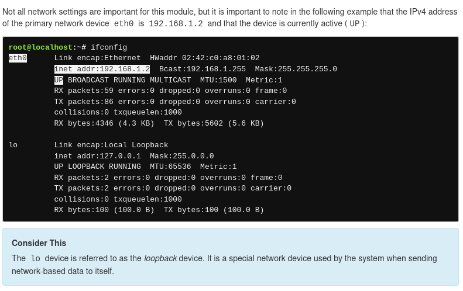

## Linux Unhatched

### Chapter 1 + 2 

What is Linux?

- Before we determine what makes Linux such a great asset to your skill-set, let’s define it first. Linux is operating system software that runs on a hardware computer system. An operating system is software that allows other programs like word processors and web browsers to be installed and run on a computer.

- Different commands:
  - the **ls** command displays a listing of information about files.
  - command [options…] [arguments…] is the syntax.
  -

- An argument can be used to specify something for the command to act upon. Example: if we put a name of a directory as a argument for ls, it will list the contents of the directory. (Directory as an argument)
  

- Options can be used to alter the behavior of a command. On the previous page, the ls command was used to list the contents of a directory. In the following example, the -l option is provided to the ls command, which results in a "long display" output, meaning the output gives more information about each of the files listed:

```
ls -l - long display
```

- Often the character is chosen to be mnemonic for its purpose, like choosing the letter l for long or r for reverse. By default, the ls command prints the results in alphabetical order, so adding the -r option will print the results in reverse alphabetical order.

```
ls -r - reverse
```

- Multiple options can be used at once, either given as separate options as in -l -r or combined like -lr. The output of all of these examples would be the same:

```
ls -l -r
ls -rl
ls -lr
```
---

- we can use the aptitude command to understand alteration of the behaviour of its command options
  
```
-v can be used for verbose

aptitude -vv moo
aptiture -vvv moo
```

### Chapter 3 

- **PWD**: Printing working directory. Its used to discover where you are currently within the filesystem. 

```
pwd [OPTIONS]
```

- virtual machines employ a prompt that displays the current working directory, emphasized with the color blue.

### Chapter 4 

- **CD**: Changing Directories. Useful way to move around the directory tree. 
```
cd [options] [path]
```

- Directories are equivalent to folders on Windows and Mac OS. Like these more popular operating systems, a Linux directory structure has a top level. It is not called "My Computer", but rather the root directory and it is represented by the / character. To move to the root directory, use the / character as the argument to the cd command.

---

- There are two types of paths: absolute and relative. Absolute paths start at the root of the filesystem, relative paths start from your current location.

- Shortcut **..**- Regardless of which directory you are in, DOTS, always represent One directory higher relative to the current one. (or the parent one).

- Shortcut **.**- represents you current directory. 
- Shortcut **~**- home directory of the current user. 

---

### Chapter 5

---

- Listing files. ls is also used to list the contents of a directory. 
  ```
  ls [Options] [file]
  ```
- if you combine with -l flag you can see permissions ownership or timestamps.
- Each line printed will correspond to a file contained within the directory. info can be broken down into fields separated by spaces. Fields are as: 


- There are also: Permissions, user owner, group owner and filesize. 


- As well as timestap, filena and symbolic links.


---

- File Sorting: ls by DEFAULT outputs sorted files alpahabetically. It can also sort by other methods. 

```
-t will sort the files by timestamp (ls -lt)
-S will sort the files by size (ls -l -S)
-r will reverse the order of any type of sort. (ls -lSr)
```

---
### Chapter 6
---
- Administrative Access. Preventing regular user from executing these command helps protect the system. 

- **su** command: 

```
su OPTIONS USERNAME
```

- su command allows you to temporarily act as a different user. it does this by creating a new shell. the shell is simply a text imput console that lets you type commands. 

- Utilizing the shell option is recommended as the login shell fully configures the new shell with the setting of the new user 
  
```
su - 
su -l 
su --login
- exit - to exint 
```
- for su command, password is required. 

---

- **sudo** command:
  
```
sudo [OPTIONS] COMMAND
```

- sudo allows user to execute a command as another use without creating a new shell. instead to execute a command with administrative privileges, use it as an argument to to the sudo command. 
  
- Like su, sudo commands assumes by default the root user arround should be used to execute commands. 
  
- sudo can be used to swtich to other user accounts as well. To specify a different user account we can use the -u option. 
- 
---

### Chapter 7

---

- Permissions- they determine the ways different user can interacti with a file or directory. 


- there are also different kind of Permission types. Read, Write and execute. 


---

### Chapter 8

---

- Changing File permissions. **chmod** command is used to change the permissions of a file directory. Only the root user or the use who owns the file is able to change the permissions of a file. 

- chmod is named after modes of access, so > chmod = CHange the MODes of access. 

- There are two types of techniques for changing permissions with the **chmod** command. symbolic and octal. 

- symbolic- good for changing one se of permissions at a time. 

- octal- or numeric requires knowled of the octal value of each of the permissions and requires all three set of permissions (user, group, other) to be specified every time. 

---

- Symbolic method. 

```
chmod [<SET><ACTION><PERMISSIONS>]... FILE

# To use the symbolic method of chmod first indicate which set of permissions is being changed. 
```
- <**SET**> symbols table: 


- <**ACTION**> symbols table:


- <**PERMISSIONS**> sumbols table:


- After that a space and the pathnames for the file to assign those permissions. 

- example:
```
# START
-rw-r--r-- 1 sysadmin sysadmin 647 Dec 20  2017 hello.sh 

#ADDING CHMOD

chmod u+x hello.sh
# u= user owner permission set
# += character to indicate a permission is being added
# x = execute permissions


# AFTER CHMOD 
-rwxr--r-- 1 sysadmin sysadmin 647 Dec 20  2017 hello.sh 

# to run it we need **./** = command should be run from the current directory.

```
---

### Chapter 9

---

- Changing File Ownership. Initially the owner of a file is the use who creates it. **chown** command is used to change the ownership of files and directories. Changing the use requires administrative access. A regular user cannot use this command to change the user owner of a file, even to give the ownership of one of their own files to another user. 

- **chown** command also permits changing group ownership, which can be accomplished by either root or the owner of the file. 

- To change the user owner of a file, the following syntax can be used. The first argument - [OWNER], specifies which user is to be the new owner. Second argument, FILE, specifies which file's ownership is changing. 

```
chown [OPTIONS] [OWNER] FILE
```

- in order to switch the owner for lets say from sysadmin to root user. we will need to add sudo  + password. 
  
```
# start before chown
-rw-r--r-- 1 sysadmin sysadmin   647 Dec 20  2017 hello.sh  

# command
sudo chown root hello sh.
password for sysadmin

#after chown
-rw-r--r-- 1 root sysadmin 647 Dec 20  2017 hello.sh 
```
- and if we try to execute it with ./hello.sh , it will NOT WORK, becuase we changed the owner to ROOT > we need sudo and a pasword.
  ```
  sudo ./hello.sh
  [sudo] password for sysadmin:
  ```
---

### Chapter 10 


---

- Few commands are availble for linux to view files. **cat** command (concatenate) is ofter used to view contents of small files. 
- it will display the entire contents of the file, hence why it is maily recommended for smaller files where the output is limited and does not require scrolling. 

```
cat [OPTIONS] [FILE]
```

- when viewing larger files, cat command can result it really large output that CANNOT BE PAUSE OR SCROLL THROUGH. 

- another way to view content of files is with **head** or **tail** commands. These commands are used to view select number of lines fro top or bottom of a file. 

```
head [OPTIONS] [FILE]

tail [OPTIONS] [FILE]
```

-default behavior of the head and tail commands in this shell is to display ten lines.

- The -n option with the head and tail commands can be used to specify the amount of lines to display. To use the -n option, specify the amount of lines from the file you want to display after the option and use the filename as an argument:

```
head -n number_of_lines filename
```

---

### Chapter 11

---

- Copying files. It is useful for numerous reasons: 
1. if a copy of a file created before changes are made, then it is possible to revert back to the original. 
2. Copy of a file can be use to transfer a file to removable media devices. 
3. Copy of an exisiting document can be used as a tempate for a new document. 

```
cp [OPTIONS] SOURCE DESTINATION

# example
sysadmin@localhost:~/Documents$ cp /etc/passwd .

# The second argument is the . character. That is a shortcut which represents the current directory.
```

- Permissions can have an impact on file management commands, such as the cp command. In order to copy a file, it is necessary to have execute permission to access the directory where the file is located and the read permission for the file being copied.

- It is also necessary to have write and execute permission on the directory the file is being copied to. Typically, there are two places where you should always have write and execute permission on the directory: your home directory and the /tmp directory.

---

- Another command for copying files is **dd** command. It can copy files or entire partitions at the bit level. 

```
dd [OPTIONS] OPERAND
```

- Useful features of the commad: 
1. can be used to clone or delete/wipe entire disks or partitions.
2. can be used to copy raw data to removable devices- USB/CDROMS
3. can backup and restore the MBR (MASTER BOOT RECORD).
4. can be used to create a file of a specific sieze that is filled with binary zeroes, which can be then used as a swap file(virtual memory).
   
- **dd** command creates a file named /tmp/swapex with 50 blocks of zeroes that are one megabyte in size.

```
~$ dd if=/dev/zero of=/tmp/swapex bs=1M count=50 
50+0 records in
50+0 records out
52428800 bytes (52 MB) copied, 0.825745 s, 635 MB/s
```

---

- Arguments for **dd** command: 


- NB! No block size or count needs to be specified when copying over entire devices. 
- Example to clone from one hard drvie (/dev/sda) to another (/dev/sdb) can be done with this command:
```
dd if=/dev/sda of=/dev/sdb
```

---

### Chapter 12

---

- Moving Files. **mv** command is used to move a file from one location in the filesystem to another. 

```
mv SOURCE DESTINATION
```

- **mv** command requires at least two arguments. 1st arg= source (path to the file to be moved). 2nd arg = destination (path to where the file will be moved to). 

- If a file is moved from one directory to another wtihout specifying a new name for the file, it will retain its original name.

- if we want to move multiple files, as long as the THE FINAL ARGUMENT IS PROVIDED to the command is the destination. 

- moving a file within same directory is an effective way to rename it. 

```
mv animals.txt zoo.txt
```

- NB! Permissions can have impact on the file management commands (mv included.). Moving a file requires write and execute permissions on both the origin and destination directories. 

---

### Chapter 13

- Removing files. **rm** is the command to delete files and directories. Deleted files do not go into a ''trash can '' they are permanently gone. 

```

rm [OPTIONS] FILE

```

- **rm** command will ingnore directories that is asked to remove, to delete a directory, use a recursive option -r or -R options. 

- Permissions can also affect **rm**. To be able to delete a file you will need to have write and execute permissions.

---

### Chapter 14

---

- Filteing Input. **grep** is command is a text filter that will search input and return lines which contain a match to a given pattern. 

```
grep [OPTIONS] PATTERN [FILE]
```


---

- Regular Expressions. They have two forms: basic and extended. Most commands that useregular expressions can interpret basic regular expressions. Extended regular expressions are not available for all commands and a command option is typically required for them to work correct.y. 

- Chart of Basic REGEX:


- For extended regular expressions, which must be either the **egrep** command or -E option with **grep**. 


---

- Basic patterns. Regex are patterns that oncly certain command are able to interpret. Regular expressions can be expanded to match certain sequences of characters in text. examples are to show power of **grep** command. 

- Anchor characters- one of the ways that can narrow down search results. 
  
- To prevent the shell from misinterpreting them as special shell characters, these patterns should be protected by strong quotes, which simply means placing them between single quotes. 

- First anchor character ^ is used to ensure that a pattern appears at the beginnin of the line. 

```
grep 'root' passwd

grep '^root' /etc/passwd

```
- second example will find all lines in /etc/passwd that start with root use the pattern ^root. Note that ^ must be the first character in the pattern to be effective. 

- Second anchor character $ can be used to ensure a pattern appears at the END OF THE LINE. 

```
grep 'r$' alpha-first.txt
```

- to example: to find the lines that end with r in the alpha-first.txt.

- Match a single character with .  (it will match any character except for the new line character).

- the pattern r..f would file any line that contained the letter r followed by exactly two characters (can be any character except a newline)

```
grep 'r..f' red.txt

# same concep can be run with other combinations: r and d

grep 'r..d' red.txt

# or . can be used any number of times. To find all words that have at least 4 characters the following pattern can be used:

grep '....' red.txt

# the line does not have to be an exact match, it simply must contain the pattern as seen here when r..t is searched for in the /etc/passwd

grep 'r..t' /etc/passwd
```

- Match a single character with []. Square brackets [] match a single character from the list or range of possible characters contained within the brackets. 

- To find all the lines in the profile.txt which have a number in them, use the pattern [0123456789] or [0-9]
```
grep '[0-9]' profile.txt

# also we can find the lines which contain any non-numeric cracters > we can insert ^ as the first characters inside brackets

grep '[^0-9]' profile.txt
```

- NB!: Do not mistake [^0-9] to match lines which do not contain numbers. It actually matches lines which contain non-numbers. Look at the original file to see the difference. The third and sixth lines only contain numbers, they do not contain non-numbers so those lines do not match.

- When other regular expression characters are placed inside of a square brackets, they are treated as literal characters. For example, the . normally matches any one character, but placed inside the brackets it will just match itself. Only lines which contain the . character are matched. 

```
grep '[.]' profile.txt
```

- Match a Repeated Character Or Patterns With *. * is used to match zero or more occurences of a character or pattern precending it. 

```
grep 're*d' red.txt
# e* would match zeor or more occurrences of the letter e

grep 'r[oe]*d' red.txt
#will match zero or more occurences of the o character or the e character.

```

- when used with only one character * is not very helpful. any of the following patterns would match every string or line in the file 


```
grep 'z*' red.txt

grep 'e*' red.txt


```

- this is because * can match 0 occurences of a pattern, to make it more useful is necessary to create a pattern which includes more than just one character preceding * , we can add anoher e > ee* to effectively match every line which contains at least one e.

```
grep 'ee*' red.txt
```


- Standard Input. if a file name is not given > grep will read from standard input( comesfrom the keyboard with input provided by the user). you can type whatever you want and the looked for phrase/word in quotes will be looked by grep.  to stop it Ctrl-D.

---

### Chapter 15

- **shutdown** command arranges fro the system to be brought down in a safe way. all logged in users are notified that the system is going down and within the last five minutes leading to the shudown, new logins are prevented. 

```
shutdown [OPTIONS] TIME [MESSAGE]
```

- shutdonw requires time argument specifying when the shutdown should begin. Formats can be : word- now, a time of day in the format hh:mm or the number of minites delay in the format +minutes. 

- NB clocks on different systems might be set to different timezons, to check it, use date in terminal. 

---

### Chapter 16

- Network Configuration: **ifconfig**- stands for interface configuration and is used to display network configuration information. 

- **iwconfig** is similar to ifconfig, but is dedicated to wireless network interfaces. 




- **ifconfig** can be used to temporarili modify network settings. Typically changes should be permanent, so ifcongi to make such is RARE.

- **ping** is used to verify connectivity between two computers. it does this by sending packets to another machine on a network. If the sender receives a response it should be possible to connect to the machine. 

- **ping** uses IP addresses to identify a computer on the network that it wants to connect to.  it will continue to send packages until the break command is entered in the console. 

- **ping** to limit how many pings are sent, use **-c** option followed by the number of pings to be set. 

```
ping -c 4 192.168.1.2
```

- ping is being limited to 4 times and and IP address to send them to. 

- if command is successful following output: 
```
64 bytes from 192.168.1.2: icmp_req=1 ttl=64 time=0.051 ms  
```

- if command fails: 
```
From 192.168.1.2 icmp_seq=1 Destination Host Unreachable
```

- ping command may fail even though the remote machine is connecting, This is because some admins configure their machines, or even entire networks to NOT RESPOND TO PING REQUESTS as a security measure. 

- ping also works with a domain name like yahoo. com, using it saves time and if is successfull > there is proper name resolution and IP address is functioning as well. 

---

### Chapter 17

- Viewing processes. running a command results in something called a process. In Linux, processes are executed with the privileges of the user who executes the command. This allows for processes to be limited to certain capabilities based on the user identity. 

- generally the operating system will differentiate users based upon whether they are the administrator. Typically regular users, like the sysadmin user, cannot control another user's processes. Users who have administrative privileges, like the root account, can control any user processes, including stopping any user process.

- **ps** will display the processes that are runnin in the current terminal by default. 

- it may return forllowing information: 


1. PID: The process identifier, which is unique to the process. This information is useful for controlling the process by its ID number.

2. TTY: The name of the terminal where the process is running. This information is useful for distinguishing between different processes that have the same name.

3. TIME: The total amount of processor time used by the process. Typically, this information isn't used by regular users.

4. CMD: The command that started the process.

- If we want to view the processes in the current terminal **ps**. If we want to view we can use **ps -e** > every process. if we want more detail we can add -f option > **ps -ef**.

---

