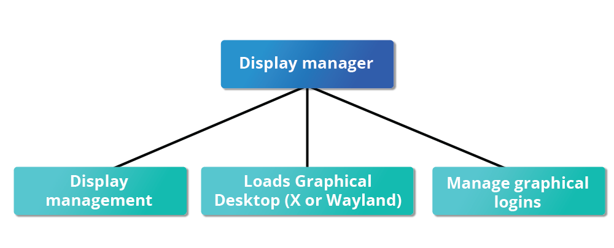
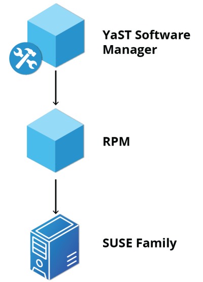

# Heading 1

## Heading 2

### Heading 3

#### Heading 4

##### Heading 5

###### Heading 6

It copies the html rules for headings. Two spaces is like <_br_> from html

# Test Heading 1

Some text

## Subheading 1

More text

---

How to bold text add \*\* or double underscore:

**bold**- prefferd method

**bold2**

How to make text italic use 1 asterics:

_Italic example_

It can be also used with 1 underscore on both sides.

If you want the text to be both bold AND Italic- 3 \*

**_Example of both_**

~~crossed off~~

==highlight== / extended feature of makrdown and its not supported by github. So we can use the mark html element
<mark>highlight</mark>.

Also superscript and subscript will ot work so we need to used the html tags:

This is a <sup>superscript</sup>

X<sup>2</sup>

This is a <sub>subsctipt</sub>

H<sub>2</sub>O

Emojis- it will not work

:smile:

How to show code

`code` - shows code on 1 line

```
let x = 1;
let y = 5;
```

By surrounding them with 3 (```) It preservves the indentation. you can even label it with the language that you use so it will be rendered in the syntax according.

how do you create a link? [this is a link ] + ()
in the parenthesis you put the link that you want to lead to.

[example link](https://google.com)

you can also use <https://google.com>

Images have the same syntax but we need to place ! before the parenthesis+ bracket structure.

Example: ! + [ ] + () = 
in the square brackets you can use the alt text
in the parethesis you can place the png/webp/jpeg format. OR uRL that points to an image.

Block quote >

> This is a start of a block quote
>
> > nested quote

Horizontal rule:

---

---

---

space + dash/underscore/star - surrounded by empty space in order to divide it.

Lists is marked with
Ordered list :

1. Item 1
2. Item 2
3. Item 3

Unordered list \* /+ / -

- item 1
- item 2

* item 3

- item 4

* item 5

To nest them you need to use TAB

- item 1
  - item 1.1

You can also make ordered list inside unordered .

Table from github:

| Col 1 | Col 2   |
| ----- | ------- |
| This  | is      |
| an    | example |
| table | with    |
| two   | columns |

Checkboxes:

- [ ] unchecked box

- [x] checked

# LFS 101 Linux Foundation

## Week 1

### Chapters 1-7

### Chapter 1

#### Course Introduction

- Brief introduction to the course.

### Chapter 2

#### The Linux Foundation

- Linux foundation introduction and overview. Information provided for Linux Foundation Events and Education.

- Linux foundation is the umbrella organization for many critical open source projects that power, corporations, spanning all industry sectors. Its work today extends far beyond Linux, fostering innovation at every layer of the software stack.

- Linux foundation training is for the community and by the community. Linux training is disribution-flexible, technically advanced, and created with the leader of Linux development community.

- There are three major distribution families within Linux: Red hat, SUSE and Debian.

### Chapter 3

### Linux Philosophy and Concepts

#### Linux History

- Linux is open source computer operating system, initially developed on and for Intel x86-based PCs. Created by Linus Torvalds in Helsinki, Finland in 1991. From a project to write his own operating system kernel. In 1992, Linux was re-licensed usingthe General Public License (GPL) by GNU (project of the FSF- free software Foundation). In 1998, IBM and Oracle announced their support for it.

#### Linux Philosophy

- Linux borrows heavily from the well-established Unix operating systems. Files are stored in a hierarchial filesystem, with the nop node of the system being the **root** of simply "/". Linux makes its components available via files or object that look like files. Devices, processes and network sockets are representented by file-like objects and can often be worked with using the same utilities for regular files. Linu is fully miltitasking (i.e., multiple threads of execution are performed symiltaneously), multiuser operating system with built-in networking and service processes knows as deamons in the Unix world.

#### Linux Terminology:

1. **Kernel**: the brain of the operating system. Glue between hardware and applications.
2. **Distribution**: Collection of software making up a Linux-based OS.(RHEL, Fedora, Ubuntu).
3. **Boot loader**: program that boots the operating systeam (GRUB, ISOLINUX).

4. **Service**: Program that runs as a backgroud process.(httpd, nfsd, ntpd, ftpd, named).

5. **Filesystem**: Method for storing and organizing files (ext3, ext4, FAT, XFS, XFS, NTFS, Btrfs).

6. **X Window System**: Provides the standart toolkit and protocol to build GUI on nearly all Linux systems.

7. **Desktop Environment**: Graphical user interface on top of the operating system. (GNOME, KDE, Xfce, Fluxbox).

8. **CommandLine**: Interface for typing commands on top of the operating system.

9. **Shell**: Command line interpreter that interprets the command line input and instructs the operating system to perform any necessary tasks and commands. (bash, tsch, zsh).

### Chapter 4

### Linux Basics And System Startup

#### Boot Process

- Linux boot process is the procedute of initializing the system. It consists of everything that happens from the switching ON of the power to fully operational user interface.

**List of processes of the boot process**:


---

**BIOS**: (focusing mainly on x86 family). When the PC is powered on, the Basic Input/Output System (BIOS) utilizes the hardware and tests the main memory. The process is called _POST_ (Power On Selt Test). The Bios software is stored on a read-only memory(ROM) chip on the motherboard. After this the remainder of the boot process is controlled by the OS.

**BIOS PROCESS DIAGRAM**


---

### **MASTER BOOT RECORD (MBR), EFI Partition, and Boot Loader**

- Upon complition of POST, system control passes from BIOS -> **boot loader**. The boot loader is sually stored on of the system's storage devices (HDD, SSD) in ehter the boot sector or the EFI partition (Extensible Firmware Interface). Up to this stage the machine does not access any mass storage media. Information is loaded from **CMOS** values.

- Most common boot loaders are GRUB( Grand Unified Boot loader), ISOLINUX (removable media), and DAS U-boot(for booting on embeded devices/appliances). When booting the boot loader is responsible for loading the kernel image and the initial RAM dis or filesystem into memory.

- Systems using the BIOS/MBR method, the boot loader resides at the first sector of the HDD, also known as the Master Boot Record. Size of 512 bytes, starting the boot loader examines the partititon table and finds bootable partition. After its found searches for secont stage boot loader (GRUB) and loads into RAM.

- Systems using EFI/UEFI, UEFI reads Boot Manager data to determine which UEFI application is to be launched and from where. Firmware launches UEFI application, for example GRUB, as defined in the boot entry in the firmware's boot manager. Second stage boot loader resited under **/boot**. Splash screen is displayed with option for a choice between OS / and/or kernel to boot. After selection, boot loader loads the kerned of the OS into RAM and passes control over it. Kernels are always compressed so the first order of operations is to uncompress themselves. After this will check and analyze any hardware device built into kernel.

---

### **KERNEL**

- The boot loader loads both the _kernel_ and an initial RAM-based file system (_initramfs_) into memory, so it can be used directly by the kernel.

- Upon loading in RAM, the kerner immediately unitializes and confugures the computer's memory and all the hardware attached to the system. All processors, I/O subsystems, storage decives and necessary user space appliactions.


---

### **THE INITIAL RAM DISK (initramfs)**

- The _initramfs_ filesystem image contains programs and binary files that perform all actions needed to mountthe proper root filesystem, including providing the kernel functionality required for the specific filesystem that will be used. Also loading the device drivers and mass storage controllers, by taking advantage of the **udev** system (user device), which is reponsible for figuring out which devices are present, locating device drivers and loading them. After root filesystem is found, its checked for errors and mounted.

- The _mount_ program instructs the operating system that a filesystem is ready for use and associates it with a particular point in the overall hierarchy of the filesystem (_mount point_). If its successful the initramfs is cleared from RAM and the _init_ program is on the root filesystem (**/sbin/init**) is executed. init handles the mounding and pivoting over the final real root filesystem. If special hardware drivers are needed before the mass storage can be accessed, they must be in the initramfs image.

---

### **TEXT-MODE LOGIN**

- At the end of the boot process, _init_ starts a number of text-mode prompts. They enable usage of username and password and later command shell access.


---

### **sbin/init and Services**

- After the set up is completed the kernel runs **sbin/init** this becomes the initial process and gets the system running. All processes can be traced back to **init** , exceptions are the **kernel processes** (started directly by the kernel and their job is to manage the internal operating system details.)

-Besides the startup, _init_ is responsible for shutting down the system cleanly. It also acts as a manager for all non-kernel processes, cleans after their completions and restarts user login services as needed.

-Traditionally the process of startup was done by Unix's System V (**SysVinit**), as the system had to pass a sequence of _runlevels_ containing collections of scripts with start and stop services.

- **SysVinit** viewed this as serial process divided into a series of sequential stages. Each stage to be completed before the next. Due to this start up did not easily take advantage of the **parallel processing** that could be done with newer gen systems. Due to this two main alternatives were developed:

1.  **Upstart** - Developed by Ubuntu and launched in 2006, Adopted in Fedora 9 and RHEL 6 and their clones.
2.  **systemd** - Adopted by Fedora in 2011, RHEL 7 and SUSE, Replaced Upstart in Ubuntu 16.04

### **systemd Features**

- Compared to the method **init** systems which start with **systemd** start significantly faster due to agressive parallelization techniques.

- Instead of complicaetd shel scripts _ /sbin/init _ now points to _ /lib/systemd/systemd _.

### Linux Filesystems

- Divided mainly into the following cathegories:

1. Conventional disk filesystems: ext3, ext4, XFS, Btrfs, JFS, NTFS, vfat, exfat, etc.
2. Flash storage filesystems: ubifs, jffs2, yaffs, etc.
3. Database filesystems
4. Special purpose filesystems: procfs, sysfs, tmpfs, squashfs, debugfs, fuse, etc.

### Partitions and Filesystems

- Definition: partition is dedicated subsection of physical storage media.

**A comparison between filesystems in Windows and Linux**

|                     | Windows     | Linux               |
| ------------------- | ----------- | ------------------- |
| Filesystem type     | NTFS/VFAT   | EXT3/EXT4/XFS/BTRFS |
| Partition           | Disk1       | /dev/sda1           |
| Mounting parameters | DriveLetter | MountPoint          |
| Base Folder         | C:\         | /                   |

### Filesystem Hierarchy Standard

- Linux stores files with a standard layout called FHS(Filesystem Hierarchy Standard), maintained by the Linux Foundation.

- Linux uses the ‘/’ character to separate paths (as sis UNIX unlike Windows, which uses ‘\’) and does not have drive letters. Multiple drives and/or partitions are mounted as directories in the single filesystem. Removable media such as USB drives and CDs, and DVDs will show up as mounted at /run/media/yourusername/disklabel for recent Linux systems or under /media for older distributions. For example, if your username is student, a USB pen drive labeled FEDORA might end up being found at /run/media/student/FEDORA, and a file README.txt on that disc would be at /run/media/student/FEDORA/README.txt.

  

---

- All Linux filesystem names are case-sensitive so /boot, /Boot and /BOOT represent three different directories.

---

### Choosing Linux Distribution

- Determening which Linux distribution(distro) to deploy required thoughtful planning. Figure below shows couple of the choices available(but not all).


- Sample questions for decision help:

1. What is the main function of the system (server or desktop)?
2. What types of packages are important to the organization? For example, web server, word processing, etc.
3. How much storage space is required, and how much is available? For example, when installing Linux on an embedded device, space is usually constrained.
4. How often are packages updated?
5. How long is the support cycle for each release? For example, LTS releases have long-term support.
6. Do you need kernel customization from the vendor or a third party?
7. What hardware are you running on? For example, it might be X86, RISC-V, ARM, PPC, etc.
8. Do you need long-term stability? Or can you accept (or need) a more volatile cutting-edge system running the latest software versions?

---

### Chapter 5

---

### Graphical Interface

- When using a Linux system you can use either a CLI- command line inetrface or a GUI- graphical User interface. The GUI allows you to interact with all the system easier in case you do not remember all the details.

#### X Window System

- Loading the graphical dekstop is one of the final stepsin the Linux boot process. A service called **Display Manager** keeps track of the displays being provided and loads the X server(named X because it provides graphical services to applications). These days X is old software, its being replaced by a newer system **Wayland** for the most part is identical, but the architecture behind is quite different.



---

**DESKTOP**

- A desktop environment consists of a **session manager**(which starts and maintains the componenets of the graphical session), **window manager** (which controls the placement) and movement of windows and set of **utilities**.

- If the display manager is not started by default in the default runlevel, you can start the graphical desktop different way, after logging on to a text-mode console, by running **startx** from the command line. Or, you can start the display manager (gdm, kdm, xdm, etc.) manually from the command line. This differs from running startx as the display managers will project a sign in screen.

- The default display manager for GNOME is called gdm. Another popular display manager is kdm, associated with KDE.

---

### Chapter 6

---

#### SYSTEM CONFIGURATION FROM THE GUI

- You can use the system to get familiar with the GUI and take a closer look at System, Display, Date and Time Settings.

#### NETWORK CONFIGURATION

- All Linux distributions have network configuration files, but file formats and locations can differ from one distribution to another.


##### NETWORK MANAGER

- Network Manager was developed to make things easier and more uniform across distributions. It can list all available networks (both wired and wireless), allow the choice of a wired, wireless, or mobile broadband network, handle passwords, and set up Virtual Private Networks (VPNs).

#### Wired and Wireless Connections

- Wired connections usually do not require complicated or manual configuration. The hardware interface and signal presence are automatically detected, and then Network Manager sets the actual network settings via Dynamic Host Configuration Protocol (DHCP).

- For static configurations that do not use DHCP, manual setup can also be done easily through Network Manager. You can also change the Ethernet Media Access Control (MAC) address if your hardware supports it. The MAC address is a unique hexadecimal number of your network card.


- Wireless networks are usually not connected by default. You can view the list of available wireless networks and see which one (if any) you are currently connected to by using Network Manager. You can then add, edit, or remove known wireless networks, and also specify which ones you want connected by default when present

- Network Manager can also manage your VPN connections.It supports many VPN technologies, such as native IPSec, Cisco OpenConnect (via either the Cisco client or a native open source client), Microsoft PPTP, and OpenVPN.

---

#### INSTALLING AND UPDATING SOFTWARE

- Each package in a Linux distribution provides one piece of the system, such as the Linux kernel, the C compiler, utilities for manipulating text or configuring the network, or for your favorite web browsers and email clients.

- Packages often depend on each other. For example, because your email client can communicate using SSL/TLS, it will depend on a package that provides the ability to encrypt and decrypt SSL and TLS communication and will not install unless that package is also installed at the same time.

- All systems have a lower-level utility that handles the details of unpacking a package and putting the pieces in the right places.

---

##### DEBIAN PACKAGING

- Debian-based systems, the higher-level package management system is the Advanced Package Tool (APT) system of utilities.

- **dpkg** is the underlying package manager for these systems. It can install, remove, and build packages. Unlike higher-level package management systems, it does not automatically download and install packages and satisfy their dependencies.

**package management debian family**


---

##### RED HAT PACKAGE MANAGER(RPM)

- Red Hat Package Manager (RPM) is the package management system popular on Linux distributions. Red Hat family distributions historically use RHEL/CentOS, and Fedora uses dnf, while SUSE family distributions such as openSUSE also use RPM but use the zypper interface.

**package management red hat family**


---

##### openSUSE YaST Software Management

- Yet another Setup Tool (**YaST**) software manager is similar to other graphical package managers. It is an RPM-based application. You can add, remove, or update packages using this application very easily.



---

### Chapter 7

---

#### COMMON APPLICATIONS
