# Heading 1

## Heading 2

### Heading 3

#### Heading 4

##### Heading 5

###### Heading 6

It copies the html rules for headings. Two spaces is like <_br_> from html

# Test Heading 1

Some text

## Subheading 1

More text

---

How to bold text add \*\* or double underscore:

**bold**- prefferd method

**bold2**

How to make text italic use 1 asterics:

_Italic example_

It can be also used with 1 underscore on both sides.

If you want the text to be both bold AND Italic- 3 \*

**_Example of both_**

~~crossed off~~

==highlight== / extended feature of makrdown and its not supported by github. So we can use the mark html element
<mark>highlight</mark>.

Also superscript and subscript will ot work so we need to used the html tags:

This is a <sup>superscript</sup>

X<sup>2</sup>

This is a <sub>subsctipt</sub>

H<sub>2</sub>O

Emojis- it will not work

:smile:

How to show code

`code` - shows code on 1 line

```
let x = 1;
let y = 5;
```

By surrounding them with 3 (```) It preservves the indentation. you can even label it with the language that you use so it will be rendered in the syntax according.

how do you create a link? [this is a link ] + ()
in the parenthesis you put the link that you want to lead to.

[example link](https://google.com)

you can also use <https://google.com>

Images have the same syntax but we need to place ! before the parenthesis+ bracket structure.

Example: ! + [ ] + () = 
in the square brackets you can use the alt text
in the parethesis you can place the png/webp/jpeg format. OR uRL that points to an image.

Block quote >

> This is a start of a block quote
>
> > nested quote

Horizontal rule:

---

---

---

space + dash/underscore/star - surrounded by empty space in order to divide it.

Lists is marked with
Ordered list :

1. Item 1
2. Item 2
3. Item 3

Unordered list \* /+ / -

- item 1
- item 2

* item 3

- item 4

* item 5

To nest them you need to use TAB

- item 1
  - item 1.1

You can also make ordered list inside unordered .

Table from github:

| Col 1 | Col 2   |
| ----- | ------- |
| This  | is      |
| an    | example |
| table | with    |
| two   | columns |

Checkboxes:

- [ ] unchecked box

- [x] checked

# LFS 101 Linux Foundation

## Week 2

### Chapters 8-14

---

#### Chapter 8: Command-Line Operations

- Introduction to the Command Line.
- Advantages of the command line tools:

1.  No GUI overhead is incurred.
2.  Every task can be accomplished in the CLI
3.  Easy implementation of scripts.
4.  You can sign into remote machines anywhere on the Internet.
5.  Initiation of graphical applications directly from the command line
6.  Graphical tools may change appearance, while CLI does not\*

- **Terminal emulator** emulates a standalone terminal within a window of the desktop. It behaves like pure text terminal. Types of terminals include- gnome-terminal, xterm, konsole.

- To open easily terminal in GNOME quickest way is Applications > System Tools > Terminal or Applications > Utilities > Terminal.

- On most GNOME-based distributions, you can always open a terminal by right-clicking anywhere on the desktop background and selecting Open in Terminal. If this does not work, you may need to install and activate the appropriate package, usually called gnome-shell-extension-apps-menu.

  You can also hit Alt-F2 and type gnome-terminal.

---

**Basic Utilities**

- **cat** : used to type out a file (or combine files)
- **head** : used to show the first few lines of a file
- **tail** : used to show the last few lines of a line
- **man** : used to view documentation

**Basic Elements**

Most input lines entered at the shell prompt have three basic elements:

- **Command**
- **Options**
- **Arguments**

The command is the name of the program or script you are executing. It may be followed by one or more options (or switches) that modify what the command may do. Options usually start with one or two dashes, for example, **-p** or **--print**, in order to differentiate them from arguments, which represent what the command operates on.

---

**sudo**

- When a user is configured with **sudo** capabilities, it means its provided with administrative(admin) privileges. **sudo** allows users to run programs using the security privileges of another
  user, generally root.

- Steps for settin up and running sudo:
  - If not enabled , Open CLI > type **su** > press Enter > provide root password >Enter > (if nothing is printed, its by design for security measures) > After that the prompt changes to **#**
  ```
  $ su Passowrd:
  #
  ```
  After that creation of a configuration file to enable the user account to use sudo. This file is created in **/ect/sudoers.d/**
  if you have username **student** it would look like this
  ```
  # echo "student ALL = (ALL) ALL" > /etc/sudoers.d/student
  ```
  Some Linux distributions will 'complain' if you do not also change permissions on the file by doing:
  ```
  # chmod 444
  /etc/sudoers.d/student
  ```
- When using sudo, by default you will be prompted to give a password (your own user password) at least the first time you do it within a specified time interval. It is possible (though very insecure) to configure sudo to not require a password or change the time window in which the password does not have to be repeated with every sudo command.

---

- Switching Between the GUI and the command line. In nature Linux is highly customizable, it will allow you to drop the graphical interface (temporary or permanently).
- Most Linux distributions give an option during installation (or have more than one version of the install media) to choose between a desktop or workstation (with a graphical user interface) or server (usually without one).

- Linux production servers are usually installed without the GUI, and even if it is installed, usually do not launch it during system startup. Removing the graphical interface from a production server can be very helpful in maintaining a lean system, which can be easier to support and keep secure.

---

**Virtual Terminals**

- **Virtual Terminals** (VT) are console sessions that use the entire display and keyboard outside of a graphical enviourment.
- Such terminals are considered "virtual" because, although there can be multiple active terminals, only one terminal remains visible at a time. A VT is not the same as a command line terminal window; you can have many of those visible simultaneously on a graphical desktop.

- One virtual terminal (usually VT 1 or VT 7) is reserved for the graphical environment, and text logins are enabled on the unused VTs.

- To switch between VTs, press CTRL-ALT-function key for the VT. For example, press CTRL-ALT-F6 for VT 6. Actually, you only have to press the ALT-F6 key combination if you are in a VT and want to switch to another VT.


**Turning Off the Graphical Desktop**

- Linux distributions can start and stop the graphical desktop in various ways. The exact method differs among distributions and between versions. For the newer system-based distributions, the display manager is run as a service, and you can stop the GUI desktop with the systemctl utility. In addition, most distributions will also work with the telinit command, as in:

  $ sudo systemctl stop gdm (or sudo telinit 3)

  and restart it (after logging into the console) with:

  $ sudo systemctl start gdm (or sudo telinit 5)

---

**Basic Operations**

- **Logging In and Out**
  Once your session is started (either by logging into a text terminal or via a graphical terminal program), you can also connect and log into remote systems by using Secure SHell (SSH). For example, by typing ssh student@remote-server.com, SSH would connect securely to the remote machine (remote-server.com) and give student a command line terminal window, using either a password (as with regular logins) or cryptographic key to sign in without providing a password to verify the identity.

---

- **Rebooting and Shutting Down**
  The preferred method to shut down or reboot the system is to use the shutdown command. This sends a warning message, and then prevents further users from logging in. The init process will then control shutting down or rebooting the system. It is important to always shut down properly; failure to do so can result in damage to the system and/or loss of data.

  When administering a multi-user system, you have the option of notifying all users prior to shutdown, as in:

```
$ sudo shutdown -h 10:00 "Shutting down for scheduled maintenance."
```

---

**Locating Applications**

One way to locate programs is to employ the **which** utility

```
$ which diff
```

If which does not find the program,where is a good alternative because it looks for packages in a broader range.

```
$ whereis diff
```

---

**Accessing Directories**

- When you first log into a system or open a terminal, the default directory should be your home directory. You can see the exact location by typing echo $HOME.

| Command        | Result                                          |
| -------------- | ----------------------------------------------- |
| **pwd**        | Displays the present working directory          |
| **cd** or cd ~ | Change to yourr home directory, ~(tilde)        |
| **cd** ..      | Change to parent directory (..)                 |
| **cd** -       | Change to previous working directory, (- minus) |

---

**Understanding Absolute and Relative Paths**

**Absolute pathname method**

- Absolute paths always start with /.

```
$ cd /usr/bin
```

**Relative pathname method**

- A relative pathname starts from the present working directory. Relative paths never start with /.

```
$ cd ../../usr/bin
```

**Example of path hierarchy**


---

**Exploring the Filesystem**

- Using the tree command is a good way to get a higher view of the filesystem. You can use **tree -d** to view just the directories and to suppress listing file names.

**Hard Links**

- The **ln** utility is used to create hard links and with the -s option, soft links. also known as symbolic links or symlinks.

```
$ ln file1 file2

$ ls -li file1 file2
```

- Hard links are very useful and they save space, but you have to be careful with their use, sometimes in subtle ways. For one thing, if you remove either file1 or file2 in the example, the inode object (and the remaining file name) will remain, which might be undesirable, as it may lead to subtle errors later if you recreate a file of that name.

**Soft (Symbolic) Links**

- They are created with the -s option:

```
$ ln -s file1 file3

$ ls -li file1 file3
```

- Symbolic links take no extra space on the filesystem (unless their names are very long). They are extremely convenient, as they can easily be modified to point to different places. An easy way to create a shortcut from your home directory to long pathnames is to create a symbolic link.

- Unlike hard links, soft links can point to objects even on different filesystems, partitions, and/or disks and other media, which may or may not be currently available or even exist. In the case where the link does not point to a currently available or existing object, you obtain a dangling link.

---

**Directory History Navigation**

- **cd** command remembers where you were last, and lets you get back there with cd -.
- **pushd** - can be used to change directory as well but remembers more than the last visited directory. It pushes your starting directory onto a list.
- **popd** - will send you back to those directories **IN REVERSE ORDER** Most recent directory will be the first one retrieved with popd.
- **dirs** - displays the list of directories.

---

**Working with files**

| **Command** | **USAGE**                                                                                                                                                                                                                                                                                        |
| ----------- | ------------------------------------------------------------------------------------------------------------------------------------------------------------------------------------------------------------------------------------------------------------------------------------------------ |
| **cat**     | Used for viewing files that are not very long; it does not provide any scroll-back                                                                                                                                                                                                               |
| **tac**     | Used to look at the file backwards,starting with the last line.                                                                                                                                                                                                                                  |
| **less**    | Used to view larger files because it is a paging progam. It pauses at each screen full of text, provides scroll-back capabilities and lets you search and nagigate within the file **!NB** Use / to search for a pattern in the forward direction and ? for a pattern in the backward direction. |
| **tail**    | Used to print the last 10 lines of a file by defailt. You can change the number of lines by doing -n 15 or just -15 if you wanted to look at the last 15 lines instead of the default.                                                                                                           |
| **head**    | The opposite of tail, by default, it prints the first 10 lines of a file.                                                                                                                                                                                                                        |

---

**touch** - is often used to set or update the access, change and modify times of files. It resets file's timestamp to match the current time.

- You can also create an empty file using **touch**

```
$ touch <filename>
```

It creates empty file as a placeholder for a later purpose.

- touch also provides several useful options **-t** option allows you to set the date and timestamp of the file to a specific value.

```
$ touch -t 12091600 myfile
```

This sets the **myfile**'s timestamp to 4 p.m. Dec 9th (12 09 1600)

---

**mkdir and rmdir**

- mkdir is used to create a directory:

```
mkdir sampdir
```

It creates a sample directory named sampdir under the current directory

```
mkdir /usr/sampdir
```

It creates a sample directory called sampdir under /usr

**rmdir** - used to remove a directory. The directory must be empty or the command will fail. To remove a directory and all of its contents you have to do **rm -rf**.

**Moving, Renaming or Removing a file**

- **mv** does two things: rename a file, move file to another location while possibly changing its name at the same time.

- when removing a file its a good practice to run it with interactive prompt ( **rm -i**)

| **Command** | **Usage**                   |
| ----------- | --------------------------- |
| **mv**      | Rename a file               |
| **rm**      | Remove a file               |
| **rm -f**   | Forcefully remove a file    |
| **rm -i**   | Interactively remove a file |

---

**Renaming or Removing a Directory**

**rmdir** works only empty directories, otherwise there will be an error

**rm -rf** its an easy way to remove a whole filesystem tree recursively. TO BE USED WITH CAUTION!

| **Command** | **Usage**                                 |
| ----------- | ----------------------------------------- |
| **mv**      | Rename a directory                        |
| **rmdir**   | Remove an empty directory                 |
| **rm -f**   | Forcefully remove a directory recursively |

---

**Modifying the Command Line Prompt**

- The PS1 variable is the character string that is displayed as the prompt on the command line. Most distributions set PS1 to a known default value, which is suitable in most cases. However, users may want custom information to show on the command line. For example, some system administrators require the user and the host system name to show up on the command line as in:

```
student@r9 $
```

The prompt above could be implemented by setting the PS1 variable to: **\u@\h \$**.

For example:

```
$ echo $PS1
\$
$ PS1="\u@\h \$ "
student@r9 $ echo $PS1
\u@\h \$
student@r9 $
```

- By convention, most systems are set up so that the root user has a pound sign (**#**) as their prompt.

---

### File Search

---

#### Standard File Streams

- When commands are executed, by default there are three standard file streams (or descriptors) always open for use: standard input (standard in or **stdin**), standard output (standard out or **stdout**) and standard error (or **stderr**).

- Usually, stdin is your keyboard, and stdout and stderr are printed on your terminal. stderr is often redirected to an error logging file, while stdin is supplied by directing input to come from a file or from the output of a previous command through a pipe. stdout is also often redirected into a file. Since stderr is where error messages (and warning) are written, usually nothing will go there.

- In Linux, all open files are represented internally by what are called file descriptors. Simply put, these are represented by numbers starting at zero. stdin is file descriptor 0, stdout is file descriptor 1, and stderr is file descriptor 2. Typically, if other files are opened in addition to these three, which are opened by default, they will start at file descriptor 3 and increase from there.

---

**I/O Redirection**

- Through the command shell, we can redirect the three standard file streams so that we can get input from either a file or another command, instead of from our keyboard, and we can write output and errors to files or use them to provide input for subsequent commands.

- For example, if we have a program called do_something that reads from stdin and writes to stdout and stderr, we can change its input source by using the less-than sign (<) followed by the name of the file to be consumed for input data:

```
$ do_something < input-file
```

If you want to send the output to a file, use the greater-than sign (>) as in:

```
$ do_something > output-file

```

you can do both at the same time as in:

```
$ do_something < input-file > output-file
```

Because stderr is not the same as stdout, error messages will still be seen on the terminal windows in the above example.

If you want to redirect stderr to a separate file, you use stderr’s file descriptor number (2), the greater-than sign (>), followed by the name of the file you want to receive everything the running command writes to stderr:

```
$ do_something 2> error-file
```

NOTE: By the same logic, do_something 1> output-file is the same as do_something > output-file.

A special shorthand notation can send anything written to file descriptor 2 (stderr) to the same place as file descriptor 1 (stdout): 2>&1.

```
$ do_something > all-output-file 2>&1
```

bash permits an easier syntax for the above:

```
$ do_something >& all-output-file
```

---

**PIPES**

- The UNIX/Linux philosophy is to have many simple and short programs (or commands) cooperate together to produce quite complex results, rather than have one complex program with many possible options and modes of operation. In order to accomplish this, extensive use of pipes is made. You can pipe the output of one command or program into another as its input.

In order to do this, we use the vertical-bar, pipe symbol (|), between commands as in:

```
$ command1 | command2 | command3
```

- This is extraordinarily efficient because **command2** and **command3** do not have to wait for the previous pipeline commands to complete before they can begin processing at the data in their input streams; on multiple CPU or core systems, the available computing power is much better utilized and things get done quicker.

- Furthermore, there is no need to save output in (temporary) files between the stages in the pipeline, which saves disk space and reduces reading and writing from disk.

---

**File Search**

- **Main Commands:**

  1.**locate**

  2.**find**

**locate**

- **locate** utility program performs a search while taking advantage of a previously constructed database of files and directories on your system, matching all entries that contain a specified character string.

- To avoid long lists, we can use **grep** as a filter. **grep** will print only the lines that contain one or more specified strings.

```
$ locate zip | grep bin
```

- This will list all the files and directories with both zip and bin in their name.

- **locate** utilizes a database created by a related utility, **updatedb**. Most Linux systems run this automatically once a day. However, you can update it at any time by just running **updatedb** from the command line as the root user.

---

**Wildcards and Matching Filenames**

- Wildcard can allow you to search for specific characters.

| **Wildcard** | **Matches**                                                                                             |
| ------------ | ------------------------------------------------------------------------------------------------------- |
| **?**        | Matches any single character                                                                            |
| \*           | Matches any string of characters                                                                        |
| **[set]**    | Matches any character in the set of characters, for ex **[adf]** will match any occurrence of a,d, or f |
| **[!set]**   | Matches any character not in the set of characters                                                      |

- To search for files using the ? wildcard, replace each unknown character with ?. For example, if you know only the first two letters are 'ba' of a three-letter filename with an extension of .out, type ls ba?.out.

- To search for files using the _ wildcard, replace the unknown string with _. For example, if you remember only that the extension was .out, type ls \*.out.

---

**The find Program**

- Extremely useful utility program. It recurses down the filesystem tree from any particular directory and locates files that match specified conditions.

- When no arguments are given, **find** lists all files in the current directory and all of its subdirectories.

- **Commonly used options**:

  - **-name** : only list files with a certain pattern in their name
  - **-iname**: also ignore the case of file names
  - **-type**: restrict the results to files of a certain specified type, such as **d** for directory, **l** for symbolic link, or **f** for a regular file.

  **Examples**:

Searching for files and directories named **gcc**:

```
$ find /usr -name gcc
```

Searching only for directories named **gcc**:

```
$ find /usr -type d -name gcc
```

Searching only for regular files named **gcc**:

```
$ find /usr -type f -name gcc
```

- Another use of **find** is being able to run commands on files that match your search criteria. The ** -exec** option is used for this purpose.

  - To find and remove all files that end with **.swp**:

  ```
  $ find -name "*.swp" -exec rm {} ';'
  ```

  - **{}** is a placeholder that will be filled with all the file names that result from the find expression, and the preceding command will be run on each one individually.
  - NB! you have to end the command with ';' (including sing-quotes) or \; Both forms are allowed.

  * One can also use the **-ok** option, which behaves the same as **-exec**, except that **find** will prompt you for permission before executing the command. This makes it a good way to test your results before blindly executing any potentially dangerous commands.

**Finding files based on Time and Size**

- To findfiles based on time

  ```
  $ find / -ctime 3
  ```

  - **-ctime** is when the inode metadata(file ownershi/permission) last changed (it is often but not necessarily- when the file was first created.)

  - **-atime** is search for accessed/last read

  - **-mtime** is search for modified/last written.

  - You can also add a number- meaning the number of days, it can be expressed as either a number **(n)**- exact value | **+n**- means grear than that number | **-n**- which means less than that number.

- To find based on sizes

```
$ find / -size 0
```

- Note that size here is in 512-byte blocks, by default.You can specify bytes **(c)**, kilobytes **(k)**, megabytes **(M)**, gigabytes **(G)**.

- Example: To find files greater than 10MB in size and running a command on those files:

```
$ find / -size +10M -exec command {}';'
```

---

### Installing Software

---

**Low Level Package Managers**

- Core parts of a Linux distribution and most of its add-on software are installed via the Package Management System. Each package contains the files and other instructions needed to make one software component work well and cooperate with the other components that comprise the entire system. Packages can depend on each other. For example, a package for a web-based application written in Python will require the appropriate Python packages to be installed first.

- There are two families of package managers(low-level):

  - Debian based family(**dpkg**)
  - RPM based family(**rpm**)

- **High-level tools** include: apt, dnf or zypper. Dependency resolution is a particularly important feature of the high-level tool, as it handles the details of finding and installing each dependency for you. Be careful, however, as installing a single package could result in many dozens or even hundreds of dependent packages being installed.


---

**Differences between Package Management Systems**

- The Advanced Packaging Tool (**apt**) is the underlying package management system that manages software on Debian-based systems. While it forms the backend for graphical package managers, such as the Ubuntu Software Center and synaptic, its native user interface is at the command line, with programs that include **apt** (or **apt-get**) and **apt-cache**.

- **dnf** is the open source command-line package-management utility for the RPM-compatible Linux systems that belong to the Red Hat family.


**Basic Packaging Commands**

| **Operation**                     | **RPM**                           | **DEB**                     |
| --------------------------------- | --------------------------------- | --------------------------- |
| **Install package**               | **rpm -i foo.rpm**                | **dpkg --install foo.deb**  |
| **Install package, dependencies** | **dnf install foo**               | **apt install foo**         |
| **Remove package**                | **rpm -e foo.rpm**                | **dpkg --remove foo.deb**   |
| **Remove package, dependencies**  | **dnf remove foo**                | **apt autoremove foo**      |
| **Update package**                | **rpm -U foo.rpm**                | **dpkg --install foo.deb**  |
| **Update package, dependencies**  | **dnf update foo**                | **apt install foo**         |
| **Update entire system**          | **dnf update**                    | **apt dist-upgrade**        |
| **Show all installed packages**   | **rpm -qa or dnf list installed** | **dpkg --list**             |
| **Get information on package**    | **rpm -qil foo**                  | **dpkg --listfiles foo**    |
| **Show packages named foo**       | **dnf list "foo"**                | **apt-cache search foo**    |
| **Show all available packages**   | **dnf list**                      | **apt-cache dumpavail foo** |
| **What package is file part of?** | **rpm -qf file**                  | **dpkg --search file**      |

---

#### Chapter 9: Finding Linux Documentation

**Linux Documentation Sources**

- **The man pages**
- **GNU info**
- **command help**
- **Other documentation sources**

**man**

- The man program searches, formats, and displays the information contained in the man page system. Because many topics have copious amounts of relevant information, output is piped through a pager program (such as less) to be viewed one page at a time. At the same time, the information is formatted for a good visual display.

- To list all pages on the topic, use the -f option. To list all pages that discuss a specific topic (even if the specified subject is not present in the name), use the –k option.

**GNU info system**

- This is the GNU project's standard documentation format, which it prefers as an alternative to man. The Info System is basically free-form, and supports linked subsections.

- Functionally, info resembles man in many ways. However, topics are connected using links

**--help Option**

- Another important source of Linux documentation is use of the --help option.

- Most commands have an available short description which can be viewed using the --help or the -h option along with the command or application.

**Other Documentation Sources**

- Desktop help system
- Package documentation
- Online resources

* GNOME: gnome-help or yelp
* KDE: khelpcenter

---

#### Chapter 10: Linux Processes

**Porcess and Process Attributes**

- What is a process? Process is an istance of one or more related tasks(threads) executing on your computer. Its not the same as program or a command.

- Processes use many ssystem resources, such as memory, CPU cycles and peripheral devices.

- Process Types: A terminal window is a process that runs as long as needed. You can alsorun programs in the background, which means they become detached from the shell.

| Process Type          | Description                                                                                                                                                                                                                                                                                                                                                  | Examples                               |
| --------------------- | ------------------------------------------------------------------------------------------------------------------------------------------------------------------------------------------------------------------------------------------------------------------------------------------------------------------------------------------------------------ | -------------------------------------- |
| Interactive Processes | Need to be started by a user, either at a command line or through a graphical interface such as an icon or a menu selection.                                                                                                                                                                                                                                 | bash, firefox, top, Slack, Libreoffice |
| Batch Processes       | Automatic processes which are scheduled from and then disconnected from the terminal. These tasks are queued and work on a FIFO (First-In, First-Out) basis.                                                                                                                                                                                                 | updatedb, ldconfig                     |
| Daemons               | Server processes that run continuously. Many are launched during system startup and then wait for a user or system request indicating that their service is required.                                                                                                                                                                                        | httpd, sshd, libvirtd, cupsd           |
| Threads               | Lightweight processes. These are tasks that run under the umbrella of a main process, sharing memory and other resources, but are scheduled and run by the system on an individual basis. An individual thread can end without terminating the whole process and a process can create new threads at any time. Many non-trivial programs are multi-threaded. | dconf-service, gnome-terminal-server   |
| Kernel Threads        | Kernel tasks that users neither start nor terminate and have little control over. These may perform actions like moving a thread from one CPU to another, or making sure input/output operations to disk are completed.                                                                                                                                      | kthreadd, migration, ksoftirqd         |

---

### Pocess Scheduling and States

- **scheduler** is a critical kernel function that constantly shift process on and off the CPU, sharing time according to relative priority, how much time is needed and how much has already been granted to a task.

**STATES**

1. **Running state** - a state where a process is currently executing instructions on a CPU or its awaiting time to be granted so it can execute. All processes that are in **running state** reside in a **run queue**. If a computer has multiple cores there is a run queue for each.


2. **Sleep State** - state where processes are waiting for something to happen before they can resume, perhaps for the user to type something. In this condition, a process is said to be sitting in a wait queue.

3. **Less frequent states** - terminating, Child process (when child process completes but its parent process has not asked about its state also called **zombie state**- its not really alive but it shows up in the system's list of processes.)

---

### Process and Thread IDs

- There are always multiple processes being executed. To keep track the system assigns them a unique process ID **PID** number. The **PID** number is used to track process state, CPU usage, memory use, etc.

- New **PIDs** are usually assigned in ascending order as processes are born. Hence PID 1 denotes the **init** process(system unitialization process) and succeeding processes are gradually assigned higher numbers.

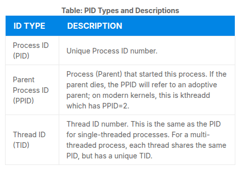

---

### Terminating a Process

- used when one of your application may stop working properly. To Terminate a process:

  **kill** -SIGKILL <**pid**> / kill -9 <**pid**>

**NB!** You can only kill your own processes, those who belong to another user are off-limits unless you are **root**

---

### User and Group IDS

- Linux allows users to access a system simultaneously and each user can run multiple processes. It identifies the user whol starts the process by the **REAL USER ID (RUID)**.

- The user who determines the access rights for the users is indentified by the **Effective UID**. The EUID may or may not be the same as the RUID.

- Users can be organized into enumerated groups, each group indentified by the **REAL GROUP ID (RGID)**. The access rights of the group are determined by the **Effective Group ID (EGID)**. Each user can be a mmember of one or more groups.


---

### Additional Priorities

At any given time, many processes are running on the system, however a CPU can actually accommodate only one task at a time, some processes are more important than others, so Linux allows you to set and manipulate proecss priority. Higher priority processes get prefential access to the CPU.

**NICE VALUE** / **NICENESS** - priority of a process can be set by specifiying it. **The lower the nice value, the higher priority**. Low values are assigned to processes that can wait longer. A process with a night nice value simply allows other processes to be executed first. In Linux a nice value of **-20** represents the **highest** priority and **+19** represents the **lowest**.

You can also assign a so-called **real-time priority** to time-sensitive tasks, such as controlling machines through a computer or collecting incoming data. This is just a very high priority and is not to be confused with what is called hard real-time, which is conceptually different and has more to do with making sure a job gets completed within a very well-defined time window.

**You can use renice command to set priorities**

---

### Load Averages

- The **load average** is the average of the load numbr for a given period of time. It takes into account processes that are:

  - Actively running on a CPU.
  - Considered runnable, but waiting on the run queue for a CPU to become available.
  - Sleeping: i.e. waiting for some kind of resource (typically, I/O) to become available.

**NB!** Linux differs from other UNIX-like operating systems in that it includes the sleeping processes. Furthermore, it only includes so-called **uninterruptible** sleepers, those which cannot be awakened easily.

**Interpreting Load Averages**

**Interpretation of numbers goes as: Average(first) > Last 5min (second) > Last 15min (third)**

---

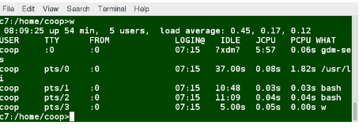

Interpreting Load Averages
The load average is displayed using three numbers (0.45, 0.17, and 0.12) in the below screenshot. Assuming our system is a single-CPU system, the three load average numbers are interpreted as follows:

- 0.45: For the last minute the system has been 45% utilized on average.
- 0.17: For the last 5 minutes utilization has been 17%.
- 0.12: For the last 15 minutes utilization has been 12%.

##

- If we saw a value of 1.00 in the second position, that would imply that the single-CPU system was 100% utilized, on average, over the past 5 minutes; this is good if we want to fully use a system. A value over 1.00 for a single-CPU system implies that the system was over-utilized: there were more processes needing CPU than CPU was available.

- If we had more than one CPU, say a quad-CPU system, we would divide the load average numbers by the number of CPUs. In this case, for example, seeing a 1 minute load average of 4.00 implies that the system as a whole was 100% (4.00/4) utilized during the last minute.

---

**Background and Foreground Processes**

- Linux supports bakground and foreground job processing.
  A job in this context means **command launched from a terminal window**. Foreground jobs run directly from the shell, when one is running other jobsneed to wait for schell access until completed. **Good for quick 'jobs', adverse effect for long 'jobs'**.

- If a job takes too long, you can run in it be background and free the shell for other tasks. Background jobs will be executed at a lower priority >> smooth execution of interactive tasks.

- All jobs are **executed in the foreground**, you can put a job in the background by **suffixing & to the command** example : **updatedb &**

- **CTRL -Z** is used to suspend a foreground job.
- **CTRL -C** is used to terminate it.
- **bg** is used to run a suspended process in the background.
- **fg** is used to run a background command in the foreground.

---

**Managing Jobs**

- The **jobs** utility displays all jobs running in the background.
- **jobs -l** provides PIDs of the background jobs.

---

### Listing Processes: ps and top

- **ps** (process status) provides information about currently running processes keyed by PID. To have periodic update on this status you can uses **top**.

- **ps** has many options for specifying exactly which tasks to examine, what information to display abou them and precisely what output format should be used.

- **ps Options:**

  - **-u** option to display infromation of processes for a specified username
  - **-ef** option to display all the processes in the system in full detail.
  - **-eLf** option displays one line of information for every thread.(a process can contain multiple threads).

- **BSD Style ps**: options are specified without preceding dashes. (**ps aux**: displays all processes of all users.)
  (**ps axo**: allows to specify which attributes you want to view)

- **The Process Tree**

- pstree displays the processes running on the system in the form of a tree diagram showing the relationship between a process and its parent processes and any other processes that it created.

- **top**- for monitoring system performance live over time. (**top** is better way to run **ps** over regular intervals- every few seconds)

- to exit **top** : **q.top**

- First line of **top**: quick summary of what is happening in the system:

  1. how long the system has been up
  2. how many users are logged on
  3. what is the load average

- The load average determines how busy the system is. A load average of **1.00** per CPU indicated a fully subscribed , but not overloaded system. If it goes over this average > processes are competing for CPU time. If load average is very high > indicates issues such as a runaway process(process in non-responding state).

- Second line of the **top**: displays total number of processes, number of running, sleeping, stopped and zombie processes. Comparing the number of running process with the load average **helps determening if the system has reached capacity or particular user is running too many processes.**

- Thirdline of the **top**: displays how CPU time is being divided between users **us** and the kernel **sy** by displaying the percentage of CPU time used for each.

  - Additional stats:

    1. **niceness - ni**- percentage of user jobs running at a lower priority.

    2. **id** - idle mode- should be low if the load average is high and vice versa.

    3. **wa** - percentage of jobs waiting if I/O is listed.

    4. **hi** - percentage of interrupts of hardware

    5. **si** - percentage of interrupts of software

       6.**st** - steal time- used with virtual machines, idle CPU time is taken for other users.

- Fourth and Fifht lines of **top**:

  - Fourth line- Physical memory _RAM_
  - Fifth line- Swap space

- Once the physical memory is exhausted, the system starts using swap space (temporary storage space on the hard drive) as an extended memory pool, and since accessing disk is much slower than accessing memory, this will negatively affect system performance.

- If the system starts using swap often, you can add more swap space. However, adding more physical memory should also be considered.

- Process list of **top**:


---

- **Interactive keys with top**


---

**Scheduling Future Processes Using _at_**

- **at** utility can be used to execute any non-interactive command at a specified time.

- Example:
  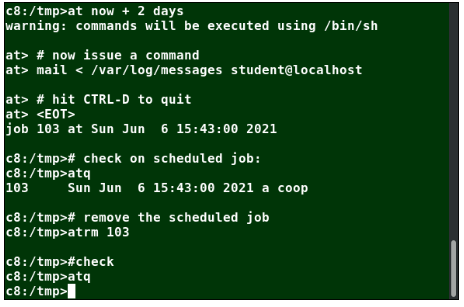

---

**Command: cron**

- **cron** is a time-based scheduling utility program. it can launch routine background jobs at specifici times or days. **cron** is driven by configuration file called /etc/crontab- contains various shell commands that need to be run at the properly scheduled times. They are both **system-wide crontab** files and **individual**. Each **crontab** = job, its composed of **CRON Expression** and a shell command to execute.

- **cronttab -e** will open crontab editor to edit existing jobs or to create new jobs. Each line of the crontab file will contain 6 fields:


- examples:

The entry \* \* \* \* \* **/usr/local/bin/execute/this/script.sh** will schedule a job to execute script.sh every minute of every hour of every day of the month, and every month and every day in the week.

The entry **30 08 10 06 \* /home/sysadmin/full-backup** will schedule a full-backup at 8.30 a.m., 10-June, irrespective of the day of the week.

**Command: anacron**

- While cron is used on UNIX-like OPs, Linux moved to a newer one: **anacron**.

- **cron**- expects the machine to run always, if the machine is powered off, scheduled jobs will **NOT RUN**
- **anacron**- will run necessary jobs in a controlled and staggered manner when the system is up and running.

**NB!** **anacron** still makes use of the cron infrastructure for submitting jobs on a daily, weekly, and monthly basis, but it defers running them until opportune times when the system is actually alive

**Command: sleep**

- Sometimes, a command or job must be delayed or suspended. Suppose, for example, an application has read and processed the contents of a data file and then needs to save a report on a backup system. If the backup system is currently busy or not available, the application can be made to sleep (wait) until it can complete its work. Such a delay might be to mount the backup device and prepare it for writing. An even simpler and frequent case is one where a system process needs to run periodically to take care of any work that has been queued up for it to deal with and then has to lurk in the background until it is needed again.

- **sleep** suspends execution for at least the specified period of time, which can be given as the number of seconds (the default), minutes, hours, or days. After that time has passed (or an interrupting signal has been received), execution will resume.

- Suffixes for **sleep**
  - s for seconds (the default)
  - m for minutes
  - h for hours
  - d for days.

**sleep vs at**

- sleep and at are quite different; sleep delays execution for a specific period, while at starts execution at a specific designated later time.

---

## Chapter 11: File Operations

**Introduction to Filesystems**

- "Everyting is a file"- quote often repeadeted by users of Linux and all Unix-like operating systems.

- On Linux the filesystem is structured like a tree. The tree is portrayed as inverted and starts at what is most often called **root directory** aka the beginning/ or trunk. It is denoted by **/**. The root directory is not the same as the root user.

- Linux supports a number of native filesystems types expressly created by Linux developers: **ext3**, **ext4**, **squashfs**, **btrs**.

- It also offers implementations of filesystems used on other alien operating systems, such as those from:

  - Windows (ntfs, vfat, exfat)
  - SGI (xfs)
  - IBM (jfs)
  - MacOS (hfs, hfs+)

- The most advanced filesystem types in common use are the journaling varieties: ext4, xfs, btrfs, and jfs.

- Linux also makes use of network (or distributed) filesystems, where all or part of the filesystem is on external machines. Besides NFS (Network File System) whose usage we will discuss, this includes Ceph, Lustre, and OpenAFS.

---

**Linux Partitions**

- Each filesystem on a Linux system occupies a disk partition. Partitions help organize the contents of disks according to the kind of use the cata contained. (important programs required to run the systems are often kept on a seprate partition knows as the root or / and the files for regular users that system holds can be found at /home).

- Advantages of this isolation by type is when all available space on a particular partition is exaused the system may still perate normally. Plus its easier to confine if data is corrupted. Common uses is **Gparted** Utility.

---

**Mount Points**

- Before you can start using the filesystem, you need to mount it on the filesystem tree at a mount point. This is simply a directory(which may or not be empty) where the filesystem is to be grafter on. You might need to create the directory if it does not already exist.


---

**Mounting and Unmounting**

- Command **mount** is used to attach a filesystem somewhere within the filesystem tree. The basic arguments are the device node and mount poin.

```
$ sudo mount /dev/sda5 /home
```

- This will attach the filesystem containd in the disk partition associated with the /dev/sda5 device node into the filesystem tree at the /home mount point.

- To unmount the partition, the commandis

```
$ sudo umount /home
```

- **NB!** The command is **umount** NOT UNMOUNT.

- Executing mount without any arguments will show all presently mounted filesystems.

- Command **df -Th** (disk free) will display information about mounted filesystems, including the filesystem type, usage statistics and available space.

---

**NFS AND NETWORK FILESYSTEMS**

- In order to share data across physical systems is required network. A network filesystem may have all its data on one machine or have it spread out on more than one network **node**. Such network filesystem can be described as a grouping of lower-level filesystems of varying types.


- Many system administrators mount remote users' home directories on a server in order to give them access to the same files and configuration files across multiple client systems. This allows the users to log in to different computers, yet still have access to the same files and resources.

- The most common such filesystem is named simply NFS (the Network Filesystem).

---

**NFS ON THE SERVER**

- On the server machine, NFS uses daemons (built-in networking and service processes in Linux) and other system servers are started at the command line by typing:

```
$ sudo systemctl start nfs
```

- - On some systems, such as RHEL/CentOS, and Fedora, the service is now called nfs-server, not nfs.

---

- The text file /etc/exports contains the directories and permissions that a host is willing to share with other systems over NFS. A very simple entry in this file may look like the following:

```
/projects *.example.com(rw)

```

- This entry allows the directory /projects to be mounted using NFS with read and write (rw) permissions and shared with other hosts in the example.com domain.

- After modifying the /etc/exports file, you can type exportfs -av to notify Linux about the directories you are allowing to be remotely mounted using NFS. You can also restart NFS with sudo systemctl restart nfs, but this is heavier, as it halts NFS for a short while before starting it up again. To make sure the NFS service starts whenever the system is booted, issue sudo systemctl enable nfs.

---

**NFS ON THE CLIENT**

- If its desired to have the remote filesystem mounted automaticall upon system boot, **/etc/fstab** is modified to accomplish this. Entry in the client's **/etc/fstab** might look like:

```
servername:/projects /mnt/nfs/projects nfs defaults 0 0
```

- You can also mount the remote filesystem without a reboot or as one-time moun b directly using the **mount** command.

```
$ sudo mount servername:/projects /mnt/nfs/projects
```

- if /etc/fstab is not modified, this remote mount will not be present the next time the system is restarted. Furthermore, you may want to use the nofail option in fstab in case the NFS server is not live at boot.

---

**FILESYSTEM LAYOUT**

- Overview: Each user has a home directory, usually placed under /home. The /root ("slash-root") directory on modern Linux systems is no more than the home directory of the root user (or superuser or system administrator account).

- On multi-user systems, the /home directory infrastructure may be mounted as a separate filesystem on its own partition or even exported (shared) remotely on a network through NFS.

---

**Directory: /bin and sbin/**

- /bin directory contains executable binaries, essential commands used to boot the system or in single-user mode, and essential commands required by all system users, such as cat, cp, ls, mv, ps, and rm.

- /sbin directory is intended for essential binaries related to system administration, such as fsck and ip.

- Commands that are not essential (theoretically) for the system to boot or operate in single-user mode are placed in the /usr/bin and /usr/sbin directories.

- On most Linux distributions today, /usr/bin and /bin are actually just symbolically linked together.

---

**/proc Filesystem**

- Certain filesystems, like the one mounted at /proc, are called pseudo-filesystems because they have no actual permanent presence anywhere on the disk.

- The /proc filesystem contains virtual files (files that exist only in memory) that permit viewing constantly changing kernel data. /proc contains files and directories that mimic kernel structures and configuration information. It does not contain real files, but runtime system information, e.g. system memory, devices mounted, hardware configuration, etc.

```
/proc/cpuinfo
/proc/interrupts
/proc/meminfo
/proc/mounts
/proc/partitions
/proc/version

/proc has subdirectories as well, including:

/proc/<Process-ID-#>
/proc/sys
```

---

**Directory: /dev**

- contains device nodes, a type of pseudo-file used by most hardware and software devices, except for network devices.

- Empty on the disk partition when it is not mounted

- Contains entries which are created by the udev system, which creates and manages device nodes on Linux, creating them dynamically when devices are found.

The /dev directory contains items such as:

1. /dev/sda1 (first partition on the first hard disk)
2. /dev/lp1 (second printer)
3. /dev/random (a source of random numbers).

---

**Directory: /var**

- Contains files that are expected to change in size and content as the system is running

- Contents fall into:

  - System log files: /var/log
  - Packages and database files: /var/lib
  - Print queues: /var/spool
  - Temporary files: /var/tmp.

- The /var directory may be put on its own filesystem so that growth of the files can be accommodated and any exploding file sizes do not fatally affect the system. Network services directories such as /var/ftp (the FTP service) and /var/www (the HTTP web service) are also found under /var.

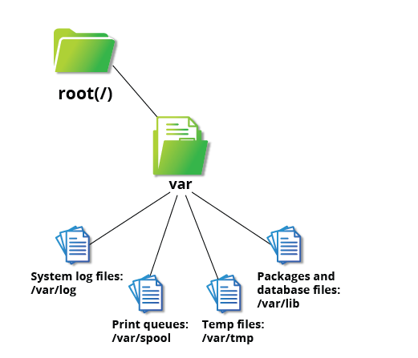

---

**Directory: /etc**

- /etc directory is the home for system configuration files. It contains no binary programs, although there are some executable scripts.

---

**Directory: /boot**

- The directory contains few essential files that are needed to boot the system.

  - **vmlinuz** - The compressed Linux kernel, required for booting.
  - **initramfs**- The initial ram filesystem, required for booting, sometimes called initrd.
  - **config** The kernel configuration file, only used for debugging and bookkeeping.
  - **system.map** - kernel symbol table, only used for debugging.

- The Grand Unified Bootloader (GRUB) files such as /boot/grub/grub.conf or /boot/grub2/grub2.cfg are also found under the /boot directory.

**Directory: /lib and /lib64**

- **/lib** contains librarires for essential programs in /bin and /sbin. These library filenames either start with **ld** or **lib**

- Most of these are what is known as dynamically loaded libraries (Shared libraries/Shared Objects). On some linux distributions there exists /lid64 directory containing 64bit librarires, while /lib contains 32-bit.

- just like for /bin and /sbin, the directories just point to those under /usr.

---

**Directory: /media ,/run, and /mnt**

- Used for removable media. Most Linux systems are configured so any removable media are automatically mounted when the system notices something has been plugged in.

- Modern distros place these mount points under /run directory.

  -Since the early days of Unix the /mnt directory has been used for temporary mounting filesystems.

**Additional Directories under /**


---

**Directory: /usr**


---

#### Comparing Files with diff

- diff is used to compare files and directories.


- To compare files: **diff** [options] <filename1*> <filename2*>

- You can compare up to 3 files with **diff3** > diff3 file1 file2 file3

- Using **patch** : many modifications to source code are distributed by patches, mainly for updates.

Usage of **patch**

```
$ patch -p1 < patchfile
$ patch originalfile patchfile

```

---

**File Utility**

- In Linux file's extensions does not categorize its nature as other OS. (If there is a file.txt One can not assume its a text file and not an executable program.)

- In Linux, a filename is generally more meaningful to the user of the system than the system itself. In fact, most applications directly examine a file's contents to see what kind of object it is rather than relying on an extension.

- The real nature of a **file** can be ascertained by using the file utility. For the file names given as arguments, it examines the contents and certain characteristics to determine whether the files are plain text, shared libraries, executable programs, scripts, or something else.

---

#### Backing Up and Compressing Data

**Backing up data**

- Basic ways include:
- simple copying with **cp** (can only copy files to and from destinations on the local machine/unless copy to from a filesystem mounted NFS)

- robust and efficient **rsync** (checks inf the file copied already exists, if exists and there is no change in size or modification time, **rsync** will avoid unnecessary copy and save time.it copies only the parts of files that have actually changed). **rsync** can be used to copy files from one machine to another. Locations are designated in the target:path form, where target can be in the form of someone@host. The someone@ part is optional and used if the remote user is different from the local user.

- rsync is very efficient when recursively copying one directory tree to another, because only the differences are transmitted over the network. One often synchronizes the destination directory tree with the origin, using the -r option to recursively walk down the directory tree copying all files and directories below the one listed as the source.

- For example, a very useful way to back up a project directory might be to use the following command:

```
$ rsync -r project-X archive-machine:archives/project-X
```

- **Dangers of rsync**- rsync can be very destructive! Accidental misuse can do a lot of harm to data and programs, by inadvertently copying changes to where they are not wanted. Take care to specify the correct options and paths. It is highly recommended that you first test your rsync command using the -dry-run option to ensure that it provides the results that you want.

- To use **rsync** at the command prompt, type rsync sourcefile destinationfile, where either file can be on the local machine or on a networked machine; The contents of sourcefile will be copied to destinationfile.

```
  $ rsync --progress -avrxH  --delete sourcedir destdir

```

---

**Compressing Data**

- Different methods to perform Compression for Linux:


- the **tar** utility is often used to group files in an archive and then compress the whole archive at once.

---

**Compression tools**

- Using **gzip**


- Using **bzip2** - has a syntax that is similar to gzip but it uses a different compression algorithm and produces significantly smaller files, at the price of taking a longer time to do its work. Thus, it is more likely to be used to compress larger files.

- **May become deprecated**


- Using **xz**- most space-efficient compression utility frequently used in Linux and is the choice for distributing and storing archives of the Linux kernel.

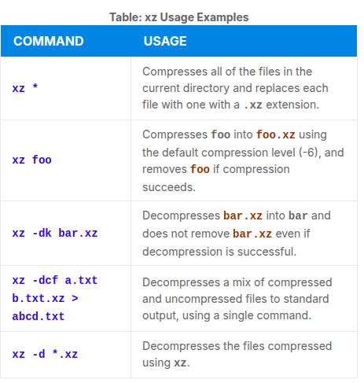

- Using **zip** - zip program is rarely used to compress files in Linux, it may be needed to examine and decompress archives from other operating systems. It is only used in Linux when you get a zipped file from a Windows user or environment or from Internet downloads. It is a legacy program. It is neither fast nor efficient.


---

**Archiving and Compressing Data Using tar**

- tar OR "tape archive" and is used to archive files to a magnetic tape. It allows you to create or extract files from an archive file, often called a tarball.


**Relative Compression Times and Sizes**

- To demonstrate the relative efficiency of gzip, bzip2, and xz-the include directory from the kernel source can be added to show how much time the achives take to execute.

---

**Disk-to-Disk Copying (dd)**

- The dd program is very useful for making copies of raw disk space. For example, to back up your Master Boot Record (MBR) (the first 512-byte sector on the disk that contains a table describing the partitions on that disk), you might type:

```
dd if=/dev/sda of=sda.mbr bs=512 count=1
```

<mark>**WARNING**<mark>

- If command:

```
dd if=/dev/sda of=/dev/sdb
```

- to make a copy of one disk onto another, will delete everything that previously existed on the second disk.

- An exact copy of the first disk device is created on the second disk device.

<mark>**DO NOT EXPERIMENT**<mark>

## Chapter 12: Text Editors

**Basic Editors: nano and gedit**

- Overview:At some point, you will need to manually edit text files. You might be composing an email offline, writing a script to be used for bash or other command interpreters, altering a system or application configuration file, or developing source code for a programming language such as C, Python or Java.

- Linux users and administrators may sidestep using a text editor, instead employing graphical utilities for creating and modifying system configuration files. However, this can be both more laborious than directly using a text editor and more limited in capability. In fact, word processing applications (including those that are part of common office application suites) are not really basic text editors; they add a lot of extra (usually invisible) formatting information that will probably render system administration configuration files unusable for their intended purpose. Thus, knowing how to confidently use one or more text editors is really an essential skill to have for Linux.

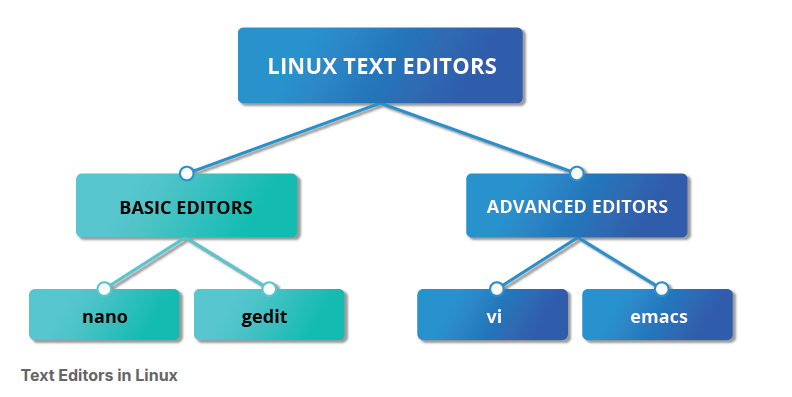

- If you want to create a file without using an editor, there are two standard ways to create one from the command line and fill it with content.

- The first is to use **echo** repeatedly:

```
$ echo line one > myfile
$ echo line two >> myfile
$ echo line three >> myfile
```

- Note that while a single greater-than sign (>) will send the output of a command to a file (and obliterate any already existing version of that file!), two of them (>>) will append the new output to an existing file.

- The second way is to use cat combined with redirection:

```
$ cat << EOF > myfile
> line one
> line two
> line three
> EOF
```

- In this example, the string used to show the beginning and end of the process need not be EOF; it could be STOP or any other string not used in the content itself. Both techniques produce a file with the following lines in it:

```
line one
line two
line three
```

---

**nano**

- To open a file, you need to type **nano** <**filename**> If the file does not exist, itwill be created.

- there is a two line shortcut bar at the bottom of the screen that lists available commands.


---

**gedit**

- Widely used on linux distros, information will be added for respect of the source material. Due to current distro, more practice will be with **mousepad**.

- same type of opening: **gedit** <**filename**>.

---

**vi and emacs**

- Both vi and emacs have a basic, purely text-based form that can run in a non-graphical environment. They also have one or more graphical interface forms with extended capabilities; these may be friendlier for a less experienced user. While vi and emacs can have significantly steep learning curves for new users, they are extremely efficient when one has learned how to use them.

---

**Intro to vi**

- Usually, the actual program installed on your system is vim, which stands for Vi IMproved and is aliased to the name vi. The name is pronounced as “vee-eye”.

- Even if you do not want to use vi, it is good to gain some familiarity with it: it is a standard tool installed on virtually all Linux distributions. Indeed, there may be times when there is no other editor available on the system.

**vimtutor**

- typing **vimtutor** unches a short but very comprehensive tutorial for those who want to learn their first vi commands. Even though it provides only an introduction and just seven lessons, it has enough material to make you a very proficient vi user, because it covers a large number of commands. After learning these basic ones, you can look up new tricks to incorporate into your list of vi commands because there are always more optimal ways to do things in vi with less typing.


---

**Modes in vi**
-3 default modes:

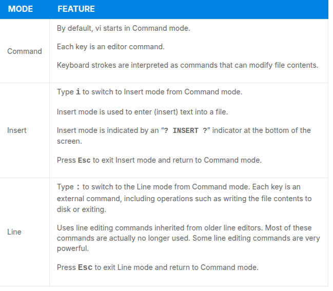

---

**Working with files in vi**


---

**Changing Cursors Positions in vi**

- Line mode commands (those following colon : ) require the ENTER key to be pressed after the command is typed.


---

**Searching for text in vi**


---

**Working with Text in vi**


---

**Using External Commands in vi**

- Typing **sh** command opens an external command shell. When you exit the shell, you will resume your editing session.
- Typing **!** executes a command from within vi. The technique is best suited for non-interactive commandssuch as : ! wc %. Typing this will run the WC(word count) command on the file, the character % represents the file currently being edited.

---

#### EMACS

- Popular competitor for vi. Does not work with modes. Highly customizable and includes large number of features.

- Table of key combinations that are often used.

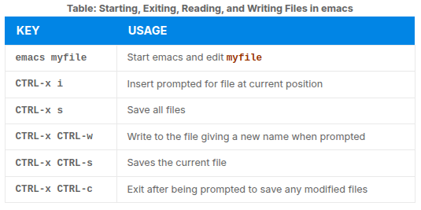

- The emacs tutorial is a good place to start learning basic commands. It is available any time when in emacs by simply typing CTRL-h (for help) and then the letter t for tutorial.

---

**Cursor Position Change**


---

**Text Search**


---

**Text Work**

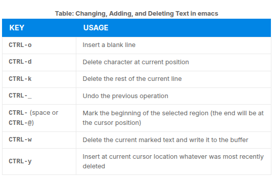

---

## Chapter 13: User Environment

**Accounts, Users and Groups**

**Identifying the Current User**

```
whoami - to identify the current user
who - to list currently logged-on users
who -a gives more detailed information
```

---

**User Startup Files**

- In Linux, command shell uses one or more start up files to configure the user environment. Files in the **/etc** directory define global setting for all users, while the initialization files in the user's home directory can include and/or override the global settings.

- You can still use it for the following:
  - Customizing the prompt
  - Defining command line shortcuts and aliases
  - Setting the default text editor
  - Setting the path for where to find executable programs

---

**Order of Startup Files**

- When you first login to Linux, **/etc/profile** is read and evaluated, the following files are searched in listed order:

1. ~/.bash_profile
2. ~/.bash_login
3. ~/.profile

- where ~/ denotes the user's home directory. The Linux login shell evaluates whatever startup file that it comes across first and ignores the rest. This means that if it finds ~/.bash_profile, it ignores ~/.bash_login and ~/.profile. Different distributions may use different startup files.

- However, every time you create a new shell, or terminal window, etc., you do not perform a full system login; only a file named ~/.bashrc file is read and evaluated. Although this file is not read and evaluated along with the login shell, most distributions and/or users include the ~/.bashrc file from within one of the three user-owned startup files.

- Most commonly, users only fiddle with ~/.bashrc, as it is invoked every time a new command line shell initiates, or another program is launched from a terminal window, while the other files are read and executed only when the user first logs onto the system.

- Recent distributions sometimes do not even have .bash_profile and/or .bash_login, and some just do little more than include .bashrc.


---

**Creating Aliases**

- Lin linux you can create customized commands or modify the behaviour of already existing ones by creating **aliases**. They are stored in your ~/.bashrc file, so they are available to any command shell created.

- **unalias** removes an alias.

- typing **alias** with no arguments will list currently defined aliases.

---

**Basics of Users and groups**

- All Linux users are assigned an unique used IR (**uid**) (which is an integer, normal starts from 1000 and go up)

- Linux uses groups for organizing users. They are collections of accounts with shared permissions. Used to establish a set of users, which ahave common interests for the purposes of access rights, privileges and security considerations. Rights are granted on basis of the user and the group they belong to.

- To control the group membership you have to use **/etc/group** file. It shows list of groups and their members.
- By default every user belongs to a default group. All members enjoy the same level of privilege.

- Users can have one or more group IDs(**gid**) including the default on, that is the same as the user ID. These numbers are assosicated with names through the files **/etc/passwd** and **/etc/group**.

---

**Adding and Removing Users**

- **Adding new user** - with the command **useradd**

- **Removing user** - with the command **userdel**

- In the simplest form, an account for the new user bjmoose would be done with:

```
$ sudo useradd bjmoose
```

which, by default, sets the home directory to **/home/bjmoose**, populates it with some basic files (copied from **/etc/skel**) and adds a line to **/etc/passwd** such as:

```
bjmoose:x:1002:1002::/home/bjmoose:/bin/bash

```

- sets the default shell to /bin/bash. Removing a user account is as easy as typing userdel bjmoose. However, this will leave the /home/bjmoose directory intact. This might be useful if it is a temporary inactivation. To remove the home directory while removing the account one needs to use the -r option to userdel.

- Typing **id** with no argument gives information about the current user, as in:

```
$ id
```

it will give something like:

```
uid=1002(bjmoose) gid=1002(bjmoose) groups=106(fuse),1002(bjmoose)
```

- If given the name of another user as an argument, id will report information about that other user.

---

**Adding and Removing Groups**

- To add new group is with **groupadd**.

```
$ sudo /usr/sbin/groupadd anewgroup

```

- To remove the group we can use **groupdel**.

```
$ sudo /usr/sbin/groupdel anewgroup
```

- Adding a user to an already existing group is done with **usermod**.

- If you would look at what groups the user already belongs to:

```
$ groups rjsquirrel
```

- And then add the new group:

```
$ sudo /usr/sbin/usermod -a -G anewgroup rjsquirrel

$ groups rjsquirrel
```

- These utilities update /etc/group as necessary. Make sure to use the -a option, for append, so as to avoid removing already existing groups. groupmod can be used to change group properties, such as the Group ID (gid) with the -g option or its name with then -n option.

- Removing a user from the group is somewhat trickier. The -G option to usermod must give a complete list of groups. Thus, if you do:

```
$ sudo /usr/sbin/usermod -G rjsquirrel rjsquirrel

$ groups rjsquirrel
```

---

**su and sudo**

- When assigning elevated privileges, you can use the command su (switch or substitute user) to launch a new shell running as another user (you must type the password of the user you are becoming). Most often, this other user is root, and the new shell allows the use of elevated privileges until it is exited. It is almost always a bad (dangerous for both security and stability) practice to use su to become root. Resulting errors can include deletion of vital files from the system and security breaches.

- Granting privileges using sudo is less dangerous and is preferred. By default, sudo must be enabled on a per-user basis. However, some distributions (such as Ubuntu) enable it by default for at least one main user, or give this as an installation option.

---

**Elevating to root account**

- To temporarily become the superuser for a series of commands, you can type **su** and then be prompted for the root password.

To execute just one command with root privilege type **sudo** <**command**>. When the command is complete, you will return to being a normal unprivileged user.

**sudo** configuration files are stored in the **/etc/sudoers** file and in the **/etc/sudoers.d/** directory. By default, the **sudoers.d** directory is empty.

---

**Environment Variables**

- Are quantities that have specific values which may be utilized by the command shell, such as bash or other utilities and applications.

- Environment variable is actually just a character string that contains information used by one or more applications. There are a number of ways to view the values of currently set environment variables; one can type set, env, or export. Depending on the state of your system, set may print out many more lines than the other two methods.

---

**Setting Environment Variables**

- By default, variables created within a script are only available to the current shell; child processes(sub-shells) will not have access to values that have been set or modified. Allowing child process to see the value required use of the export command.


- One line command will be:

```
$ SDIRS="s_0*" KROOT=/lib/modules/$(uname -r)/build make modules_install
```

- It feeds the values of the SDIRS and KROOT environment variables to the command make modules_install.

---

**HOME variable**

- IT represents the home (or login) directory of the user. **cd** without arguments will change the current working dir to the value of HOME.

- (~) is used as abreviation of **$HOME** -> cd $HOME === cd ~


---

**PATH Variable**

- Path is an ordered list of directories(the path) which is scanned when a command is given to find the appropriate program or script to run. Each directory in the path is separated by colons (:). Empty directory or ./ indicates the current directory at any given time.

```
:path1:path2
path1::path2
```

- example 1, there is a null directory before the first colon
- example 2, there is a null directory between path1 and path2

---

**SHELL variable**

- points to the user's default command shell

---

**PS1 Variable and CLI prompt**

- **PS** prompt statement is used to customize your prompt string in your terminal windows to display the information you want.

- **PS1** is ht primary prompt variable which controls what your command line prompt looks like. There are couple of characters that are allowed to be included:

```
\u -User name
\h -Host name
\w -Current working directory
\! -History number of this command
\d -Date
```

- They must be surroundded in single quotes when they are used, example:

```
$ echo $PS1
$ export PS1='\u@\h:\wS '
```

---

**Recalling Previous Commands**

- bash keeps track of previously entered commands and statements in a history buffer. You can change that with using the up and down cursor keys. To view it **history** in the CLI.

```
history | tail -20
```

---

**History Environment Variables**

- There are several environment variabvles that can get information about the history file:

```
HISTFILE
The location of the history file.
HISTFILESIZE
The maximum number of lines in the history file (default 500).
HISTSIZE
The maximum number of commands in the history file.
HISTCONTROL
How commands are stored.
HISTIGNORE
Which command lines can be unsaved.
```

**Always remember to check man pages > man bash**

---

**Finding and Using Previous Commands**


**Executing Previous Commands**


Examples:

```
$ history

echo $SHELL
echo $HOME
echo $PS1
ls -a
ls -l /etc/ passwd
sleep 1000
history
```

```
$ !1   (Execute command #1 above)

$ !sl  (Execute the command beginning with "sl")
```

**Keyboard Shortcuts**


---

**FIle Ownership**

- In Linux and Unix based OS, every file is associated with a user who is the owner, also associated with a group which has an interest in the file and certain rights or permissions- read, write, execute.


---

**File Permission Modes and chmod**

- Files have three kinds of permissions: read(r), write(w), execute(x).

- These permissions affect three groups of owners:
  user/owner (u), group (g), and others (o).

In the end you have three groups of three permissions:

```
rwx: rwx: rwx
 u:   g:   o

```

- There are also different ways to use **chmod** . For example to give the owner and other execute permission and remove the group write permission.

```
$ ls -l somefile

$ chmod uo+x, g-w somefile

$ ls -l somefile
```

- where u stands for user (owner), o stands for other (world), and g stands for group.

Shorthand with digit, Single digit suffices to specify all three permission bits for each entiti, The Digit is the sum of:

```
4 if read permission is desired
2 if write permission is desired
1 if execute permission is desired
```

so the result will be :

```
7- read/write/execute,
6- read/write
5- read/execute

```

- when you use chmod you have to give three digits for each degree of freem:

```
$ chmod 755 somefime
```

---

**chown**

- changing file using **chown**

---

**chgrp**

---

## Chapter 14: Text manipulation

**Command Line Tools for Manipulating Text Files**

**cat**

- short for concatenate. most oftenly used. Used to read and print files, as well as for simply viewing file contents.

```
$ cat <filename>
```

- main purpose of **cat** is to combine multiple files together.

**tac** (**cat** spalled backwards) prints the line of a file in reverse order. Each line remains the same, but the order of lines in inverted. Syntax of **tac** is exact same as **cat**

```
$ tac file
```


- **cat** can be used to read from standard input if no files are specified. You can use > operator to create and add lines into a new file, and the >> operator to append lines(or files) to an existing file. (creating files without an editor)

- to create a new file, use the following command:

```
cat > <filename>
```

- this command creates a new file and waits for the user to edit/enter the text. After the typing is finished you can press **CTRL -D** at the start of new line to save and exit the edition.

- Another way to crea a file at the terminal is:

```
cat > <filename > <<EOF
```

- A new file is created and you can type the required input. To exit, enter the EOF at the start of the line.

- EOF is case sensitive.


---

**echo**

- echo simply displays (echoes) text. It is used simply:

```
$ echo string
```

- echo can be used to display a sting on standart outpu. or to place in a new file (using > operator) or append to an already existing file (using >> operator).

- **-e** option is used to enable special character sequences:

```
\n represents newline
\t represents horizontal tab
```

- **echo** is particularly useful for viewing the values of environment variables.


---

**Working with large Files: less, head, tail**

- When working with large files, its a good practice to use it with **less** to view the contents. **less** makes viewing the file without the system having to place the entire file in memory before starting.

```
$ less somefile
$ cat somefile | less
```

- **man** pages are sent through the **less** command, there is also the old utility **more** - but it offers less capabilities. > **less** is **more**!

---

**head**

- reads the first few lines of each named file (10 by default) and displays on standart output. You can give a different number of lines in an option.

- to printthe first 5 lines:

```
$ head -n 5 /etc/default/grub

head 05 /etc/default/grub
```

---

**tail**

- **tail** prints the last few lines of named file(displays last 10 lines). Especially, useful when you are troubleshooting any issue log files.

```
$ tain -n 15 somefile.log

tail -15 somefile.log

$ tail -f somefile.log

```

---

**Viewing compressed Files**

- When a file is compressed, standard commands cannot be used. For many text-manipulation programs there is a version of the commands which start with 'z'.
- Versions such as **zcat**, **zless**, **zdiff** and **zgrep**.

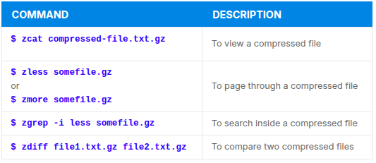

---

**sed**

- text processing tool, one of the oldest Unix utilities, used to modify the contents of a file or input stream, placing the contents into a new file or output stream. SED is an abreviation for stream editor.

- **sed** can filter text, as well as perform subtitutions in data streams. Data from input source/file is taken and moved to aworking space. Entire list of operations/modification is applied over the data in the working space and the final contents are moved to the standart output.


- Usage od **sed** includes:


- Basic operations with **sed**. (ex- pattern is the current string and replace_strin is the new string)

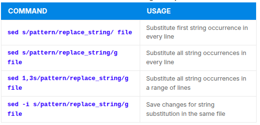

- NB! You must use the -i option with care, because the action is not reversible. It is always safer to use sed without the –i option and then replace the file yourself.

---

**awk**

- **awk** is used to extract and then print specific contents of a file. Often used to contruct reports. Powerful utility and interpreted programming language. Used to manipulate data files, and retrieving and processing text. it works with fields and recors.

- **awk** commands can be specified directly in the command line, but a more complext script can be saved in a file that you can specify with the -f option.

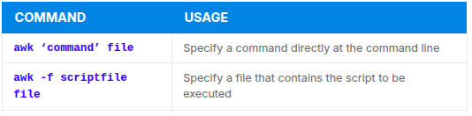

- **awk** Basic Operations: For example if we have a input file, it is read one line at a time and for each line awk matches the given pattern in the given order and performs the requested actiom. -F options allows you to specify0 the 'field separator'.

- Example of awk: **/etc/passwd** file uses : to separate the fields, so the -F: option is used with it.

- Commands/action in **awk** need to be surrounded with apostrophes or single quotes.


- How to seach all instances of the user command interpreter (shell) equal to /sbin/nologin in /etc/passwd and replace them with /bin/bash (do not overwrite /etc/passwd).

```
option 1:
student:/tmp> sed s:'/sbin/nologin':'/bin/bash':g /etc/passwd

option 2:
student:/tmp> sed s:/sbin/nologin:/bin/bash:g /etc/passwd
```

---

**FIle Manipulation Utilities**

- There are different file manipulation programs: sort, uniq, paste, join, split.

**sort**

- used to rearrange the lines of a text file, in either ascending or descending order according to sort key. You can apply the key t to sort according to a particular field(colum) in a file. Default sort key is the order of the ASCII characters.


- When used with the -u option, sort checks for unique values after sorting the records (lines).

---

**uniq**

- removes duplicate consecutive lines in a text file and is useful for simplifying a text display.

- uniq requires that the duplicate entries must be consecutive, one often runs sort first and then pipes the output into uniq; if sort is used with the -u option, it can do all this in one step.

- Different command variantions with sort and uniq:

```
sort file1 file2 | uniq > file3

or

sort -u file1 file2 > file3

To count the number of duplicate entries, use the following command:

uniq -c filename

```

---

**paste**

- If you have 1 file that contains for example: full name of employees and another with employee ID and phone numbers you can combine them both into one with **paste**.

- Creates a single file containing all three columns, the different columns are identified based on **delimeters** (spacing used to separate two fields). For example delimiters can be a blank space, a tab or **Enter**. In the image below, a single space is used as the delimiter in all files.

- **paste** accepts:
  - **-d**, delimiters, which specify a list of delimiters to be used instead of tabs for separating consecutive values on a single line. Each delimiter is used in turn, when the list has been exhaused, paste begins again at the first delimiter.
  - **-s**, which causes paste to append the data in series rather than parallel, that is in a horizontal rather than vvertical fashion.


---

**Usage paste**

- paste can be used to combine fields(such as name or phone number) from different files, as well as combine lines from multiple files.

- For example, line one from file1 can be combined with line one of file2, line two from file1 can be combined with line two of file2, and so on.

```
$ paste file1 file2
```

- The syntax to use a different delimiter is a follows:

```
$ paste -d, file1 file2
```

- Common delimiters are 'space', 'tab', '|', 'comma'

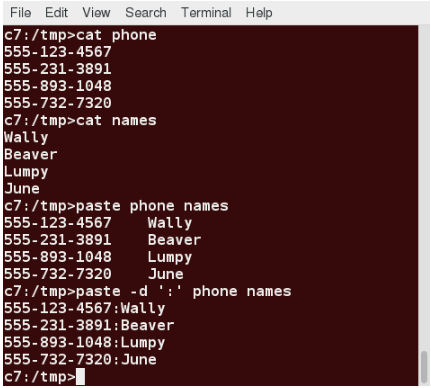

---

**join**
